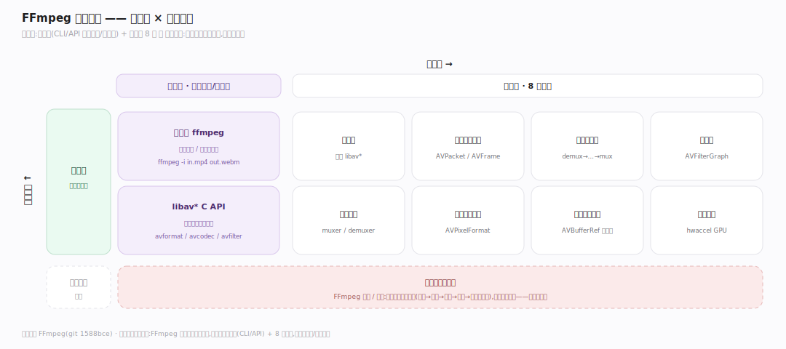
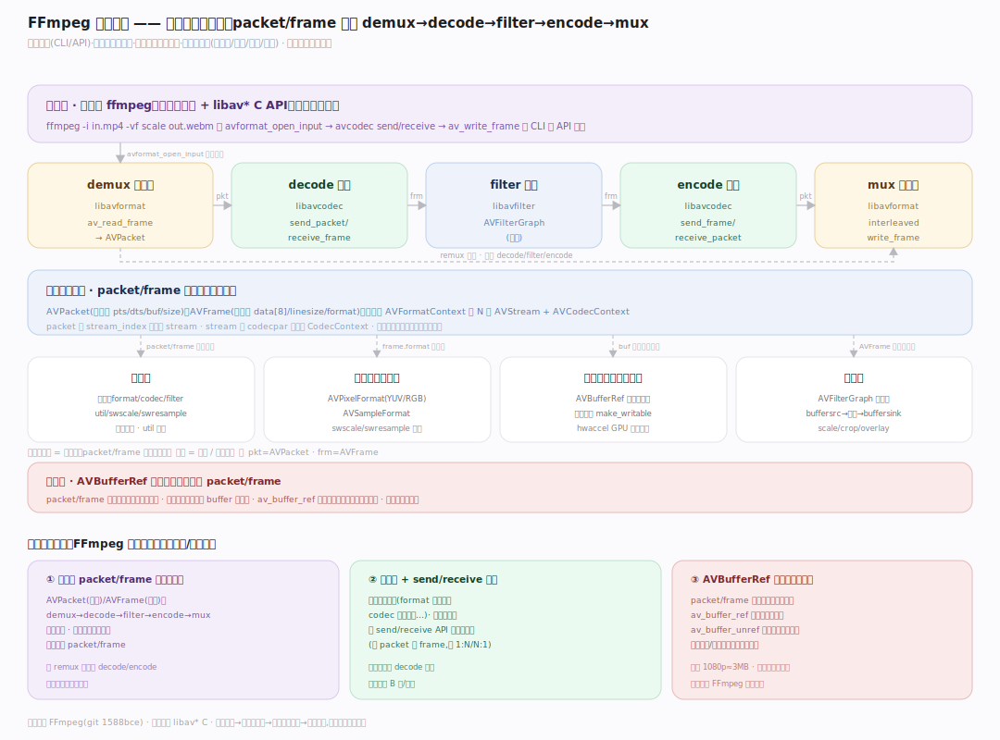
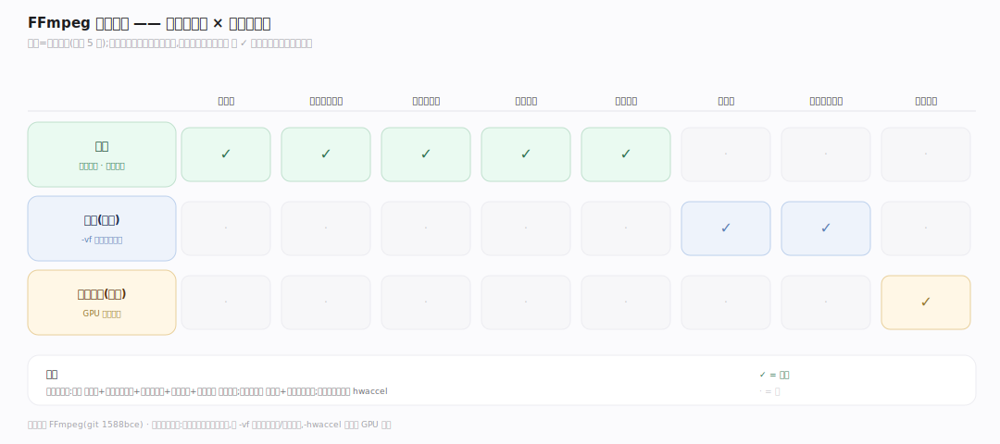
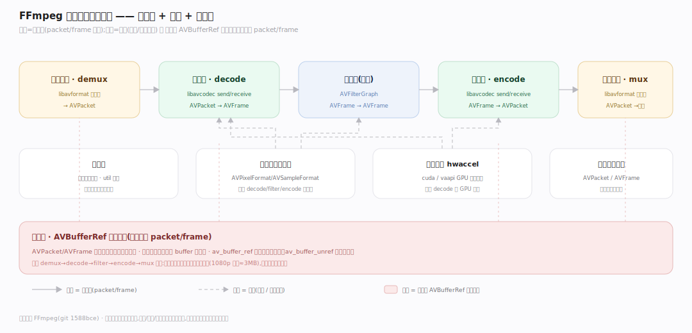

# FFmpeg 原理 · 全景主线框架

> 统领全部原理文档:FFmpeg 是**多媒体处理管线**(新家族:多媒体编解码/转码/滤镜——把音视频的解封装→解码→滤镜→编码→封装做成一条 packet/frame 流经的管线,库化供调用)。源码基准 **FFmpeg(git 1588bce)**(`~/workdir/FFmpeg`,libav* 模块 C)。

FFmpeg 的世界观:**一切是 packet(压缩数据包)与 frame(原始帧)流经的管线**。转码 = demux(拆容器出压缩包)→ decode(解码成原始帧)→ filter(滤镜处理)→ encode(编码成压缩包)→ mux(封进容器)。核心数据结构 AVPacket(压缩)/AVFrame(原始)在管线各段流动,靠 AVBufferRef 引用计数零拷贝共享。理解"库分层 + packet/frame 管线 + 引用计数"三点,就懂了 FFmpeg。

> **结构提示(写文档必看)**:① 六库分层 libavformat(容器)/libavcodec(编解码)/libavfilter(滤镜)/libavutil(公共)/libswscale(缩放)/libswresample(重采样);② AVPacket(压缩,packet.h:580)/AVFrame(原始,frame.h:472),AVBufferRef 引用计数零拷贝;③ 编解码用 send/receive API(现代解耦)非旧 decode/encode;④ 滤镜图 AVFilterGraph(filter 链接成图,buffersrc→中间→buffersink);⑤ 容器 muxer/demuxer(FFInputFormat/FFOutputFormat);⑥ AVPixelFormat/AVSampleFormat,swscale/swresample 转换;⑦ hwaccel(cuda/vaapi)GPU 加速。

---

## 一、双维模型:能力域 × 执行时机

- **能力域**:接触面(命令行 ffmpeg / libav API)面向用户/开发者;支撑侧——库分层、核心数据结构、编解码管线、滤镜图、容器格式、像素采样格式、引用计数内存、硬件加速。
- **执行时机**:全前台(转码是同步流:读包→解码→滤镜→编码→写包的循环);无后台守护——FFmpeg 是库/工具,进程内同步处理流。

---

## 二、总架构图

一次转码的管线:**输入文件** → `avformat_open_input`(libavformat 打开容器)→ `av_read_frame`(demux 出压缩 **AVPacket**)→ `avcodec_send_packet`/`receive_frame`(libavcodec 解码成原始 **AVFrame**)→ 滤镜图(libavfilter:buffersrc→scale/crop/overlay→buffersink 处理帧)→ `avcodec_send_frame`/`receive_packet`(编码成 AVPacket)→ `av_interleaved_write_frame`(mux 封进容器)→ **输出文件**。AVPacket/AVFrame 靠 AVBufferRef 引用计数零拷贝流动;swscale/swresample 转像素/采样格式;hwaccel 可 GPU 解码。

---

## 三、主线的分层归位(接触面 + 8 支撑域)

| 层 | 主线 | 一句话职责 |
|---|---|---|
| 接触面 | **命令行与 libav API** | ffmpeg CLI / avformat/avcodec API |
| 分层 | **库分层** | format/codec/filter/util/swscale/swresample |
| 数据 | **核心数据结构** | AVPacket 压缩 / AVFrame 原始 |
| 核心 | **编解码管线** | demux→decode→filter→encode→mux |
| 滤镜 | **滤镜图** | AVFilterGraph filter 链接成图 |
| 容器 | **容器格式** | muxer/demuxer 封装解封装 |
| 格式 | **像素采样格式** | AVPixelFormat/AVSampleFormat + 转换 |
| 内存 | **引用计数 + 硬件加速** | AVBufferRef 零拷贝 + hwaccel GPU |

---

## 四、接触面 × 能力域 依赖矩阵

转码依赖库分层(各库协作)+ 核心数据结构(packet/frame)+ 编解码管线(send/receive)+ 容器格式(mux/demux)+ 引用计数(零拷贝);滤镜依赖滤镜图 + 像素采样格式(转换);硬件解码依赖 hwaccel。

---

## 五、能力域依赖关系图

实线=数据流,虚线=约束。贯穿层:**AVBufferRef 引用计数** 横切 packet/frame——AVPacket/AVFrame 的数据都是引用计数缓冲,管线各段共享同一 buffer 零拷贝,引用归零才释放。

---

## 六、三条贯穿声明(FFmpeg 区别于单一编解码器/播放器)

1. **一切是 packet/frame 流经的管线**:核心是 AVPacket(压缩数据)和 AVFrame(解码后原始数据)在 demux→decode→filter→encode→mux 各段流动;转码就是这条管线,每段变换 packet/frame。

2. **库分层 + send/receive 解耦**:六个 libav* 库各司其职(format 管容器、codec 管编解码…);现代编解码用 send/receive API(送 packet 收 frame,可 1:N/N:1)解耦数据流——不是一次性 decode 回调。

3. **AVBufferRef 引用计数零拷贝**:packet/frame 的数据是引用计数缓冲(AVBufferRef),`av_buffer_ref` 增引用而非复制、`av_buffer_unref` 减引用归零才释放——管线各段、多引用共享同一份数据零拷贝,大幅省内存拷贝。

---

**一句话定位**:FFmpeg 是多媒体处理管线——六库分层(libavformat 容器/libavcodec 编解码/libavfilter 滤镜/libavutil 公共/libswscale 缩放/libswresample 重采样),转码是 packet/frame 流经的管线:demux 出 AVPacket→send/receive 解码成 AVFrame→滤镜图(AVFilterGraph:buffersrc→scale/crop→buffersink)→编码成 AVPacket→mux 封容器;AVBufferRef 引用计数让 packet/frame 零拷贝共享,swscale/swresample 转像素采样格式,hwaccel 支持 GPU 解码;库化供 CLI 和 libav API 调用。
