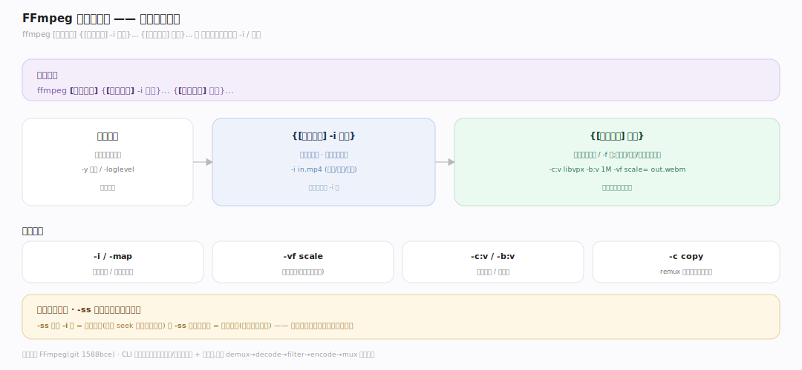
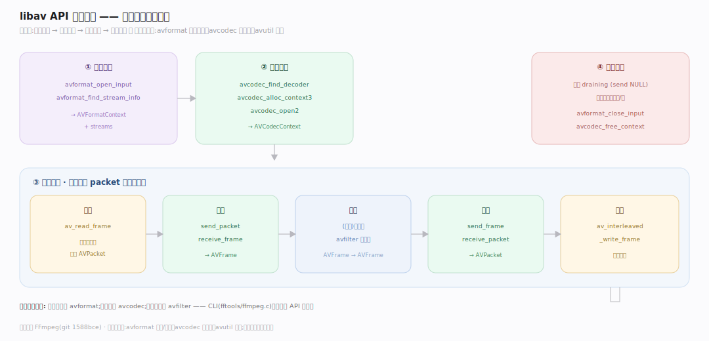
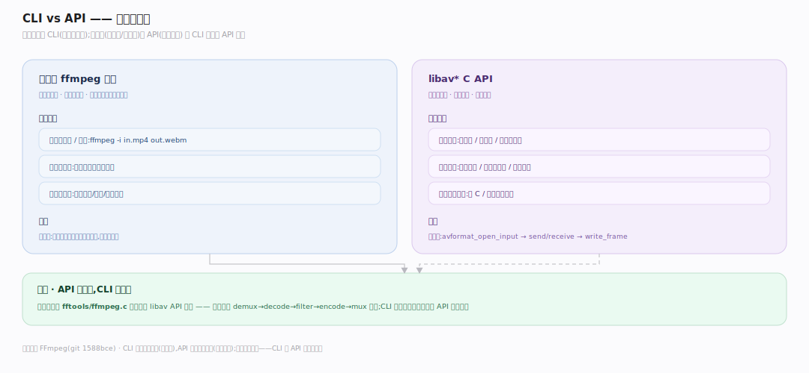

# FFmpeg 原理 · 接触面主线 · 命令行与 libav API

> **定位**：属"接触面主线"(用户/开发者可见)。FFmpeg 两种接触面:命令行工具 ffmpeg(用户)+ libav* C API(开发者集成)。CLI 是 API 的封装。调用【编解码管线】转码、【库分层】各库。源码基准 **FFmpeg(1588bce)**(`fftools/`、libav* API)。

FFmpeg 怎么被用?两种:**命令行 ffmpeg**(`ffmpeg -i in.mp4 out.webm`,用户转码/处理)+ **libav* C API**(开发者链接库集成到应用)。CLI 是 API 的高层封装——底层都是 demux→decode→filter→encode→mux 管线。理解 CLI 参数模型 + API 调用骨架,就懂了怎么用 FFmpeg。

---

## 一、命令行:输入输出 + 选项

`ffmpeg [全局选项] {[输入选项] -i 输入}... {[输出选项] 输出}...`:

- **输入** `-i in.mp4`:可多个输入;输入选项(如 `-ss` 起始)放 -i 前。
- **输出** `out.webm`:格式由扩展名/`-f` 定;输出选项(编码器 `-c:v libvpx`、码率 `-b:v`、滤镜 `-vf scale=`)放输出前。
- **流选择/映射** `-map`:选哪些输入流进哪个输出。
- CLI 解析成内部的输入/输出上下文 + 滤镜图,驱动管线循环。

**为什么这参数序**:选项作用于其后的 -i/输出——`-ss` 在 -i 前=输入定位、在输出前=输出裁剪;位置即作用域。CLI 把参数编译成管线配置。

---

## 二、libav API:集成骨架

开发者集成的 API 骨架(见编解码管线篇细节):

- **打开**:`avformat_open_input` + `avformat_find_stream_info` → 得 AVFormatContext + streams。
- **解码器**:`avcodec_find_decoder` + `avcodec_alloc_context3` + `avcodec_open2` → AVCodecContext。
- **循环**:`av_read_frame`(读包)→ `send_packet`/`receive_frame`(解码)→ 处理 → `send_frame`/`receive_packet`(编码)→ `av_interleaved_write_frame`(写)。
- **收尾**:冲刷 + `avformat_close_input`/`avcodec_free_context` 释放。

**为什么这套 API**:分层对应库(avformat 打开/读写、avcodec 编解码、avutil 数据);开发者按需组合——只解码用 avformat+avcodec,加滤镜再用 avfilter。CLI 就是这套 API 的封装。

---

## 三、CLI vs API:何时用哪个

- **CLI(ffmpeg 工具)**:一次性转码/处理、脚本批处理、快速试参数——无需写代码。绝大多数转码需求 CLI 够。
- **libav API**:嵌入应用(播放器/编辑器/流媒体服务)、需精细控制(逐帧处理、自定义滤镜、动态参数)、性能敏感集成——写 C/绑定调用。
- 关系:CLI(`fftools/ffmpeg.c`)本身用 libav API 实现;API 是底层、CLI 是封装。

**为什么两层**:CLI 覆盖常见转码(声明式参数),API 覆盖深度集成(编程控制);多数人用 CLI,做产品(播放器/云转码)用 API。

---

## 拓展 · 接触面关键结构一览

| 接触面 | 入口 | 职责 |
|---|---|---|
| ffmpeg CLI | `fftools/ffmpeg.c` | 命令行转码工具 |
| avformat API | `avformat_open_input` 等 | 容器打开/读写 |
| avcodec API | `avcodec_send_packet` 等 | 编解码 |
| avfilter API | `avfilter_graph_*` | 滤镜图 |

## 调优要点（理解要点）

- **选项位置**:输入选项在 -i 前、输出选项在输出前——位置定作用域(输入定位 vs 输出裁剪)。
- **-c copy remux**:`-c copy` 不重编码只转封装,快且无损(改容器不改编码)。
- **-map 精选流**:多流文件用 -map 选需要的流进输出,避免带无用流。
- **API 分层引入**:只转封装用 avformat;要转码加 avcodec;要滤镜加 avfilter——按需链接。

## 常见误区与工程要点

- **误区:CLI 和 API 是两套实现。** CLI(fftools/ffmpeg.c)用 libav API 实现;API 底层、CLI 封装。
- **误区:选项位置随意。** 输入/输出选项位置定作用域;-ss 在 -i 前后语义不同。
- **误区:转码必重编码。** `-c copy` remux 只换容器不重编码,无损快;仅换封装用它。
- **误区:一个 -i 一条流。** 一个输入文件可含多流(视频/音频/字幕);-map 选映射。
- **归属提醒**:CLI/API 驱动【编解码管线】;各库职责在【库分层】;滤镜参数(-vf)编译成【滤镜图】;-c copy 走【容器格式】remux。

## 一句话总纲

**FFmpeg 两种接触面:命令行 ffmpeg(用户,[全局]{-i 输入}{输出} + 选项按位置定作用域,-vf 滤镜/-c 编码器/-map 流映射/-c copy remux)覆盖常见转码;libav C API(开发者,avformat_open_input→avcodec send/receive→av_write_frame 骨架,按需分层引入 avformat/avcodec/avfilter)覆盖深度集成(播放器/编辑器/云转码);CLI(fftools/ffmpeg.c)本身用 API 实现——API 底层、CLI 封装。**
