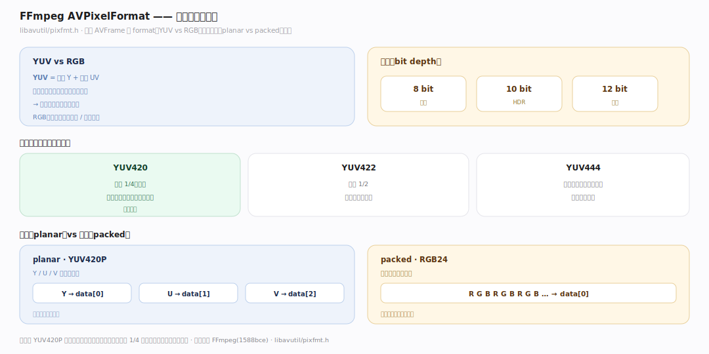
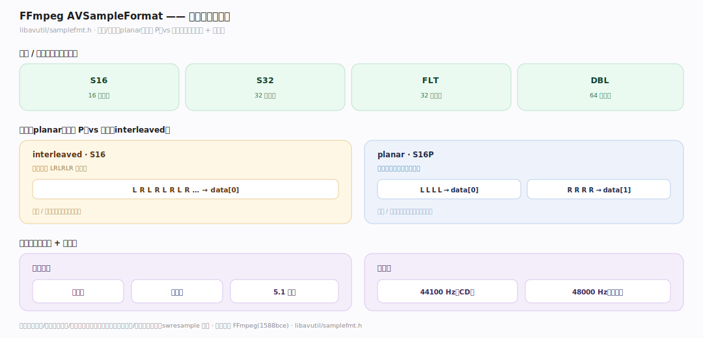
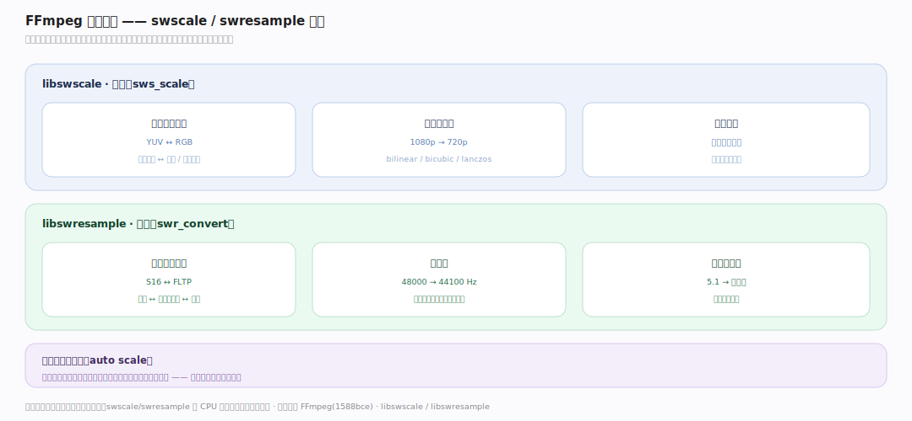

# FFmpeg 原理 · 支撑主线 · 像素与采样格式

> **定位**：属"数据表示能力域"。管原始帧的内存布局:AVPixelFormat(视频像素格式 YUV/RGB)、AVSampleFormat(音频采样格式),libswscale/libswresample 做转换。是 AVFrame 的 format 字段语义。用【核心数据结构】的 AVFrame。源码基准 **FFmpeg(1588bce)**(`libavutil/pixfmt.h`、`samplefmt.h`)。

原始帧(AVFrame)的数据到底怎么排布?视频有 **AVPixelFormat**(YUV420P/RGB24/NV12…决定像素怎么存)、音频有 **AVSampleFormat**(S16/FLTP…决定采样怎么存)。不同编码器/滤镜要不同格式,libswscale(视频)/libswresample(音频)负责转换。理解"像素/采样格式 + 平面 vs 打包 + 转换",就懂了 FFmpeg 的数据表示。

---

## 一、AVPixelFormat:视频像素布局

**AVPixelFormat**(`libavutil/pixfmt.h`)决定视频帧像素怎么存:

- **YUV vs RGB**:YUV(亮度 Y + 色度 UV,人眼对亮度敏感,可压缩色度)是编码常用;RGB(红绿蓝)是显示/处理常用。
- **色度采样**:YUV420(色度 1/4,最省)、YUV422、YUV444(不压缩色度)。
- **平面(planar)vs 打包(packed)**:planar(YUV420P)Y/U/V 各存一平面(data[0/1/2]);packed(RGB24)像素交织存一平面。
- **位深**:8bit/10bit/12bit。

**为什么 YUV420 主流**:人眼对亮度(Y)敏感、对色度(UV)不敏感;YUV420 色度只存 1/4 分辨率,省一半数据而肉眼几乎无损——所以编码几乎都用 YUV420P。

---

## 二、AVSampleFormat:音频采样布局

**AVSampleFormat**(`libavutil/samplefmt.h`)决定音频采样怎么存:

- **位深/类型**:S16(16 位整数)、S32、FLT(32 位浮点)、DBL——精度与范围。
- **平面(planar,后缀 P)vs 交织(interleaved)**:S16(交织,左右声道 LRLRLR 存一块)vs S16P(平面,左声道一块、右声道一块)。
- 配合**声道布局**(单声道/立体声/5.1)和**采样率**(44100/48000Hz)。

**为什么区分平面/交织**:编码器/处理常要平面(各声道独立处理),播放/硬件常要交织(按时间连续);两种布局适配不同环节,swresample 转换。

---

## 三、格式转换:swscale / swresample

编码器/滤镜/显示要求的格式常与解码输出不同,需转换:

- **libswscale**:视频——像素格式转换(YUV↔RGB)、分辨率缩放(1080p→720p)、色域转换。`sws_scale`。
- **libswresample**:音频——采样格式转换(S16↔FLTP)、重采样(48000→44100Hz)、声道重映射(5.1→立体声)。`swr_convert`。
- 滤镜图会**自动插入**必要的格式转换(auto scale)——若上下游格式不匹配。

**为什么要转换**:解码输出格式(如 YUV420P)、滤镜要求格式、编码器接受格式、显示器格式常各不同;swscale/swresample 做桥接,让不同环节能对接。

---

## 拓展 · 像素采样格式关键一览

| 项 | 定义 | 说明 |
|---|---|---|
| AVPixelFormat | `libavutil/pixfmt.h` | 视频像素格式(YUV420P/RGB24/NV12) |
| AVSampleFormat | `libavutil/samplefmt.h` | 音频采样格式(S16/FLTP) |
| libswscale | `sws_scale` | 像素转换 + 缩放 |
| libswresample | `swr_convert` | 采样转换 + 重采样 |
| planar/packed | AVFrame.data[] | 多平面 vs 单平面交织 |

## 调优要点（理解要点）

- **YUV420P 省**:编码用 YUV420P(色度 1/4)省数据肉眼无损;别无脑用 RGB/YUV444(大且多余)。
- **避免多余转换**:源、滤镜、编码器格式一致时无转换开销;链路统一格式减少 swscale 调用。
- **缩放算法**:swscale 有多种算法(bilinear/bicubic/lanczos),质量与速度权衡;放大用高质量算法。
- **重采样精度**:音频用浮点(FLTP)中间处理避免多次整数转换的精度损失。

## 常见误区与工程要点

- **误区:像素就是 RGB。** 编码几乎都用 YUV(YUV420P 主流);RGB 主要用于显示/处理。
- **误区:planar 和 packed 一样。** planar 各分量分平面(data[0/1/2])、packed 交织存一平面;处理方式不同。
- **误区:格式转换免费。** swscale/swresample 有 CPU 开销;能避免(格式统一)就避免。
- **误区:降采样率无损。** 重采样(48k→44.1k)有精度损失;非必要不降。
- **归属提醒**:格式是 AVFrame 的 format 字段【核心数据结构】;转换库属【库分层】的 swscale/swresample;滤镜里自动转换在【滤镜图】;GPU 上的格式在【硬件加速】。

## 一句话总纲

**FFmpeg 原始帧的内存布局由格式决定:视频 AVPixelFormat(pixfmt.h:YUV vs RGB、色度采样 420/422/444、planar 分平面 vs packed 交织、位深)——YUV420P 主流因人眼对色度不敏感省一半数据肉眼无损;音频 AVSampleFormat(samplefmt.h:S16/FLT 位深、planar 后缀 P vs 交织)配声道布局+采样率;libswscale(sws_scale 像素转换+缩放)/libswresample(swr_convert 采样转换+重采样)桥接不同环节格式,滤镜图自动插入必要转换。**
