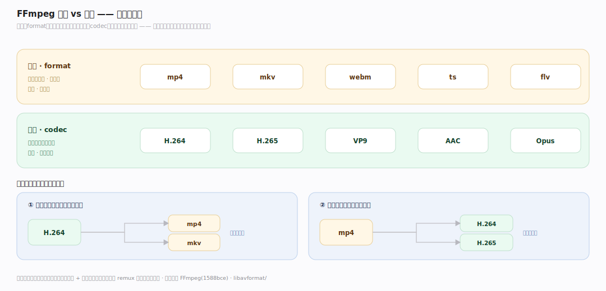
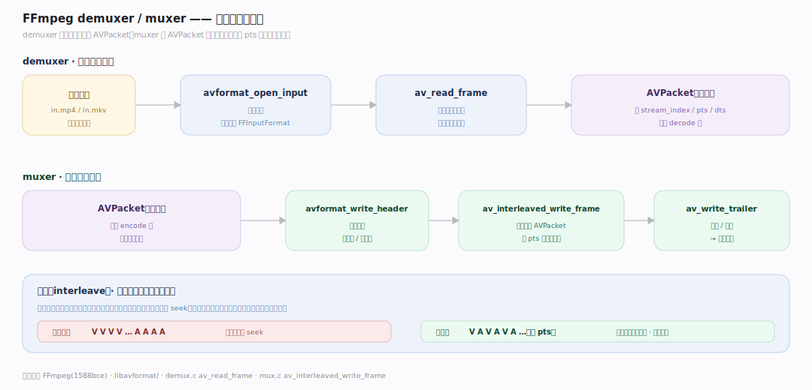
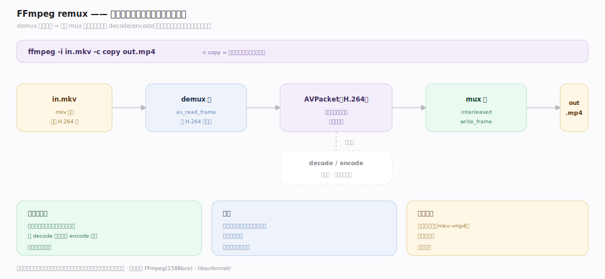

# FFmpeg 原理 · 支撑主线 · 容器格式

> **定位**：属"IO 能力域"。管封装/解封装:muxer(封)/demuxer(拆)把编码流装入/取出容器(mp4/mkv/ts…)。是管线两端(读入/写出)的接口。用【核心数据结构】的 AVFormatContext/AVStream/AVPacket。源码基准 **FFmpeg(1588bce)**(`libavformat/`)。

一个媒体文件 = **容器**(mp4/mkv/webm/ts…)里装着若干**编码流**(H.264 视频、AAC 音频、字幕)。容器管"怎么组织多条流 + 元数据 + 时间戳",编码管"每条流怎么压缩"——两者正交。FFmpeg 用 **demuxer** 拆容器出压缩包、**muxer** 把压缩包封进容器。理解"容器 vs 编码分离 + mux/demux",就懂了 FFmpeg 怎么读写文件。

---

## 一、容器 vs 编码:正交两层

- **容器(format)**:mp4/mkv/webm/ts/flv…——组织多条流、存元数据(时长/标题)、交织(interleave)音视频、时间戳。
- **编码(codec)**:H.264/H.265/VP9/AAC/Opus…——每条流的压缩算法。
- **正交**:同一 H.264 流可封进 mp4 或 mkv;同一 mp4 可装 H.264 或 H.265。容器不关心流内部怎么编码(只存字节 + 参数)。

**为什么分离**:容器解决"多流组织/同步/元数据",编码解决"单流压缩";职责不同、独立演进。所以能 remux(换容器不换编码,`-c copy`)——只重新封装,不重新压缩。

---

## 二、demuxer/muxer:拆与封

- **demuxer**(拆):`avformat_open_input` 打开文件 → 识别容器格式(FFInputFormat)→ `av_read_frame` 逐个读出压缩 AVPacket(带 stream_index/pts/dts)。
- **muxer**(封):`avformat_write_header` 写容器头 → `av_interleaved_write_frame` 交织写入 AVPacket → `av_write_trailer` 写尾/索引。
- **交织(interleave)**:muxer 按时间戳交替写音视频包,保证播放时音画同步、边下边播。

**为什么交织写**:播放器顺序读文件,若视频包全在前、音频全在后,播放时要来回 seek;交织(按 pts 交替)让顺序读就能同步取到当前时刻的音视频。

---

## 三、remux:免解码转封装

**remux**(转封装)= 换容器不换编码:

- `ffmpeg -i in.mkv -c copy out.mp4`:demux in.mkv 出 H.264 包 → 直接 mux 进 mp4(不 decode/encode)。
- 只重组织封装层,编码流原样搬运——**无质量损失、极快**(不重压缩)。
- 用途:改容器兼容性(mkv→mp4 给不支持 mkv 的播放器)、去流、改元数据。

**为什么 remux 快且无损**:容器与编码正交——换容器只需重新封装(拆包再装包),压缩数据一字不改;不经过 decode(解压)/encode(重压)所以无损且省算力。

---

## 拓展 · 容器格式关键结构一览

| 结构/API | 定义 | 职责 |
|---|---|---|
| avformat_open_input | `libavformat/demux.c:231` | 打开容器(demux) |
| av_read_frame | `libavformat/demux.c:1588` | 读出压缩 AVPacket |
| av_interleaved_write_frame | `libavformat/mux.c:1223` | 交织写入(mux) |
| AVFormatContext | `avformat.h:1316` | 容器上下文(streams/format) |
| FFInputFormat/FFOutputFormat | `libavformat/` | demuxer/muxer 实现 |

## 调优要点（理解要点）

- **remux 首选**:只需换容器时用 `-c copy`,无损极快;别无脑重编码。
- **交织**:muxer 交织写保证音画同步、支持流式播放;别手动打乱包序。
- **faststart**:mp4 的 moov 原子放文件头(`-movflags +faststart`)支持边下边播,否则要下完才播。
- **容器能力差异**:不同容器支持的编码/特性不同(webm 只 VP8/9+Opus/Vorbis);换容器前确认编码兼容。

## 常见误区与工程要点

- **误区:换容器要重编码。** remux(`-c copy`)只重封装、不重编码,无损快;仅换容器用它。
- **误区:容器决定画质。** 画质由编码(codec/码率)定;容器只是封装组织。
- **误区:任意编码封任意容器。** 容器有兼容限制(webm 不封 H.264);换容器前查兼容。
- **误区:包顺序无所谓。** muxer 交织(按 pts)保证同步和流式播放;顺序重要。
- **归属提醒**:demux/mux 在【编解码管线】两端;流经的 AVPacket 在【核心数据结构】;编码算法在【编解码管线】;CLI 的 -c copy 在【接触面】。

## 一句话总纲

**FFmpeg 容器与编码正交两层:容器(format:mp4/mkv/ts,组织多流+元数据+交织+时间戳)vs 编码(codec:H.264/AAC,单流压缩算法)——同编码可封不同容器;demuxer(avformat_open_input+av_read_frame 拆容器出压缩 AVPacket)/muxer(write_header+av_interleaved_write_frame 交织写+write_trailer);remux(-c copy)换容器不换编码,只重封装不 decode/encode,无损极快;交织按 pts 保音画同步支持流式播放。**
