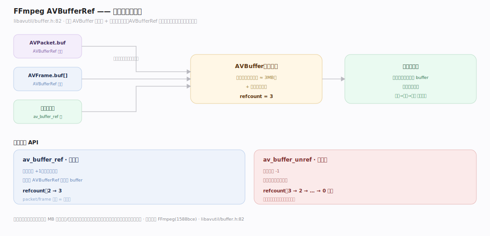
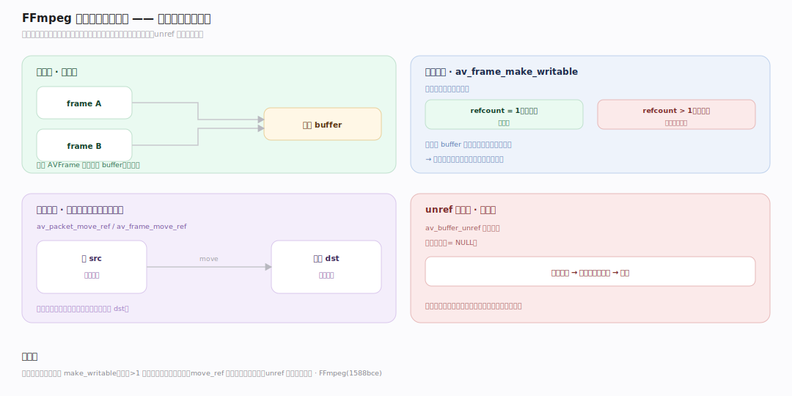
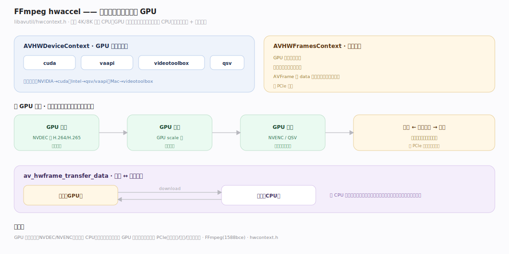

# FFmpeg 原理 · 支撑主线 · 引用计数与硬件加速

> **定位**：贯穿层(引用计数,横切所有 packet/frame)+ 加速能力域(硬件加速)。AVBufferRef 让 packet/frame 零拷贝共享;hwaccel 让解码/编码走 GPU。是 FFmpeg 高效的两大支柱。用【核心数据结构】的 AVFrame/AVPacket。源码基准 **FFmpeg(1588bce)**(`libavutil/buffer.h`、`hwcontext.h`)。

FFmpeg 处理海量数据(一帧 1080p ≈ 3MB),两个效率关键:**引用计数**(AVBufferRef 让 packet/frame 在管线各段零拷贝共享,不复制数据)和**硬件加速**(hwaccel 让 GPU 做解码/编码/滤镜,省 CPU)。理解这两点,就懂了 FFmpeg 怎么高效处理大数据。

---

## 一、AVBufferRef:引用计数零拷贝

**AVBufferRef**(`libavutil/buffer.h:82`)= 引用计数的数据缓冲:

- 底层 AVBuffer 持实际数据 + 原子引用计数;AVBufferRef 是指向它的引用。
- `av_buffer_ref`:增引用计数(不复制数据),返回新 AVBufferRef 指同一 buffer。
- `av_buffer_unref`:减引用计数,归零才真正释放数据。
- AVPacket.buf、AVFrame.buf[] 都是 AVBufferRef——所以 packet/frame 复制其实是增引用。

**为什么引用计数**:一帧数据大(MB 级),管线各段(解码→滤镜→编码)、多处引用同一帧若都深拷贝会爆内存/耗时;引用计数让共享零拷贝——只 buffer 引用归零才释放。这是 FFmpeg 省内存的核心。

---

## 二、写时复制与所有权

引用计数配合所有权规则:

- **共享读**:多个 AVFrame 引用同一 buffer,都能读(零拷贝)。
- **写前确保独占**:要修改数据时用 `av_frame_make_writable`——若引用计数>1(被共享)则复制一份再改(写时复制),避免改乱别的引用。
- **移动语义**:`av_packet_move_ref`/`av_frame_move_ref` 转移所有权(源置空),不增引用。
- unref 后指针置空,防悬垂。

**为什么写时复制**:共享的 buffer 若直接改会破坏其他引用;make_writable 在写前检查——独占则直接改、共享则复制;读多写少时零拷贝共享、写时才付复制代价。

---

## 三、硬件加速:GPU 解码/编码

**hwaccel**(`libavutil/hwcontext.h`)让编解码走 GPU:

- **AVHWDeviceContext**:GPU 设备上下文(cuda/vaapi/videotoolbox/qsv…)。
- **AVHWFramesContext**:GPU 显存里的帧池;硬件解码的帧留在显存(AVFrame 的 data 指显存,不下载到内存)。
- **加速环节**:解码(GPU 解 H.264/H.265)、编码(NVENC/QSV)、部分滤镜(GPU scale)。
- **下载/上传**:`av_hwframe_transfer_data` 在显存↔内存搬帧(需 CPU 处理时)。

**为什么显存留帧**:GPU 解码后帧在显存,若每帧下载到内存再上传编码会浪费 PCIe 带宽;全 GPU 链路(硬解→GPU 滤镜→硬编)帧一直在显存,只最终结果下载——大幅提速。

**为什么 hwaccel**:软解 4K/8K 吃满 CPU;GPU 有专用编解码单元(NVDEC/NVENC),快且省 CPU;代价是显存占用 + 格式受限 + 需对应硬件。

---

## 拓展 · 内存与加速关键一览

| 结构/API | 定义 | 职责 |
|---|---|---|
| AVBufferRef | `libavutil/buffer.h:82` | 引用计数缓冲 |
| av_buffer_ref/unref | buffer.h | 增/减引用 |
| av_frame_make_writable | frame.h | 写时复制确保独占 |
| AVHWDeviceContext | `libavutil/hwcontext.h` | GPU 设备上下文 |
| AVHWFramesContext | hwcontext.h | 显存帧池 |
| av_hwframe_transfer_data | hwcontext.h | 显存↔内存搬帧 |

## 调优要点（理解要点）

- **零拷贝传引用**:管线各段传 packet/frame 引用(av_packet_ref)不深拷贝;省内存/时间。
- **写前 make_writable**:修改共享帧前调用,避免破坏其他引用(自动写时复制)。
- **全 GPU 链路**:硬解→GPU 滤镜→硬编,帧留显存不下载,省 PCIe 带宽最快。
- **hwaccel 选型**:NVIDIA 用 cuda/nvenc、Intel 用 qsv/vaapi、Mac 用 videotoolbox;按硬件选。

## 常见误区与工程要点

- **误区:packet/frame 复制是深拷贝。** 是增引用计数(零拷贝);数据共享,引用归零才释放。
- **误区:能直接改共享帧。** 要先 make_writable(引用>1 则写时复制);直接改会破坏其他引用。
- **误区:硬件解码一定快。** 显存↔内存搬帧有开销;若中间下载到内存处理,可能不如软解;全 GPU 链路才最优。
- **误区:hwaccel 到处能用。** 受硬件/格式/编码器限制(不是所有编码都硬件支持);需对应 GPU。
- **归属提醒**:引用计数的 buf 字段在【核心数据结构】的 AVPacket/AVFrame;buffer 属【库分层】的 libavutil;显存帧的格式在【像素采样格式】;硬解在【编解码管线】的 decode 段。

## 一句话总纲

**FFmpeg 高效两支柱:引用计数(AVBufferRef buffer.h:82,av_buffer_ref 增引用不复制/av_buffer_unref 归零才释放,packet/frame 的 buf 都是引用计数——复制即增引用零拷贝共享,写前 av_frame_make_writable 写时复制确保独占)省内存;硬件加速(hwcontext.h,AVHWDeviceContext GPU 设备+AVHWFramesContext 显存帧池,GPU 解码/编码/滤镜,硬解帧留显存,全 GPU 链路只最终下载省 PCIe,av_hwframe_transfer_data 显存↔内存搬帧)省 CPU——软解 4K/8K 吃满 CPU,GPU 专用单元快且省。**
