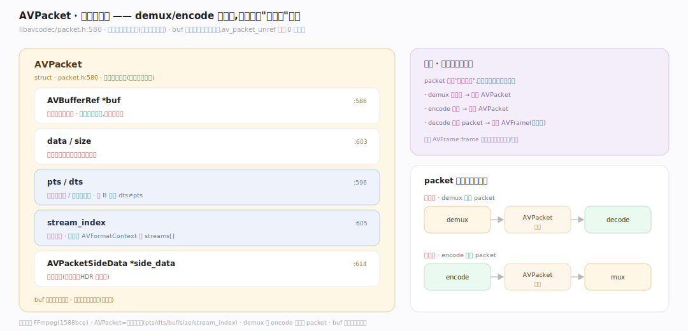
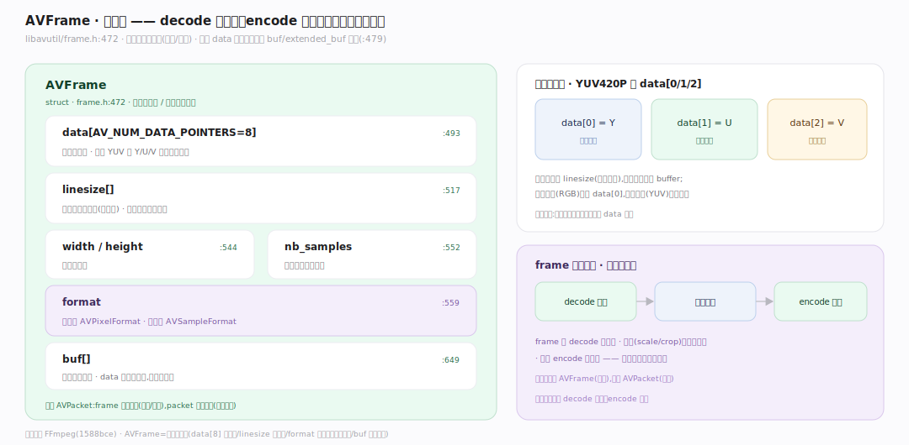
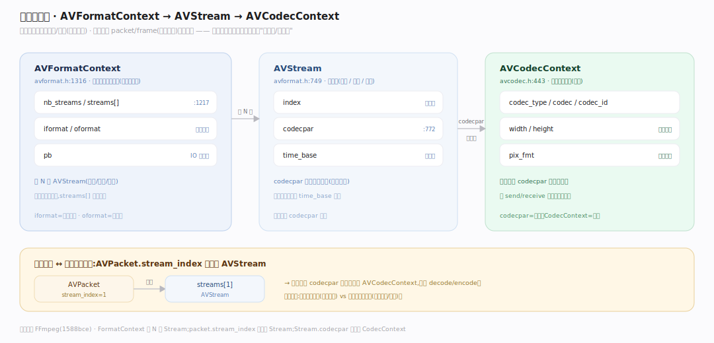

# FFmpeg 原理 · 支撑主线 · 核心数据结构

> **定位**：属"数据能力域"。管管线流动的数据:AVPacket(压缩数据包)、AVFrame(原始帧)、AVCodecContext/AVFormatContext/AVStream(上下文)。是 packet/frame 管线的载体。被【编解码管线】各段处理、【引用计数】共享。源码基准 **FFmpeg(1588bce)**(`libavcodec/packet.h`、`libavutil/frame.h`)。

FFmpeg 管线流动两种核心数据:**AVPacket**(压缩数据,如一个编码帧的字节)和 **AVFrame**(解码后原始数据,如一张像素图/一段采样)。上下文结构(AVCodecContext/AVFormatContext/AVStream)承载编解码/容器/流的配置与状态。理解 packet/frame 的字段 + 上下文关系,就懂了 FFmpeg 数据模型。

---

## 一、AVPacket:压缩数据包

**AVPacket**(`libavcodec/packet.h:580`)= 一个压缩数据单元(编码后的字节):

- `AVBufferRef *buf`(:586,引用计数所有权)、`data`/`size`(:603,压缩字节)。
- `int64_t pts`/`dts`(:596,显示/解码时间戳)——pts 播放序,dts 解码序(B 帧时不同)。
- `int stream_index`(:605,属哪条流)、`AVPacketSideData *side_data`(:614)。
- buf 置位时数据引用计数,`av_packet_unref` 降到 0 才释放(:560)。

AVPacket 是 demux 的产物、encode 的产物——管线里"压缩态"的数据载体。

---

## 二、AVFrame:原始帧

**AVFrame**(`libavutil/frame.h:472`)= 解码后原始数据(像素/采样):

- `uint8_t *data[AV_NUM_DATA_POINTERS]`(:493,AV_NUM_DATA_POINTERS=8,多平面如 YUV 的 Y/U/V 各一指针)。
- `int linesize[]`(:517,每平面行字节数,含对齐)、`width`/`height`(:544,视频)、`nb_samples`(:552,音频采样数)。
- `int format`(:559,视频存 AVPixelFormat、音频存 AVSampleFormat)、`AVBufferRef *buf[]`(:649)。
- 所有 data 指针必须指向 buf/extended_buf 之一(:479)。

AVFrame 是 decode 的产物、encode 的输入、滤镜的处理对象——管线里"原始态"数据。

---

## 三、上下文与关系

三个上下文承载配置/状态:

- **AVFormatContext**(`libavformat/avformat.h:1316`):封装上下文——`nb_streams`/`streams[]`(:1217)、`iformat`/`oformat`(容器格式)、`pb`(IO)。代表一个媒体文件。
- **AVStream**(`avformat.h:749`):单条流——`index`、`codecpar`(编解码参数,:772)、`time_base`(时间基)。一个文件多条流(视频/音频/字幕)。
- **AVCodecContext**(`libavcodec/avcodec.h:443`):编解码上下文——`codec_type`/`codec`/`codec_id`、`width`/`height`、`pix_fmt`。

**关系**:AVFormatContext 持 N 个 AVStream;AVPacket 的 `stream_index` 索引到 AVStream;每流的 codecpar 初始化 AVCodecContext。

**为什么分 packet/frame + 上下文**:packet/frame 是流动的数据(每帧一个),上下文是长期配置/状态(整个流一份);数据轻量流动、上下文承载"怎么解/怎么封"的信息——分离清晰。

---

## 拓展 · 核心数据结构一览

| 结构 | 定义 | 职责 |
|---|---|---|
| AVPacket | `libavcodec/packet.h:580` | 压缩数据包(pts/dts/buf/size) |
| AVFrame | `libavutil/frame.h:472` | 原始帧(data[]/linesize/format) |
| AVFormatContext | `libavformat/avformat.h:1316` | 封装上下文(streams/format/pb) |
| AVStream | `libavformat/avformat.h:749` | 单条流(codecpar/time_base) |
| AVCodecContext | `libavcodec/avcodec.h:443` | 编解码上下文 |

## 调优要点（理解要点）

- **pts/dts 区分**:pts 播放序、dts 解码序(B 帧时 dts≠pts);转码保持/重算时间戳避免音画不同步。
- **time_base**:每流有时间基,时间戳按它换算;跨流/跨容器要转换 time_base。
- **多平面 frame**:YUV420P 等平面格式 data[0/1/2] 分别 Y/U/V,linesize 各含对齐——别按连续内存处理。
- **codecpar vs CodecContext**:流存 codecpar(参数),用时初始化 CodecContext(状态)——新代码用 codecpar 传参。

## 常见误区与工程要点

- **误区:AVPacket 和 AVFrame 一样。** packet 是压缩数据(编码字节)、frame 是原始数据(像素/采样);decode 把 packet 变 frame。
- **误区:frame.data 是连续内存。** 多平面格式(YUV)data[] 多指针、linesize 含对齐;不能当一块连续 buffer。
- **误区:pts=dts。** B 帧存在时解码序(dts)≠显示序(pts);处理时间戳要分清。
- **误区:packet/frame 复制传递。** 引用计数(AVBufferRef)零拷贝共享(见内存篇);传引用不复制数据。
- **归属提醒**:packet/frame 在【编解码管线】各段流动;引用计数共享在【引用计数内存】;format 字段的像素/采样格式在【像素采样格式】;stream 的容器在【容器格式】。

## 一句话总纲

**FFmpeg 管线流动两种核心数据:AVPacket(packet.h:580 压缩数据包,pts/dts 时间戳+buf 引用计数+stream_index,demux/encode 产物)和 AVFrame(frame.h:472 原始帧,data[8] 多平面+linesize+format 存像素/采样格式,decode 产物/滤镜对象);上下文 AVFormatContext(持 N 个 AVStream)+ AVStream(codecpar/time_base)+ AVCodecContext(编解码状态)承载配置——packet 的 stream_index 索引到 stream、stream 的 codecpar 初始化 CodecContext;数据轻量流动、上下文承载配置,分离清晰。**
