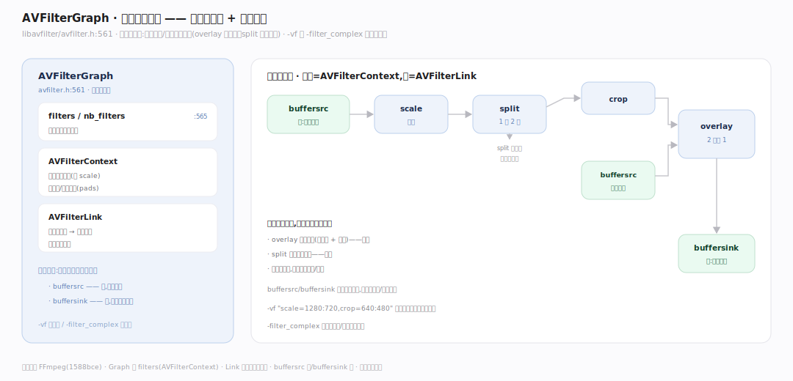
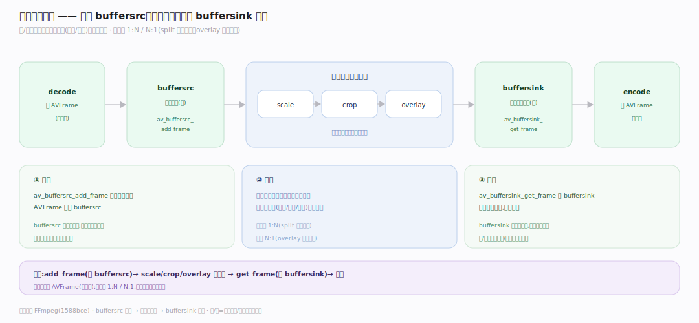
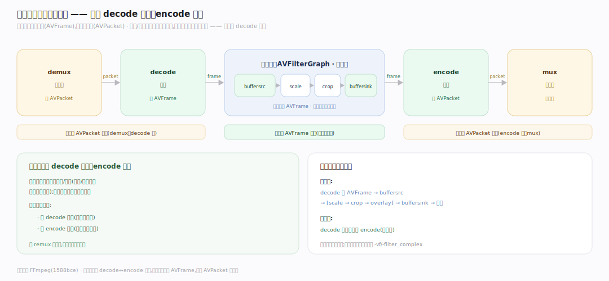

# FFmpeg 原理 · 支撑主线 · 滤镜图

> **定位**：属"处理能力域"。管帧的变换处理:AVFilterGraph 把 scale/crop/overlay 等滤镜链接成**图**,帧从 buffersrc 流入、经中间滤镜、从 buffersink 流出。是编解码管线中间的可选处理段。用【核心数据结构】的 AVFrame。源码基准 **FFmpeg(1588bce)**(`libavfilter/avfilter.h`)。

解码得到原始帧后,常要处理:缩放、裁剪、叠加水印、加字幕、调色、变速…FFmpeg 用**滤镜图**(AVFilterGraph)——把多个滤镜(filter)链接成有向图,帧从源(buffersrc)进、逐个滤镜处理、从汇(buffersink)出。理解"滤镜链接成图 + 帧在图中流动",就懂了 FFmpeg 怎么处理帧。

---

## 一、AVFilterGraph:滤镜链接成图

**AVFilterGraph**(`libavfilter/avfilter.h:561`)= 滤镜的容器 + 链接关系:

- `AVFilterContext **filters`(:565,图中所有滤镜实例)、`nb_filters`。
- 每个 **AVFilterContext** = 一个滤镜实例(如 scale),有输入/输出端口(pads)。
- 滤镜间用**链接(AVFilterLink)**连接输出端口到输入端口——形成有向图。
- 特殊滤镜:**buffersrc**(源,喂帧入图)、**buffersink**(汇,取处理后的帧)。

命令行 `-vf "scale=1280:720,crop=640:480"` 或复杂 `-filter_complex` 描述这张图。

**为什么用图不是链**:多数是线性链(scale→crop),但支持分支/合并——overlay 要两输入(主画面+水印)、split 一输入多输出;图能表达任意拓扑,链只能线性。

---

## 二、帧在图中流动

处理帧的流程:

- **喂入**:`av_buffersrc_add_frame` 把解码的 AVFrame 送入 buffersrc。
- **传播**:帧沿链接从一个滤镜流到下一个,每个滤镜处理(scale 缩放、crop 裁剪、overlay 叠加…)后传给下游。
- **取出**:`av_buffersink_get_frame` 从 buffersink 取处理完的帧,送去编码。
- 滤镜可 1:N/N:1(split 一帧变多、overlay 多帧合一)。

**为什么源/汇特殊**:图需要一个入口喂外部帧(buffersrc)、一个出口给外部取结果(buffersink);它们是图与管线其余部分(解码/编码)的接口边界。

---

## 三、滤镜图在管线中的位置

滤镜图插在**解码后、编码前**:

`decode 出 AVFrame` → **buffersrc → [scale→crop→overlay] → buffersink** → `编码 AVFrame`。

- 无滤镜时:decode 的帧直接送编码(跳过图)。
- 有滤镜时:帧经图变换再编码。
- 滤镜图只处理原始帧(AVFrame),不碰压缩包(AVPacket)——所以必在 decode 之后。

**为什么在中间**:滤镜处理的是原始像素/采样(缩放/裁剪需要解码后的图像),压缩数据无法直接处理;所以滤镜图必然在 decode(得原始帧)之后、encode(重新压缩)之前。

---

## 拓展 · 滤镜图关键结构一览

| 结构 | 定义 | 职责 |
|---|---|---|
| AVFilterGraph | `libavfilter/avfilter.h:561` | 滤镜图容器 |
| AVFilterContext | `avfilter.h` | 单个滤镜实例 |
| buffersrc | 特殊滤镜 | 帧入图的源 |
| buffersink | 特殊滤镜 | 帧出图的汇 |
| AVFilterLink | — | 滤镜间链接(端口到端口) |

## 调优要点（理解要点）

- **-vf vs -filter_complex**:单输入线性链用 `-vf`;多输入/多输出(overlay/split)用 `-filter_complex`。
- **滤镜顺序影响性能**:先 crop 再 scale(缩小处理量)比反之快;顺序影响计算量。
- **避免冗余转换**:滤镜间自动插像素格式转换(auto-inserted scale);格式一致减少隐式转换开销。
- **只处理原始帧**:滤镜在 decode 后——纯 remux(不解码)无法用滤镜。

## 常见误区与工程要点

- **误区:滤镜是线性链。** 是有向图——支持分支(split)、合并(overlay 两输入);图能表达任意拓扑。
- **误区:滤镜能处理压缩数据。** 只处理原始帧(AVFrame);必在 decode 后、encode 前。
- **误区:buffersrc/buffersink 是普通滤镜。** 是图的入口/出口接口——喂帧/取帧的边界。
- **误区:滤镜顺序无所谓。** 顺序影响性能(先 crop 后 scale 更快)和结果;是有序处理。
- **归属提醒**:流经滤镜的 AVFrame 在【核心数据结构】;滤镜图在【编解码管线】的 decode/encode 之间;像素格式转换在【像素采样格式】;帧的引用计数在【引用计数内存】。

## 一句话总纲

**FFmpeg 用滤镜图处理帧:AVFilterGraph(avfilter.h:561)把 scale/crop/overlay 等滤镜(AVFilterContext)用链接(AVFilterLink)连成有向图(支持分支/合并任意拓扑,非线性链);帧从 buffersrc 喂入、沿链接逐滤镜处理(可 1:N/N:1)、从 buffersink 取出;滤镜图插在 decode(得原始 AVFrame)之后、encode 之前(只处理原始帧不碰压缩包);-vf 线性/-filter_complex 多路,滤镜顺序影响性能。**
