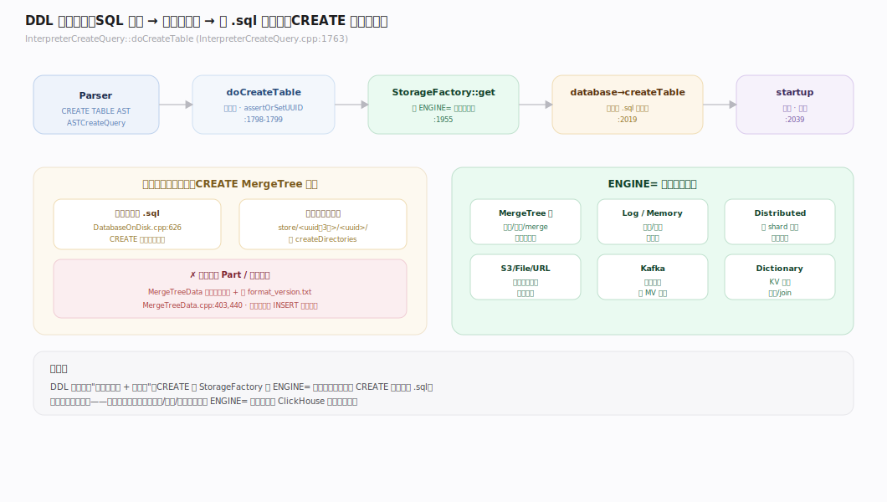
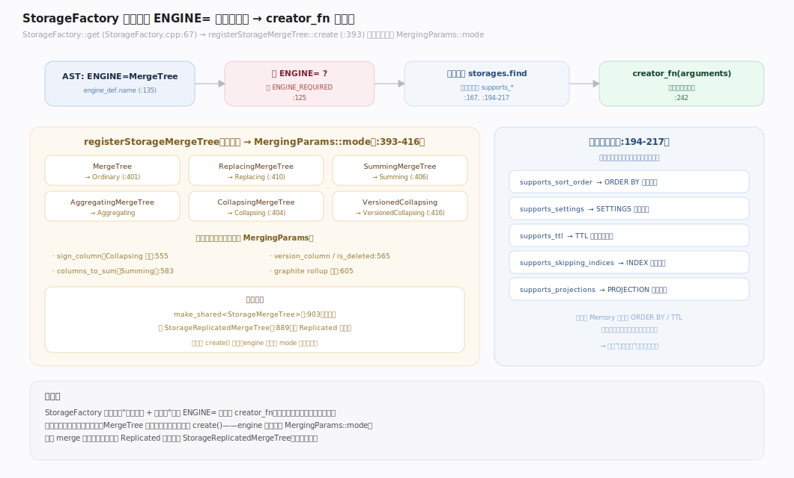
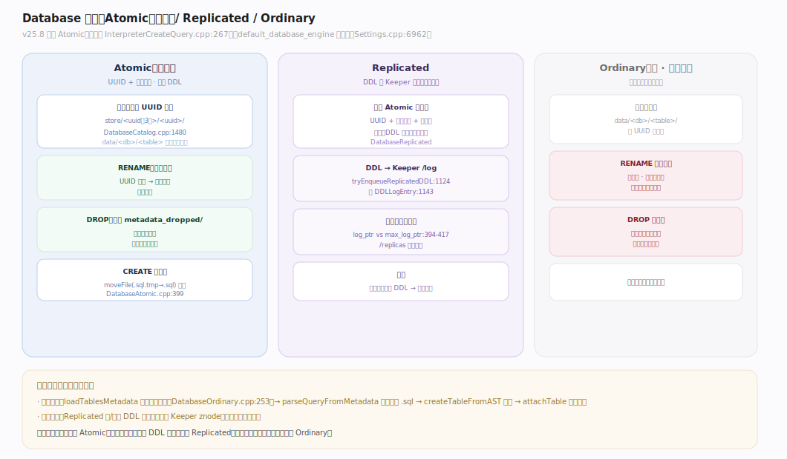
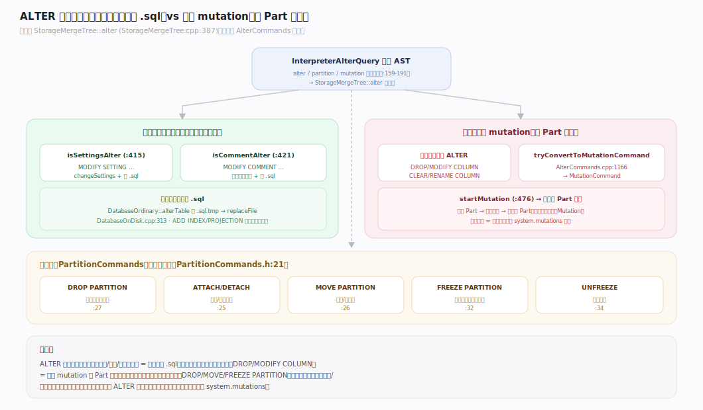
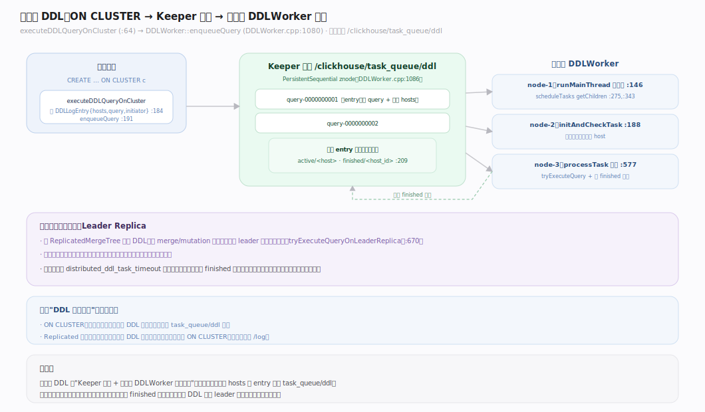

# ClickHouse 核心原理 · DDL 数据定义

> **定位**：DDL 是"建/改元数据"的接口主线，骨架 = `Parser → InterpreterCreateQuery → StorageFactory 分发 → 落 .sql 元数据 + 注册引擎`；依赖 **元数据与协调**（Database 引擎、Keeper、DDLWorker）落地，依赖 **存储引擎** 决定 `ENGINE=` 的物理形态；ALTER 中的重写部分交给 **后台任务**（mutation）。核实基准：社区 v25.8。

## 一、DDL 生命周期总览

一条 `CREATE TABLE` 的链路：`InterpreterCreateQuery::doCreateTable`（`InterpreterCreateQuery.cpp:1763`）解析库、分配/校验 UUID（`assertOrSetUUID:1799`）、经 `StorageFactory::get`（`:1955`）按 `ENGINE=` 造出存储对象、`database->createTable` 持久化 `.sql`（`:2019`）、最后 `res->startup()`（`:2039`）。**关键认知：`CREATE` 一张 MergeTree 表只写元数据、建空目录，不写任何数据**——`MergeTreeData` 构造只 `createDirectories` + 写 `format_version.txt`（`MergeTreeData.cpp:403,440`），不产生 Part。

---

## 二、CREATE TABLE：ENGINE= 与 StorageFactory 分发

`ENGINE=` 是 ClickHouse 建表的灵魂——它决定表的一切行为。`StorageFactory::get`（`StorageFactory.cpp:67`）从 AST 读引擎名（`:135`），缺失即抛 `ENGINE_REQUIRED`（`:125`），在注册表 `storages` 查到对应 `creator_fn` 并校验能力位（`supports_settings/sort_order/ttl…`，`:194-217`）后分发（`:242`）。对 MergeTree 族，`registerStorageMergeTree::create`（`registerStorageMergeTree.cpp:393`）把引擎名映射到 `MergingParams::mode`（Ordinary/Collapsing/Summing/…，`:401-416`），并解析尾部引擎参数（`sign_column:555`、`version_column:565`、`columns_to_sum:583` 等），最终 `make_shared<StorageMergeTree>`（`:903`）或 `StorageReplicatedMergeTree`（`:889`）。

---

## 三、Database 引擎：Atomic / Replicated / Ordinary

**v25.8 默认库引擎是 Atomic**（硬编码 `InterpreterCreateQuery.cpp:267`；老的 `default_database_engine` 设置已废弃，`Settings.cpp:6962`）。

| 引擎 | 元数据位置 | 原子性 | DDL 复制 | 适用 |
|---|---|---|---|---|
| **Atomic**（默认） | `.sql` + 数据在 `store/<uuid前3位>/<uuid>/` | CREATE/DROP/RENAME 原子（UUID 不变、无数据搬移） | 否 | 单机默认，安全 RENAME/DROP |
| **Ordinary**（旧） | `.sql` + 数据在 `data/<db>/<table>/` | 弱（按路径，RENAME 需移动） | 否 | 遗留兼容，不推荐 |
| **Replicated** | 同 Atomic + Keeper `/log` | 原子 + 集群一致 | **是**（经 Keeper） | 多节点自动同步 DDL |

Atomic 的原子性靠 **UUID + 符号链接**（`DatabaseAtomic.h:12`）：真身在 `store/`，`data/<db>/<table>` 只是符号链接——RENAME 只改链接不搬数据，DROP 只把元数据挪到 `metadata_dropped/`。DatabaseReplicated 把每条 DDL 写成 Keeper `/log` 里的 `DDLLogEntry`（`DatabaseReplicated.cpp:1143`），各副本按 `log_ptr` 追平（`:394-417`），实现"在任一副本执行 DDL，全库自动生效"。

---

## 四、ALTER：轻量元数据改 vs 重量 mutation 改

`InterpreterAlterQuery` 先把 AST 拆成三类命令（`InterpreterAlterQuery.cpp:159`）：`alter_commands` / `partition_commands` / `mutation_commands`。真正的"轻/重"决策在 `StorageMergeTree::alter`（`StorageMergeTree.cpp:387`）：

- **纯设置变更**（`isSettingsAlter`，`:415`）→ 只 `changeSettings` + 重写 `.sql`，**不动数据**。
- **纯注释变更**（`isCommentAlter`，`:421`）→ 同上，改内存元数据 + `.sql`。
- **其余**（`:427`）→ 可能 `startMutation`（`:476`），触发**整 Part 重写**（如 `MODIFY/DROP COLUMN` 改变了物理数据）。

判据在 `AlterCommands`：`tryConvertToMutationCommand`（`AlterCommands.cpp:1166`）把 DROP/RENAME/CLEAR COLUMN 转成 `MutationCommand`。元数据级 ALTER 的落盘是原子的：`DatabaseOrdinary::alterTable` 写 `.sql.tmp` 再 `replaceFile`（`DatabaseOnDisk.cpp:313`）。`PartitionCommands`（`PartitionCommands.h:21`）另管 ATTACH/DETACH/DROP/MOVE/FREEZE PARTITION。

---

## 五、分布式 DDL：ON CLUSTER 与 DDLWorker

`... ON CLUSTER <name>` 的执行：`executeDDLQueryOnCluster`（`executeDDLQueryOnCluster.cpp:64`）构造含目标 hosts + query + initiator 的 `DDLLogEntry`（`:184`），`DDLWorker::enqueueQuery`（`DDLWorker.cpp:1080`）在 Keeper 队列 `queue_dir` 下建一个 `PersistentSequential` znode（`query-…`，`:1086`）。各节点的 `DDLWorker` 主循环（`runMainThread:146`）`getChildren` 拉队列（`scheduleTasks:275`）、逐条 `initAndCheckTask`（`:188`）判断本机是否目标、`processTask`（`:577`）执行并写 `finished/<host_id>` 状态。默认队列路径 `/clickhouse/task_queue/ddl/`（`Server.cpp:2670`）。

---

## 深化 · 表元数据的持久化与恢复

每张表一个 `.sql` 文件（`DatabaseOnDisk.cpp:626`），Atomic 表数据在 `store/<uuid前3位>/<uuid>/`（`DatabaseCatalog.cpp:1480`）。**启动恢复**：`DatabaseOrdinary::loadTablesMetadata`（`DatabaseOrdinary.cpp:253`）扫元数据目录、`parseQueryFromMetadata` 逐个解析 `.sql`（`:270`）、`createTableFromAST`（`:370`）重建存储对象、`attachTable`（`DatabasesCommon.cpp:453`）挂回内存。这就是"元数据两层"：本地 `.sql`（单机权威）+ Keeper znode（复制型库/表的集群权威）。

---

## 拓展 · DDL 对象全景

| 对象 | 创建语句 | 元数据落点 |
|---|---|---|
| 表 | `CREATE TABLE … ENGINE=` | `.sql` + `store/<uuid>/` |
| 库 | `CREATE DATABASE … ENGINE=Atomic` | 库元数据目录 |
| 视图 | `CREATE VIEW` / `MATERIALIZED VIEW` | `.sql`（MV 另有内嵌目标表） |
| 字典 | `CREATE DICTIONARY` | `.sql` + 内存缓存 |
| 函数 | `CREATE FUNCTION`（SQL UDF） | `.sql` |
| 列/索引/投影 | `ALTER … ADD COLUMN/INDEX/PROJECTION` | 改表 `.sql`（+ 可能 mutation） |

---

## 调优要点（关键开关）

- **库引擎选择**：默认 Atomic 已满足绝大多数单机场景；多节点自动同步 DDL 用 Replicated；避免用已过时的 Ordinary。
- **`distributed_ddl.path`**：分布式 DDL 队列的 Keeper 路径（默认 `/clickhouse/task_queue/ddl`，`Server.cpp:2670`）。
- **`distributed_ddl_task_timeout`**：ON CLUSTER 等待各节点执行完成的超时。
- **区分 ALTER 轻重**：`MODIFY SETTING`/`MODIFY COMMENT` 是秒级元数据改；`ADD/DROP/MODIFY COLUMN` 可能触发整 Part 重写，大表慎用、错峰做。

---

## 常见误区与工程要点

- **以为 `CREATE` 会写数据**：CREATE 只注册元数据、建空目录；没有数据文件，直到 INSERT。
- **在大表上随意 `ALTER … MODIFY COLUMN`**：改物理类型会触发全表 mutation（整 Part 重写），代价等同重写整表，应评估后错峰执行、看 `system.mutations` 进度。
- **多节点手动逐台建表**：多副本环境应用 `ON CLUSTER` 或 Replicated 库，避免各节点元数据漂移。
- **混用 Ordinary 与 Atomic 期望一致行为**：Ordinary 的 RENAME/DROP 语义与 Atomic 不同（非原子、需搬数据），新库一律 Atomic。

---

## 一句话总纲

**DDL 是"改元数据"的接口主线：`CREATE` 经 StorageFactory 按 `ENGINE=` 造出存储对象并落 `.sql`（不写数据），库引擎默认 Atomic（UUID+符号链接保证 CREATE/DROP/RENAME 原子）；`ALTER` 分轻量（改 `.sql`）与重量（触发整 Part mutation）两条路；`ON CLUSTER`/Replicated 库经 Keeper 队列把 DDL 播到全集群。**
