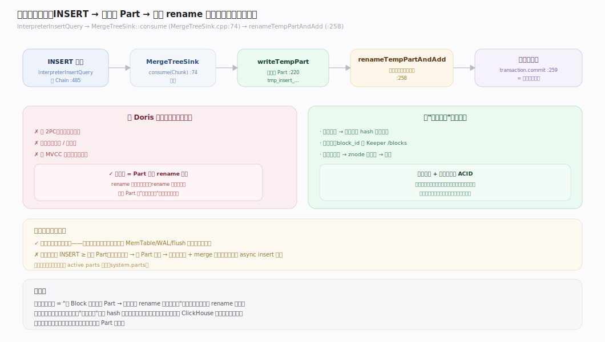
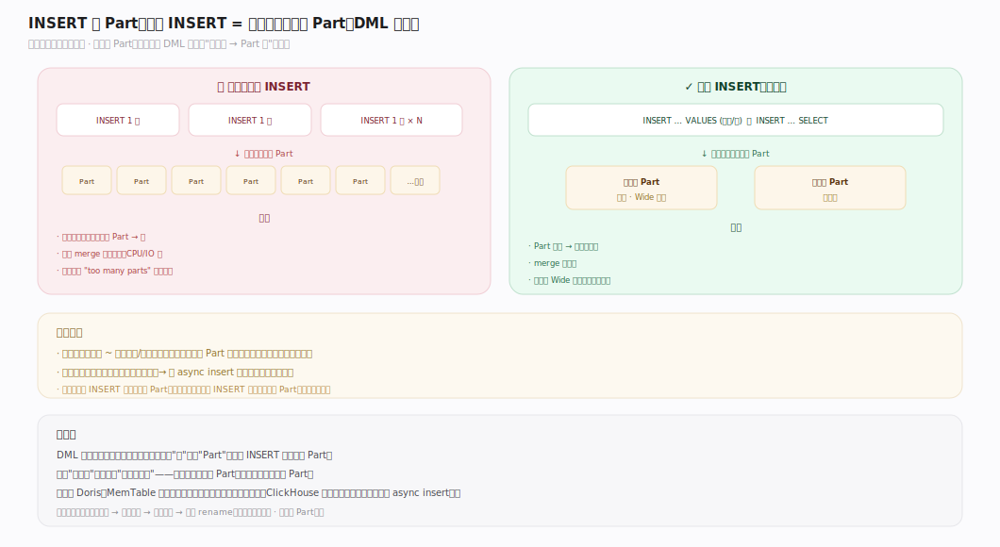
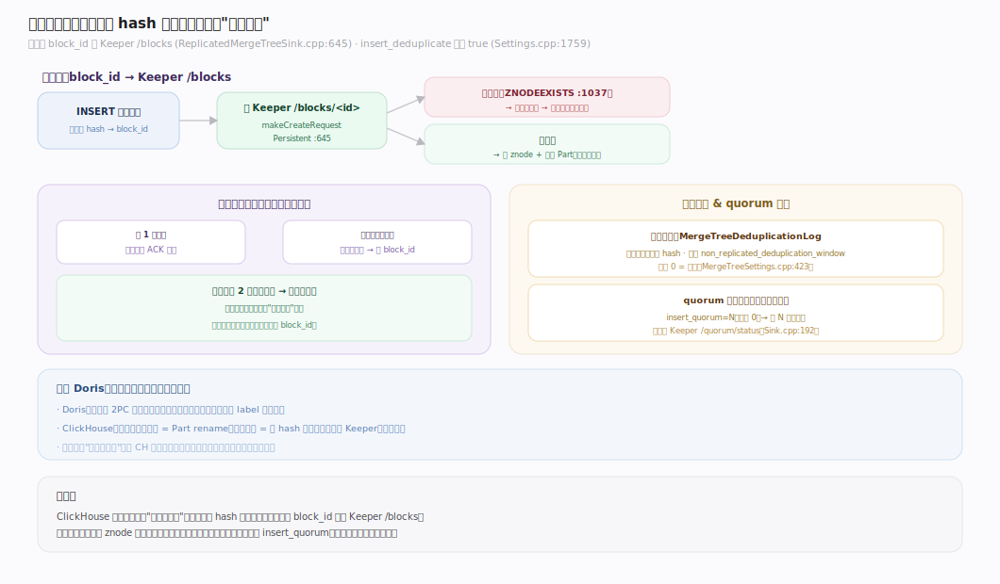
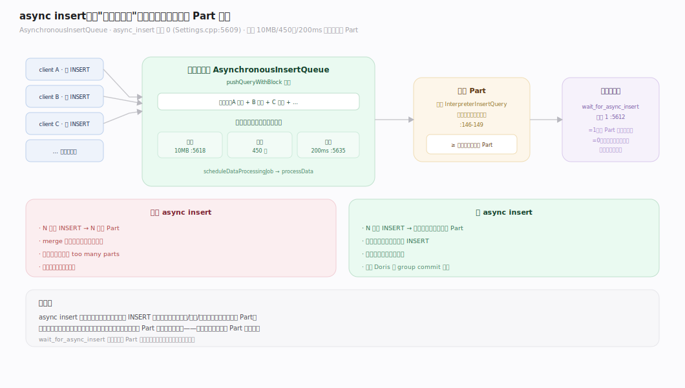
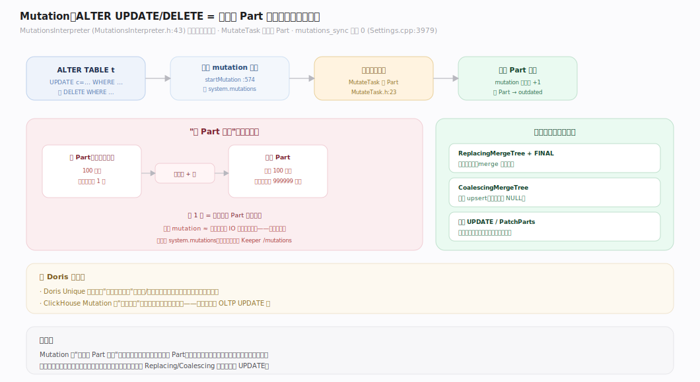
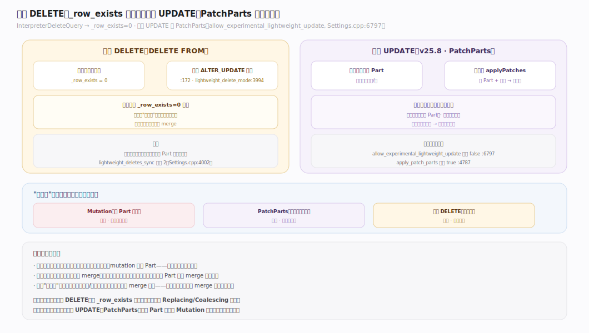

# ClickHouse 核心原理 · DML 数据写入（INSERT / Mutation / DELETE）

> **定位**：DML 是"改数据"的接口主线，骨架 = `INSERT → 建不可变 Part`；依赖 **存储引擎** 的 Part 写入路径，依赖 **复制与一致性**（幂等去重、副本 fetch），"更新/删除"与合并交给 **后台任务**（mutation/merge）。ClickHouse **无经典事务**：可见性来自 Part 原子出现。核实基准：社区 v25.8。

## 一、写入生命周期总览

`InterpreterInsertQuery::execute` 建 Chain 推入管线（`InterpreterInsertQuery.cpp:485,503`），Sink 是 `MergeTreeSink`（`MergeTreeSink.h:36`）。其 `consume`（`MergeTreeSink.cpp:74`）把 Block 切块 → `writeTempPart` 建临时 Part（`:220`）→ `commitPart`（`:223`）在锁内 `renameTempPartAndAdd`（`:258`）把 Part **原子加入活跃集**、`transaction.commit`（`:259`）。**可见性 = Part 原子 rename 到位的那一刻**——没有 2PC、没有事务提交点。

---

## 二、INSERT 建 Part：无 MemTable 的直落模型

（详细的"分区切分 → 主键排序 → 流式写列 → 原子 rename"见「存储引擎」写入建 Part 篇。）DML 视角的要点是：**一次 INSERT 至少产生一个 Part**。这是 ClickHouse 写入模型的双刃剑——写入极简极快（直接落盘不可变文件），但高频小批量 INSERT 会制造海量小 Part，同时拖慢查询（归并路数多）与后台（merge 压力大）。

---

## 三、写入去重与幂等（block hash）

ClickHouse 用**块级 hash 去重**替代事务保证"重试不重复写"：

| 场景 | 去重键 | 存放 | 默认 |
|---|---|---|---|
| 非复制表 | 插入块内容 hash | 本地 `MergeTreeDeduplicationLog` | `non_replicated_deduplication_window=0`（关闭，`MergeTreeSettings.cpp:423`） |
| 复制表 | 块 `block_id` | Keeper `<zk>/blocks/<block_id>`（`ReplicatedMergeTreeSink.cpp:645`） | `insert_deduplicate=true`（`Settings.cpp:1759`） |

复制表插入时，若 `block_id` 的 znode 已存在（`ZNODEEXISTS`，`:1037`），说明这批数据已写过 → 直接跳过。**这就是"重试安全"的来源：网络抖动重发同一批数据不会重复入库，而这不需要事务。**

**quorum 写入**（可选）：`insert_quorum=N`（默认 0 关闭，`Settings.cpp:1775`）要求至少 N 个副本确认才算成功，状态记在 Keeper `<zk>/quorum/status`（`:192`）。

---

## 四、async insert：服务端攒批解小 Part 之痛

高频小 INSERT 的官方解法是 **async insert**（`async_insert=1`，默认 0，`Settings.cpp:5609`）：`AsynchronousInsertQueue`（`AsynchronousInsertQueue.cpp`）把多个小 INSERT 先攒在服务端缓冲，攒够大小（`async_insert_max_data_size=10MB`，`:5618`）、条数（`async_insert_max_query_number=450`）或超时（`async_insert_busy_timeout_max_ms=200ms`，`:5635`）后，`processData` 用**一个** `InterpreterInsertQuery` 把累积的多批数据合并写成**一个 Part**（`:146-149`）。`wait_for_async_insert=1`（默认，`:5612`）时客户端会等 Part 落定再返回。**把"客户端攒批"下放到服务端**，既保留小 INSERT 的编程简单性，又避免小 Part 爆炸。

---

## 五、Mutation：ALTER UPDATE/DELETE = 异步整 Part 重写

`ALTER TABLE ... UPDATE/DELETE` 是 **Mutation**：`MutationsInterpreter`（`MutationsInterpreter.h:43`）把变更编译成类 SELECT 的读取管线，`MutateTask` 读旧 Part、应用变更、写全新 Part——**异步、整 Part 重写，非原地行级更新**。`mutations_sync=0`（默认异步不等待，`Settings.cpp:3979`）。任务队列：单机在 `system.mutations`（`StorageMergeTree::startMutation:574`），复制表在 Keeper `<zk>/mutations`（`StorageReplicatedMergeTree.cpp:886`）。因为重写整 Part，Mutation 是**重操作**，不适合高频更新。

---

## 深化 · 轻量 DELETE 与轻量 UPDATE（PatchParts 读期叠加）

- **轻量 DELETE**（`DELETE FROM`）：`InterpreterDeleteQuery`（`InterpreterDeleteQuery.cpp`）改写为给隐藏掩码列 `_row_exists=0`；`lightweight_delete_mode` 默认 `ALTER_UPDATE`（`Settings.cpp:3994`），走 `ALTER ... UPDATE _row_exists=0`（`:172`），`mutations_sync = lightweight_deletes_sync`（默认 2，`:192`/`Settings.cpp:4002`）。读时跳过 `_row_exists=0` 的行，物理清除延后到 merge。
- **轻量 UPDATE**（实验特性，近版本演进中）：`InterpreterUpdateQuery`（`InterpreterUpdateQuery.cpp`）在 `supportsLightweightUpdate` 且 `allow_experimental_lightweight_update=true`（默认 false）时，走 **PatchParts**（`apply_patch_parts=true`）：把更新写成轻量补丁 Part，查询时 `applyPatches` 现场叠加，避免整 Part 重写——把更新代价从写侧转到读侧。

---

## 拓展 · 写入方式对比

| 方式 | 触发 | 一致性 | 代价 | 适用 |
|---|---|---|---|---|
| 直接 INSERT | 客户端攒批 | 块 hash 幂等去重 | 每次至少 1 Part | 批量导入（万行/批） |
| async insert | 服务端攒批 | 同上 | 服务端合并成大 Part | 高频小 INSERT |
| INSERT SELECT | 表间搬运 | 同上 | 按结果集大小 | ETL/回填 |
| ALTER UPDATE/DELETE | 手动 | 无事务 | 整 Part 重写（重） | 偶发批量订正 |
| 轻量 DELETE | 手动 | 无事务 | 写掩码（轻） | 常规删行 |
| 轻量 UPDATE（实验） | 手动 | 无事务 | 写补丁 + 读叠加 | 较频繁更新 |

---

## 调优要点（关键开关）

- `async_insert`：高频小 INSERT 场景开启（默认 0，`Settings.cpp:5609`），配 `wait_for_async_insert`。
- `async_insert_max_data_size` / `async_insert_busy_timeout_max_ms`：攒批触发阈值（10MB / 200ms）。
- `insert_deduplicate`：复制表插入去重（默认 true，`Settings.cpp:1759`）——重试安全的开关。
- `insert_quorum` / `insert_quorum_timeout`：写入需确认的副本数（默认 0 关闭）。
- `mutations_sync`：ALTER UPDATE/DELETE 是否等待完成（默认 0 异步）。
- `lightweight_deletes_sync`：轻量删除同步级别（默认 2，`Settings.cpp:4002`）。

---

## 常见误区与工程要点

- **逐行/高频小批 INSERT**：每次至少一个 Part，几千 QPS 的单行 INSERT 会瞬间制造几千个小 Part。应客户端攒批到万行级，或开 async insert。
- **把 ALTER UPDATE 当 OLTP UPDATE 用**：它是整 Part 重写的重操作、异步、无事务；高频更新应改用 ReplacingMergeTree/CoalescingMergeTree + merge，或（实验性）轻量 UPDATE/PatchParts。
- **以为 INSERT 有事务回滚**：没有 2PC；可见性 = Part 原子 rename。要"重试安全"靠块 hash 去重（复制表默认开），不是靠事务。
- **依赖 INSERT 返回即全副本可见**：默认写入只保证本副本落定；要多副本确认用 `insert_quorum`。

---

## 一句话总纲

**DML 的核心是"INSERT 直落一个不可变 Part"：无 MemTable/无事务，可见性来自 Part 原子 rename，重试安全靠块 hash 幂等去重（复制表经 Keeper）；高频小写用 async insert 服务端攒批解小 Part 之痛；"更新/删除"分重量 Mutation（整 Part 重写）、轻量 DELETE（写 `_row_exists` 掩码）、轻量 UPDATE（PatchParts 读期叠加）三档，物理清理都推迟到后台 merge。**
