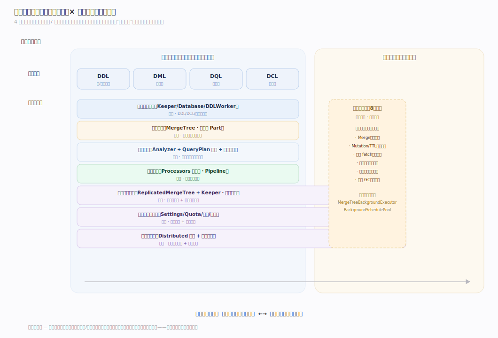
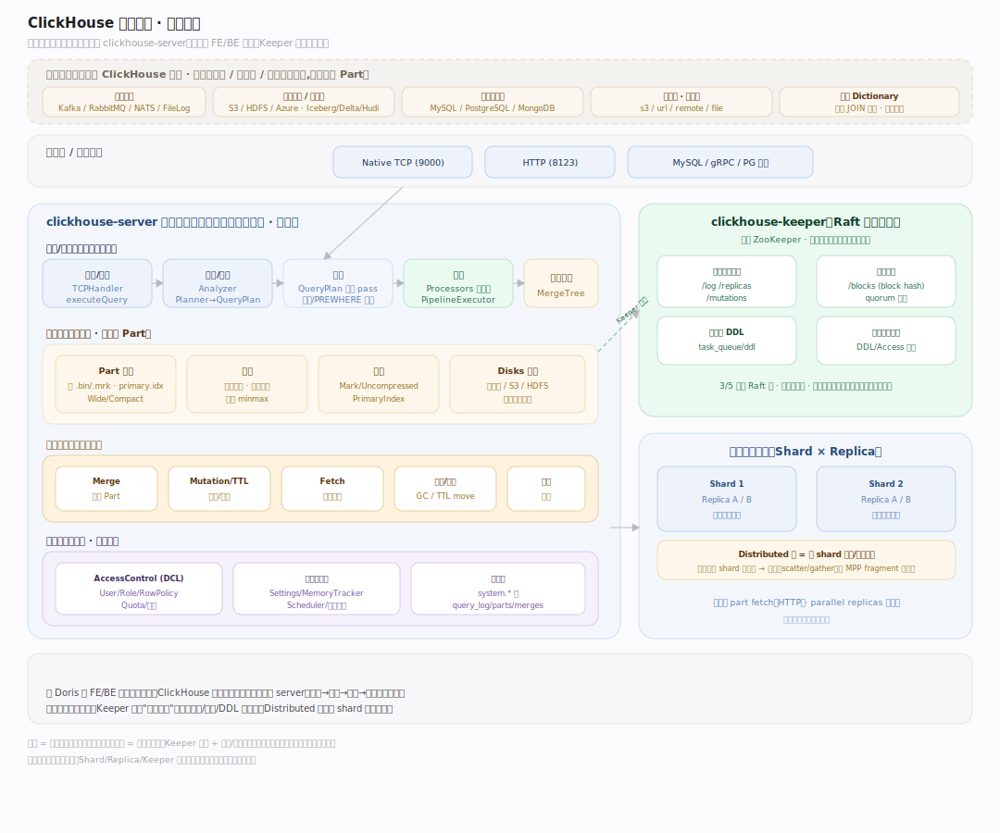
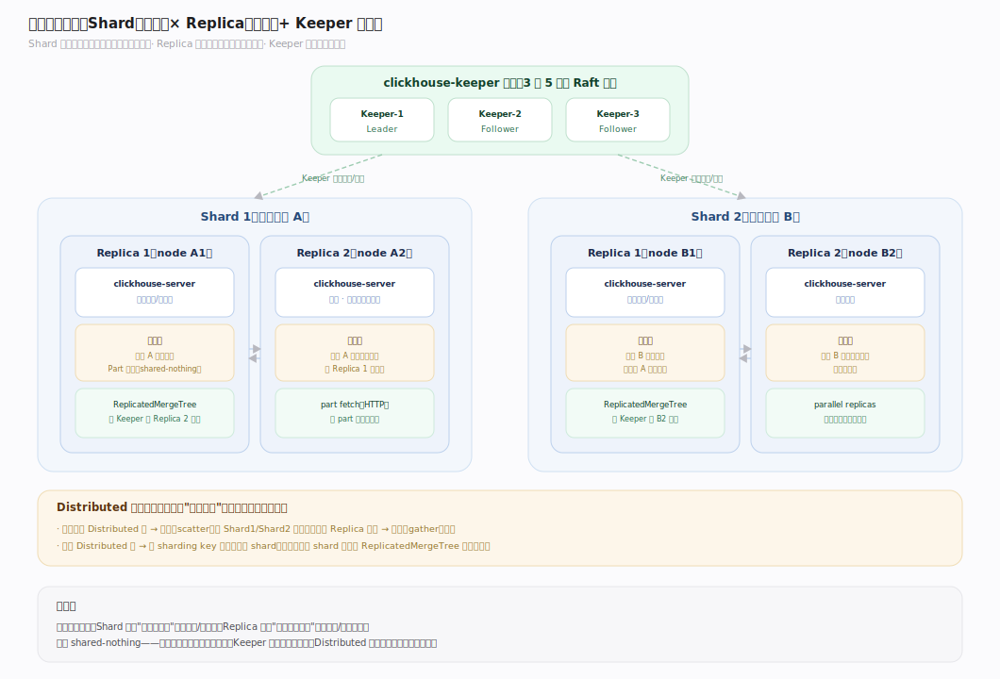
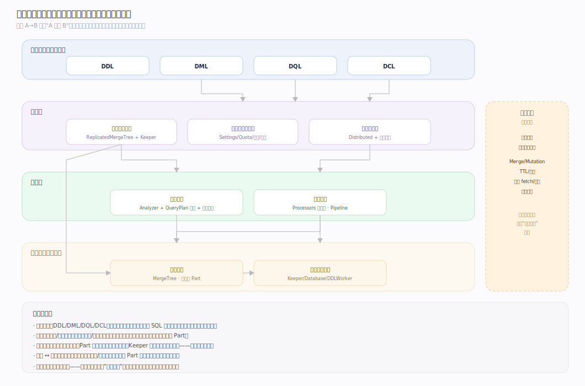
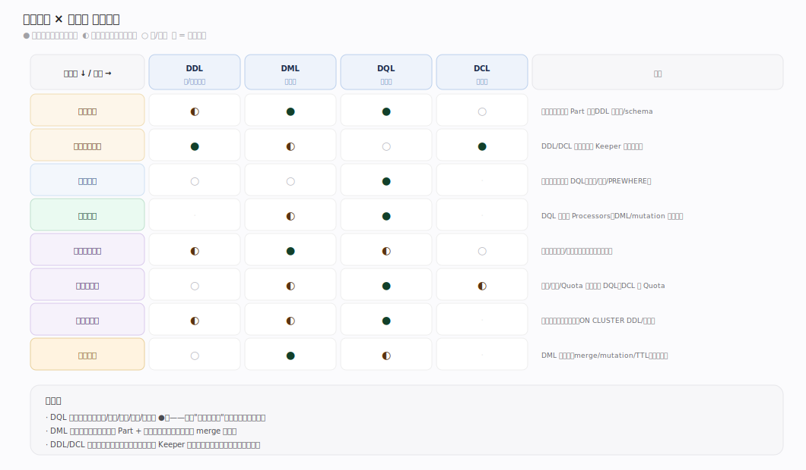
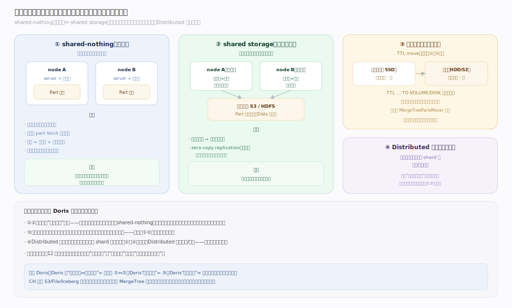

# ClickHouse 核心原理 · 全景主线框架

> 统领全部原理文档：ClickHouse 的 **4 条接口主线（DDL/DML/DQL/DCL）+ 8 条支撑主线**，既无遗漏也无越界。核实基准 = 社区主线 **v25.8**（源码 `ClickHouse/src`）。

## 〇、与 Doris 的心智对照（读前必看）

ClickHouse 与 Doris 同为 MPP 列存分析库，但内核假设差异很大，先立三条"反直觉"认知，后文不再重复：

| 维度 | Doris | ClickHouse | 影响 |
|---|---|---|---|
| 写入模型 | MemTable 攒批 → flush Rowset（近 LSM） | **INSERT 直接落一个不可变 Part**，无 MemTable/WAL | 小批量高频 INSERT 会炸 Part 数，须攒批或 async insert |
| 主键 | Unique 模型下是**唯一约束**（MoW 去重） | **稀疏主键 = 排序 + 跳数索引**，非唯一约束、不强制去重 | 同键多行默认共存，去重靠 ReplacingMergeTree + merge |
| 一致性 | 导入走 **2PC 事务**，原子可见 | **无经典事务**：最终一致 + 幂等去重（block hash） | "可见性"来自 Part 原子出现，不是事务提交点 |
| "更新" | Unique 主键实时更新 | **Mutation = 异步整 Part 重写**；轻量 DELETE 打 `_row_exists` 掩码 | UPDATE/DELETE 是重操作，非在线事务 |
| 合并语义 | 模型内建（Aggregate/Unique 写时/读时生效） | 表引擎变体语义（Replacing/Summing/…）**仅在 merge 时生效** | 未 merge 前重复/待聚合行可见，需 `FINAL` 现场合并 |

一句话：**Doris 以"表模型 + 事务"为中心，ClickHouse 以"不可变 Part + 后台 merge"为中心。**

---

## 一、双维模型：能力域 × 执行时机

- **能力域（管什么）**：接口主线（DDL/DML/DQL/DCL）面向用户；支撑侧 7 条能力域面向引擎内部——元数据与协调、存储引擎、优化技术、执行引擎、复制与一致性、资源与负载管理、集群与自愈。
- **执行时机（何时做）**：前台同步（请求路径）与后台异步（守护线程）。**后台任务**是第 8 条支撑主线，横切承接各能力域的异步部分——正交的"执行时机"维度，而非又一个能力域。

---

## 二、总架构图

---

## 二·补　物理部署视图（Shard/Replica · Keeper · 本地盘）

---

## 三、8 条支撑主线的分层归位

| 层 | 支撑主线 | 一句话职责 | 内核锚点 |
|---|---|---|---|
| 底座 | **元数据与协调** | 全局状态一致：Keeper(Raft)、Database 元数据、分布式 DDL | `Coordination/`、`Databases/`、`DDLWorker` |
| 底座 | **存储引擎** | 数据组织、落盘与读取：MergeTree 族 · 不可变 Part | `Storages/MergeTree/` |
| 计算 | **优化技术** | 规划期减少"要做的事"：Analyzer + QueryPlan 优化 + 主键裁剪 | `Analyzer/`、`Processors/QueryPlan/Optimizations/` |
| 计算 | **执行引擎** | 执行期并行跑：Processors 向量化 · Pipeline | `Processors/`、`QueryPipeline/` |
| 保障 | **复制与一致性** | 副本一致、写入幂等：ReplicatedMergeTree + Keeper | `StorageReplicatedMergeTree`、`ReplicatedMergeTreeQueue` |
| 保障 | **资源与负载管理** | 多租户隔离、稳定不崩：Settings/Quota/内存/调度 | `Core/Settings`、`Access/Quota`、`Common/Scheduler/` |
| 保障 | **集群与自愈** | 分片路由、副本恢复、数据均衡：Distributed + 恢复线程 | `Storages/Distributed`、`ReplicatedMergeTree*Thread` |
| 异步 | **后台任务** | 各域异步部分的统一调度载体：merge/mutate/move/fetch/TTL | `MergeTreeBackgroundExecutor`、`BackgroundSchedulePool` |

---

## 四、能力域依赖关系（按依赖深度分层）

---

## 五、接口主线 × 能力域 依赖矩阵

---

## 六、三条贯穿声明（不单列主线，但覆盖全局）

- **通信/传输（性能）**：分布式 shuffle、副本 part fetch、Keeper 复制均走网络与序列化，瓶颈常落于此。
- **可观测性（诊断）**：`system.*` 表（query_log/parts/merges/replication_queue/…）+ EXPLAIN + 采样 profiler，归资源与负载的"事后审计"。
- **部署形态（前提）**：默认 shared-nothing（每副本本地盘全量）；亦支持 shared storage（S3/存算分离）与 zero-copy replication，主线不变、存储介质变。容错以**副本重试 / parallel replicas** 为主。

---

## 七、部署形态（存储关系维度的取值）

- **shared-nothing（默认）**：每个 Replica 在本地盘持有分片全量数据，ReplicatedMergeTree 靠 Keeper 协调多副本一致。
- **shared storage / 存算分离（正交叠加）**：数据放 S3/HDFS 等对象存储（`Disks/` 抽象），本地盘退化为缓存；可叠加 **zero-copy replication**（多副本共享远端数据，只复制元数据）。
- **Distributed 表（旁路路由）**：`Distributed` 引擎本身不存数据，是跨 shard 的**路由/汇聚视图**，把查询散射到各 shard 的本地表——不是"存储实现形态"，而是平行的分布式接入路径。

---

## 常见误区与工程要点

- **后台任务不是第 8 个"平级能力域"**：它是正交的执行时机维度，只承接各域异步部分（merge/mutate/TTL/fetch）。
- **接口主线不能脱离支撑主线单独理解**：一条 SQL 的表现由它依赖的能力域共同决定（见依赖矩阵）。
- **稀疏主键 ≠ 唯一键**：ClickHouse 主键只定义排序与跳数索引，不去重、不唯一——这是与 Doris/传统 OLTP 最大的认知鸿沟。
- **变体引擎不是"实时生效"**：Replacing/Summing/Aggregating 的语义只在 merge 时兑现，查询要即时正确须付 `FINAL` 或 `GROUP BY` 代价。

---

## 一句话总纲

**ClickHouse 的主线是"能力域 × 执行时机"双维网：纵向 4 条接口主线（DDL/DML/DQL/DCL）面向用户，横切 8 条支撑主线——底座（元数据与协调、存储引擎）、计算（优化、执行）、保障（复制一致性、资源、集群自愈）、异步载体（后台任务）；而贯穿一切的内核信条是"不可变 Part + 后台 merge + 稀疏主键"。**
