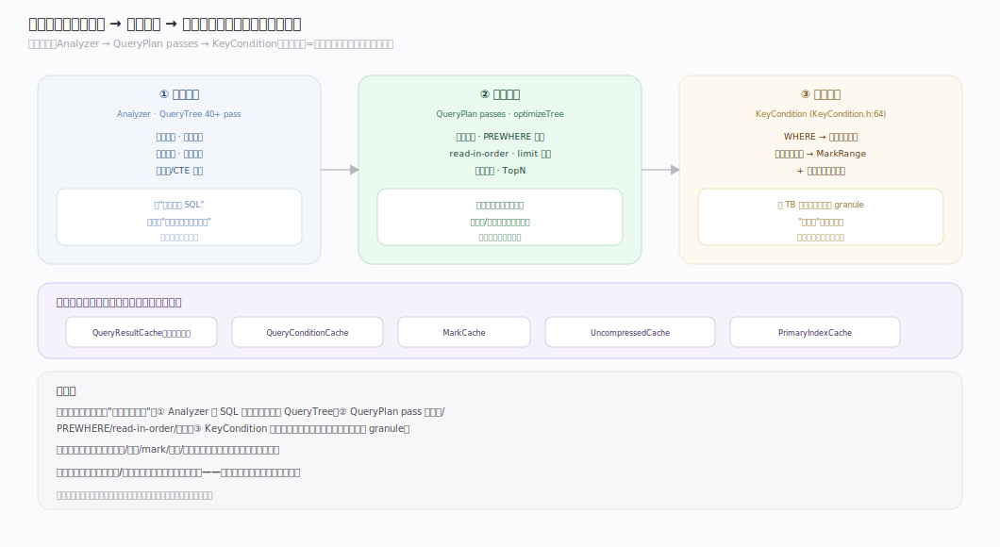
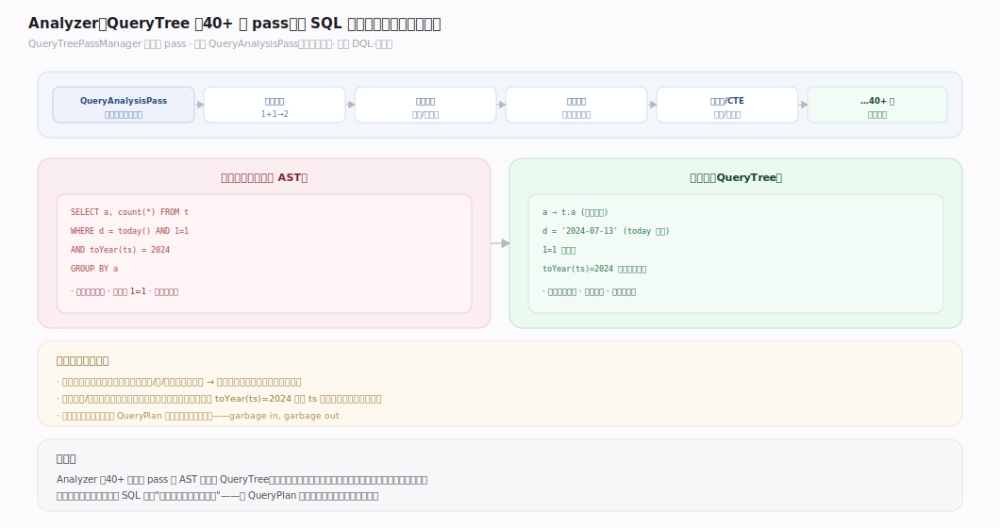
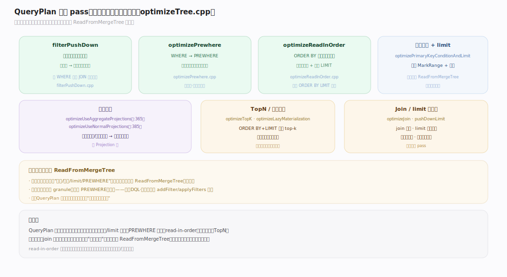
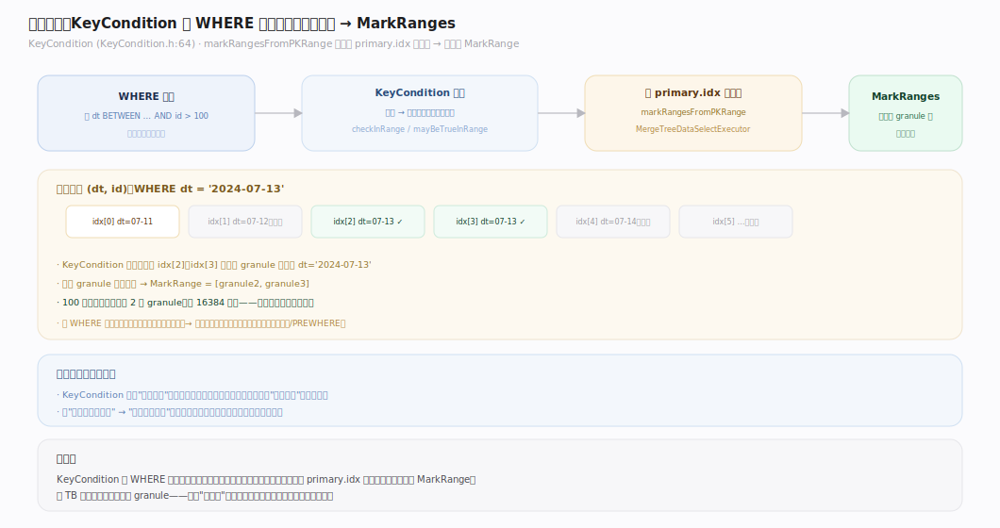
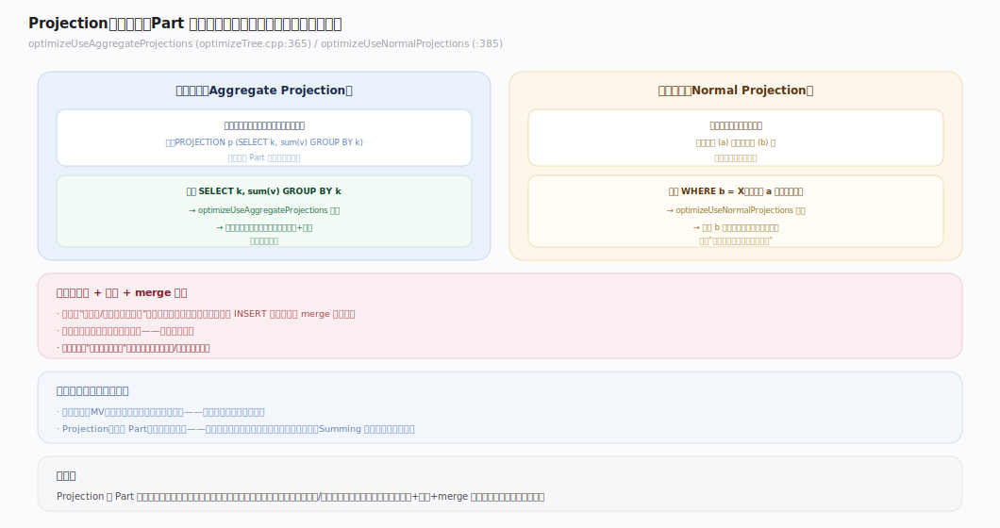
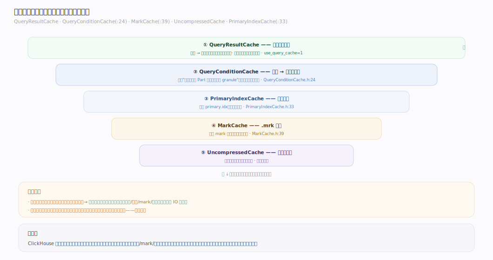

# ClickHouse 核心原理 · 支撑主线 · 优化技术

> **定位**：优化技术是计算能力域，规划期减少"要做的事"；骨架 = `Analyzer(QueryTree passes) → Planner → QueryPlan 优化 pass → 主键/跳数裁剪`。产出交 **执行引擎** 跑；主键裁剪深依 **存储引擎** 的稀疏索引；结果/条件缓存旁路加速。核实基准：社区 v25.8。

## 一、优化全景：分析改写 + 计划优化 + 存储裁剪

ClickHouse 的优化分三层，层层递进地"减少要做的事"：
1. **分析改写**（Analyzer）：AST → QueryTree，跑 40+ 个 pass 做名称解析、常量折叠、谓词/函数重写。
2. **计划优化**（QueryPlan passes）：谓词下推、PREWHERE 移动、read-in-order、投影使用、limit 下推。
3. **存储裁剪**（KeyCondition）：把过滤条件编译成对稀疏主键的区间判定，只读命中的 granule。

三层共同的目标：**在真正读数据/算数据之前，把工作量削到最小**。

---

## 二、Analyzer：QueryTree 的 40+ 个 pass

`QueryTreePassManager`（`addQueryTreePasses`，`QueryTreePassManager.cpp:268-352`）顺序跑一串 pass（首个 `QueryAnalysisPass` 做名称解析，`:270`）。这些 pass 把"用户写的 SQL"规整成"引擎好优化的语义树"：解析标识符到真实对象、折叠常量、化简恒真/恒假谓词、重写等价函数、展开子查询/CTE。规整后的 QueryTree 才交给 Planner——好的语义形态是后续所有优化的前提。（详见「DQL 数据查询 · 分析」篇。）

---

## 三、QueryPlan 优化 pass（下推 / PREWHERE / read-in-order）

`optimizeTree`（`Optimizations/optimizeTree.cpp`）对 QueryPlan 做多轮变换：

| pass | 作用 | 收益 |
|---|---|---|
| `filterPushDown` | 谓词尽量下推到源附近 | 早过滤、少传数据 |
| `optimizePrewhere` | WHERE → PREWHERE | 先读判断列，少读投影列 |
| `optimizeReadInOrder` | 利用 ORDER BY 与主键序一致 | 省排序、可流式 LIMIT |
| `optimizePrimaryKeyConditionAndLimit` | 主键条件 + limit 下推给读取步 | 缩小 MarkRange、早停 |
| `optimizeUseAggregateProjections`（:365）/ `optimizeUseNormalProjections`（:385） | 命中预聚合/重排序投影 | 直接读投影，跳过原表计算 |
| `optimizeTopK` / `optimizeLazyMaterialization` | TopN 提前、延迟物化 | 减少排序/列读取 |

这些优化最终把裁剪条件"推给 `ReadFromMergeTree`"——见「DQL · 优化」篇的落点细节。

---

## 四、主键裁剪：KeyCondition → MarkRanges

`KeyCondition`（`KeyCondition.h:64`）是优化与存储的接合点：它把 WHERE 里与主键相关的谓词编译成对主键**区间**的判定函数（`checkInRange`/`mayBeTrueInRange`）。`MergeTreeDataSelectExecutor::markRangesFromPKRange` 用它在稀疏 `primary.idx` 上二分/排除，得到需要读的 **MarkRange** 集合。**这是"少读盘"最关键的一环**——把 TB 级表的扫描缩到几个 granule。（存储侧实现见「存储引擎 · 稀疏主键」篇。）

---

## 五、Projection 与物化优化

**Projection（投影）** 是 Part 内嵌的"预计算副本"：可以是预聚合（类似物化视图）或按不同键重排序的副本。查询若能命中投影，优化器直接读投影结果，跳过原表的重算/重排：
- `optimizeUseAggregateProjections`（`optimizeTree.cpp:365`）：命中预聚合投影 → 直接读聚合结果。
- `optimizeUseNormalProjections`（`:385`）：命中重排序投影 → 换更优的读取顺序。

与 MergeTree 变体、物化视图共同构成"用空间/写入换查询速度"的预计算体系。

---

## 深化 · 缓存体系（结果 / 条件 / mark / 主键索引）

多层缓存各管一段，命中即省对应的工作：

| 缓存 | 命中粒度 | 省掉什么 | 源码 |
|---|---|---|---|
| QueryResultCache | 整条查询 | 全部计算 | `Cache/QueryResultCache` |
| QueryConditionCache | 条件 → 可跳过的段 | 重复的跳数判定 | `QueryConditionCache.h:24` |
| MarkCache | .mrk 标记 | 重复读 mark 文件 | `MarkCache.h:39` |
| UncompressedCache | 解压后的块 | 重复解压 | `Context.h:109` |
| PrimaryIndexCache | 稀疏主键 | 重复加载 primary.idx | `PrimaryIndexCache.h:33` |

从粗到细：结果缓存跳过一切，往下逐层跳过"解压/读标记/加载索引"。（结果缓存的适用与失效见「DQL · 接入缓存」篇。）

---

## 拓展 · 优化边界清单

| 类别 | 项 | 说明 |
|---|---|---|
| Join 优化 | `optimizeJoin` / lazy indexing | join 重排、延迟索引 |
| 延迟物化 | `optimizeLazyMaterialization` | 先算过滤，晚读大列 |
| 统计信息 | column statistics | 辅助代价估算（较新） |
| 分布式 | 谓词下推到 shard | 各 shard 本地先过滤 |

---

## 调优要点（关键开关）

- `enable_analyzer`：新分析器（默认 true）——优化能力的基础。
- `optimize_move_to_prewhere`：WHERE→PREWHERE（默认 true）。
- `optimize_read_in_order`：利用主键序省排序。
- `optimize_use_projections`：启用投影优化。
- `use_query_cache`：结果缓存（对重复确定性查询）。
- `allow_statistics_optimize`：启用统计信息辅助优化。

---

## 常见误区与工程要点

- **主键设计随意**：主键（ORDER BY）决定裁剪与 read-in-order 能力；应把高频过滤/排序列放前缀，否则优化无从下手。
- **投影当银弹**：投影提升查询但增加写入与存储成本、也需 merge 维护；只给高频固定模式建。
- **依赖结果缓存救慢查询**：结果缓存只对"完全相同、结果稳定"的查询有效；数据一变即失效，治标不治本。
- **忽略 read-in-order**：ORDER BY 与主键序一致时能省全量排序 + 流式 LIMIT；不一致则退化为全排。

---

## 一句话总纲

**优化技术三层递进"减少要做的事"：Analyzer 把 SQL 规整成好优化的 QueryTree（40+ pass）→ QueryPlan pass 做下推/PREWHERE/read-in-order/投影 → KeyCondition 把过滤编译成主键区间裁剪只读命中 granule；再叠多层缓存（结果/条件/mark/解压/主键索引）从粗到细跳过重复工作。核心信条：真正读算之前，先把工作量削到最小。**
