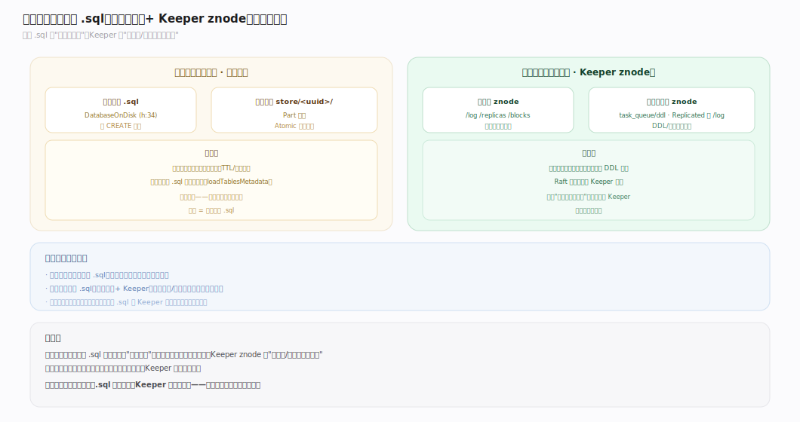
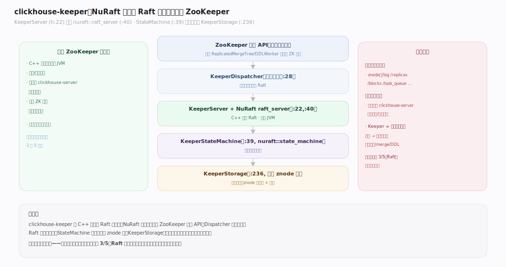
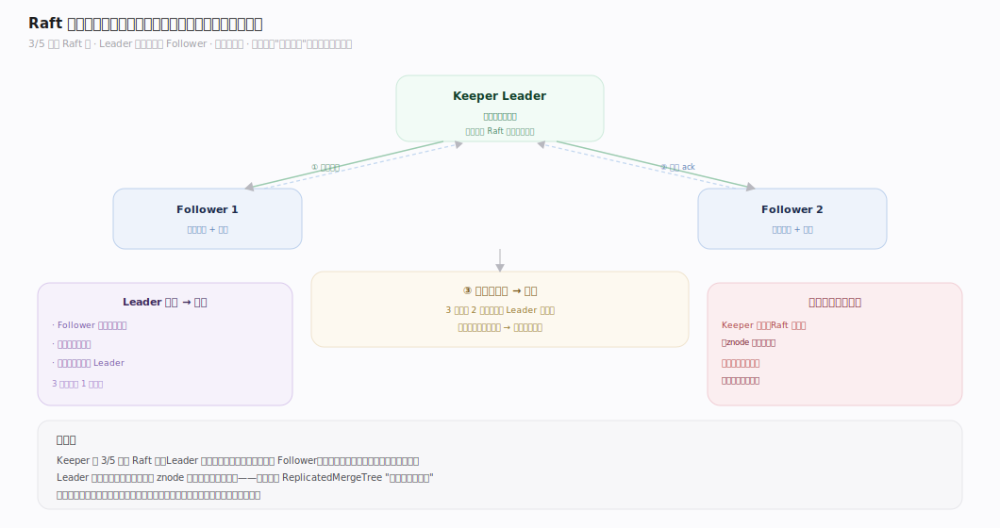
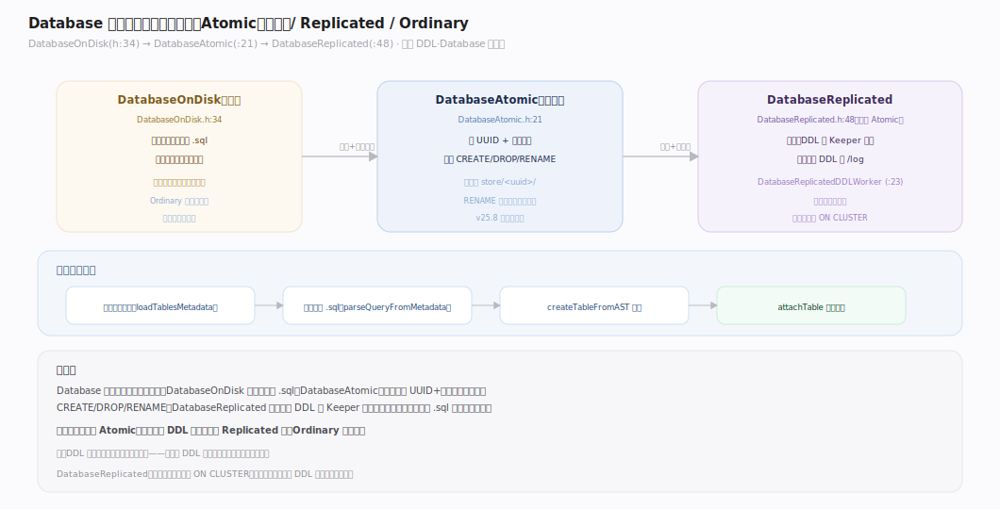
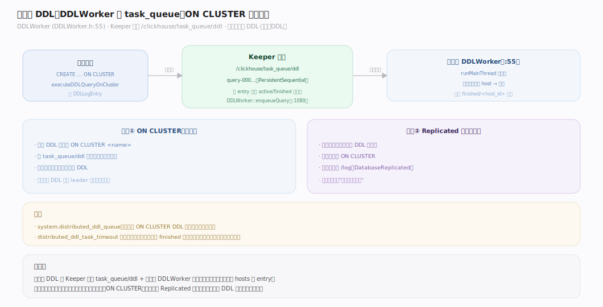
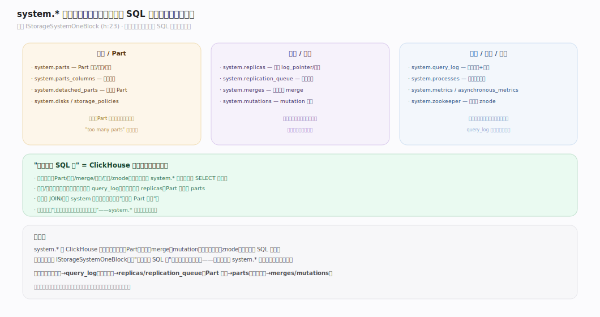

# ClickHouse 核心原理 · 支撑主线 · 元数据与协调

> **定位**：元数据与协调是底座能力域，负责全局状态的持久化与全集群一致；三支柱 = **clickhouse-keeper（Raft）** + **Database 引擎（.sql 元数据）** + **DDLWorker（分布式 DDL）**。是 DDL/DCL 落点、复制日志仲裁者、`system.*` 自省之源。核实基准：社区 v25.8，源码 `src/Coordination/`、`src/Databases/`、`src/Storages/System/`。

## 一、元数据两层：本地 .sql 与 Keeper znode

ClickHouse 元数据分两层：
- **本地层（单机权威）**：每张表一个 `.sql` 文件（DatabaseOnDisk），存 CREATE 语句；启动时解析重建表对象。适用于所有表。
- **集群层（分布式权威）**：Keeper znode——复制表的 `/log`、`/replicas`，Replicated 库的 DDL `/log`，分布式 DDL 队列，复制型访问控制。只有"需要全集群一致"的状态才上 Keeper。

两层各司其职：本地 `.sql` 管"这张表长什么样"，Keeper 管"多副本/多节点如何一致"。

---

## 二、clickhouse-keeper：NuRaft 替代 ZooKeeper

`KeeperServer`（`KeeperServer.h:22`）是一个 **Raft 协调器**——它包装 NuRaft 的 `raft_server`（`:40`），提供 ZooKeeper 兼容的 API，但是用 C++ 原生实现、无需独立 JVM。`KeeperStateMachine`（`KeeperStateMachine.h:39`，继承 `nuraft::state_machine`）应用已提交的 Raft 日志到 `KeeperStorage`（`KeeperStorage.h:236`，内存中的 znode 树）。`KeeperDispatcher`（`KeeperDispatcher.h:28`）路由请求。**关键认知：Keeper 只存"协调元数据"（znode），不存表数据**——它是集群的"神经中枢"，不是存储节点。

---

## 三、Raft 日志复制与选主

Keeper 是 3 或 5 节点的 Raft 组：一个 Leader 接收写请求，把每个写操作作为 Raft 日志复制给 Follower，**多数派确认后提交**并应用到状态机。Leader 故障时 Follower 经 Raft 选举产生新 Leader。这保证了 znode 的强一致（线性一致读写）——而这正是上层 ReplicatedMergeTree "最终一致"所依赖的强一致底座：**表数据最终一致，但协调元数据（谁有哪个 Part、去重记录）必须强一致**。

---

## 四、Database 引擎与表元数据持久化

`DatabaseOnDisk`（`DatabaseOnDisk.h:34`）负责把表定义持久化为 `.sql`；`DatabaseAtomic`（`DatabaseAtomic.h:21`，默认）在其上加 UUID + 符号链接实现原子 CREATE/DROP/RENAME；`DatabaseReplicated`（`DatabaseReplicated.h:48`，继承 Atomic）再加一层——把库内所有 DDL 写进 Keeper `/log`，各节点经 `DatabaseReplicatedDDLWorker`（`DatabaseReplicatedWorker.h:23`）自动同步。（详见「DDL · Database 引擎」篇。）

---

## 五、分布式 DDL：DDLWorker 与 task_queue

`... ON CLUSTER` 的 DDL 经 `DDLWorker`（`DDLWorker.h:55`）落地：发起端把带目标 hosts 的 entry 写进 Keeper 队列 `/clickhouse/task_queue/ddl`，各节点主循环拉取、判断是否目标、执行并回写 finished 状态。（完整链路见「DDL · 分布式 DDL」篇。）这与 Replicated 库的库级 DDL 复制是两条"DDL 播全集群"的路径。

---

## 深化 · system.* 自省表全景

`system.*` 是 ClickHouse 的"元数据可观测层"，基类 `IStorageSystemOneBlock`（`IStorageSystemOneBlock.h:23`）。它把内部状态暴露成可 SQL 查询的表：

| 表 | 内容 | 诊断用途 |
|---|---|---|
| `system.parts` | 所有 Part 的状态/大小/行数 | Part 数、碎片、磁盘占用 |
| `system.replicas` | 每副本 log_pointer、队列、只读态 | 副本落后、健康 |
| `system.replication_queue` | 复制队列每个 entry | 卡住的复制任务 |
| `system.merges` / `system.mutations` | 进行中的 merge/mutation | 后台任务进度 |
| `system.query_log` | 查询历史与指标 | 慢查询、资源消耗 |
| `system.zookeeper` | 直接查 Keeper znode | 底层协调状态 |
| `system.metrics` / `asynchronous_metrics` | 实时指标 | 监控 |

**"一切皆可 SQL 查"是 ClickHouse 可观测性的核心**——运维/诊断不需要额外工具，查 `system.*` 即可。

---

## 拓展 · 元数据边界清单

| 类别 | 项 | 说明 |
|---|---|---|
| Keeper 部署 | 3/5 节点独立或内嵌 | 生产建议独立部署 |
| 元数据备份 | `.sql` + Keeper 快照 | 两层都要备 |
| DDL 传播 | ON CLUSTER / Replicated 库 | 两条路径 |
| 一致性边界 | Keeper 强一致 / 表数据最终一致 | 不要混淆两者 |

---

## 调优要点（关键开关）

- **Keeper 独立部署**：生产环境把 Keeper 与 clickhouse-server 分开，避免相互影响。
- **Keeper 节点数**：3 或 5（奇数，容忍 1 或 2 节点故障）；不要用偶数。
- `distributed_ddl_task_timeout`：ON CLUSTER 等待超时。
- **默认库引擎 Atomic**：多节点自动同步 DDL 用 Replicated 库。
- `max_table_size_to_drop` / `max_partition_size_to_drop`：防误删大表的保护阈值。

---

## 常见误区与工程要点

- **Keeper 当存储节点扩容**：Keeper 只存协调元数据，节点数固定为 3/5（Raft 多数派），不随数据量扩；扩的是 clickhouse-server。
- **混淆两种一致性**：Keeper 内部是 Raft 强一致，但 ReplicatedMergeTree 表数据是最终一致——别以为写 Keeper 强一致就等于表数据强一致。
- **忽视 system.* 诊断**：绝大多数运维问题（副本落后、Part 过多、merge 卡住）都能从 `system.*` 直接查出，不必猜。
- **只备份数据不备元数据**：恢复需要 `.sql`（表定义）+ Keeper 状态（复制拓扑）；只备数据文件无法恢复集群。

---

## 一句话总纲

**元数据与协调三支柱：clickhouse-keeper（NuRaft 实现的 Raft 协调器，强一致存 znode，不存表数据）+ Database 引擎（.sql 本地元数据，Atomic 默认、Replicated 经 Keeper 同步 DDL）+ DDLWorker（ON CLUSTER 经 Keeper 队列播 DDL）；一切内部状态经 `system.*` 暴露成可 SQL 查的表——这是 ClickHouse 可观测性的基石。**
