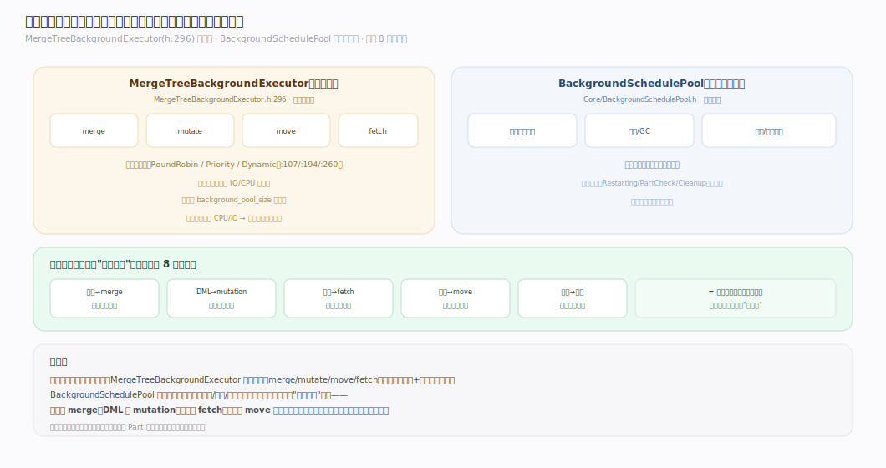
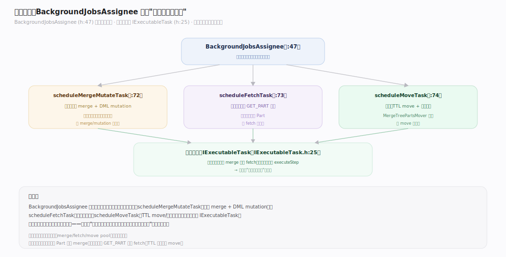
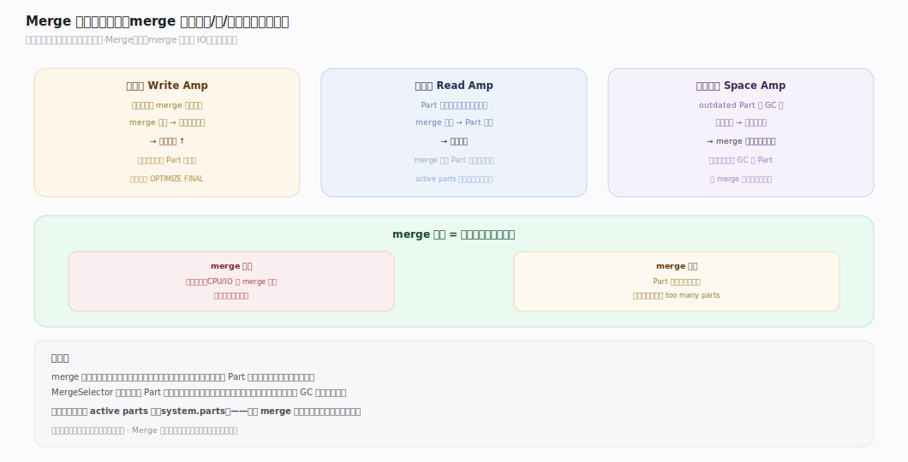
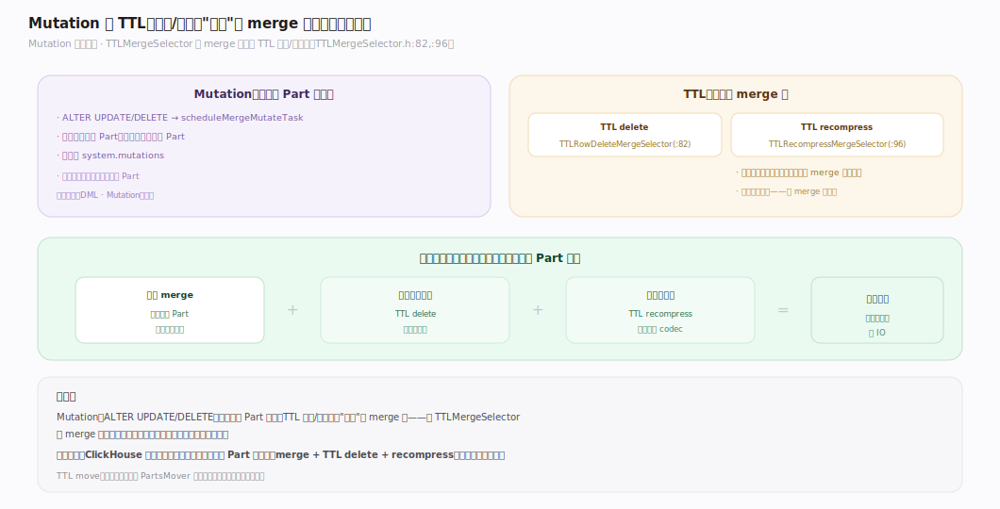
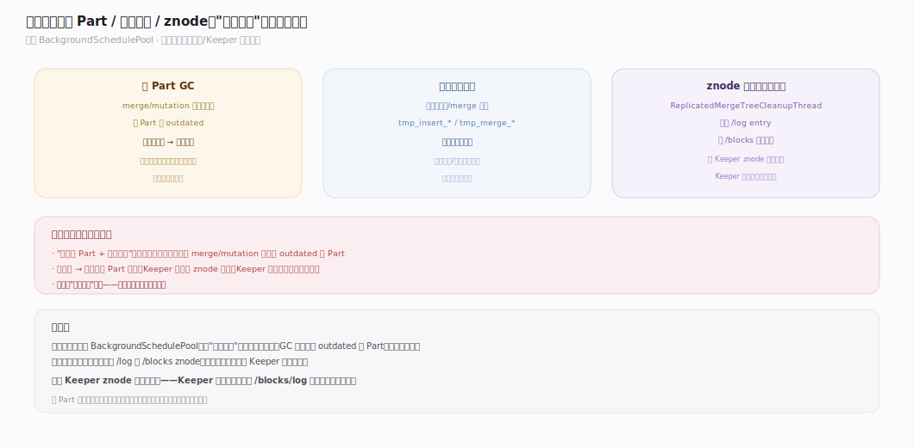
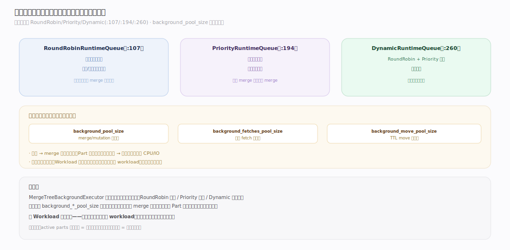

# ClickHouse 核心原理 · 支撑主线 · 后台任务

> **定位**：后台任务是**正交的"执行时机"维度**（非第 8 个平级能力域），统一承接各能力域的异步部分；两个调度载体 = **MergeTreeBackgroundExecutor**（重任务：merge/mutate/move/fetch）+ **BackgroundSchedulePool**（轻周期任务）。是"不可变 Part + 后台 merge"信条的执行侧。核实基准：社区 v25.8。

## 一、后台调度全景：两类执行器

ClickHouse 的后台工作由两类载体承接：
- **MergeTreeBackgroundExecutor**（`MergeTreeBackgroundExecutor.h:296`）：跑"重任务"（merge/mutate/move/fetch），有独立线程池与运行时队列（`RoundRobinRuntimeQueue`/`PriorityRuntimeQueue`/`DynamicRuntimeQueue`，`:107/:194/:260`）。
- **BackgroundSchedulePool**（`Core/BackgroundSchedulePool.h`）：跑"轻周期任务"（复制队列拉取、清理、心跳等定时活）。

**核心定位（呼应全景框架）**：后台任务不是又一个能力域，而是横切各域的"执行时机"维度——存储的 merge、DML 的 mutation、复制的 fetch、集群的 move、优化的统计刷新，其异步部分统一在这里被调度。

---

## 二、任务分配：BackgroundJobsAssignee

`BackgroundJobsAssignee`（`BackgroundJobsAssignee.h:47`）是"该干哪个后台活"的决策者，向执行器提交三类任务：

| 任务 | 提交方法 | 承接什么 |
|---|---|---|
| merge/mutate | `scheduleMergeMutateTask`（`:72`） | 存储 merge、DML mutation |
| fetch | `scheduleFetchTask`（`:73`） | 复制的 GET_PART 拉取 |
| move | `scheduleMoveTask`（`:74`） | 集群的 TTL move、卷间均衡 |

任务统一抽象为 `IExecutableTask`（`IExecutableTask.h:25`），执行器不关心具体是 merge 还是 fetch，只管调度执行——这就是"统一调度载体"的含义。

---

## 三、Merge：选取策略与写放大

Merge 是后台任务里最核心的一类（详见「存储引擎 · Merge 合并」篇）。后台视角的要点：
- **选取**：MergeSelector 挑大小相近的 Part 合并，压低写放大（同一数据被反复重写的倍数）。
- **调度**：进 MergeTreeBackgroundExecutor 的队列，按优先级/轮转执行。
- **三放大权衡**：merge 频率是写放大（重写次数）、读放大（Part 数）、空间放大（新旧并存）的平衡杆——merge 太勤费 IO，太懒查询慢。

---

## 四、Mutation 与 TTL 执行

- **Mutation**：`ALTER UPDATE/DELETE` 的整 Part 重写在后台执行（`scheduleMergeMutateTask`），进度看 `system.mutations`（见「DML · Mutation」篇）。
- **TTL delete**：过期行的删除由 **TTLMergeSelector**（`TTLRowDeleteMergeSelector`，`TTLMergeSelector.h:82`）在 merge 时触发——即"删除"搭 merge 的便车，不单独扫全表。
- **TTL move / recompress**：`TTLRecompressMergeSelector`（`:96`）在 merge 时重压缩；move 由 PartsMover 执行（见「集群与自愈」）。

**关键：TTL 的删除/重压缩都"寄生"在 merge 上**——ClickHouse 尽量把多种后台工作合并到一次 Part 重写里，减少重复扫描。

---

## 五、清理任务：旧 Part / 临时文件 / znode

merge/mutation 产新替旧后，旧 Part 变 outdated 待清理。清理任务（多在 BackgroundSchedulePool）负责：
- **旧 Part GC**：无查询引用后物理删除 outdated Part。
- **临时文件清理**：中断的 `tmp_insert_*`/`tmp_merge_*` 目录。
- **znode 清理**：复制表的过期 `/log` entry、旧 `/blocks` 去重记录（`ReplicatedMergeTreeCleanupThread`）。

不清理会导致磁盘/Keeper 无限膨胀——清理是"产新替旧"模型的必要收尾。

---

## 深化 · 后台线程池与优先级

MergeTreeBackgroundExecutor 用运行时队列区分优先级：`RoundRobinRuntimeQueue`（轮转，公平）、`PriorityRuntimeQueue`（优先级）、`DynamicRuntimeQueue`（`:260`，二者结合）。池大小与并发由 `background_pool_size`、`background_merges_mutations_concurrency_ratio` 等服务器设置控制。合理配置保证：merge 跟得上写入（不然 Part 堆积），又不抢占前台查询的 CPU/IO（与「资源与负载」的 Workload 调度协同）。

---

## 拓展 · 后台任务清单

| 类别 | 任务 | 归属能力域 |
|---|---|---|
| merge | 合并 Part | 存储引擎 |
| mutation | ALTER UPDATE/DELETE 重写 | DML/存储 |
| TTL delete/recompress | 过期删除/重压缩 | 存储（搭 merge） |
| move | TTL 冷热下沉/卷均衡 | 集群与自愈 |
| fetch | 副本 Part 拉取 | 复制与一致性 |
| cleanup | 旧 Part/临时文件/znode | 各域 |
| 统计刷新 | column statistics | 优化技术 |
| flush | async insert 缓冲落盘 | DML |

---

## 调优要点（关键开关）

- `background_pool_size`：merge/mutation 后台线程数——写入重时调大。
- `background_merges_mutations_concurrency_ratio`：并发比例。
- `background_fetches_pool_size`：副本 fetch 线程数。
- `background_move_pool_size`：TTL move 线程数。
- `number_of_free_entries_in_pool_to_lower_max_size_of_merge`：池快满时降低 merge 上限，留余量给小 merge。

---

## 常见误区与工程要点

- **把后台任务当独立能力域**：它是横切的"执行时机"维度，只承接各域的异步部分——理解它要回到"是谁的异步部分"。
- **强制频繁 `OPTIMIZE FINAL`**：手动触发全表 merge = 巨大写放大，通常没必要（merge 是自动的）；只在特殊场景（如强制去重后立即查）用。
- **后台池配置不当**：太小 → merge 跟不上写入，Part 堆积拖慢查询；太大 → 抢占前台查询资源。按写入量与查询负载平衡。
- **忽视清理导致膨胀**：outdated Part、过期 znode 不清理会撑爆磁盘/Keeper；确认清理线程正常工作。

---

## 一句话总纲

**后台任务是正交的"执行时机"维度：两个载体（MergeTreeBackgroundExecutor 跑 merge/mutate/move/fetch 重任务，BackgroundSchedulePool 跑清理/心跳轻任务）统一承接各能力域的异步部分，由 BackgroundJobsAssignee 分配、抽象为 IExecutableTask 调度；TTL 删除/重压缩寄生在 merge 上，清理为"产新替旧"收尾——它是"不可变 Part + 后台 merge"信条的执行侧，配置好它才能既跟上写入又不抢前台。**
