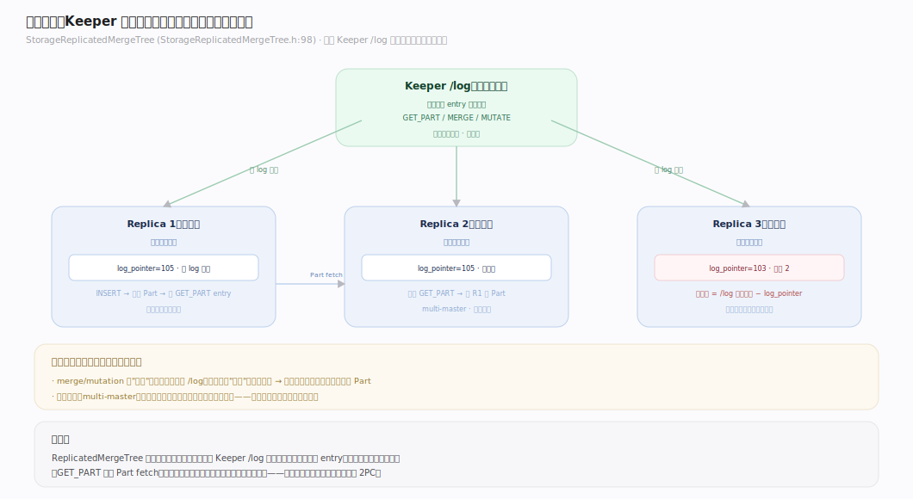
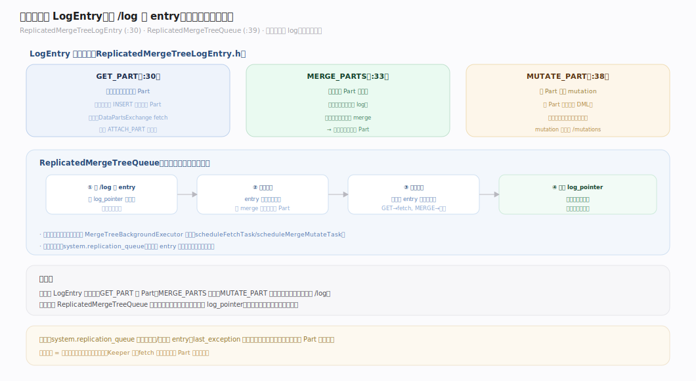
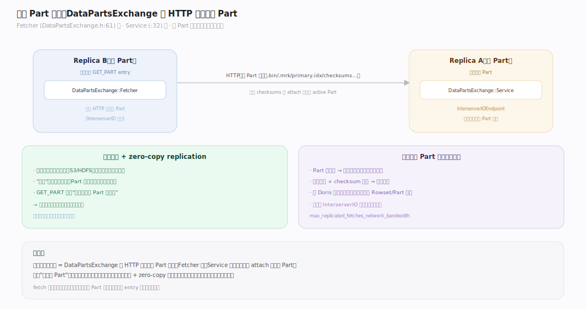
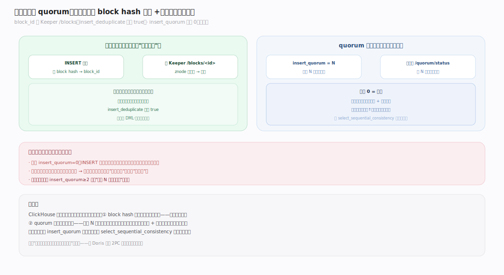
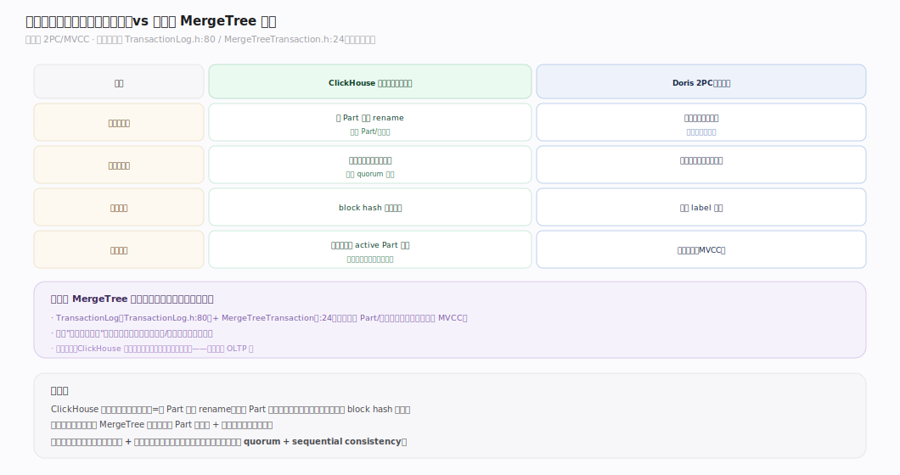
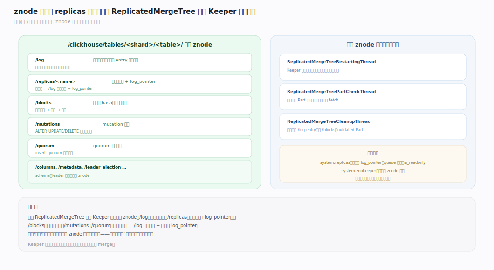

# ClickHouse 核心原理 · 支撑主线 · 复制与一致性

> **定位**：复制与一致性是保障能力域（对标 Doris"事务一致性"），但 ClickHouse **无经典 2PC/MVCC 事务**，靠 **ReplicatedMergeTree + Keeper** 实现最终一致 + 幂等去重。依赖 **元数据与协调**（Keeper 是复制日志的仲裁者）；副本恢复与 **集群与自愈** 交叠。核实基准：社区 v25.8。

## 一、复制模型总览：Keeper 作为复制日志仲裁

`StorageReplicatedMergeTree`（`StorageReplicatedMergeTree.h:98`）的复制不是"主从同步字节"，而是**基于 Keeper 的复制日志**：任何副本的变更（新 Part、merge、mutation）先写成一条 log entry 进 Keeper `/log`，各副本把它拉进自己的**复制队列**异步重放。所有副本地位对等（multi-master），没有唯一主节点。一致性模型是**最终一致**——不同副本在某一时刻可能进度不同，但最终收敛到相同状态。

---

## 二、复制队列与 LogEntry（GET_PART / MERGE / MUTATE）

`ReplicatedMergeTreeLogEntry`（`ReplicatedMergeTreeLogEntry.h:30`）是复制的基本单位，主要类型：
- **GET_PART**（`:30`）：从别的副本拉取一个 Part（如别处刚 INSERT 了新 Part）。
- **MERGE_PARTS**（`:33`）：合并若干 Part（merge 决策在一处做，各副本重放同样的 merge）。
- **MUTATE_PART**（`:38`）：对 Part 应用 mutation。

`ReplicatedMergeTreeQueue`（`ReplicatedMergeTreeQueue.h:39`）是每个副本的本地队列：从 Keeper `/log` 拉 entry、排序、判断依赖、逐条执行。**关键设计：merge/mutation 的"决策"只做一次（写进 log），各副本"重放"同样的操作**——保证所有副本最终得到字节一致的 Part。

---

## 三、副本 Part 拉取（DataPartsExchange）

当队列里有 GET_PART，副本通过 `DataPartsExchange`（`Fetcher`，`DataPartsExchange.h:61`）用 **HTTP** 从持有该 Part 的其他副本拉取整个 Part 目录（`Service` 端 `:32` 提供）。这是"数据怎么在副本间流动"的实现——不是逐行同步，而是**整 Part 传输**（与不可变 Part 模型一致）。存算分离 + zero-copy replication 时，副本共享远端存储、只复制元数据，无需真正传数据。

---

## 四、写入幂等与 quorum

- **幂等去重**：INSERT 的 block hash 写 Keeper `/blocks/<block_id>`；重发同批数据因 znode 已存在而跳过（`insert_deduplicate` 默认 true）。这替代了事务的"精确一次"保证。（详见「DML · 幂等去重」篇。）
- **quorum 写入**（可选）：`insert_quorum=N` 要求至少 N 个副本确认才算写成功，状态记 Keeper `/quorum/status`。默认 0（关闭）——默认只保证本副本落定 + 异步复制到其他副本。

---

## 五、一致性模型：最终一致 vs（实验）MergeTree 事务

| 维度 | ClickHouse 默认 | Doris 2PC |
|---|---|---|
| 写入原子性 | 单 Part 原子 rename（无跨 Part 事务） | 导入事务原子提交 |
| 多副本可见 | 最终一致（异步复制） | 事务提交即多副本可见 |
| 重试安全 | block hash 幂等去重 | 事务 label 幂等 |
| 隔离级别 | 无（读到的是当前 active Part 集） | 快照隔离 |

**实验性 MergeTree 事务**（`TransactionLog.h:80`、`MergeTreeTransaction.h:24`）提供跨 Part/表的原子性与快照隔离（类 MVCC），但默认关闭、非生产主流。ClickHouse 的定位是分析库，用最终一致 + 幂等换取写入路径的极简与高吞吐。

---

## 深化 · znode 结构与 replicas 拓扑

一张 ReplicatedMergeTree 表在 Keeper 下的关键 znode：
- `/log`：复制日志（所有变更 entry 的顺序流）。
- `/replicas/<name>`：每个副本的状态与其 `log_pointer`（读到 log 的位置）。
- `/blocks`：插入块 hash（幂等去重）。
- `/mutations`：mutation 队列。
- `/quorum`：quorum 写入状态。

副本落后多少 = `/log` 最大序号 − 该副本 `log_pointer`。恢复线程（`ReplicatedMergeTreeRestartingThread`）、Part 校验（`ReplicatedMergeTreePartCheckThread`）、清理（`ReplicatedMergeTreeCleanupThread`）都围绕这套 znode 工作（见「集群与自愈」）。

---

## 拓展 · 复制边界清单

| 类别 | 项 | 说明 |
|---|---|---|
| 冲突 | 同名 Part | block hash 去重 + Part 命名保证不冲突 |
| 落后监控 | `system.replicas` / `replication_queue` | 看队列长度、落后量 |
| 只读态 | Keeper 不可用 | 副本转只读，拒绝写入 |
| zero-copy | 共享存储多副本 | 只复制元数据，不传数据 |

---

## 调优要点（关键开关）

- `insert_quorum` / `insert_quorum_timeout`：写入需确认的副本数（默认 0）。
- `insert_deduplicate`：复制表插入去重（默认 true）。
- `select_sequential_consistency`：读时要求看到已 quorum 的最新数据（默认 0，最终一致）。
- `replicated_deduplication_window`：Keeper 去重窗口大小。
- `max_replicated_fetches_network_bandwidth`：限制 part fetch 带宽。

---

## 常见误区与工程要点

- **把最终一致当强一致**：INSERT 返回后，其他副本可能还没同步到；需强一致读用 `insert_quorum` + `select_sequential_consistency`。
- **Keeper 当可有可无**：ReplicatedMergeTree 完全依赖 Keeper——Keeper 挂了副本转只读、无法写入/merge。Keeper 是复制的命脉。
- **副本间手动 rsync 数据**：复制由 log + DataPartsExchange 自动完成；手动搬 Part 会破坏 Keeper 里的元数据一致性。
- **误用实验性事务**：MergeTree 事务非生产主流，别指望它提供 OLTP 级 ACID。

---

## 一句话总纲

**复制与一致性 = ReplicatedMergeTree + Keeper：变更先写 Keeper `/log`，各对等副本拉进本地队列重放（GET_PART/MERGE/MUTATE），Part 经 HTTP 整份 fetch；一致性是最终一致 + block hash 幂等去重（可选 quorum 加强），而非经典 2PC/MVCC 事务——这是分析库以极简写入路径换高吞吐的取舍。**
