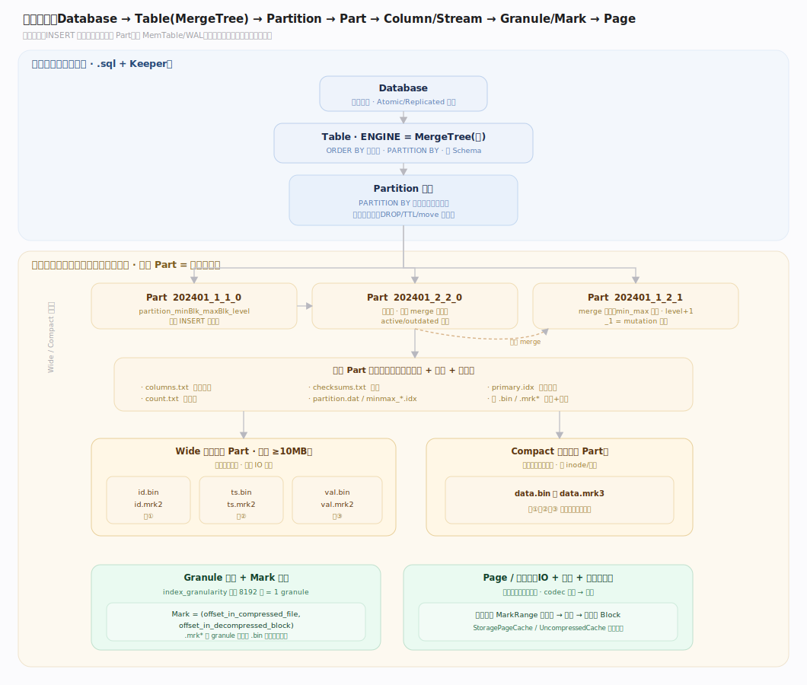
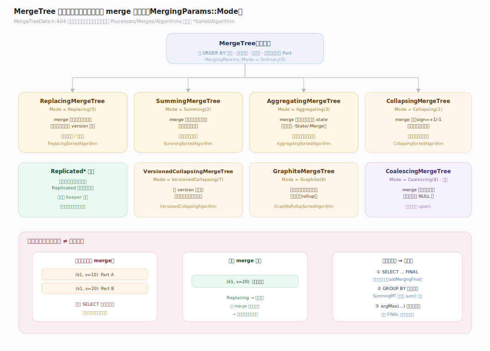
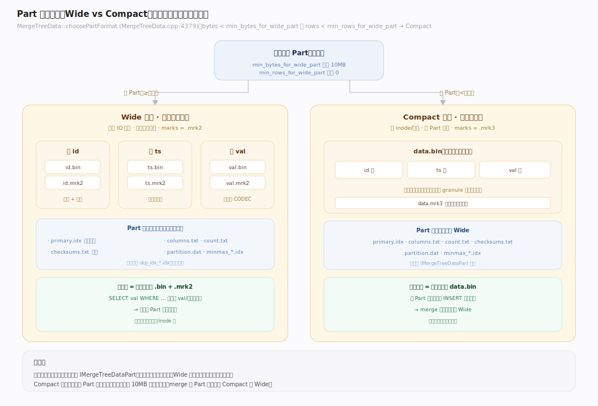
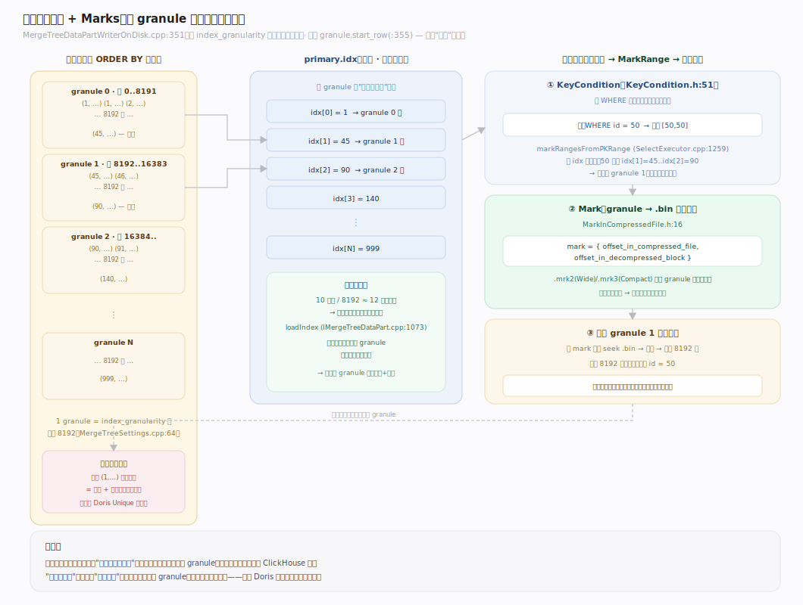
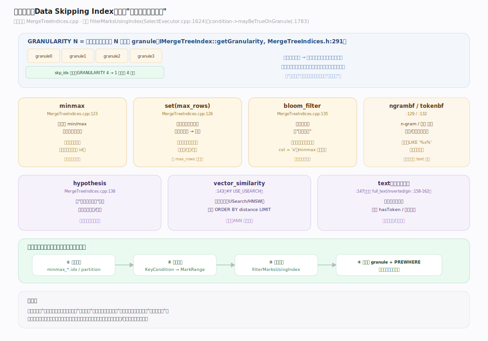
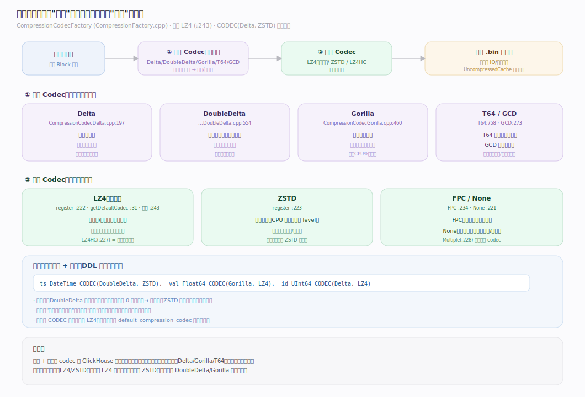
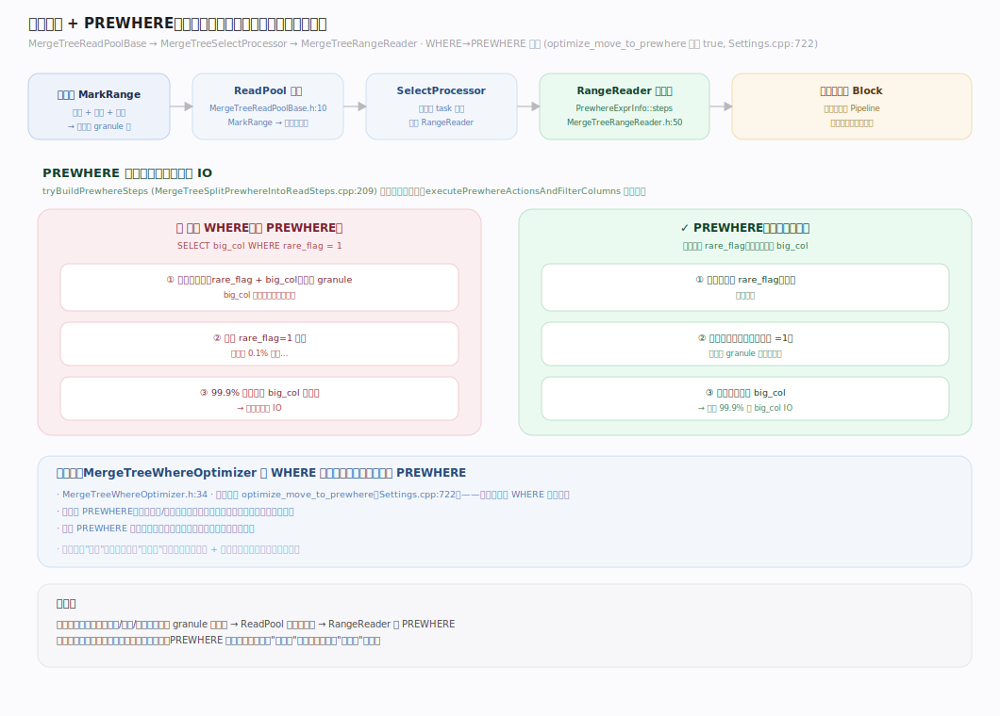
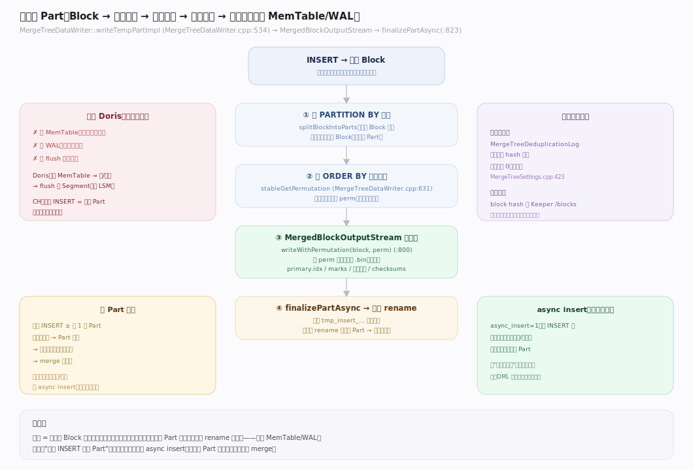
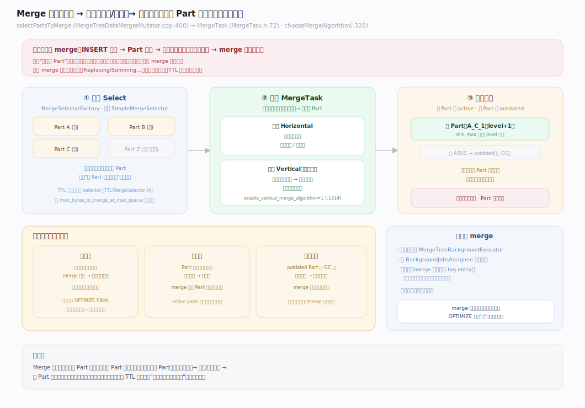
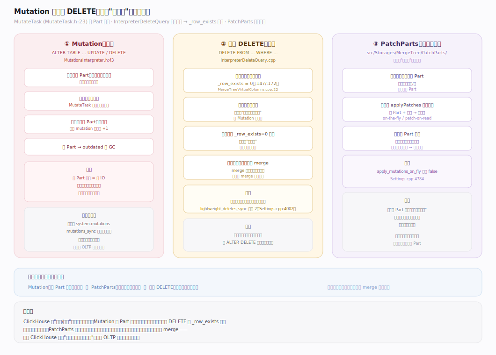

# ClickHouse 核心原理 · 支撑主线 · 存储引擎（MergeTree）

> **定位**：存储引擎是底座能力域，为 DQL/DML 提供数据组织与读写；核心信条 = **不可变 Part + 后台 merge + 稀疏主键**。异步部分（merge/mutation/TTL）由 **后台任务** 承接；多副本一致由 **复制与一致性** 承接。核实基准：社区 v25.8，源码 `src/Storages/MergeTree/`。

## 一、数据组织架构（Data Organization）

一条从逻辑到物理的层次链：`Database → Table(ENGINE=MergeTree) → Partition → Part → 列 Stream(.bin/.mrk) → Granule/Mark → 压缩块`。与 Doris 最大的不同是**没有 MemTable/WAL**：一次 `INSERT` 直接在磁盘上产出一个**不可变 Part 目录**（`MergeTreeDataWriter::writeTempPart`，`MergeTreeDataWriter.cpp:518`）。Part 目录名形如 `202401_1_1_0`，编码 `partitionID_minBlock_maxBlock_level[_mutation]`（`MergeTreePartInfo::getPartNameV1`，`MergeTreePartInfo.cpp:207`）——后台 merge 会把多个 Part 合成 `level+1` 的新 Part，mutation 则递增末段版本号。

Part 目录里除列数据外，还有一组元数据文件：`columns.txt`（列与类型）、`count.txt`（行数）、`checksums.txt`（校验）、`partition.dat` 与 `minmax_*.idx`（分区裁剪）、`primary.idx`（稀疏主键）。**Partition 只是逻辑边界**（`DROP PARTITION`/TTL/move 的单位），真正被调度、merge、复制的最小物理单位是 **Part**。

---

## 二、MergeTree 表引擎族（合并语义仅在 merge 时生效）

全族由**一个枚举** `MergingParams::Mode` 区分（`MergeTreeData.h:404`），而非类继承。每种模式对应 `src/Processors/Merges/Algorithms/` 里一个 `*SortedAlgorithm`，**只在后台 merge 时被调用**。这带来 ClickHouse 最反直觉的一点：**变体语义不是实时的**——写入直后普通 `SELECT` 会看到未合并的重复/待聚合行，要即时正确须付 `FINAL`（读时现场归并，`ReadFromMergeTree.cpp:1356 addMergingFinal`）或 `GROUP BY`/`argMax` 的代价。

| 引擎（Mode 值） | merge 时行为 | 即时正确手段 | 适用 |
|---|---|---|---|
| MergeTree（Ordinary 0） | 只排序、不去重 | — | 明细/日志 |
| ReplacingMergeTree（5） | 同键留最新（可按 version 列） | `FINAL` / `argMax` | 去重、最新态 |
| SummingMergeTree（2） | 同键数值列求和 | `sum GROUP BY` | 预聚合累加 |
| AggregatingMergeTree（3） | 按聚合 state 合并 | `-Merge` 函数 + `GROUP BY` | 物化视图预聚合 |
| CollapsingMergeTree（1） | sign ±1 成对抵消 | `sum(sign)` 过滤 | 可撤销累计 |
| VersionedCollapsing（7） | 带 version 的折叠，容乱序 | 同上 | 乱序写入的抵消 |
| GraphiteMergeTree（6） | 历史数据按粒度降采样 | — | 监控时序 rollup |
| CoalescingMergeTree（8，新增） | 同键取每列最后非 NULL | `FINAL` | 列级 upsert |

任一变体加 `Replicated` 前缀即成多副本引擎（正交叠加，见「复制与一致性」主线）。

---

## 三、Part 物理格式：Wide vs Compact

同一引擎的 Part 有两种物理布局，由**写入时体积/行数**自动选择（`MergeTreeData::choosePartFormat`，`MergeTreeData.cpp:4379`）：

| 格式 | 布局 | 标记文件 | 触发条件 | 适用 |
|---|---|---|---|---|
| **Wide** | 每列一个 `<col>.bin` + `<col>.mrk2` | `.mrk2`（或 `.mrk4` 带子流） | `bytes ≥ min_bytes_for_wide_part` **且** `rows ≥ min_rows_for_wide_part` | 大 Part、列级 IO |
| **Compact** | 所有列拼进单 `data.bin` + `data.mrk3` | `.mrk3` | 低于上述阈值 | 小 Part、省 inode/寻道 |

阈值默认：`min_bytes_for_wide_part = 10485760`（10MB，`MergeTreeSettings.cpp:73`）、`min_rows_for_wide_part = 0`（`:77`）。小批量 INSERT 产生的小 Part 走 Compact，避免海量小文件；merge 变大后自然转 Wide。二者读写接口统一在 `IMergeTreeDataPart`（`.bin` 扩展名常量 `IMergeTreeDataPart.h:75`）。

---

## 四、稀疏主键索引 + Marks

ClickHouse 主键是 **稀疏的**：`primary.idx` **每 granule（默认 8192 行）才存一条**主键值，不是每行（`MergeTreeDataPartWriterOnDisk.cpp:351`，仅写 `granule.start_row`）。因此索引极小、可常驻内存（`IMergeTreeDataPart::loadIndex`，`IMergeTreeDataPart.cpp:1073`）。

**这是与 Doris/OLTP 最大的认知鸿沟：主键 = 排序 + 粗粒度跳数，不去重、不是唯一约束。** 查询裁剪分两步：
1. `KeyCondition`（`KeyCondition.h:51`）把 WHERE 谓词编译成对主键区间的判定；
2. `MergeTreeDataSelectExecutor::markRangesFromPKRange`（`MergeTreeDataSelectExecutor.cpp:1259`）用它在稀疏索引上二分/排除，得到需要读的 **MarkRange** 集合。

**Mark** 是 granule 到物理位置的映射：`{offset_in_compressed_file, offset_in_decompressed_block}`（`MarkInCompressedFile.h:16`）——先定位压缩块在 `.bin` 中的偏移，再定位解压后块内的行偏移。granule 大小可自适应（`MergeTreeIndexGranularityAdaptive`），大行表按字节封顶而非固定 8192 行。

---

## 五、跳数索引（Data Skipping Index）

主键只对**排序前缀**有效；对非排序列的过滤，靠可选的**跳数索引**（`INDEX ... TYPE ... GRANULARITY N`）。它以"每 N 个 data granule"为单位存一份摘要，读时先判"这段能否整体跳过"（`MergeTreeDataSelectExecutor::filterMarksUsingIndex`，`:1624`；`condition->mayBeTrueOnGranule`，`:1783`）。工厂注册在 `MergeTreeIndices.cpp`：

| 类型（注册行） | 判定 | 适用 |
|---|---|---|
| `minmax`（:123） | 段内 min/max 区间 | 范围过滤、准有序列 |
| `set`（:126） | 段内去重值集合（≤ max_rows） | 低基数枚举列 |
| `bloom_filter`（:135） | 布隆过滤"一定不在" | 高基数等值点查 |
| `ngrambf_v1`（:129） | n-gram 布隆 | `LIKE '%x%'` 子串 |
| `tokenbf_v1`（:132） | 分词布隆 | 分词等值/搜索 |
| `hypothesis`（:138） | 表达式恒真假设 | 谓词化简 |
| `vector_similarity`（:143） | 向量近邻（USearch） | ANN 检索 |
| `text`（:147，旧名 full_text/inverted/gin） | 全文倒排 | 文本检索 |

**GRANULARITY N** 指该索引一个条目覆盖 N 个数据 granule（`IMergeTreeIndex::getGranularity`，`MergeTreeIndices.h:291`）——越大越省空间但越粗。跳数索引是"可跳过"提示，判"可能命中"仍要读原始数据，不像主键那样定位精确区间。

---

## 六、压缩与编码（Codec）

列数据落盘前经 **编码 → 压缩** 两段处理，注册在 `CompressionCodecFactory`（`CompressionFactory.cpp`）。默认通用压缩器是 **LZ4**（`CompressionFactory.cpp:243`，`getDefaultCodec`），可 `CODEC(...)` 按列指定：

| Codec（注册行） | 类别 | 适用 |
|---|---|---|
| `LZ4`（:222，默认） | 通用压缩 | 均衡快压 |
| `LZ4HC`（:227） | 高压缩比 LZ4 | 冷数据 |
| `ZSTD`（:223） | 通用高压缩 | 存储敏感 |
| `Delta`（:229） | 差分编码 | 缓变序列 |
| `DoubleDelta`（:231） | 二阶差分 | 单调时间戳 |
| `Gorilla`（:232） | 浮点异或 | 监控浮点指标 |
| `T64`（:230） | 位打包裁剪 | 小范围整型 |
| `GCD`（:238） | 公约数缩放 | 等步长整型 |
| `FPC`（:234） | 浮点预测 | 科学浮点 |

编码类（Delta/DoubleDelta/Gorilla/T64/GCD）通常与压缩类（LZ4/ZSTD）用 `CODEC(Delta, ZSTD)` **链式组合**：先编码把数据变得更规律，再压缩。压缩块也是 IO/缓存的单位（`UncompressedCache`）。

---

## 七、读取路径（Read Path + PREWHERE）

一次 MergeTree 读取的链路：**主键裁剪 → MarkRange → ReadPool 分派 → 逐 granule 解压 → PREWHERE 分步过滤 → 输出 Block**。

- **裁剪**：主键裁剪（§四）+ 跳数索引（§五）先把要读的 MarkRange 缩到最小。
- **分派**：`MergeTreeReadPoolBase`（`MergeTreeReadPoolBase.h:10`）及其子类（普通 / InOrder / parallel-replicas）把 MarkRange 分给多个执行线程；驱动是 `MergeTreeSelectProcessor`。
- **PREWHERE**：ClickHouse 特有的"先读过滤列、再读投影列"优化。`MergeTreeWhereOptimizer`（`MergeTreeWhereOptimizer.h:34`）在 `optimize_move_to_prewhere` 默认开启下（`Settings.cpp:722`）自动把选择性高的 WHERE 条件下移为 PREWHERE；`tryBuildPrewhereSteps`（`MergeTreeSplitPrewhereIntoReadSteps.cpp:209`）把它拆成多步，`MergeTreeRangeReader` 逐步应用——先只读判断列、过滤掉不匹配行，**再按存活行读其余列**，省下大量列 IO。

---

## 深化 · 写入建 Part（Write Path）

`MergeTreeDataWriter::writeTempPartImpl`（`MergeTreeDataWriter.cpp:534`）把一个内存 `Block` 变成磁盘 Part：**① 按 `PARTITION BY` 切块**（`splitBlockIntoParts`）→ **② 按主键 `ORDER BY` 稳定排序**（`stableGetPermutation`，`:631`）→ **③ 经 `MergedBlockOutputStream` 流式写列 + 建索引/marks**（`:786`，`writeWithPermutation`）→ **④ `finalizePartAsync` 落定为临时 Part 再原子 rename 可见**（`:823`）。整条路径**无 memtable、无 WAL**——这正是"直落不可变 Part"的实现。

**插入去重**：非复制表用 `MergeTreeDeduplicationLog`（`MergeTreeDeduplicationLog.h:134`），按插入块 hash 去重，窗口 `non_replicated_deduplication_window` 默认 **0**（关闭，`MergeTreeSettings.cpp:423`）；复制表的块级幂等去重放在 Keeper（见「复制与一致性」）。

---

## 深化 · Merge 合并（选取 → 执行 → 版本替换）

后台 merge 是"不可变 Part"模型的代价与解药：INSERT 越碎，Part 越多，查询要归并的路数越多越慢——merge 把它降下来。

- **选取**：`MergeSelectorFactory`（`Compaction/MergeSelectors/`）注册 Simple/Stochastic/Trivial/All 策略；默认 `SimpleMergeSelector`（`SimpleMergeSelector.h:85`）在"Part 大小相近、总量适中"时择优合并。`MergeTreeDataMergerMutator::selectPartsToMerge`（`MergeTreeDataMergerMutator.cpp:400`）落地选取。
- **执行**：`MergeTask`（`MergeTask.h:72`）合并多个 Part 为一个。`chooseMergeAlgorithm`（`:320`）在**水平**（整行）与**垂直**（按列分组，大宽表内存友好）间选择；`enable_vertical_merge_algorithm` 默认 **1**（`MergeTreeSettings.cpp:1314`）。变体引擎的 `*SortedAlgorithm` 在此被调用兑现合并语义。
- **替换**：merge 产出的新 Part 变 active，旧 Part 转 outdated 待 GC。**全程无原地修改**——Part 始终不可变，"变更"永远是"产新替旧"。

---

## 深化 · Mutation 与轻量 DELETE

`ALTER TABLE ... UPDATE/DELETE` 是 **Mutation**：`MutateTask`（`MutateTask.h:23`）**异步整 Part 重写**——读旧 Part、应用变更、写全新 Part，绝非原地行级更新。`MutationsInterpreter`（`MutationsInterpreter.h:43`）把变更编译成读取管线。因为要重写整个 Part，Mutation 是**重操作**，不适合高频。

**轻量 DELETE**（`DELETE FROM`）更快：`InterpreterDeleteQuery`（`InterpreterDeleteQuery.cpp`）把它改写成给隐藏掩码列 `_row_exists` 置 0（`:147` / `:172`；掩码列名 `MergeTreeVirtualColumns.cpp:22`），读时跳过 `_row_exists=0` 的行，物理清除延后到后续 merge。`lightweight_deletes_sync` 默认 **2**（`Settings.cpp:4002`，等所有副本）。

**PatchParts**（`src/Storages/MergeTree/PatchParts/`）是更新的"读期叠加补丁"机制：把变更写成轻量补丁 Part，查询时 `applyPatches` 现场叠加，避免整 Part 重写——由 `apply_mutations_on_fly`（默认 false，`Settings.cpp:4784`）等开关控制。

---

## 拓展 · 存储边界清单

| 类别 | 项 | 说明 |
|---|---|---|
| 特殊列 | `_row_exists` / `_part` / `_partition_id` | 虚拟列：删除掩码、来源定位 |
| 索引附件 | `minmax_<col>.idx` | 分区级 min/max，分区裁剪用 |
| 投影 | `PROJECTION` | Part 内嵌的预聚合/重排序副本 |
| TTL | move / delete / recompress | 见「后台任务」与「集群与自愈」 |
| 存储介质 | `Disks/` 抽象 | 本地盘 / S3 / HDFS，支持存算分离 |

---

## 调优要点（关键开关）

- `index_granularity`：granule 行数（默认 **8192**，`MergeTreeSettings.cpp:64`）。越小索引越精、内存越大。
- `min_bytes_for_wide_part`：Wide/Compact 分界（默认 **10MB**，`:73`）。
- `enable_vertical_merge_algorithm`：大宽表垂直 merge（默认 **1**，`:1314`）。
- `optimize_move_to_prewhere`：自动 WHERE→PREWHERE（默认 **true**，`Settings.cpp:722`）。
- `non_replicated_deduplication_window`：非复制表插入去重窗口（默认 **0**，`MergeTreeSettings.cpp:423`）。
- `lightweight_deletes_sync`：轻量删除同步级别（默认 **2**，`Settings.cpp:4002`）。

---

## 常见误区与工程要点

- **把稀疏主键当唯一键**：主键不去重、不唯一，同键多行默认共存；要"最新态"须 ReplacingMergeTree + `FINAL`/`argMax`，不能指望主键自动去重。
- **依赖变体引擎"实时聚合/去重"**：Summing/Replacing 只在 merge 时生效，merge 时机不确定；查询正确性必须自己用 `FINAL` 或 `GROUP BY` 兜底。
- **小批量高频 INSERT**：每次 INSERT 至少产一个 Part，碎 Part 拖垮查询并加重 merge；应攒批（几千~几万行/批）或用 async insert。
- **用 Mutation 做频繁更新**：`ALTER UPDATE` 是整 Part 重写的重操作，高频更新场景应改用 ReplacingMergeTree/CoalescingMergeTree + merge，或 PatchParts。

---

## 一句话总纲

**ClickHouse 存储引擎以"不可变 Part + 后台 merge + 稀疏主键"为信条：INSERT 直落一个按主键排序的不可变 Part（Wide/Compact 二选一），主键只做粗粒度跳数裁剪而不去重，一切"更新/去重/聚合"都推迟到后台 merge 时由 `*SortedAlgorithm` 兑现——所以要即时正确就得付 `FINAL` 的代价。**
