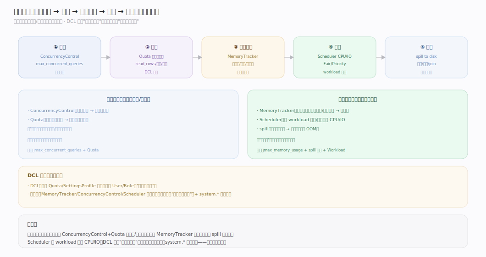
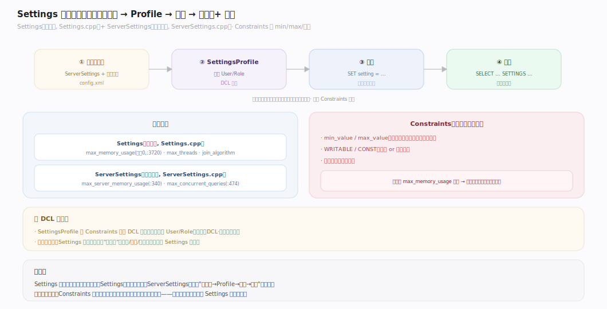
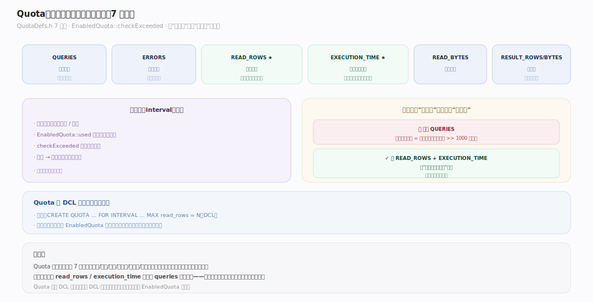
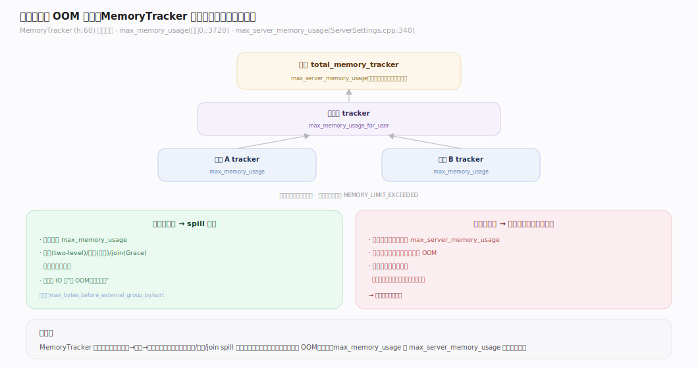
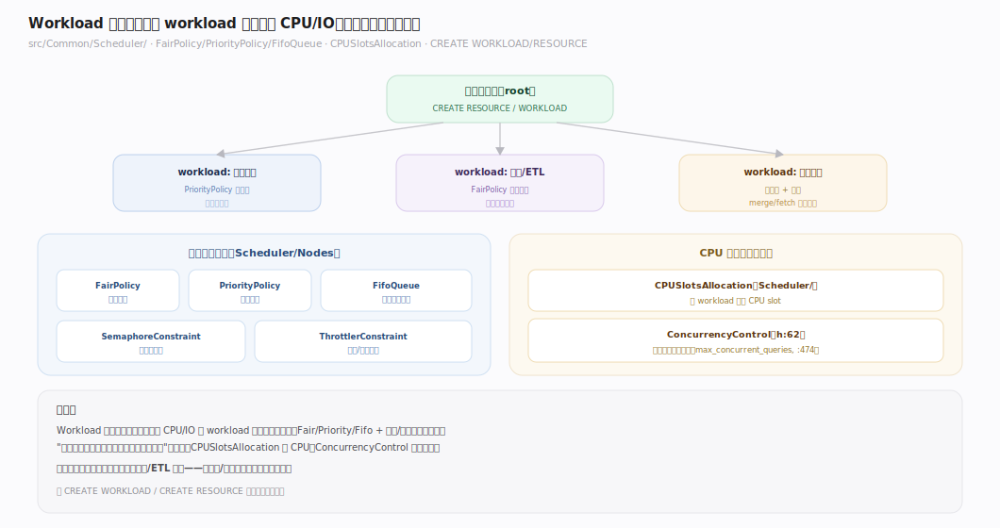
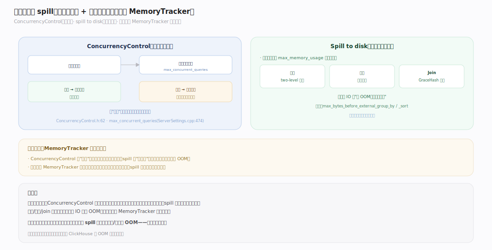

# ClickHouse 核心原理 · 支撑主线 · 资源与负载管理

> **定位**：资源与负载管理是保障能力域，目标"多租户隔离、稳定不被拖垮"；四支柱 = **Settings 体系** + **Quota/SettingsProfile** + **内存追踪（MemoryTracker）** + **Workload 资源调度（CPU/IO）**。与 **DCL** 共用配额/约束实体，事后审计归 `system.*`。核实基准：社区 v25.8。

## 一、资源管理全景

ClickHouse 的资源管控在多个层次同时生效：**准入**（并发查询数上限）→ **配额**（按周期限流）→ **内存追踪**（单查询/服务器上限）→ **调度**（CPU/IO 公平分配）→ **溢写**（超内存落盘）。这些机制共同保证"一个大查询/一个租户不会拖垮整个集群"。DCL 定义"谁受什么限"，本主线执行"运行时怎么限"。

---

## 二、Settings 体系：层级覆盖与约束

Settings 是 ClickHouse 的"行为总开关"，分两类：
- **Settings**（`src/Core/Settings.cpp`）：查询级，如 `max_memory_usage`（默认 0=不限，`:3720`）、`max_threads`。
- **ServerSettings**（`src/Core/ServerSettings.cpp`）：服务器级，如 `max_server_memory_usage`（`:340`）、`max_concurrent_queries`（`:474`）。

层级覆盖：服务器默认 → SettingsProfile（赋给 User/Role）→ 会话 → 查询。约束（SettingsConstraints）可限定 min/max 或锁只读，防止用户改坏关键设置（见「DCL · 配额约束」篇）。

---

## 三、Quota：按周期限流

Quota（`src/Access/Quota`）按时间窗口限制资源消费，维度 = `QUERIES/ERRORS/RESULT_ROWS/RESULT_BYTES/READ_ROWS/READ_BYTES/EXECUTION_TIME`。

| 维度 | 计量 | 挡什么 |
|---|---|---|
| QUERIES | 查询次数 | 高频轰炸 |
| READ_ROWS/BYTES | 读取量 | 重扫描查询 |
| EXECUTION_TIME | 累计执行时长 | 慢查询占用 |
| RESULT_ROWS/BYTES | 结果量 | 大结果集 |

**关键：限 `read_rows`/`execution_time` 比只限 `queries` 更能挡"重查询"**——一个全表扫描的杀伤力远超一千个点查。（Quota 作为 DCL 实体定义，运行时由本主线执行。）

---

## 四、内存追踪与 OOM 保护（MemoryTracker）

`MemoryTracker`（`MemoryTracker.h:60`）是层级化的内存计量器：查询级 tracker → 用户级 → 全局 tracker，每次分配都向上累加。超限即抛 `MEMORY_LIMIT_EXCEEDED`：
- `max_memory_usage`（默认 0=不限，`Settings.cpp:3720`）：单查询上限。
- `max_server_memory_usage`（`ServerSettings.cpp:340`）：整个服务器上限——最后防线，防止所有查询加起来打爆机器。

超单查询限时，聚合/排序/join 可 **spill 到磁盘** 续命；超服务器限则拒绝新分配。**两级都要设**：只设单查询限，多个大查询并发仍能打爆服务器。

---

## 五、Workload 资源调度（CPU/IO scheduler）

`src/Common/Scheduler/` 提供**层级化资源调度器**，把 CPU/IO 按 workload 分配：
- **调度策略节点**：`FairPolicy`（公平分享）、`PriorityPolicy`（优先级）、`FifoQueue`（排队）、`SemaphoreConstraint`/`ThrottlerConstraint`（并发/带宽约束）。
- **CPU 调度**：`CPUSlotsAllocation`（`Scheduler/CPUSlotsAllocation`）按 workload 分配 CPU slot。
- **准入控制**：`ConcurrencyControl`（`ConcurrencyControl.h:62`）限制同时活跃的查询数（`max_concurrent_queries`，`ServerSettings.cpp:474`）。

`CREATE WORKLOAD` / `CREATE RESOURCE` 定义资源层级树，把不同租户/查询类型隔离——保证在线查询不被后台大查询饿死。

---

## 深化 · 并发控制与 spill（溢写磁盘）

两道保命机制：
- **ConcurrencyControl**：限并发查询数，超限的排队——防"惊群"同时打爆内存/CPU。
- **Spill to disk**：单查询内存超 `max_memory_usage` 时，聚合（two-level）、排序（外部排序）、join（GraceHash）把中间状态落盘续命，用磁盘 IO 换"不 OOM"。

二者配合：ConcurrencyControl 从"入口"限并发，spill 从"执行中"救内存，MemoryTracker 是二者共用的计量基准。

---

## 拓展 · 资源边界清单

| 类别 | 项 | 说明 |
|---|---|---|
| 内存 | max_memory_usage / _for_user / server | 三级内存上限 |
| 并发 | max_concurrent_queries / _for_user | 准入控制 |
| 带宽 | max_*_network_bandwidth | 复制/传输限速 |
| 溢写 | max_bytes_before_external_* | 聚合/排序 spill 阈值 |
| 页缓存 | page_cache_max_size | 用户态页缓存 |

---

## 调优要点（关键开关）

- `max_memory_usage`：单查询内存上限（默认 0 不限，`Settings.cpp:3720`）——生产必设。
- `max_server_memory_usage`：服务器内存上限（`ServerSettings.cpp:340`）——最后防线，必设。
- `max_concurrent_queries`：并发查询上限（`ServerSettings.cpp:474`）——防惊群。
- `max_bytes_before_external_group_by` / `_sort`：聚合/排序 spill 阈值。
- `max_execution_time`：单查询超时。
- Workload/Quota：多租户隔离用 `CREATE WORKLOAD` + Quota。

---

## 常见误区与工程要点

- **只设单查询内存不设服务器上限**：多个大查询并发仍能打爆机器；`max_memory_usage` 与 `max_server_memory_usage` 都要设。
- **不限并发**：`max_concurrent_queries=0`（不限）下，突发流量会同时挤爆内存/CPU；生产应设合理上限 + 排队。
- **Quota 只限 queries**：一个重查询杀伤力巨大，应同时限 `read_rows`/`execution_time`。
- **忽视 spill 阈值**：默认不 spill 的大聚合/排序会 OOM；给 `max_bytes_before_external_*` 设值让它落盘续命。
- **workload 隔离缺失**：在线查询与后台 ETL 混跑会相互饿死，用 Workload 调度隔离。

---

## 一句话总纲

**资源与负载管理多层设防："准入（ConcurrencyControl 限并发）→ 配额（Quota 按周期限 read_rows/时长）→ 内存追踪（MemoryTracker 三级上限 + 超限 spill）→ 调度（Scheduler 按 workload 公平/优先分配 CPU/IO）"，共同保证一个大查询/一个租户拖不垮集群；DCL 定义"谁受什么限"，本主线在运行时执行，system.* 做事后审计。**
