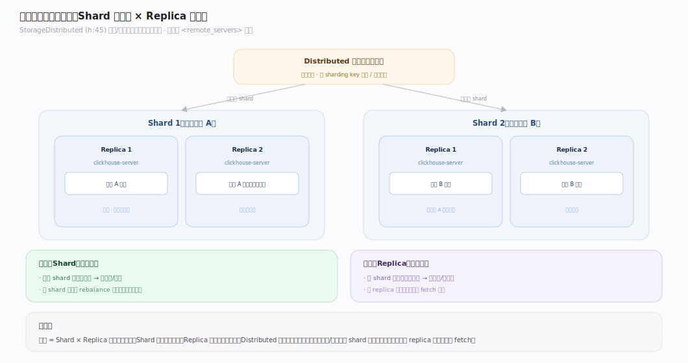
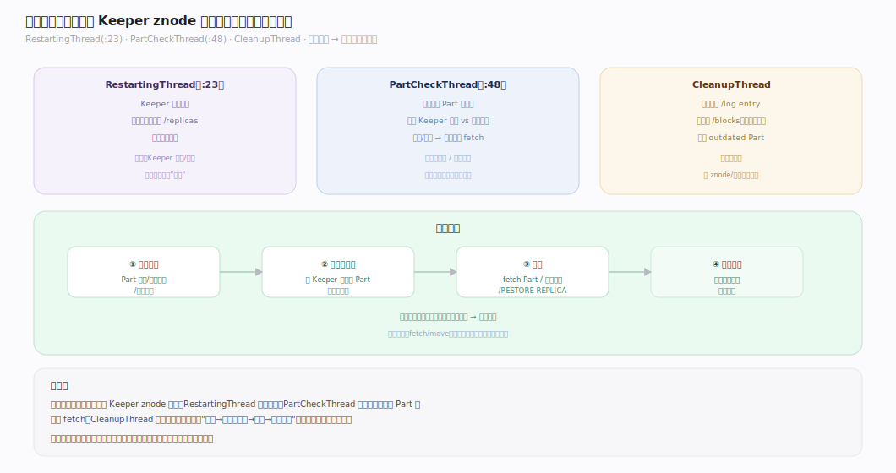
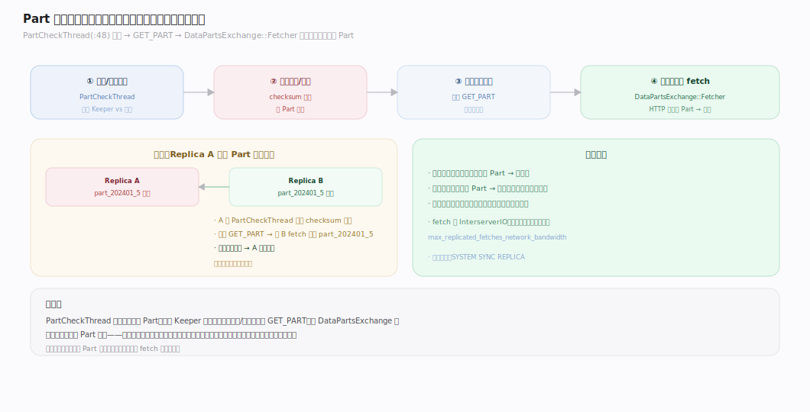
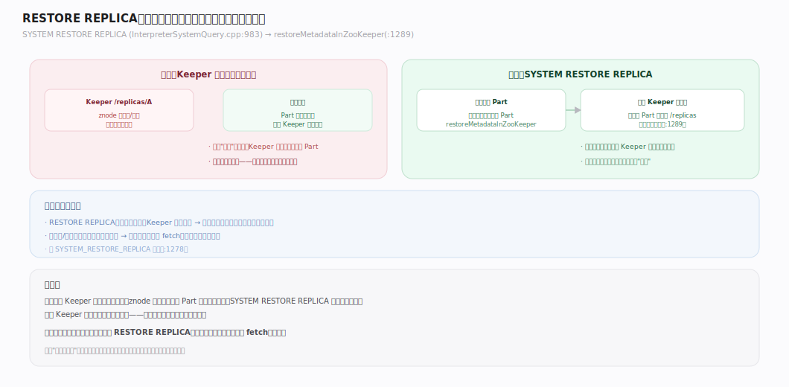
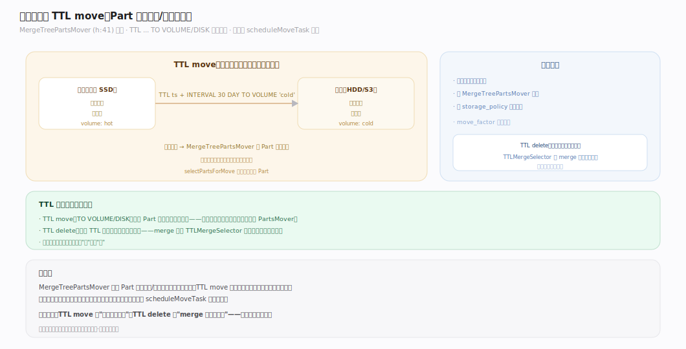
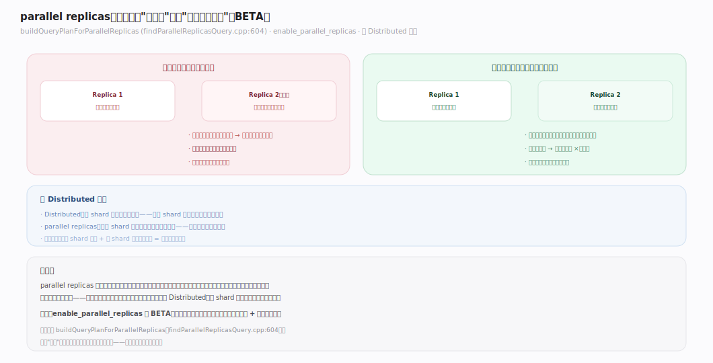

# ClickHouse 核心原理 · 支撑主线 · 集群与自愈

> **定位**：集群与自愈是保障能力域，负责"分片路由、副本恢复、数据均衡、高可用"；骨架 = **Distributed 分片路由** + **ReplicatedMergeTree 恢复线程** + **part fetch / RESTORE REPLICA** + **TTL move**。深依 **复制与一致性**（副本状态源）与 **后台任务**（恢复动作的执行载体）。核实基准：社区 v25.8。

## 一、集群拓扑与分片路由（Distributed）

`StorageDistributed`（`StorageDistributed.h:45`）是跨 shard 的**路由/汇聚视图**，本身不存数据。集群拓扑在配置里定义（`<remote_servers>`：哪些 shard、每 shard 哪些 replica）。查询命中 Distributed 表 → 散射到各 shard 的一个健康副本执行 → 汇聚（scatter/gather，见「DQL · 分布式」篇）。写入 Distributed 表 → 按 sharding key 路由到目标 shard。**两个正交维度：Shard 拆数据（扩容量），Replica 存冗余（高可用）。**

---

## 二、副本健康与自愈线程

每个 ReplicatedMergeTree 副本跑几个守护线程围绕 Keeper znode 自愈：

| 线程 | 职责 | 触发 |
|---|---|---|
| `ReplicatedMergeTreeRestartingThread`（`:23`） | Keeper 会话恢复、重新注册副本、拉起队列 | Keeper 断连/重连 |
| `ReplicatedMergeTreePartCheckThread`（`:48`） | 校验本地 Part 完整性，损坏则重新 fetch | 周期/发现异常 |
| `ReplicatedMergeTreeCleanupThread` | 清理过期 /log、旧 /blocks、outdated Part | 周期 |

**自愈闭环**：发现问题（Part 损坏/副本落后/会话丢失）→ 从其他副本 fetch 或重新注册 → 恢复到一致状态。无需人工干预。

---

## 三、Part 校验与拉取恢复

`ReplicatedMergeTreePartCheckThread`（`:48`）定期或按需校验本地 Part：对比 Keeper 里记录的 Part 应有状态与本地实际。若本地 Part 缺失/损坏（checksum 不符），把它标记为需要重新获取，走 GET_PART → `DataPartsExchange::Fetcher` 从健康副本拉取完整 Part（见「复制 · 副本拉取」篇）。这是"单副本数据损坏"的自动修复路径——只要还有一个健康副本，数据就能恢复。

---

## 四、RESTORE REPLICA 与元数据重建

极端情况下 Keeper 里某副本的元数据丢失（如 znode 被误删），用 `SYSTEM RESTORE REPLICA`（`InterpreterSystemQuery.cpp:983`）恢复：`restoreMetadataInZooKeeper`（`:1289`）用本地实际的 Part 重建该副本在 Keeper 里的元数据条目，重新加入复制。这是"副本元数据损坏但本地数据还在"的恢复手段——把本地数据重新登记到集群。

---

## 五、数据均衡与 TTL move（层间移动）

`MergeTreePartsMover`（`MergeTreePartsMover.h:41`）负责 Part 在存储卷/磁盘间移动，两个用途：
- **TTL move**：`TTL ... TO VOLUME/DISK`，按数据年龄把冷数据下沉到廉价介质（冷热分层）。
- **卷间均衡**：多磁盘卷时平衡负载。

这是"数据生命周期管理"的执行者，由后台任务调度（`scheduleMoveTask`）。（TTL delete 由 TTLMergeSelector 在 merge 时执行，见后台任务篇。）

---

## 深化 · parallel replicas：读侧的动态负载分担

`buildQueryPlanForParallelReplicas`（`findParallelReplicasQuery.cpp:604`）实现**同一 shard 内多副本并行读**：把单分片的大扫描动态切成多段，分给该分片的多个副本同时读，再汇聚。这让"副本"从纯冗余备份变成也能分担查询负载——单分片数据大、副本多时显著提升吞吐。`enable_parallel_replicas`（BETA）控制。与 Distributed（跨 shard 分数据）正交。

---

## 拓展 · 集群边界清单

| 类别 | 项 | 说明 |
|---|---|---|
| 扩容 | 加 shard + 重分布 | 数据不自动 rebalance，需手动/工具 |
| 副本增减 | 加 replica → 自动 fetch 全量 | 新副本从 Keeper+其他副本恢复 |
| 故障转移 | Distributed 跳过不健康副本 | 查询自动选健康副本 |
| 只读保护 | Keeper 不可用 → 副本只读 | 拒绝写入直到恢复 |

---

## 调优要点（关键开关）

- `<remote_servers>`：集群拓扑定义（shard/replica）。
- `enable_parallel_replicas`：单分片多副本并行读（BETA）。
- `max_replicated_fetches_network_bandwidth`：限 part fetch 带宽，避免恢复挤占业务。
- TTL `TO VOLUME/DISK`：冷热分层策略。
- `SYSTEM RESTORE REPLICA` / `SYSTEM SYNC REPLICA`：手动恢复/同步命令。

---

## 常见误区与工程要点

- **加 shard 期待自动 rebalance**：ClickHouse 不自动迁移已有数据到新 shard；需手动重分布或用工具，新数据才按新拓扑写。
- **副本损坏就慌**：只要有一个健康副本，PartCheckThread + fetch 会自动修复；元数据丢了用 RESTORE REPLICA。
- **parallel replicas 当默认开**：它是 BETA，对小查询反而增开销；只在单分片大扫描、副本多时开。
- **忽视 fetch 带宽限制**：副本恢复/新副本全量 fetch 会挤占网络，用 `max_replicated_fetches_network_bandwidth` 限速。

---

## 一句话总纲

**集群与自愈两条线：横向 Distributed 做 shard 路由（数据怎么拆）+ Replica 做冗余（存几份）；纵向自愈由守护线程围绕 Keeper znode 闭环——PartCheck 校验损坏→fetch 修复，Restarting 恢复会话，RESTORE REPLICA 重建元数据，PartsMover 做 TTL 冷热下沉。parallel replicas 让副本额外分担读负载。恢复动作都由后台任务承接，只要有一个健康副本数据就能恢复。**
