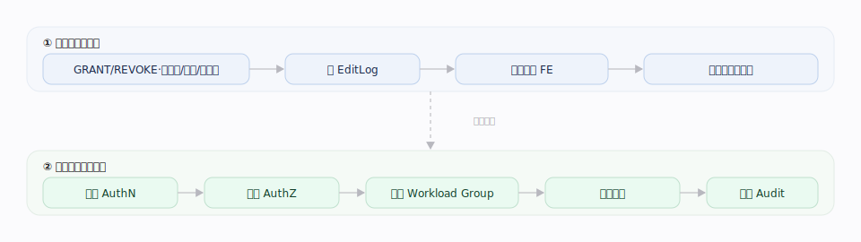
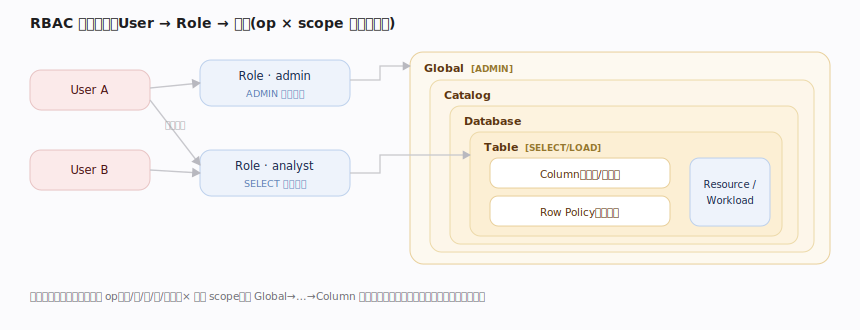
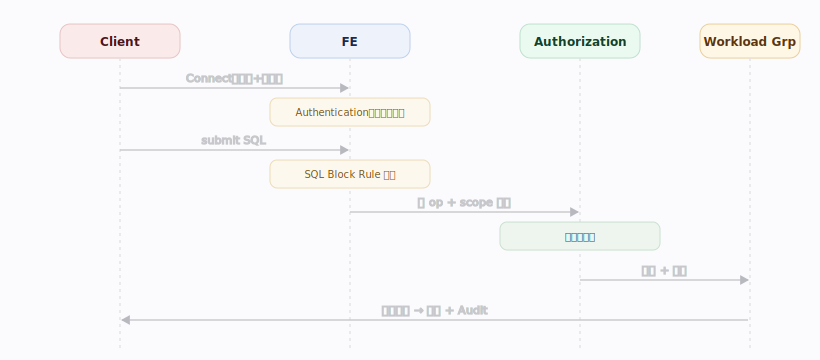
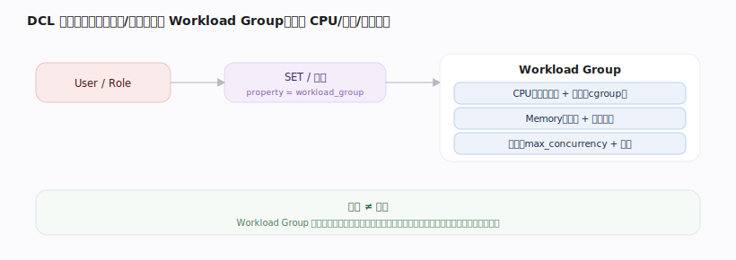
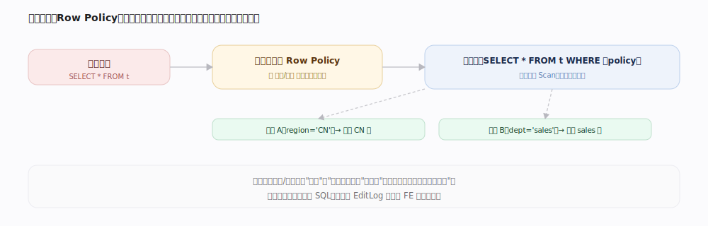
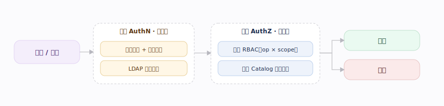

# Doris 核心原理 · DCL 数据控制（权限与资源管控）

> **定位**：DCL 是接口主线之一，其策略变更走 **元数据** 能力域持久化复制；执行期的 **认证 / 鉴权（Authentication / Authorization）是本线自身的访问控制**（FE 接入侧鉴权），仅 **并发 / 资源限流**（Workload Group）由 **资源与负载管理** 落地。

## 生命周期总览：定义线 × 执行线

---

## 阶段一 · 权限模型：RBAC

---

## 阶段二 · 策略的定义与生效

`GRANT/REVOKE/CREATE USER/ROLE/Workload Group` 由 Master 执行：改内存权限元数据、写 **EditLog** 复制多数派、其余 FE **Replay** 一致（与 DDL 共享复制/恢复机制）。

---

## 阶段三 · 请求管控时序

---

## 阶段四 · 资源隔离与限流

---

## 深化 · 行列级权限 与 数据治理

| 粒度 | 机制 | 效果 |
|---|---|---|
| 行级安全 Row Policy | 为用户/角色定义行过滤谓词，查询自动附加 | 不同用户看不同行 |
| 列级脱敏 / 掩码 | 对敏感列按策略返回脱敏值 | 同列不同用户看明文/掩码 |
| 列级权限 | Scope 到 Column 的授权 | 控制可见列集合 |

---

## 深化 · 鉴权流程与可插拔认证/授权

| 环节 | 时点 | 可选实现 | 判定 |
|---|---|---|---|
| 认证 AuthN | 连接建立 | 内置密码（+ 密码策略）、LDAP 目录 | 换取身份/角色 |
| 授权 AuthZ | 语句执行前 | 内置 RBAC、外部权限中心 | op × scope 沿层级匹配累积权限 |

---

## 拓展 · 加密与合规

| 层面 | 手段 | 作用 |
|---|---|---|
| 传输加密 | 客户端↔FE、节点间 TLS/SSL | 防链路窃听 |
| 静态加密 | 底层存储 / KMS 落盘加密 | 防磁盘泄露 |
| 字段加密 | 应用层加解密函数（AES 等） | 敏感字段列级保护 |
| 审计 | 审计插件记录 SQL / 耗时 / 扫描量 | 合规留痕、事后追溯 |

---

## 深化 · 权限类型与作用域

| 权限 | 作用域 | 用途 |
|---|---|---|
| ADMIN_PRIV | Global | 超级管理，几乎不受限 |
| GRANT_PRIV | Global→Table | 授予 / 回收权限 |
| NODE_PRIV | Global | 节点管理（增删 FE/BE） |
| SELECT_PRIV | Catalog→Column | 读 |
| LOAD_PRIV | Catalog→Table | 写入 / 导入 |
| ALTER_PRIV | Catalog→Table | 改结构 |
| CREATE_PRIV | Catalog→Table | 建对象 |
| DROP_PRIV | Catalog→Table | 删对象 |
| USAGE_PRIV | Resource / Workload Group | 使用资源 / 资源组 |
| SHOW_VIEW_PRIV | Table | 查看视图定义 |

---

## 调优要点（关键开关）

- Workload Group：CPU 软限（`cpu_share`）/ 硬限、`memory_limit`、`max_concurrency` / `max_queue_size` / `queue_timeout`（并发/排队/排队超时）。
- SQL Block Rule：按扫描分区数、tablet 数、返回基数或 SQL 特征拦截坏 SQL。
- 认证：内置密码或 **LDAP**（对接企业目录 + 角色映射）。
- 数据治理：`CREATE ROW POLICY`（行级过滤）、列脱敏/掩码策略。
- 审计：审计插件记录 SQL、耗时、扫描量与资源消耗。

---

## 常见误区与工程要点

- **权限变更也有复制延迟**：授权后个别只读 FE 可能短暂未生效。
- **Authentication 与 Authorization 是两个时点**：排障要分清是连接失败还是权限失败。
- **Workload Group 只隔离不加速**：防止互相拖垮，别指望它让慢查询变快。

---

## 源码锚点（jdolap-engine 核实）

> FE 路径前缀 `fe/fe-core/src/main/java/org/apache/doris/`。认证与鉴权是执行线两个时点。

| 环节 | 源码位置 | 说明 |
|---|---|---|
| Authentication 认证 | `mysql/privilege/Auth.java:94`，`checkPassword`（:187）/ `checkPlainPassword`（:227） | 连接握手校验身份 |
| LDAP 对接 | `mysql/privilege/Auth.java:115` `LdapManager`，`getRolesByUserWithLdap`（:245） | 内置密码之外接企业目录 + 角色映射 |
| Authorization 鉴权分级 | `mysql/privilege/AccessControllerManager.java:59`；`checkGlobalPriv`（:187）/ `checkDbPriv`（:234）/ `checkTblPriv`（:244）/ `checkResourcePriv`（:292）/ `checkWorkloadGroupPriv`（:318） | 按 op + scope 逐级判权 |
| 可插拔鉴权器 | `AccessControllerManager.java:83` `InternalAccessController`（默认）；`getAccessControllerOrDefault`（:119） | 支持 Catalog 级自定义 Access Controller |
| 权限谓词（op 位） | `mysql/privilege/PrivPredicate.java:95` SELECT、:62 LOAD、:54 ADMIN、:50 GRANT | wanted 权限位定义 |
| GRANT / REVOKE / 用户角色 | `Auth.java:635` `grantRoleCommand`→`grantInternal`（:636）；`createUser`（:477）、`createRole`（:1033） | Master 改内存权限元数据并写 EditLog |
| Row Policy 行级安全 | `policy/PolicyMgr.java:114` `createPolicy`；查询期 `getUserPolicies`（:358） | 匹配行策略注入过滤条件 |
| Workload Group 限流 | `resource/workloadgroup/WorkloadGroupMgr.java:64`；`getWorkloadGroup`（:143）+ `getWorkloadGroupNameAndCheckPriv`（:185） | 取组并做 USAGE 鉴权，施加并发/内存/排队约束 |

---

## 一句话总纲

**数据控制分两条线：定义线把权限与资源规则当作元数据、经 EditLog 复制全集群一致生效；执行线对每条请求先 Authentication、再按 op+scope Authorization、再分 Workload Group 施加内存/并发/超时约束地执行，最后 Audit。**
