# Doris 核心原理 · DQL 数据查询（SELECT）

> **定位**：DQL 是面向用户的接口主线之一，依赖 **优化技术**（产出计划）、**执行引擎**（并行执行）、**存储引擎**（读数据）与 **事务一致性**（锁定一致快照 · MVCC 读），受 **资源与负载管理** 约束。

## 执行全景（一图看全链路）

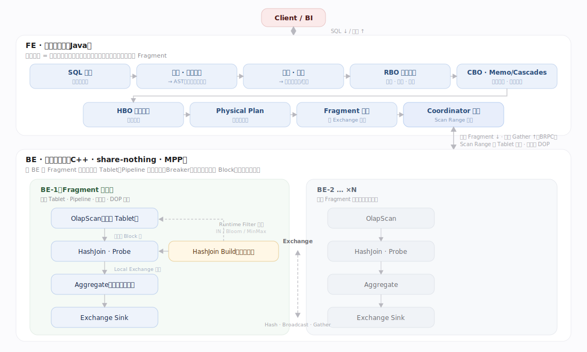

---

## 生命周期总览

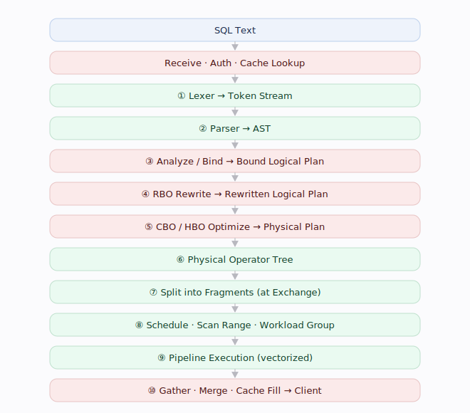

---

## 阶段一 · 接入与缓存（Receive · Cache）

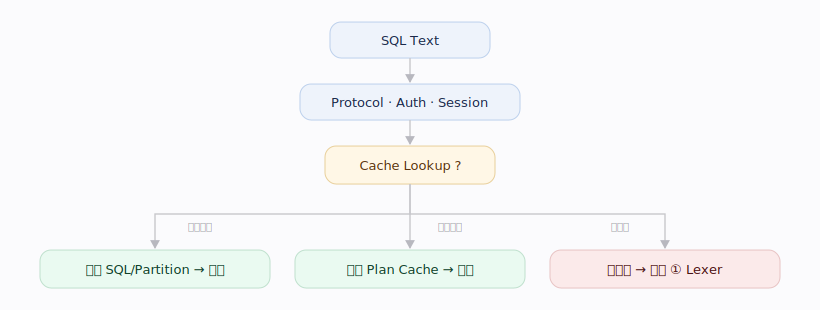

---

## 阶段二 · 编译：Text → Physical Plan

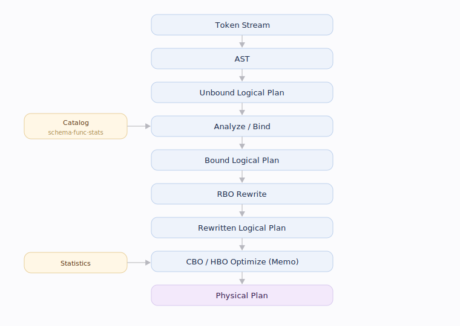

---

## 阶段三 · 算子树与 Fragment 切分

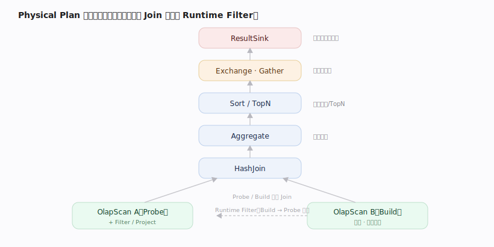

---

## 阶段四 · MPP 分布式执行

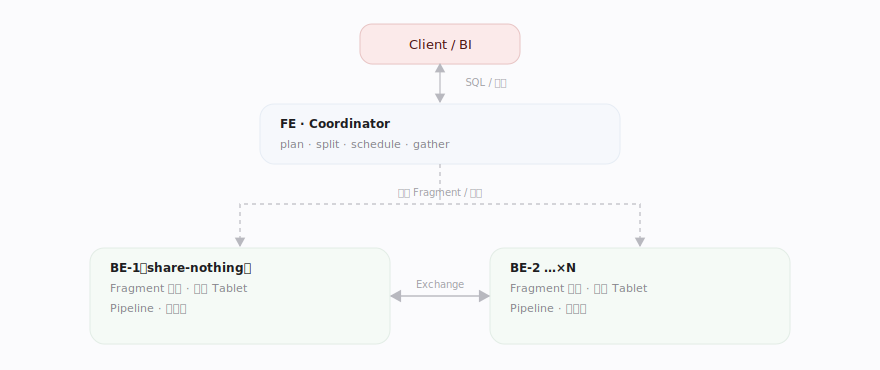

---

## 阶段五 · Fragment 内的 Pipeline 执行

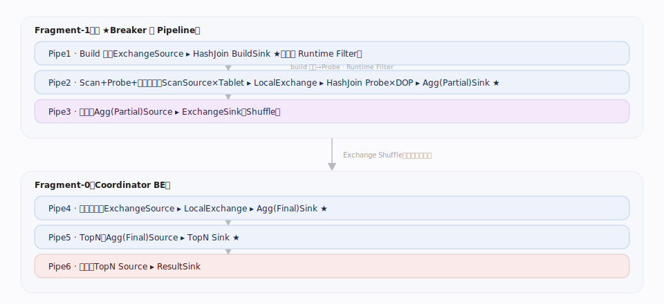

---

## 阶段六 · 汇聚与返回

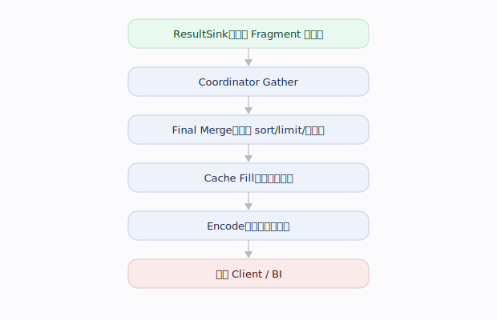

---

## 补充：外部数据源与容错语义

**读快照（一致性）**：查询开始时锁定一个已发布 **Version**，整条查询只读该快照、不受并发写影响（读不阻塞写）；主键表按 Delete Bitmap 跳被覆盖旧行。这是 DQL 对**事务一致性**主线的依赖（详见事务篇 MVCC）。

**External Catalog / 联邦查询**：除内表外，查询可跨多 Catalog 访问外部数据源（数据湖、关系库、检索引擎等），由相应连接器读取、纳入同一优化与执行。

**容错语义**：分布式查询"快速失败"——任一节点故障通常使整条查询失败、由客户端重试，而非查询内部逐任务重跑；长查询对节点稳定性敏感。

---

## 深化 · 计划阶段与 EXPLAIN（产物演进）

| EXPLAIN 级 | 阶段 | 产物 |
|---|---|---|
| PARSED | 词法 / 语法 | AST → Unbound LogicalPlan |
| ANALYZED | 分析 · 绑定 | Bound LogicalPlan（绑定元数据/类型/权限） |
| REWRITTEN | RBO 规则改写 | Rewritten LogicalPlan |
| OPTIMIZED | CBO 代价择优 | PhysicalPlan（Memo 选最优） |

---

## 深化 · Nereids 优化器三段式

| 阶段 | 定位 | 手段 | 依据 |
|---|---|---|---|
| RBO 规则改写 | 定形（总不更差） | 谓词下推、列裁剪、常量折叠、子查询解嵌套、Limit/TopN 下推、聚合下推、分区裁剪 | 无条件等价规则 |
| CBO 代价择优 | 定量（选最优） | 在 Memo 等价类结构中记忆化 + 剪枝搜索，定 Join 顺序 / 分布方式 / 聚合方式 | 统计信息（行数/NDV/直方图） |
| HBO 历史纠偏 | 纠偏（估不准时） | 用重复查询的实测行数/耗时回灌，纠正估算偏差 | 历史执行反馈 |

---

## 深化 · Runtime Filter 与两阶段聚合

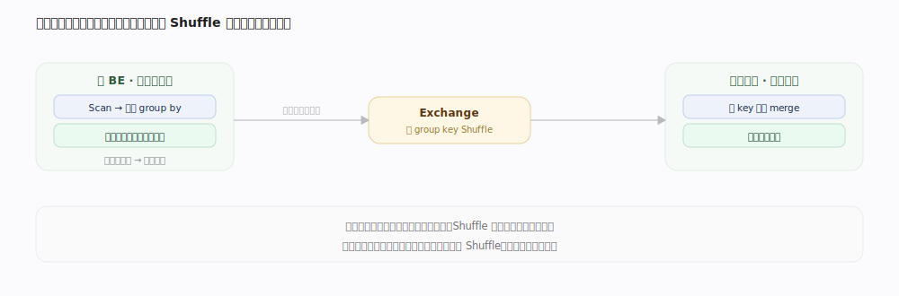

| 形态 | 结构 | 适用 | 代价 |
|---|---|---|---|
| IN | 精确取值集合 | 取值少、选择率高 | 取值多时膨胀 |
| Bloom | 概率位图 | 取值多 | 有假阳性、省内存 |
| MinMax | 上下界 | 范围过滤 | 最轻量、过滤弱 |

---

## 深化 · 高并发点查（旁路优化路径）

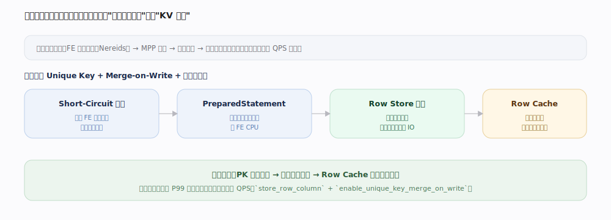

| 层 | 作用 |
|---|---|
| Row Store（行存） | 减少读整行的随机 IO |
| Short-Circuit（短路） | 跳过 FE 完整规划直达存储 |
| PreparedStatement | 缓存计划与表达式，省 FE CPU |
| Row Cache（行缓存） | 专用行缓存，避免被大查询挤掉 Page Cache |

---

## 拓展 · 分布式 Join 的四种分布方式

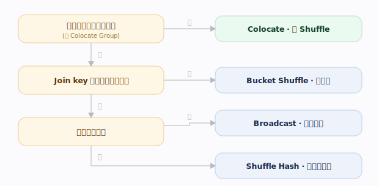

| 分布方式 | 前提 | 数据搬运 | 适用 |
|---|---|---|---|
| Colocate Join | 两表同分桶键、同分布 | 零 Shuffle | 大表 Join 大表首选 |
| Bucket Shuffle | Join key 命中一侧分桶键 | 只搬另一侧 | 少搬一半数据 |
| Shuffle (Hash) | 无 | 两侧按 key 重分布 | 最通用兜底 |
| Broadcast | 一侧足够小 | 广播小表到每节点 | 小表足够小时最快 |

---

## 调优要点（关键开关）

- `parallel_pipeline_task_num`：单 Fragment 每 BE 的并行度（DOP），一般对齐核数。
- `runtime_filter_type` / `runtime_filter_mode`：运行时过滤器类型（IN / Bloom / MinMax）与全局/本地模式。
- `enable_sql_cache`：结果缓存开关；`exec_mem_limit` / `query_timeout`：单查询内存上限 / 超时。
- 高并发点查：表属性 `store_row_column` + `enable_unique_key_merge_on_write`（开行存 + MoW）。
- 诊断：`EXPLAIN` / `EXPLAIN VERBOSE` 看计划与分布方式，Query Profile 看各算子耗时。

---

## 常见误区与工程要点

- **`SELECT *` 破坏列裁剪**：宽表只查少数列务必显式列名。
- **Statistics 过期让 CBO 跑偏**：错误 Join 顺序/分布方式多源于此。
- **Broadcast Join 小表不能太大**：过大压垮内存与网络，应改 Shuffle。

---

## 一句话总纲

**编译期把 SQL 逐步变形（Token → AST → Logical Plan → Physical Plan），在 Exchange 处切成 Fragment 分发多 BE；BE 用 Pipeline 向量化并行执行、以 Runtime Filter 剪枝、以 Exchange 交换数据；Coordinator 汇聚返回。**
