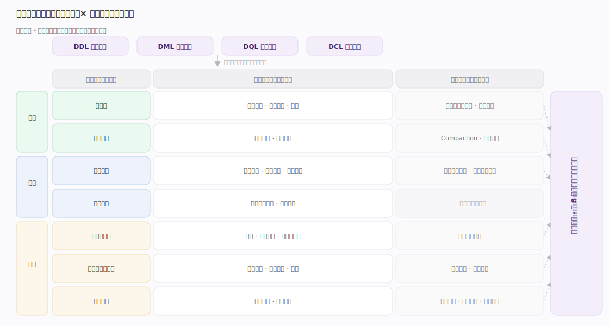
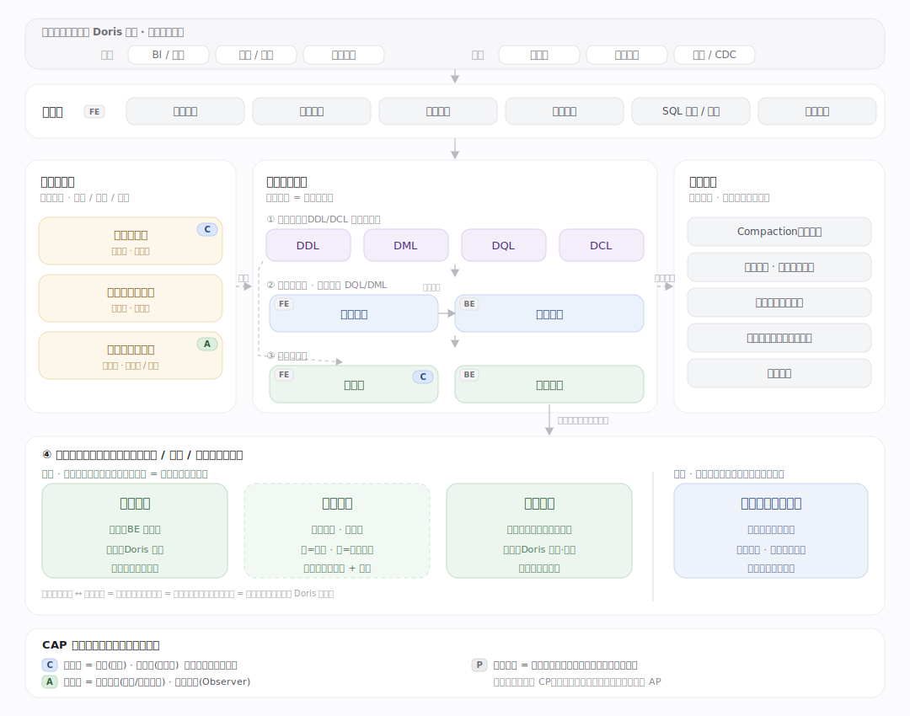
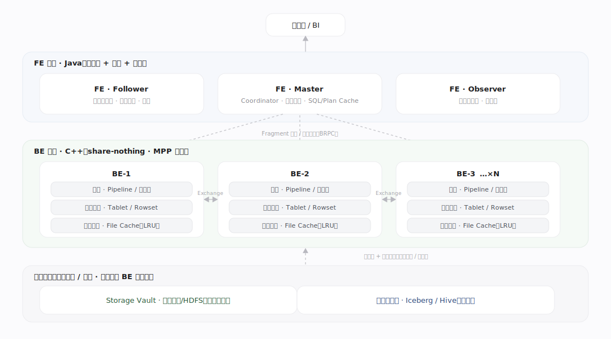
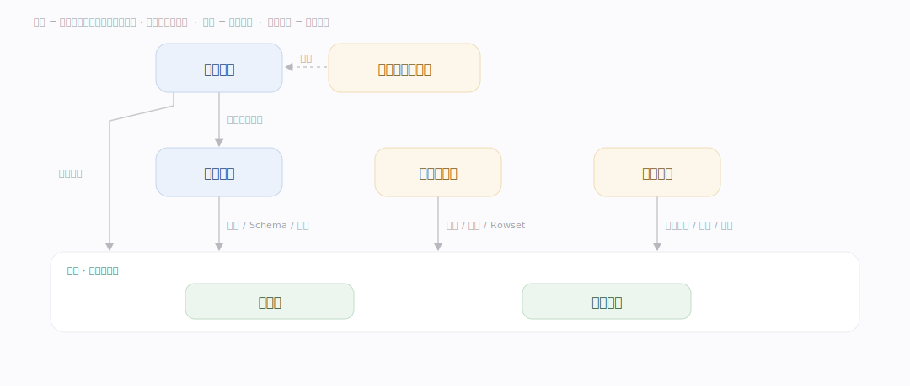
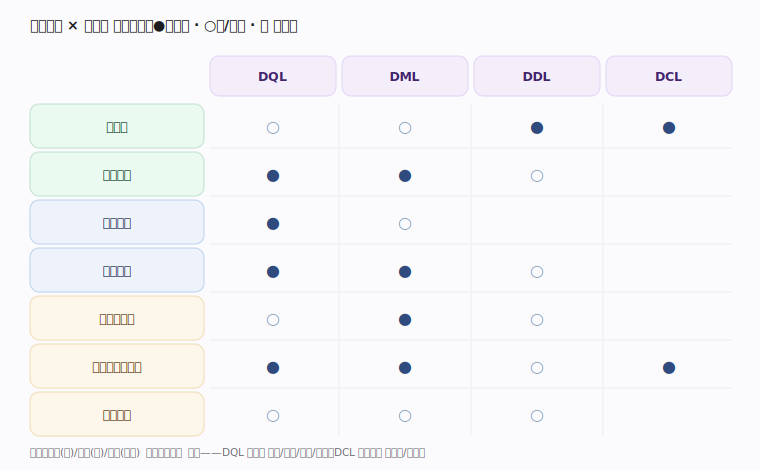
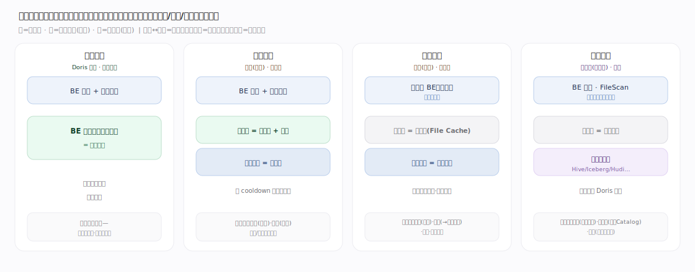

# Doris 核心原理 · 全景主线框架

> 统领全部原理文档：Doris 的 **4 条接口主线（DDL/DML/DQL/DCL）+ 8 条支撑主线**，既无遗漏也无越界。

## 一、双维模型：能力域 × 执行时机

- **能力域（管什么）**：接口主线（DDL/DML/DQL/DCL）面向用户；支撑侧的 7 条能力域面向引擎内部——元数据、存储引擎、优化技术、执行引擎、事务一致性、资源与负载管理、集群自愈。
- **执行时机（何时做）**：前台同步（请求路径）与后台异步（守护线程）。**后台任务**是第 8 条支撑主线，它横切承接各能力域的异步部分——是正交的"执行时机"维度，而非又一个能力域。

---

## 二、总架构图（位置即语义）

---

## 二·补　物理部署视图（FE/BE · MPP · 缓存）

---

## 三、8 条支撑主线的分层归位

| 层 | 支撑主线 | 一句话职责 |
|---|---|---|
| 底座 | **元数据** | 全局状态的持久化与全集群一致（DDL/DCL/事务状态/副本位置的落点） |
| 底座 | **存储引擎** | 数据的组织、落盘与读取（内表 + 外表接入） |
| 计算 | **优化技术** | 规划期减少"要做的事"（RBO/CBO/物化/缓存） |
| 计算 | **执行引擎** | 执行期把计划并行跑出来（MPP/Pipeline/向量化） |
| 保障 | **事务一致性** | 写入原子可见、读取快照一致（2PC + MVCC） |
| 保障 | **资源与负载管理** | 多租户隔离、稳定不被拖垮（资源组/内存/限流） |
| 保障 | **集群管理与自愈** | 副本健康、数据均匀、高可用（调度/修复/选主） |
| 异步 | **后台任务** | 各能力域异步部分的统一调度载体（Compaction/刷新/统计/检查点/修复） |

---

## 四、能力域依赖关系（按依赖深度分层）

---

## 五、接口主线 × 能力域 依赖矩阵

---

## 六、三条贯穿声明（不单列主线，但覆盖全局）

- **通信/传输（性能）**：Shuffle、写入流、元数据复制、副本克隆均走网络与序列化，瓶颈常落于此。
- **可观测性（诊断）**：Profile/审计/指标，归资源与负载的"事后审计"。
- **部署形态（前提）**：默认存算一体；分离时主线不变、形态变（存储"本地分片"→"远端+缓存"，自愈"副本修复"→"缓存一致性"）。容错取**快速失败**（单点故障→整查询重试）。

---

## 七、四种部署形态（存储关系维度的取值）

- **部署形态（存算关系）**：**存算一体 ↔ 存算分离** 才是真正的部署形态，区别在于自管内表数据放在 BE 本地盘还是共享对象存储（本地盘退化为缓存）。
- **分层策略（正交、可叠加）**：**冷热分离** 是数据生命周期策略，可叠加在一体或分离之上，把冷数据下沉到对象存储——它不是与前两者平级的部署模式。
- **外部数据源接入（旁路）**：**湖仓查询** 读外部表格式，数据**不由 Doris 存储引擎组织**，经连接器旁路存储引擎——它不是"存储引擎的实现形态"，而是一条平行的外部接入路径。

---

## 常见误区与工程要点

- **后台任务不是第 8 个能力域的"平级能力"**：它是正交的执行时机维度，只承接各域异步部分。
- **接口主线不能脱离支撑主线单独理解**：一条 SQL 的表现由它依赖的能力域共同决定（见依赖矩阵）。
- **存算分离只改形态不改主线清单**：不要因部署变化而误以为少了或多了主线。

---

## 一句话总纲

**Doris 的主线是"能力域 × 执行时机"双维网：纵向 4 条接口主线（DDL/DML/DQL/DCL）面向用户，横切 8 条支撑主线——底座（元数据、存储）、计算（优化、执行）、保障（事务、资源、自愈）、异步载体（后台任务）。**
