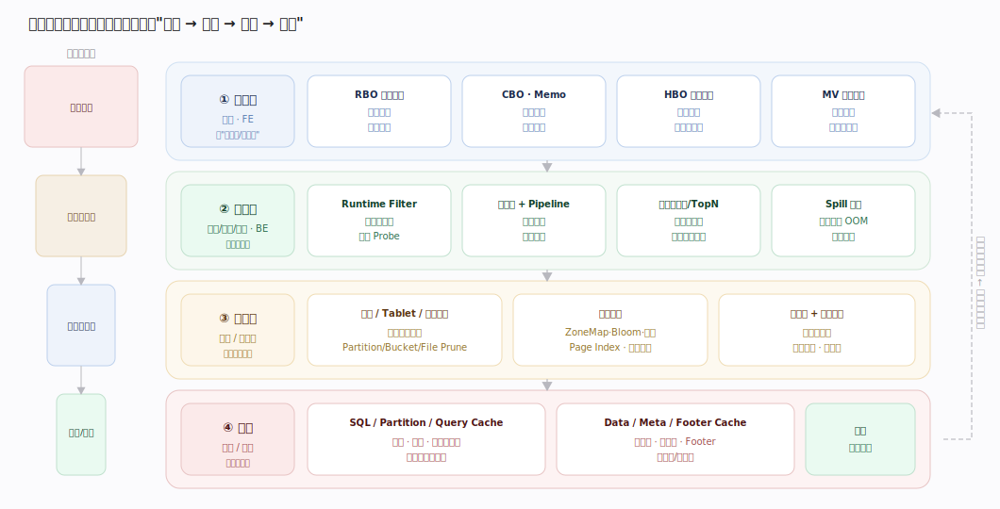
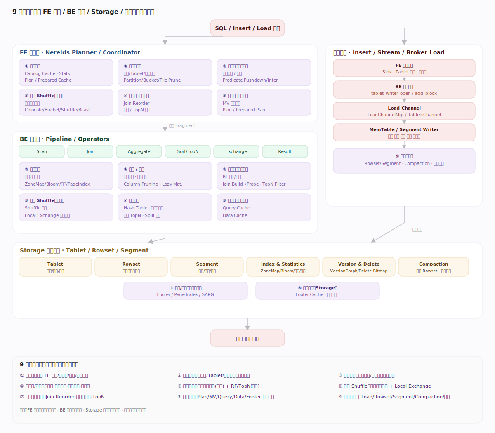
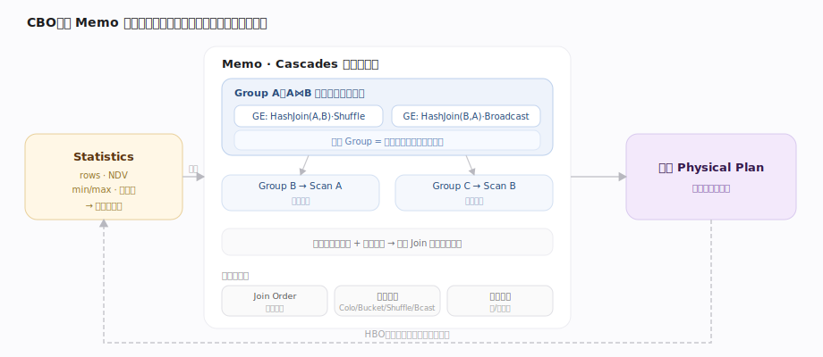
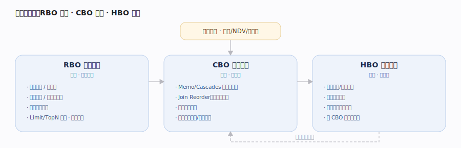
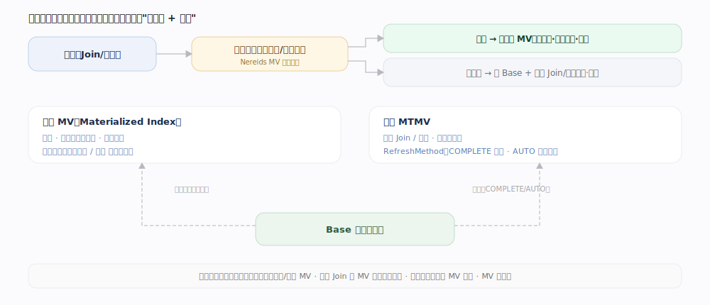
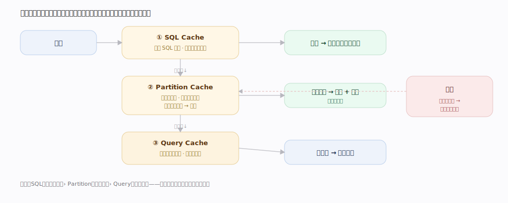
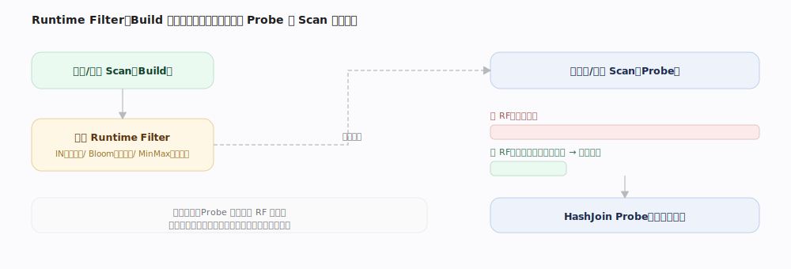
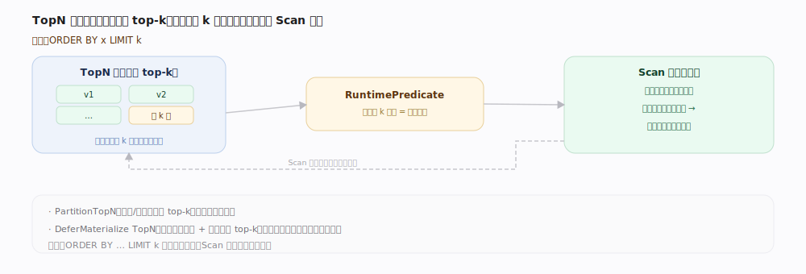
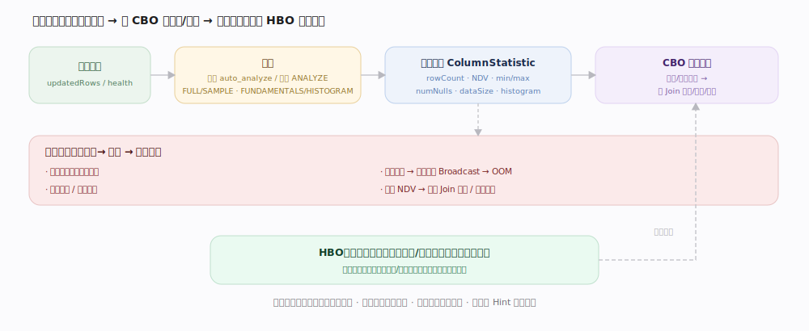

# Doris 核心原理 · 支撑主线 · 优化技术

> **定位**：优化技术是计算能力域，建立在 **元数据**（Statistics/MV 定义/分区/Schema）与 **存储引擎**（数据分布/索引能力/有序性）之上，为 **执行引擎** 产出计划；异步部分（Statistics 收集、MV 刷新）由 **后台任务** 承接。

## 一、优化的四个位置

---

## 一·补　九类优化主轴的落点

九类主轴（规划开销/扫描对象/存储读取/读列字节/流入行数/网络 Shuffle/算子计算/重复计算/写入维护）分别落在 FE 规划、BE 执行、Storage、写入主线，一条主轴常横跨多层。

---

## 二、RBO Rewrite（规则改写）

等价、保序、总是有益。规则按作用分六类：

| 类别 | 代表规则 | 原理 / 作用 |
|---|---|---|
| 下推 | 谓词下推 · Limit/TopN 下推 · 聚合下推 | 把过滤/限制/聚合尽量贴近数据源，早减行 |
| 裁剪 | 列裁剪（Column Pruning）· 分区/分桶裁剪 | 只读需要的列与分区，少读少解码 |
| 化简 | 常量折叠 · 表达式化简 · 谓词推断（传递） | 编译期算掉常量、推出隐含谓词再下推 |
| 消除 | 消除无用 Project/Sort/Limit · 外连接消除 · 空关系消除 | 删掉不改变结果的算子与分支 |
| 解嵌套 | 子查询解嵌套（Apply → Join） | 相关子查询转 Join，交给 CBO 优化 |
| 规范化 | Join 条件去重/规范 · 常量传播 | 归一化计划，便于匹配与代价择优 |

RBO 只做"无条件更好"的变换，不依赖统计；产物交 CBO 定量择优。

---

## 三、CBO Optimize（代价优化）

---

## 三·补　RBO / CBO / HBO 三段协同

| 阶段 | 定位 | 依据 | 关键决策 |
|---|---|---|---|
| RBO | 保序改写（总是安全） | 无条件等价规则 | 下推、裁剪、折叠、解嵌套 |
| CBO | 依统计估代价择优 | 行数/NDV/直方图 | Join 顺序、分布方式、聚合方式 |
| HBO | 依历史实测纠偏 | 上次真实运行信息 | 统计缺失/偏差大时校正 |

---

## 四、Materialized View / Runtime Filter / Cache

| 手段 | 机制 | 命中 / 触发 | 代价 |
|---|---|---|---|
| Materialized View | 预算常用 Join/Agg 结果 | 查询语义等价时透明改写 | 存储 + 后台刷新 |
| Runtime Filter | Build 侧运行期生成过滤器 | 下推 Probe 侧 Scan 提前过滤 | 短暂等待、尽力而为 |
| Cache | 多级结果/计划/数据缓存 | 数据未变即命中短路 | 一致性与失效管理 |

---

## 补充：优化器的局限与兜底

CBO 并非万能——统计缺失或分布特殊时可能选错。

---

## 深化 · 物化视图透明改写

| 物化视图 | 范围 | 更新 | 改写 |
|---|---|---|---|
| 同步 MV | 单表 | 随基表实时 | 透明改写 |
| 异步 MTMV | 多表 Join/聚合 | COMPLETE 全量 / AUTO 增量优先 | 透明改写 |

---

## 深化 · 多级缓存

| 缓存层 | 粒度 | 命中条件 | 失效范围 |
|---|---|---|---|
| SQL Cache | 整条 SQL 结果 | 数据未变 | 相关表变更即失效 |
| Partition Cache | 分区级结果 | 该分区未变 | 只失效变更分区 |
| Query Cache | 算子级中间结果 | 子计划可复用 | 依赖数据版本 |

---

## 深化 · Runtime Filter 运行时裁行

| 形态 | 结构 | 适用 | 代价 |
|---|---|---|---|
| IN | 精确取值集合 | 取值少、选择率高 | 取值多时膨胀 |
| Bloom | 概率位图 | 取值多 | 有假阳性、省内存 |
| MinMax | 上下界 | 范围过滤 | 最轻量、过滤弱 |

生成时机与范围：Build 侧收齐后生成；**Local**（本实例内）即时生效，**Global**（跨实例）汇总后下发。Probe 侧**短暂等待**过滤器就绪，超时则直接扫（尽力而为、不影响正确性）。

---

## 深化 · TopN 与极值下推

| 形态 | 机制 | 适用 |
|---|---|---|
| TopN | 堆维护 top-k + RuntimePredicate 极值下推 Scan | ORDER BY … LIMIT k |
| PartitionTopN | 分组/窗口内各取 top-k | 每组前 N |
| DeferMaterialize TopN | 先读排序列定位 top-k，最后回表取其余列 | 宽表 TopN 减解码 |

---

## 深化 · Memo 等价类搜索与 Join Reorder

Memo 把逻辑等价的所有计划折叠成有限的"组 + 组表达式"，配合**记忆化 + 剪枝**避免 Join 顺序枚举爆炸。

其上做两大决策：**Join Reorder**（按估算中间结果把小表前置）与**分布方式选择**（Colocate > Bucket Shuffle > Shuffle > Broadcast）。

Join Reorder 按连续 Join 的规模选用不同算法：

| 规模 | 算法 | 说明 |
|---|---|---|
| 一般 | ZigZag / Bushy（Cascades 内枚举重写） | 在 Memo 里探索等价 Join 顺序，产 left-deep 或 bushy 形态 |
| 大规模 | DPHyp（基于超图的动态规划） | 连续 Join 数超阈值时启用，控住组合爆炸；代价导向 |

用哪套由"连续 Join 数是否超阈值"（或显式开关）决定：超过则切 DPHyp，否则走 ZigZag/Bushy 规则集。形态上 left-deep 便于流水，bushy 利于并行大 Join；由 CBO 依统计权衡。

---

## 深化 · 统计信息：CBO 的燃料与失真

| 统计项 | 用途 | 失真后果 |
|---|---|---|
| 行数 / 分区行数 | 估基数与代价 | 低估→误广播大表→OOM |
| NDV（唯一值数） | 估选择率与聚合规模 | 高估→错误 Join 顺序 |
| Min/Max · 空值率 | 范围/裁剪估计 | 裁剪失效、扫描放大 |
| 直方图 | 倾斜分布下的选择率 | 倾斜列估偏 |

---

## 拓展 · 物化透明改写的命中条件

| 改写场景 | 命中条件 |
|---|---|
| 聚合上卷 | 查询聚合粒度粗于/等于 MV，可再上卷 |
| Join 子集 | 查询 Join 是 MV Join 的子集或等价 |
| 投影/过滤包含 | 查询列与过滤被 MV 覆盖 |

---

## 调优要点（关键开关）

- `enable_nereids_planner`：Nereids 优化器（默认开）。
- 统计信息：`ANALYZE TABLE` 手动收集 / 自动收集（采样比例可调）——CBO 质量的前提。
- 物化视图：同步（建在表上）/ 异步（多表、按策略刷新），透明改写命中。
- 缓存：`enable_sql_cache`（SQL/结果）、Partition Cache、Query Cache（算子级）。
- 运行时过滤：`runtime_filter_type` / `runtime_filter_mode`。

---

## 常见误区与工程要点

- **CBO 依赖 Statistics 质量**：统计不准，优化器也会选错计划。
- **MV 需刷新且要命中**：不刷新读旧结果，命中要求语义等价。
- **Cache 以一致性换速度**：高更新表命中率低甚至频繁失效。

---

## 一句话总纲

**优化是一条链路：Planning 用 RBO/CBO 与 MV 把计划变优，Execution 用 Runtime Filter 与向量化减少实际做的工，Storage 提供裁剪与少读，Cache 在最外层短路。**
