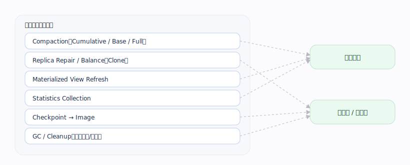
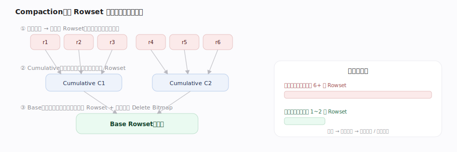
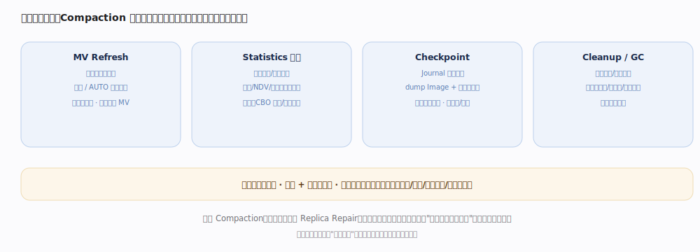
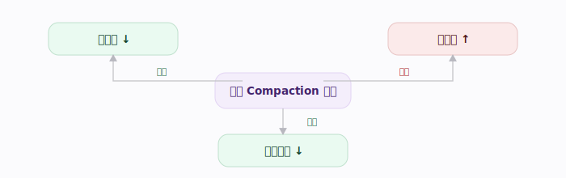

# Doris 核心原理 · 支撑主线 · 后台任务

> **定位**：后台任务不是与其他能力域并列的"第八个能力域"，而是一条**正交的"执行时机"维度**——它是元数据、存储、优化、自愈等各能力域**异步部分的统一调度载体**。与各域是"承接"关系：如 Replica Repair 由**集群自愈决策**、交**后台任务执行**（决策/执行分离），Compaction 是**存储引擎**的异步部分，Statistics/MV 刷新是**优化技术**的异步部分，Checkpoint 是**元数据**的异步部分。

## 一、异步守护摊平成本

---

## 二、Compaction

---

## 三、MV Refresh / Statistics / Checkpoint / Cleanup

| 任务 | 承接域 | 触发 | 反哺 |
|---|---|---|---|
| Compaction | 存储引擎 | Rowset 堆积 / 分数 | 降读放大 |
| MV Refresh | 优化技术 | 源数据变化 | 保物化新鲜（全量/增量） |
| Statistics | 优化技术 | 定期 / 变化量 | 喂 CBO |
| Checkpoint | 元数据 | Journal 增长 | dump Image、截断旧 EditLog |
| Replica Repair | 集群自愈 | 副本缺失/损坏 | 保可用（决策在自愈） |
| Cleanup / GC | 各域 | 引用消失 | 回收旧 Version、临时文件、失效缓存 |

---

## 深化 · Compaction 类型与策略

| 类型 | 频率 | 作用 | 场景 |
|---|---|---|---|
| Cumulative | 高频轻量 | 合并近期增量小 Rowset | 持续写入降读放大 |
| Base | 低频重量 | 增量并入基线大 Rowset | 控空间、清过期 Delete Bitmap |
| Full | 按需 | 全量重整 | Schema Change 后 |
| Vertical | — | 按列分组合并 | 列多时降内存 |
| Single-Replica | — | 一副本压完克隆给其他 | 省重复算力 |

---

## 深化 · Compaction 的三放大权衡与限速错峰

---

## 拓展 · Compaction 分数与调度

- **Compaction Score**：反映 Tablet 待合并的 Rowset/版本堆积程度，分数越高读放大越重、越优先被调度。
- **调度优先级**：高分数 Tablet 优先 Compaction；写入热点 Tablet 需保障 Compaction 跟得上写入速度。
- **资源隔离**：Compaction 占 CPU/IO，需限速并与前台错峰；可调并发与带宽。
- **观测**：监控 compaction score、版本数、失败率——分数持续走高预示写入过快或 Compaction 被"饿死"。

---

## 深化 · Compaction 触发策略

| 策略 | 选 Rowset 依据 | 适用 |
|---|---|---|
| size_based（默认） | 按 Rowset 大小分层 + cumulative_point 推进 | 通用负载 |
| time_series | 按时间 / 文件数 / 目标大小（goal_size）触发 | 时序、持续追加 |

高分数（版本堆积）Tablet 优先调度；写入热点需保 Compaction 跟上写速。

---

## 调优要点（关键开关）

- Compaction：Cumulative/Base 策略参数、Vertical Compaction（降内存）、Single-Replica Compaction（省算力）。
- 统计信息：自动收集开关与采样比例——喂 CBO。
- 物化视图：异步 MV 的刷新调度（全量/分区增量/实时）。
- 观测：`SHOW ... COMPACTION` / 版本数与 compaction score 判断读放大风险。

---

## 常见误区与工程要点

- **Compaction 滞后 = 查询变慢**：读放大直接体现为延迟上升，需保障其吞吐。
- **必须与前台错峰限速**：否则后台抢占资源反而拖垮在线负载。
- **Statistics / MV 刷新滞后 = 优化跑偏、读旧数据**：频率要匹配数据变化速度。

---

## 源码锚点（jdolap-engine 核实）

> BE 路径前缀 `be/src/olap/`；FE 路径前缀 `fe/fe-core/src/main/java/org/apache/doris/`。

| 任务 | 源码位置 | 说明 |
|---|---|---|
| Compaction 生产者线程 | `olap_server.cpp:647` `StorageEngine::_compaction_tasks_producer_callback` → `_generate_compaction_tasks`（:717） | 周期扫 Tablet 挑候选、按分数排序提交 |
| Compaction 限速错峰 | `olap_server.cpp:585` `_adjust_compaction_thread_num` | 动态调压缩线程数，避免抢占前台资源 |
| Cumulative Point / 分层 | `cumulative_compaction_policy.cpp:46` `SizeBasedCumulativeCompactionPolicy::calculate_cumulative_point` | size_based 默认策略推进 cumulative_point |
| Compaction 执行 | `compaction.cpp:567` `CompactionMixin::execute_compact` → `execute_compact_impl`（:637） | 合并入口 |
| Rowset 归并 | `compaction.cpp:256` `Compaction::merge_input_rowsets` → `Merger::vertical_merge_rowsets`（:292）/ `vmerge_rowsets`（:301） | Vertical 按列分组降内存 |
| Statistics 自动收集 | `statistics/StatisticsAutoCollector.java:53`，周期 `runAfterCatalogReady`（:70）→ `collect`（:93） | 定期采样喂 CBO |
| MV Refresh | `job/extensions/mtmv/MTMVTask.java:94`，`run`（:181）→ `generateRefreshMode`（:243） | 判全量 / 分区增量刷新 |
| Checkpoint dump Image | `master/Checkpoint.java:53`，`runAfterCatalogReady`（:80）→ `env.saveImage`（:149） | 回放 Journal 生成新 Image |
| 截断旧 EditLog / 清理 | `master/Checkpoint.java:298` `editLog.deleteJournals`；`MetaCleaner.clean`（:317） | 防元数据膨胀 |

---

## 一句话总纲

**后台任务用异步守护把写入与维护成本移出关键路径：Compaction 降读放大、MV Refresh 保新鲜、Statistics 喂优化器、Replica Repair 保可用、Checkpoint 与 Cleanup 防膨胀。**
