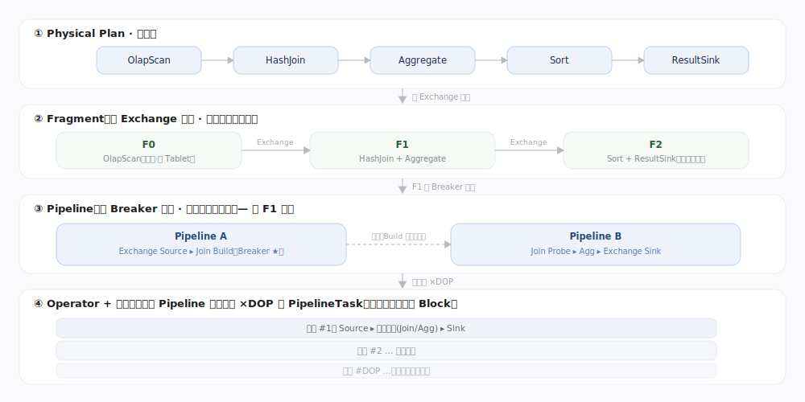
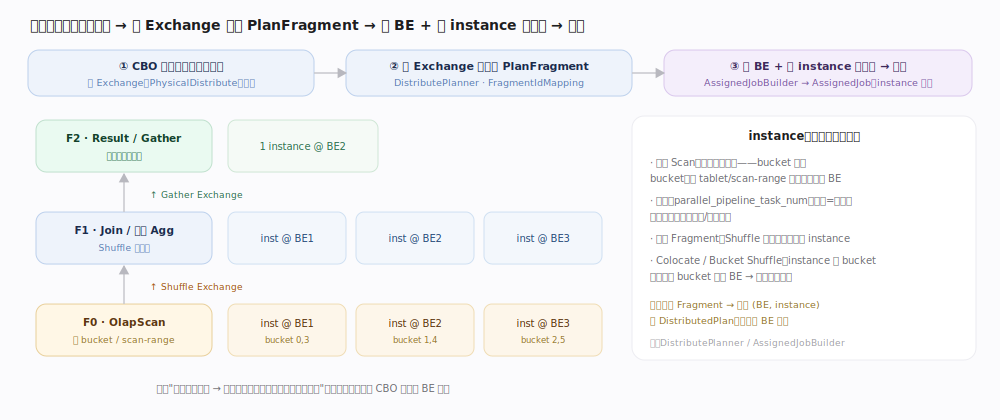
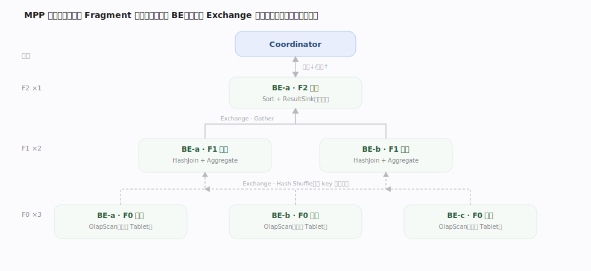
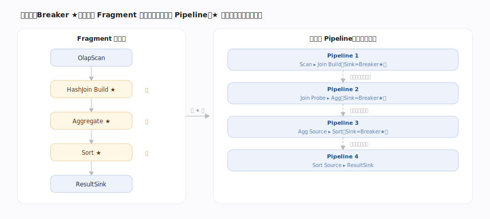
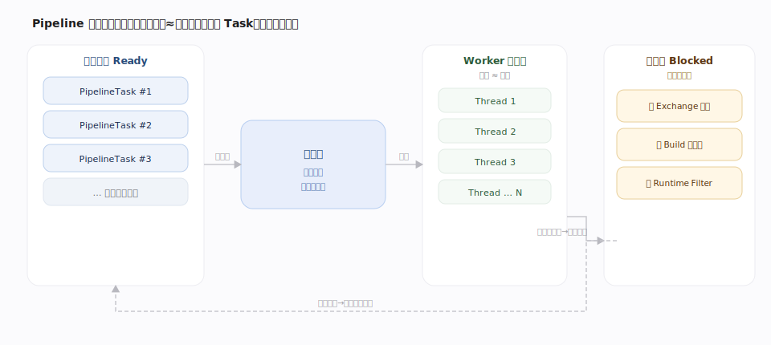
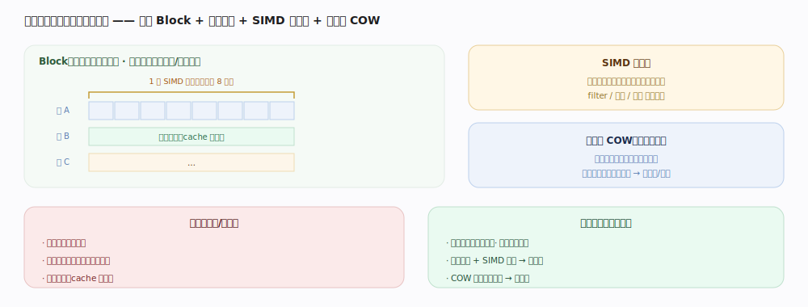
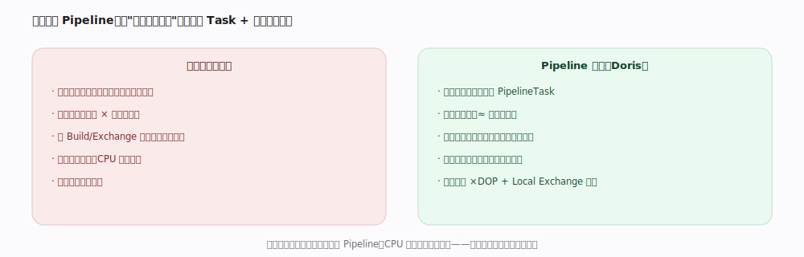
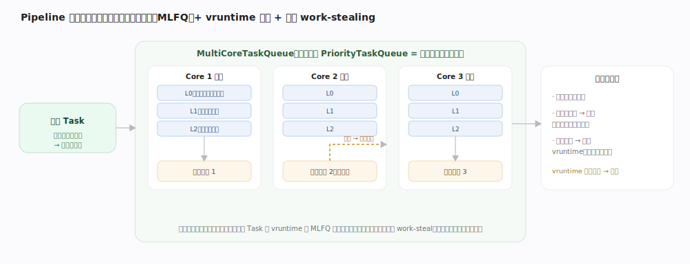
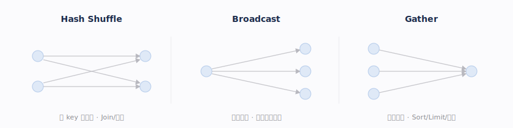
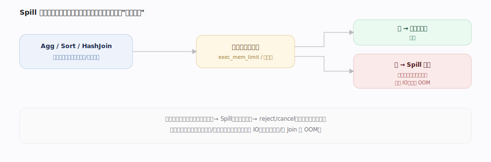

# Doris 核心原理 · 支撑主线 · 执行引擎

> **定位**：执行引擎是计算能力域。内存/线程在本线是**机制**，其配额策略归资源与负载管理；**Exchange** 是跨节点通信载体，也是分布式查询常见瓶颈。

## 一、四级展开（Plan → Fragment → Pipeline → Operator）

---

## 一·补　分布式规划（Fragment 切分与 BE/instance 分配）

四级展开里"Plan → Fragment"这步并非纯逻辑切分：CBO 产出的物理算子树以 **Exchange（重分布）为切点**切成若干 **PlanFragment**，每个 Fragment 再由规划器**选定执行的 BE、并确定 instance 并行度**——叶子 Scan 按数据分布（bucket 表按 bucket、按 tablet/scan-range）分给持有副本的 BE，受并行度上限封顶；Shuffle 后的中间 Fragment 按并行度起多实例；Colocate / Bucket Shuffle 则让 instance 按 bucket 对齐、同 bucket 落同 BE 以免网络重分布。产物是"每个 Fragment 对应一组 (BE, instance)"的分布式计划，下发各 BE 执行——这是 FE 规划与 BE 执行之间的桥。

---

## 二、MPP 分布式执行

---

## 三、Pipeline 拆分与 Breaker

---

## 四、向量化与线程模型

向量化为何快：数据以**列式 Block**（每列连续数组）为单位批量流动——连续内存 cache 友好、一条 **SIMD** 指令并行处理多值、批处理摊薄函数调用开销；列对象用**写时复制（COW）**在算子间共享不可变列、仅修改时才拷贝，省内存与拷贝。

---

## 补充：容错语义

分布式查询采用**快速失败**：任一实例失败通常使整条查询失败、由上层重试，而非查询内部逐任务重跑。

---

## 深化 · 为什么是 Pipeline：从"一线程一算子"到依赖驱动

- **不阻塞占线程**：某个 Task 依赖未就绪（等 Build 端 Hash 表、等 Exchange 数据、等 Runtime Filter）时**主动让出线程**，转为等待态，依赖满足后被唤醒重新入就绪队列。
- **依赖显式化**：算子间的"必须先有谁"被建模成显式依赖对象，调度器据此决定谁可运行，而非靠线程阻塞隐式表达。
- **并行实例**：一个 Pipeline 可实例化多份（并行度 DOP），配合节点内 Local Exchange 把数据打散喂给多实例，充分利用多核。

---

## 深化 · 调度队列纪律（MLFQ + work-stealing + vruntime）

"依赖驱动"只解决了"谁可运行"，"就绪的 Task 怎么排、哪个线程跑"由调度队列决定：**每个核一条队列**，各自是一个**多级反馈队列（MLFQ）**——新任务进高优先级子队列，跑得久就逐级降级，避免长任务饿死短任务；同级内按 **vruntime（跑得越少越靠前）** 择序，保证公平。线程**优先跑本核队列**（局部性好），本核空了才去**窃取（work-stealing）邻核**任务，兼顾负载均衡。任务运行一个时间片后：依赖未就绪就让出转等待、唤醒后重入；没跑完就累加 vruntime、降级重回队尾。

---

## 深化 · Exchange：跨节点数据重分布

| 分发方式 | 模式 | 供给算子 | 目的 |
|---|---|---|---|
| Hash Shuffle | 按 key 重分布，同 key 落同实例 | Shuffle Join、全局聚合 | 保证同 key 汇聚 |
| Broadcast | 小表全量广播到每实例 | Broadcast Join | 省去大表重分布 |
| Gather | 多实例汇聚到单点 | 最终 Sort/Limit、返回客户端 | 收口输出 |

---

## 深化 · Spill 落盘 与 Local Shuffle

**Spill 落盘**：Aggregation/Sort/HashJoin 内存不足时把部分状态写盘、分批处理，避免 OOM（代价额外 IO，"慢但不崩"）。

---

## 拓展 · 算子全景清单

| 类别 | 算子 | 是否阻塞 |
|---|---|---|
| 扫描 | OlapScan（内表）、FileScan（湖仓）、JdbcScan/EsScan（外部源） | 否 |
| 连接 | HashJoin（等值）、NestLoopJoin（非等值/笛卡尔） | Build 侧阻塞 |
| 聚合 | Aggregation（一/两阶段）、Repeat（GROUPING SETS） | 阻塞 |
| 排序 | Sort、TopN、PartitionTopN | Sort 阻塞 |
| 集合 / 窗口 | Union/Intersect/Except、AnalyticEval | 部分阻塞 |
| 交换 | Exchange（Broadcast/Shuffle/Gather）、LocalExchange | 否 |
| 输出 | ResultSink、OlapTableSink | — |

---

## 深化 · BE 线程池分工（按功能）

BE 以大量分工线程池支撑并发，池大小多为可配：

| 功能域 | 代表线程池 | 职责 |
|---|---|---|
| 查询执行 | Fragment / Pipeline 执行池 | 跑 Pipeline Task |
| 写入落盘 | MemTableFlush / HighPriorityFlush | MemTable → Segment |
| 合并 | CumuCompaction / BaseCompaction / SegCompaction / ColdDataCompaction | 各类 Compaction |
| 导入 | GroupCommit / GroupCommitReplayWal | 攒批与 WAL 回放 |
| 冷热 / 迁移 | Cooldown / Migration / Download | 冷数据下沉、副本迁移、下载 |
| 缓存 / IO | BufferedReaderPrefetch / FileCacheBlockDownloader | 预读、File Cache 下载 |

---

## 调优要点（关键开关）

- `enable_pipeline_engine`：Pipeline 引擎（默认）；`parallel_pipeline_task_num`：并行度（DOP）。
- `enable_spill`：Agg/Sort/Join 内存不足落盘，防 OOM。
- `exec_mem_limit`：单查询内存上限；`query_timeout`：超时。
- 诊断：Query Profile 看每个 Operator 的耗时、行数、内存、等待。

---

## 常见误区与工程要点

- **并行度不是越高越好**：过高带来调度/内存/上下文切换开销。
- **不是所有算子都能全流水线**：Breaker 必须收齐输入才产出。
- **Exchange 是跨节点瓶颈**：能 Colocate 就别 Shuffle。

---

## 一句话总纲

**执行引擎四级展开：Physical Plan 在 Exchange 处切成 Fragment 分发多节点，Fragment 在 Breaker 处切成 Pipeline，Pipeline 串起向量化 Operator，由依赖驱动调度打满多核。**
