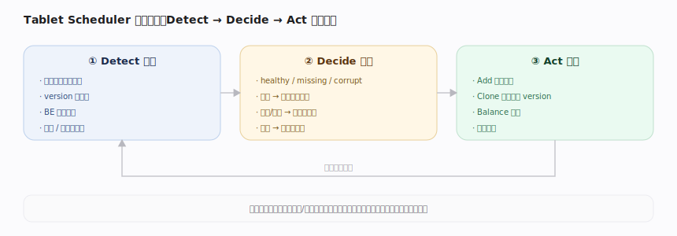
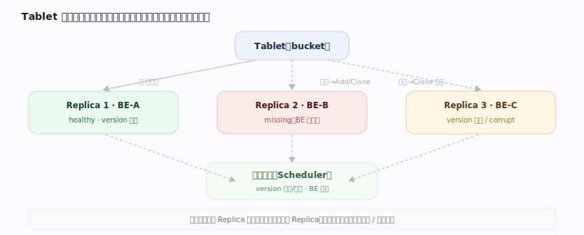
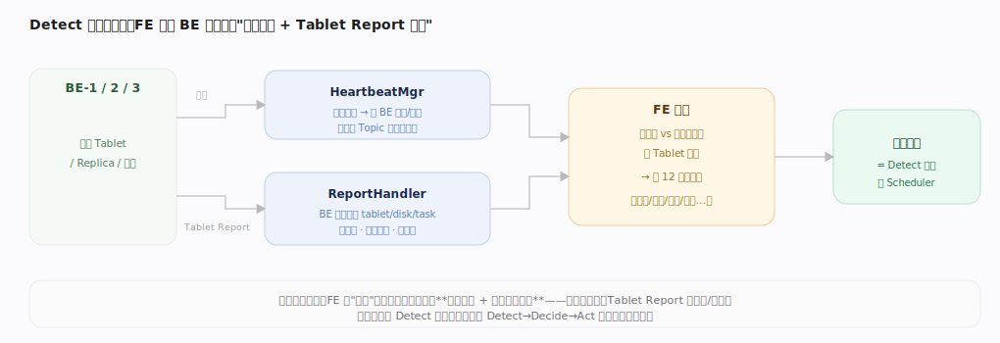
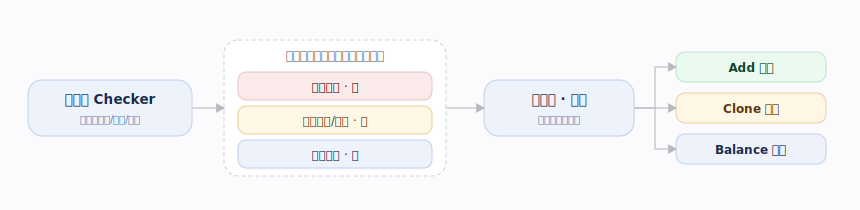
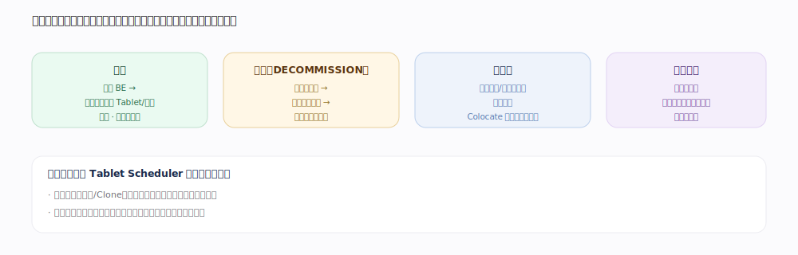

# Doris 核心原理 · 支撑主线 · 集群管理与自愈

> **定位**：保障能力域（保可用），依赖 **元数据**（Replica 位置/健康）与 **存储引擎**（Replica 数据）；它负责**决策**，具体 Repair/Balance 的**执行**交由 **后台任务**（决策/执行分离）。

## 一、自愈闭环

---

## 二、Replica 模型与健康检测

**Detect 的真相来源（对账，非扫盘）**：FE 并不主动扫 BE 磁盘，而是靠 **BE 心跳**（判存活/负载）+ **Tablet Report**（BE 周期上报 tablet/disk/task：版本、副本状态、磁盘）→ FE 与元数据期望**逐 Tablet 对账**，差异即健康度判定与调度任务的输入。这才是 Detect→Decide→Act 闭环真正的起点。

---

## 深化 · Tablet 健康度 12 态（调度输入）

Checker 把每个 Tablet 判为下列状态之一，作为调度器的优先级依据：

| 状态 | 含义 | 调度动作 · 优先级 |
|---|---|---|
| OK / HEALTHY | 副本数够、版本齐、分布对 | 无 |
| REPLICA_MISSING | 存活副本不足 | 补副本 · 高 |
| VERSION_INCOMPLETE | 副本够但版本缺 | Clone 追版本 · 高 |
| REPLICA_RELOCATING | 健康但迁移中（BE 下线） | 迁移中 |
| REDUNDANT | 副本过多 | 删冗余 · 很高（快速释放空间） |
| REPLICA_MISSING_FOR_TAG | 指定 Tag 内健康副本不足 | 按 Tag 补 |
| FORCE_REDUNDANT | 缺/坏但无处可修 | 先删占位副本 |
| COLOCATE_MISMATCH | 不在正确 Colocate 集合 | 按组迁移对齐 |
| COLOCATE_REDUNDANT | 匹配 Colocate 但冗余 | 删冗余 |
| NEED_FURTHER_REPAIR | 某副本需确定性修复 | 定向修复 |
| UNRECOVERABLE | 无健康副本 | 不可恢复 · 告警 |
| REPLICA_COMPACTION_TOO_SLOW | 某副本版本数远多于其他 | 标记 / 干预 |

---

## 三、调度：Add / Clone Repair / Balance

| 动作 | 触发 | 手段 | 优先级 |
|---|---|---|---|
| Add | 健康副本数低于预期 | 选节点新建、Clone 补足冗余 | 高（可用性） |
| Clone Repair | 副本损坏或落后 | 选健康副本作 Clone 源、追平 version | 高（可用性） |
| Balance | 数据/负载倾斜 | 从繁忙/满盘节点迁到空闲节点 | 低（优化性） |

三者都限速、不影响在线服务；修复类优先于均衡类。**决策/执行分离**：本线（Tablet Scheduler）负责检测与调度决策，实际的克隆/搬迁数据传输是**限速的异步后台任务**（由后台任务承载执行）。

---

## 四、节点上下线与高可用

**节点上线**逐步迁入 Replica 分摊；**优雅下线**先迁走再退出，**异常宕机**触发 Add/Repair；**FE 高可用**靠多数派复制 + 选主（Master 宕机后 Follower 选新主，已提交状态不丢）。

---

## 深化 · 检测—调度—执行 与 抖动抑制

| 场景 | 处理 | 原因 |
|---|---|---|
| 节点短暂抖动 | 冷却/延迟判定，先观察 | 避免"故障→搬迁→更多故障"风暴 |
| 优雅下线 Decommission | 先迁走副本、确认冗余再摘除 | 不中断服务 |
| Colocate 表组均衡 | 按组整体迁移、保分片对齐 | 保住 Colocate Join 免 Shuffle 前提 |

---

## 拓展 · 扩缩容与再均衡

| 操作 | 机制 | 要点 |
|---|---|---|
| 扩容 | 新增 BE 后均衡逐步迁入 Tablet/副本 | 限速、不影响在线 |
| 缩容 | `DECOMMISSION` 优雅下线 | 先迁副本、确认冗余再摘除 |
| 再均衡 | 按磁盘使用率、分布均匀度触发 | Colocate 组按组整体迁移 |
| 存算分离 | 计算节点无状态、分钟级扩缩 | 不搬数据，只需缓存预热 |

---

## 调优要点（关键开关）

- 表属性 `replication_num`：副本数（可用性 vs 存储成本/写放大的权衡）。
- Tablet 调度：修复优先于均衡、限速执行；`colocate_with` 表组按组整体均衡。
- `ALTER SYSTEM DECOMMISSION BACKEND`：优雅下线（先迁副本再摘除）。
- `SHOW REPLICA STATUS` / `ADMIN REPAIR`：查看与干预副本健康。

---

## 常见误区与工程要点

- **Repair / Balance 必须限速**：否则抢占在线读写资源，放大故障影响。
- **Replica 数要适中**：过少损可用性，过多增存储与写放大。
- **节点频繁抖动引发反复修复**：需冷却/延迟判定，避免抖动放大成负载风暴。

---

## 源码锚点（jdolap-engine 核实）

> FE 路径前缀 `fe/fe-core/src/main/java/org/apache/doris/`。决策/执行分离：Checker 判态、Scheduler 执行。

| 环节 | 源码位置 | 说明 |
|---|---|---|
| Detect · 心跳 | `system/HeartbeatMgr.java:75`，周期 `runAfterCatalogReady`（:115）、`BackendHeartbeatHandler`（:269） | 判 BE 存活/负载，`handleHbResponse`（:180）更新节点态 |
| Detect · Tablet Report 对账 | `master/ReportHandler.java:602` `tabletReport` | 与元数据逐 Tablet diff：sync（:653）、delete meta-be（:664），非扫盘 |
| 健康度 12 态 | `catalog/Tablet.java:62` `enum TabletStatus`（HEALTHY 外 12 态：REPLICA_MISSING / VERSION_INCOMPLETE / REPLICA_RELOCATING / REDUNDANT / …） | 判态入口 `Tablet.java:542` `getHealth`、Colocate 组 `Tablet.java:766` `getColocateHealth` |
| Decide · 巡检判优先级 | `clone/TabletChecker.java:66`，周期 `runAfterCatalogReady`（:202）→ `checkTablets`（:236） | 把不健康 Tablet 按优先级加入调度队列，`PrioPart`（:90）承接手动 REPAIR 加急 |
| Act · 调度执行 | `clone/TabletScheduler.java:103`，周期 `runAfterCatalogReady`（:353）→ `schedulePendingTablets`（:423）→ `scheduleTablet`（:506） | 生成 Clone 任务修复、下发 BE |
| Act · 处理冗余副本 | `clone/TabletScheduler.java:883` `handleRedundantReplica` | 按坏版本 / 低版本 / 同主机 / 非法 Tag / rebalancer 选择 等序删多余副本（:891-898） |
| 均衡负载统计 | `clone/TabletScheduler.java:371` `updateLoadStatistics` | 喂 rebalancer / diskRebalancer 做磁盘与分布再均衡 |

---

## 一句话总纲

**集群自愈是 Detect→Decide→Act 的持续闭环：巡检 Replica 数量/健康/均衡，Add 补齐、Clone 修复、Balance 迁移，节点上下线平滑过渡，FE 靠多数派 + 选主保高可用。**
