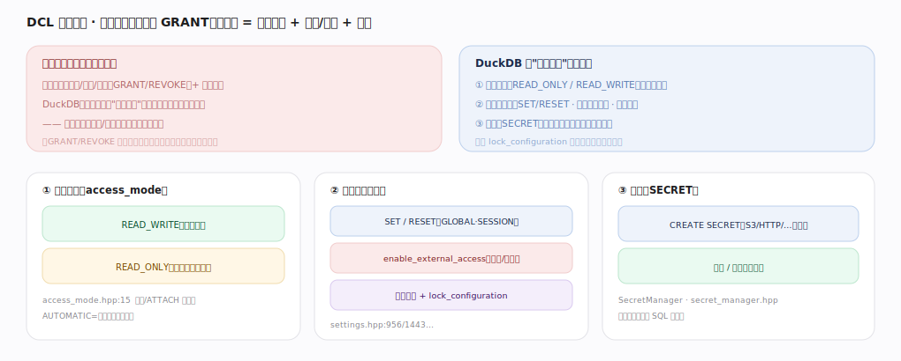
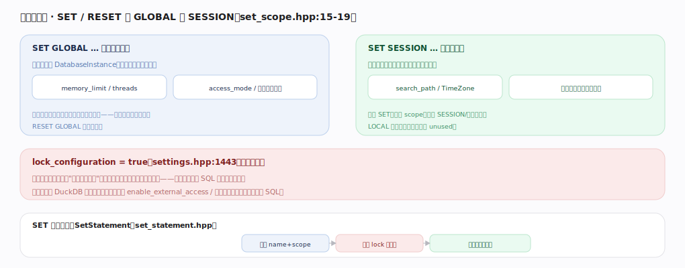
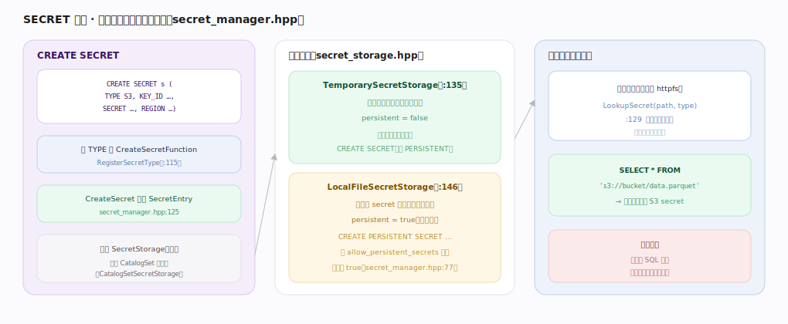
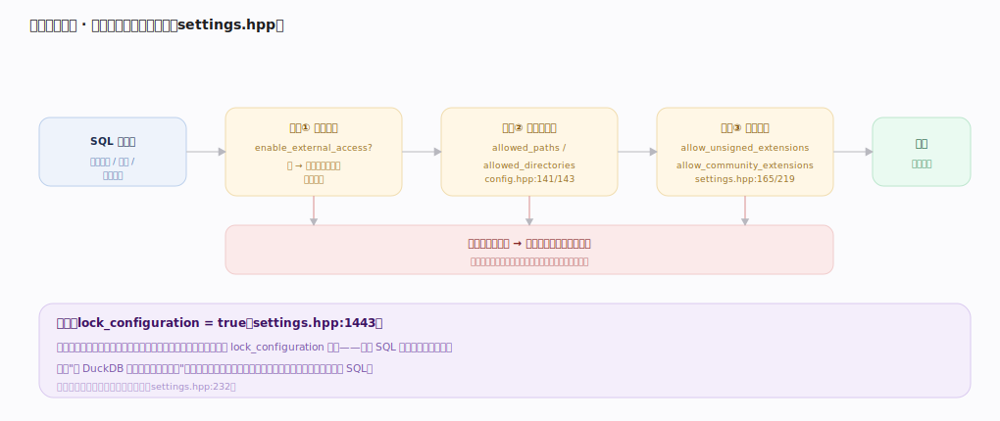

# DuckDB 核心原理 · DCL 数据控制（配置 / SECRET / 访问）

> **定位**：DCL 是"控制访问与行为"的接口主线，但在**进程内嵌入式**下没有服务器库的多用户 GRANT/REVOKE 体系。它的控制面落在三处：**访问模式**（READ_ONLY/READ_WRITE）、**配置与安全闸门**（SET/RESET、外部访问、扩展信任、lock_configuration）、**SECRET 密钥管理**。主要依托**元数据与 Catalog**（SECRET 存于 CatalogSet）与**扩展机制**（SECRET provider、扩展信任）。核实基准：主线源码 `duckdb/src`。它是依赖面最轻的一条主线（见全景依赖矩阵）。

## 〇、与服务器数据库的心智对照（读前必看）

| 维度 | 服务器库（Postgres/ClickHouse） | DuckDB |
|---|---|---|
| 谁能访问数据 | 登录认证 + 用户/角色/权限（GRANT/REVOKE） | **能打开该进程/文件即有权限**——由宿主进程与 OS 决定 |
| 权限粒度 | 库/表/列级授权 | 无内建对象级授权（GRANT/REVOKE 仅为保留关键字，无传统权限体系） |
| 控制手段 | ACL + 认证插件 | 访问模式 + 配置/安全闸门 + SECRET |

一句话：**DuckDB 的"数据控制"不是"谁能看哪张表"，而是"这个进程能对外做什么"。**

---

## 一、控制面总览：DCL 落在三处

嵌入式没有多用户授权，DuckDB 把"数据控制"收敛为三类：① **访问模式**（开库/ATTACH 时定 READ_ONLY/READ_WRITE，`access_mode.hpp:15`）；② **配置与安全闸门**（`SET`/`RESET`、`enable_external_access`、扩展信任、`lock_configuration`）；③ **SECRET**（外部数据源凭证的集中管理，`secret_manager.hpp`）。可用 `lock_configuration` 锁死配置防运行时篡改。

---

## 二、配置作用域：GLOBAL 与 SESSION

`SET`/`RESET` 有作用域（`common/enums/set_scope.hpp:15-19`）：**GLOBAL**（库实例级，影响之后所有连接，如 `memory_limit`/`threads`/`access_mode`）与 **SESSION**（连接级，仅当前连接，如 `search_path`/`TimeZone`）；`LOCAL` 在源码里标记 unused。`SetStatement`（`parser/statement/set_statement.hpp`）解析 name+scope，检查 `lock_configuration` 白名单后写入对应作用域。

---

## 深化 · SECRET 密钥管理

`CREATE SECRET` 按 `TYPE`（S3/HTTP/…）找到注册的 `CreateSecretFunction`（`RegisterSecretType` `:115`），`CreateSecret`（`:125`）生成 `SecretEntry` 存入 **SecretStorage**。两种存储（`secret_storage.hpp`）：**TemporarySecretStorage**（`:135`，仅内存、进程退出即失、`persistent=false`，默认）与 **LocalFileSecretStorage**（`:146`，落盘到 secret 目录跨会话保留、惰性加载，受 `allow_persistent_secrets` 控制，默认 true `:77`）。读外部数据时 `LookupSecret(path, type)`（`:129`）按最长前缀匹配自动挑选凭证——凭证与 SQL 文本解耦，不再明文散落在查询里。

---

## 深化 · 访问控制闸门（沙箱化嵌入）

把 DuckDB 当受控执行沙箱嵌入时，外部访问逐层过闸：① `enable_external_access`（`settings.hpp:956`，关掉则除白名单外拒绝文件/网络）→ ② 路径白名单 `allowed_paths`/`allowed_directories`（`config.hpp:141/143`，即使关了外部访问也放行的例外）→ ③ 扩展信任 `allow_unsigned_extensions`/`allow_community_extensions`（`settings.hpp:219/165`）。任一闸门不通过即报错拒绝（不静默降级）。最后用 `lock_configuration=true`（`settings.hpp:1443`）封印——宿主先设策略并锁死，再对不可信来源开放执行 SQL（白名单选项除外，`settings.hpp:232`）。

---

## 拓展 · 关键控制项清单

| 类别 | 设置 | 作用 | 锚点 |
|---|---|---|---|
| 访问模式 | `access_mode` | AUTOMATIC/READ_ONLY/READ_WRITE | `access_mode.hpp:15` |
| 外部访问 | `enable_external_access` | 文件/网络访问总闸 | `settings.hpp:956` |
| 路径白名单 | `allowed_paths` / `allowed_directories` | 例外放行的路径 | `config.hpp:141/143` |
| 扩展信任 | `allow_unsigned_extensions` / `allow_community_extensions` | 允许加载哪些扩展 | `settings.hpp:219/165` |
| 配置封印 | `lock_configuration` | 锁死配置防篡改 | `settings.hpp:1443` |
| 密钥持久 | `allow_persistent_secrets` | 是否允许落盘 SECRET | `secret_manager.hpp:77` |

---

## 调优要点（关键开关）

- 生产嵌入不可信 SQL：先 `SET enable_external_access=false`、限定 `allowed_paths`、禁不签名/社区扩展，再 `SET lock_configuration=true` 封印。
- 外部数据源用 `CREATE SECRET` 管凭证，避免在 SQL 里明文写 KEY/TOKEN。
- 只读分析场景以 `READ_ONLY` 打开库，杜绝误写。
- 多连接共享库实例时，用 GLOBAL 设资源上限（`memory_limit`/`threads`），用 SESSION 调单连接行为。

---

## 常见误区与工程要点

- **找 GRANT/REVOKE 做表级授权**：DuckDB 无此体系；访问控制在进程/文件/OS 层面，别指望 SQL 级用户权限。
- **在 SQL 里明文写云凭证**：改用 SECRET，凭证与查询解耦、可持久管理。
- **先开放执行再想起加固**：安全闸门应在暴露 SQL 执行前配好并 `lock_configuration`，顺序反了等于没锁。
- **以为关了外部访问就绝对安全**：`allowed_paths` 白名单仍是放行例外——审计白名单内容。

---

## 一句话总纲

**DuckDB 嵌入式无多用户 GRANT/REVOKE，其"数据控制"收敛为三面：开库时的访问模式（READ_ONLY/READ_WRITE）、带 GLOBAL/SESSION 作用域的配置与安全闸门（enable_external_access + 路径白名单 + 扩展信任 + lock_configuration 封印）、以及把外部数据源凭证与 SQL 解耦的 SECRET 管理（临时内存 / 持久落盘两种存储、按路径最长前缀匹配）——控制的是"这个进程能对外做什么"，而非"谁能看哪张表"。**
