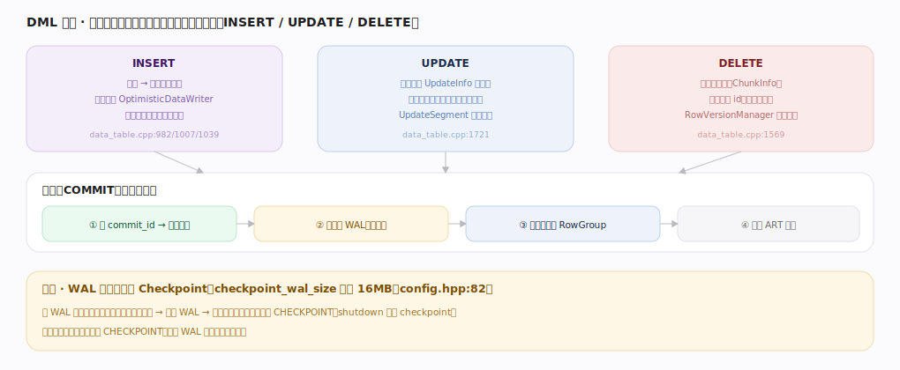
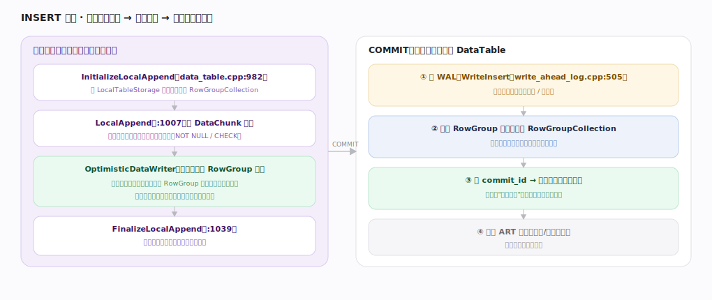
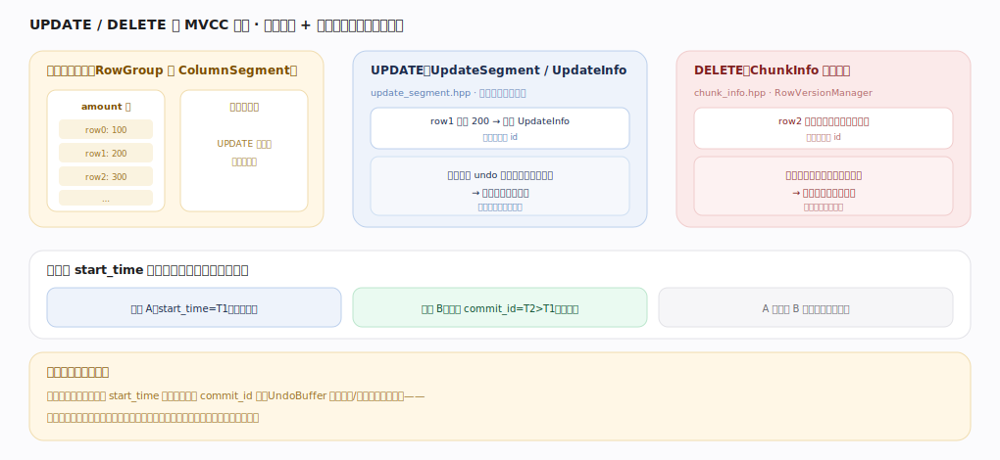
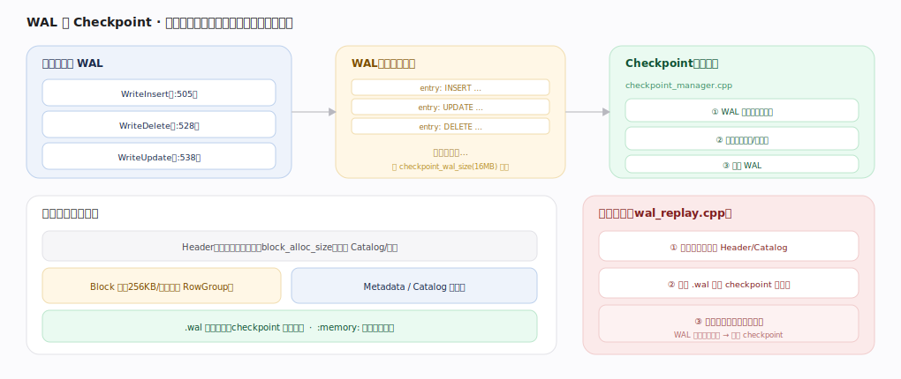
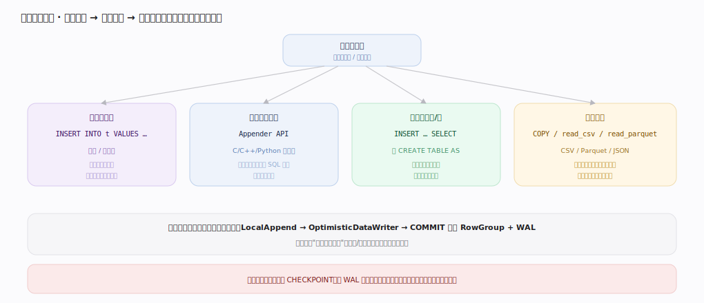

# DuckDB 核心原理 · DML 数据写入（INSERT / UPDATE / DELETE）

> **定位**：DML 是"改数据"的接口主线，骨架 = `事务本地存储 → COMMIT 并入全局表 → WAL 持久 → 后台 Checkpoint`。它以**存储引擎**（RowGroup 追加/就地列存）与**事务与 MVCC**（UndoBuffer 版本链、快照可见性）为双轴，写入落盘靠 **WAL + Checkpoint**（后台任务），约束校验依赖 **元数据与 Catalog**（主键/唯一走 ART 索引）。核实基准：主线源码 `duckdb/src`。

## 一、总览：写入先入本地，提交才可见

三类写操作共享同一收口模型：变更先落在**事务本地空间**（仅本连接可见），`COMMIT` 时统一定 `commit_id`、写 WAL、并入全局表、更新索引。这与 ClickHouse"INSERT 直接落不可变 Part"不同——DuckDB 有经典事务边界，未提交的写对其他事务不可见。

---

## 二、三类写操作的存储形态对比

| 操作 | 数据形态 | 版本机制 | 锚点 |
|---|---|---|---|
| INSERT | 新行入事务本地 RowGroupCollection，提交时挂接进全局表 | 无旧版本，靠 `commit_id` 控可见性 | `data_table.cpp:982/1007/1039` |
| UPDATE | 新值**就地**写入列段；旧值存入 `UpdateInfo` 版本链 | `UpdateSegment` 按列挂旧值 + 写入事务 id | `data_table.cpp:1721` |
| DELETE | **不物理擦除**，打删除标记 | `ChunkInfo` 记删除事务 id，`RowVersionManager` 判可见 | `data_table.cpp:1569` |

---

## 深化 · INSERT 路径：本地追加 → 乐观预写 → 提交并入

INSERT 分事务内与提交两段。事务内：`InitializeLocalAppend` 在 `LocalTableStorage` 开一块本地 RowGroupCollection，`LocalAppend` 逐 DataChunk 按列写入并校验约束，`FinalizeLocalAppend` 收尾。关键是 **OptimisticDataWriter**（`transaction/local_storage.hpp:79`）——大批量导入时，本地写满一个 RowGroup 就乐观预写进数据文件（不等提交），使内存不随导入量线性膨胀。`COMMIT` 时写 WAL（`WriteInsert`）、把本地 RowGroup 挂接进全局 `RowGroupCollection`（已预写的块直接引用无需重写）、定 `commit_id` 使新行可见、更新 ART 索引（冲突则整事务回滚）。

---

## 深化 · UPDATE / DELETE 的 MVCC 版本

DuckDB 用"就地列存 + 旁路版本信息"实现 MVCC。UPDATE 把新值直接写进列段，旧值存入 `UpdateInfo`（`update_segment.hpp`）版本链并记写入事务 id；DELETE 只在 `ChunkInfo`（`chunk_info.hpp`）打删除标记记删除事务 id，不物理擦除。读者按自己的 `start_time` 快照判定可见性：看到 undo 版本就用旧值覆盖就地值、删除标记生效就剔除该行——快照隔离下事务 A 看不到并发事务 B 的改动。**乐观并发**：写写冲突在提交时以失败告终（不阻塞等待），冲突事务回滚重试。当无活跃事务再需要某旧版本时，后台按最低活跃 `start_time` 回收 UndoBuffer。

---

## 深化 · WAL 与 Checkpoint：先写日志，后合并单文件

提交时变更以 `WriteInsert`/`WriteDelete`/`WriteUpdate`（`write_ahead_log.cpp:505/528/538`）追加到 WAL 求持久。当 WAL 大小超过 `checkpoint_wal_size`（默认 `1<<24` = 16MB，`main/config.hpp:82`）自动触发 **Checkpoint**（`checkpoint_manager.cpp`）：把 WAL 变更写入单文件的列存块、更新数据库头/元数据、截断 WAL。重启时 `wal_replay.cpp` 回放未 checkpoint 的变更恢复到崩溃前已提交状态。`checkpoint_on_shutdown` 默认 true（`config.hpp:105`）。`:memory:` 模式无文件、无 WAL。

---

## 拓展 · 写入方式选择（决策树）

按数据来源与量级选接口：少量字面量用 `INSERT … VALUES`（调试用，逐行有解析开销）；程序高频追加用 **Appender API**（按列批攒块，避开 SQL 解析）；已有结果集/表用 `INSERT … SELECT` 或 `CREATE TABLE AS`（全程向量化并行）；外部文件用 `COPY` / `read_csv` / `read_parquet`（并行分块读，批量入库最快，也可直接查文件不入库）。四条路径最终都走同一写入引擎，差别只在数据怎么进来与解析/攒批开销。

---

## 调优要点（关键开关）

- `checkpoint_wal_size`：自动 checkpoint 的 WAL 阈值（默认 16MB）；批量导入可临时调大减少 checkpoint 频次。
- `CHECKPOINT`：显式合并 WAL 进单文件——大批量导入后建议手动执行。
- 大导入用**单个大事务**而非逐行提交，减少 WAL 条目与提交开销。
- `PRAGMA` / `SET threads`：导入解析（如 CSV）也可并行，受线程池规模影响。

---

## 常见误区与工程要点

- **在循环里高频 `INSERT … VALUES` 单行**：每条都过 SQL 解析，慢；改用 Appender 或攒批 `INSERT … SELECT`。
- **以为 DELETE 立刻回收空间**：DELETE 只打标记，空间在 checkpoint/vacuum 类合并后才真正回收；频繁改删的表需要 checkpoint 整理。
- **长时间只写不 checkpoint**：WAL 膨胀，重启回放慢；导入结束显式 `CHECKPOINT`。
- **误以为未提交写别人能看到**：DuckDB 有事务边界，未 `COMMIT` 的写对其他事务不可见，与 ClickHouse 的"Part 一出现即可见"不同。

---

## 一句话总纲

**DML 三类写操作都先落在事务本地空间（INSERT 走 LocalAppend + OptimisticDataWriter 乐观预写、UPDATE 就地写新值旧值入 UpdateInfo 版本链、DELETE 打 ChunkInfo 删除标记），COMMIT 时统一定 commit_id 决定可见性、写 WAL 求持久、并入全局 RowGroupCollection 并更新 ART 索引；WAL 超 16MB 或显式 CHECKPOINT 时后台合并进单文件并截断日志，MVCC 快照隔离 + 乐观并发保证并发正确。**
