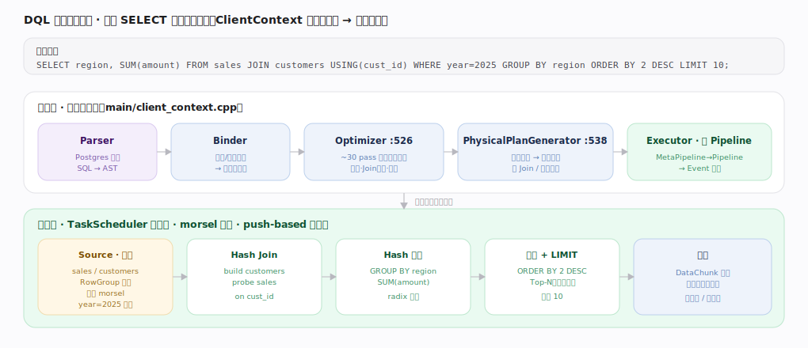
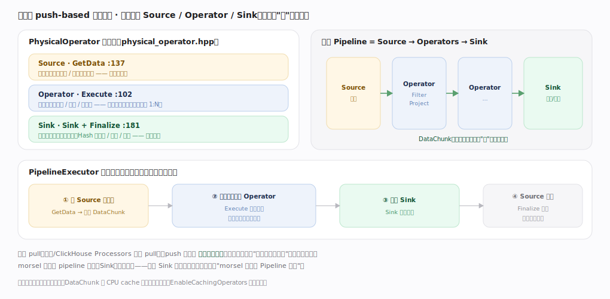
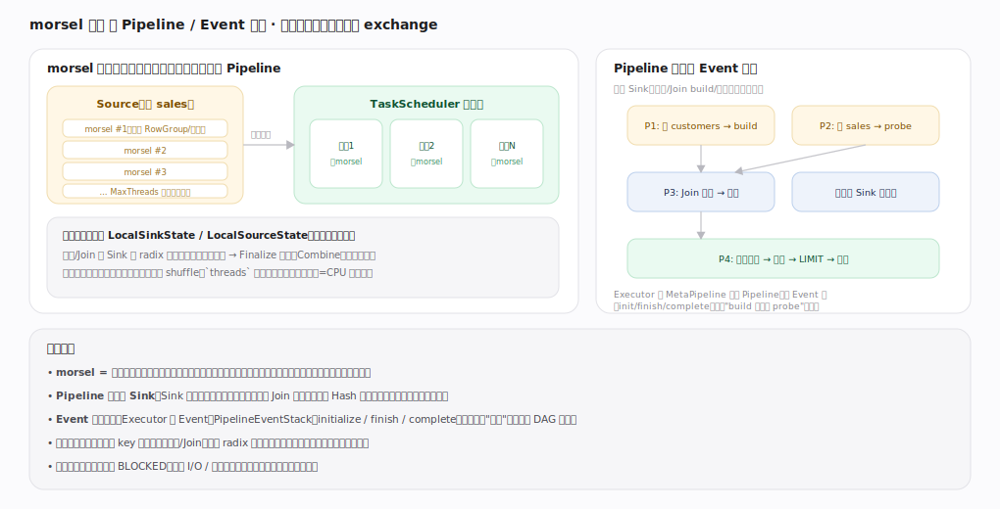
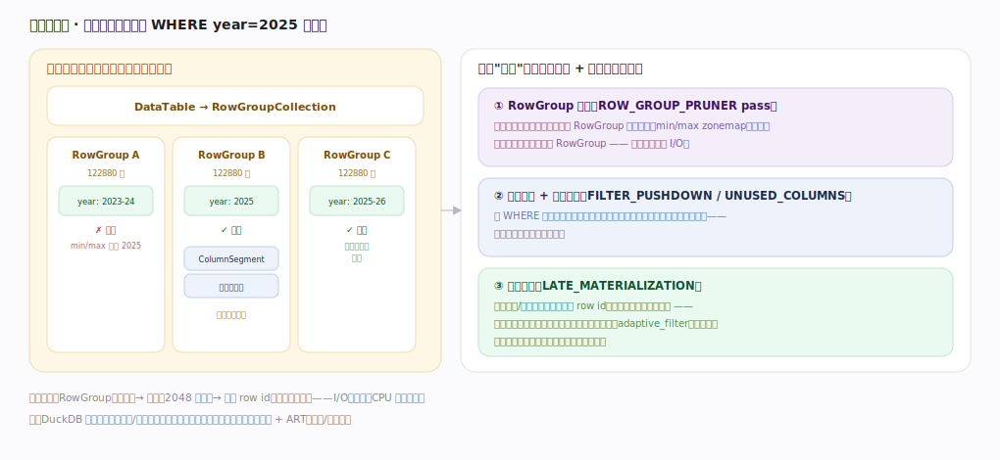
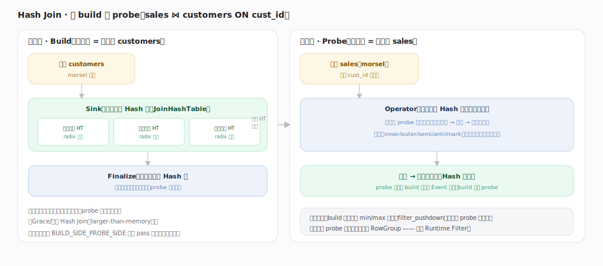
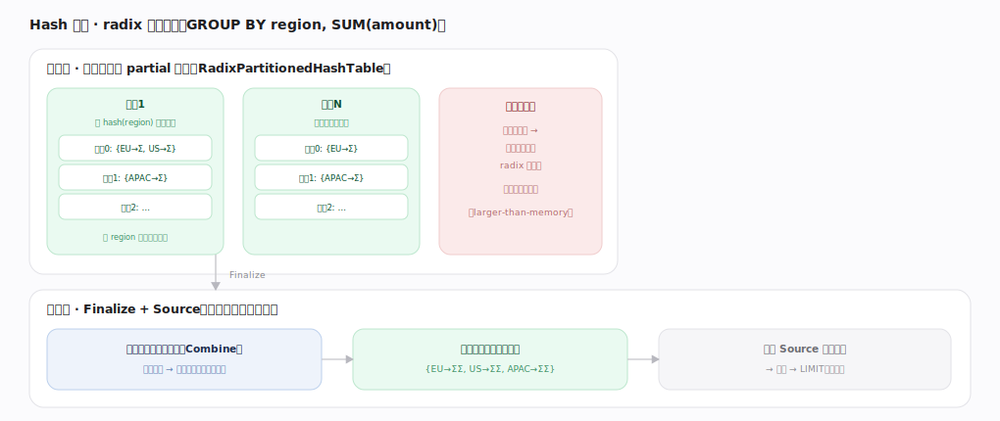
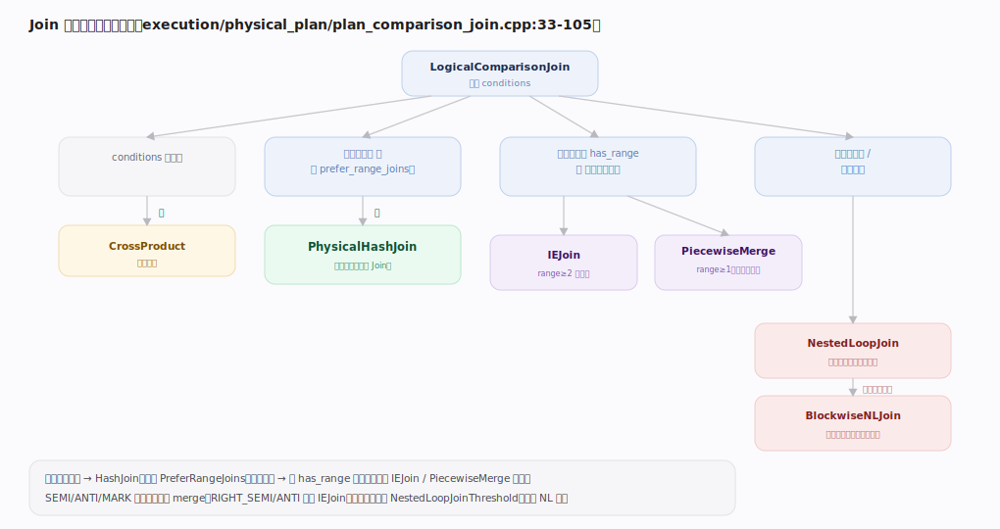

# DuckDB 核心原理 · DQL 数据查询（SELECT）

> **定位**：DQL 是"读数据"的接口主线，骨架 = `ClientContext` 内 `Parser → Binder → Optimizer → PhysicalPlanGenerator → Executor`（`main/client_context.cpp:478-539`），再由 push-based 向量化流水线在 TaskScheduler 线程池上 morsel 并行执行。它是依赖面最广的一条线：强依赖**向量化执行引擎**、**优化技术**、**存储引擎**（读取路径）与**内存/Buffer 管理**，弱依赖**事务与 MVCC**（快照读）。核实基准：主线源码 `duckdb/src`。

## 一、生命周期总览（一图看全链路）

一条 SELECT 分两段：编译期在 `ClientContext` 内单线程顺序把 SQL 变成物理计划，执行期交给线程池以 morsel 并行推进。全篇用同一个贯穿示例——`SELECT region, SUM(amount) FROM sales JOIN customers USING(cust_id) WHERE year=2025 GROUP BY region ORDER BY 2 DESC LIMIT 10;`——看它在每层的形态。

---

## 二、编译四段：从文本到物理算子

| 阶段 | 输入 → 输出 | 干什么 | 锚点 |
|---|---|---|---|
| Parser | SQL 文本 → AST | 语法解析（Postgres 派生的解析器） | `ClientContext::Parse` |
| Binder | AST → 逻辑算子树 | 名称/类型绑定、展开 `*`、解析函数与列引用 | `Planner::CreatePlan`（`:488`） |
| Optimizer | 逻辑 → 逻辑 | ~30 个 pass 重写：下推、Join 定序、裁剪、统计传播 | `Optimizer::Optimize`（`:526`） |
| PhysicalPlanGenerator | 逻辑 → 物理算子 | 为每个逻辑算子选具体物理实现（Join/聚合算法） | `PhysicalPlanGenerator::Plan`（`:538`） |
| Executor | 物理算子 → Pipeline | 拆成 MetaPipeline/Pipeline，用 Event 表达依赖，交线程池 | `Executor` |

编译期是纯 CPU 的单线程工作；只有 Executor 之后才进入并行执行。是否优化受 `EnableOptimizer` 开关控制（`:516`），部分语句（如 `EXPLAIN` 外壳）会跳过。

---

## 三、向量化 push-based 执行模型（DuckDB 招牌）

DuckDB 的物理算子统一实现三面接口（`execution/physical_operator.hpp`）：**Source**（`GetData` `:137`，产出数据）、**Operator**（`Execute` `:102`，逐块变换）、**Sink**（`Sink` `:181` + `Finalize`，吸收全部输入后才产出）。数据被"推"过流水线：一个工作线程向 Source 要一个 `DataChunk`（列向量批，宽度 `STANDARD_VECTOR_SIZE = 2048`，`common/vector_size.hpp:16`），依次穿过中间 Operator，最后推入 Sink。相比 pull（火山模型），push 由"数据到达"驱动下游，天然契合"一次算一整列批"的向量化，中间不物化整表——一个 DataChunk 在 CPU cache 内穿过多个算子。

---

## 四、morsel 并行与 Pipeline / Event 调度

DuckDB 的并行是**单机 morsel 驱动**，不是分布式 shuffle。源算子把数据切成 morsel（细粒度工作单元），TaskScheduler 线程池抢占式领取推进同一条 Pipeline——快线程多干活，天然负载均衡。每个 **Sink 是 Pipeline 断点**（如 Hash Join 要先建完整张表才能 probe），故其上游是一条独立管道；`Executor` 用 **Event**（`PipelineEventStack`：initialize/finish/complete）把管道间先后关系连成 DAG 调度。需要按 key 重分布时（聚合/Join），用 **radix 分区哈希表**在同一进程内完成，取代网络 exchange。`threads` 设置调线程池规模（默认取 CPU 核数）。

---

## 五、扫描与裁剪：读得越少越快

表在存储里是 `DataTable → RowGroupCollection → RowGroup（122880 行）→ ColumnData → ColumnSegment`。三层"少读"手段递进：**RowGroup 裁剪**（`ROW_GROUP_PRUNER` pass，用每段列统计 min/max zonemap 整段跳过）→ **谓词下推 + 投影下推**（`FILTER_PUSHDOWN`/`UNUSED_COLUMNS`，边扫边滤、只解压用到的列）→ **后期物化**（`LATE_MATERIALIZATION`，先用过滤/排序列定位命中 row id，最后才回取宽表其余列）。粒度从段级（RowGroup）到向量级（2048 行）再到行级 row id，越早裁掉，I/O、解压、CPU 依次递减。

---

## 深化 · Hash Join：先 build 后 probe

等值 Join 的主力是 `PhysicalHashJoin`。**Build 端**（优化器依基数估计选较小表，`BUILD_SIDE_PROBE_SIDE` pass）先扫描并在各线程本地构建 radix 分区哈希表，Finalize 合并成全局表；**Probe 端**扫描较大表，对每个向量算哈希、查桶、拼接匹配列，Join 语义（inner/outer/semi/anti/mark）决定未匹配行的处理。两条管道由 Event 约束"build 完才 probe"。build 端还可生成 min/max 动态过滤回推给 probe 扫描（`filter_pushdown`），类似 Runtime Filter；构建端超内存时按分区落盘（larger-than-memory）。

---

## 深化 · Hash 聚合：radix 分区并行

`GROUP BY` 用 `RadixPartitionedHashTable`（`execution/radix_partitioned_hashtable.cpp`）：各线程按 `hash(group_key)` 的 radix 位把分组分散到多个分区、本地累加（同组累进同槽）。**分区独立**是关键——Finalize 时同一分区可跨线程无锁并行合并，再作为 Source 读出。某分区过大时继续按更高 radix 位再分区，或溢写临时文件，支撑超内存聚合。

---

## 深化 · Join 物理算子选择（决策树）

`PlanComparisonJoin`（`execution/physical_plan/plan_comparison_join.cpp:33-105`）按条件形态选算子：无条件→CrossProduct；**有等值且非 `PreferRangeJoins`→HashJoin**（默认主力）；纯范围条件按 `has_range` 与基数阈值在 **IEJoin**（≥2 个范围且够大）与 **PiecewiseMergeJoin** 间选；其余不等值/小基数退回 **NestedLoopJoin**，任意布尔条件最终兜底 **BlockwiseNLJoin**。语义会收紧选择：SEMI/ANTI/MARK 仅单条件可 merge，RIGHT_SEMI/ANTI 禁用 IEJoin。

---

## 拓展 · 优化器 pass 清单（部分，`optimizer/optimizer.cpp`）

| 类别 | 代表 pass | 作用 |
|---|---|---|
| 表达式重写 | `EXPRESSION_REWRITER`、`COMMON_SUBEXPRESSIONS` | 常量折叠、化简、公共子表达式提取 |
| 下推 | `FILTER_PUSHDOWN`、`LIMIT_PUSHDOWN`、`PARTIAL_AGGREGATE_PUSHDOWN` | 把过滤/limit/部分聚合尽量下推近数据源 |
| Join | `JOIN_ORDER`、`BUILD_SIDE_PROBE_SIDE`、`JOIN_ELIMINATION` | 基于基数的 Join 重排、构建端选择、消除无用 Join |
| 裁剪 | `ROW_GROUP_PRUNER`、`UNUSED_COLUMNS`、`COLUMN_LIFETIME` | 段级裁剪、去未引用列、缩短列生命周期 |
| 物化/Top-N | `LATE_MATERIALIZATION`、`TOP_N`、`SAMPLING_PUSHDOWN` | 后期物化、`ORDER BY+LIMIT` 合成 Top-N |
| 统计 | `STATISTICS_PROPAGATION` | 沿计划传播列统计，喂给上面各 pass |

本例中 `ORDER BY 2 DESC LIMIT 10` 会被 `TOP_N` 合成为一个 Top-N 算子——不必全排序，只维护大小为 10 的堆。

---

## 调优要点（关键开关）

- `threads` / `SET threads`：并行线程池规模，默认取 CPU 核数；受限环境可调小。
- `memory_limit`：查询可用内存上限，触发溢写的阈值来源。
- `enable_optimizer`：关掉可对比"优化前后"计划（诊断用），生产勿关。
- `prefer_range_joins`：偏好范围 Join 算子（影响上面的决策树分支）。
- `EXPLAIN` / `EXPLAIN ANALYZE`：看逻辑/物理计划与各算子实际耗时、行数——调优第一手段。

---

## 常见误区与工程要点

- **以为并行度越高越快**：morsel 并行受限于单机核数与内存带宽；线程过多在小查询上反而增加调度开销，`threads` 需按机器实测。
- **指望手建索引加速分析扫描**：DuckDB 的范围/分析查询主要靠内建列统计做 RowGroup 裁剪，ART 索引服务于点查与约束（主键/唯一），不是分析扫描的常规依赖。
- **忽视 build/probe 端**：Join 慢常因构建端选成了大表；用 `EXPLAIN` 确认较小表在 build 端，必要时更新统计（`ANALYZE`）。
- **把 push 当成"没有阻塞"**：Sink（聚合/Join build/排序）是阻塞断点，其上游不跑完下游拿不到数据；理解断点位置才能读懂 Pipeline 划分。

---

## 一句话总纲

**DQL 在 ClientContext 内经 Parser→Binder→Optimizer(~30 pass)→PhysicalPlanGenerator 编译为物理算子树，再由 Executor 拆成以 Sink 为断点的 Pipeline、用 Event 表达依赖，交 TaskScheduler 线程池以 morsel 并行执行；算子实现 Source/Operator/Sink 三面，数据以 2048 宽的 DataChunk 被 push 过向量化流水线，配合 RowGroup 裁剪、谓词/投影下推、后期物化与 radix 分区 Hash Join/聚合，把"少读 + 批量算 + 单机吃满多核"做到极致。**
