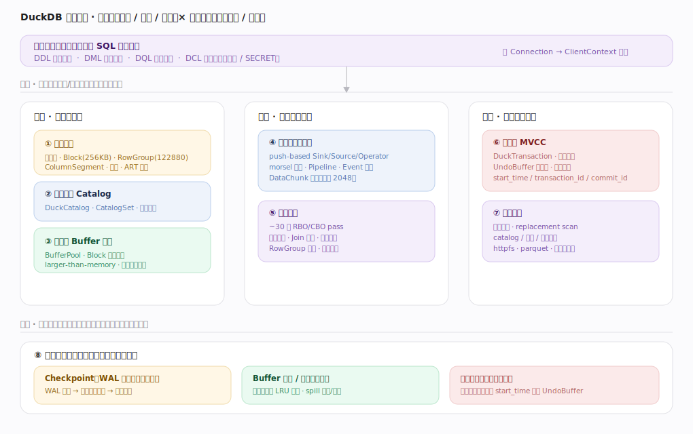
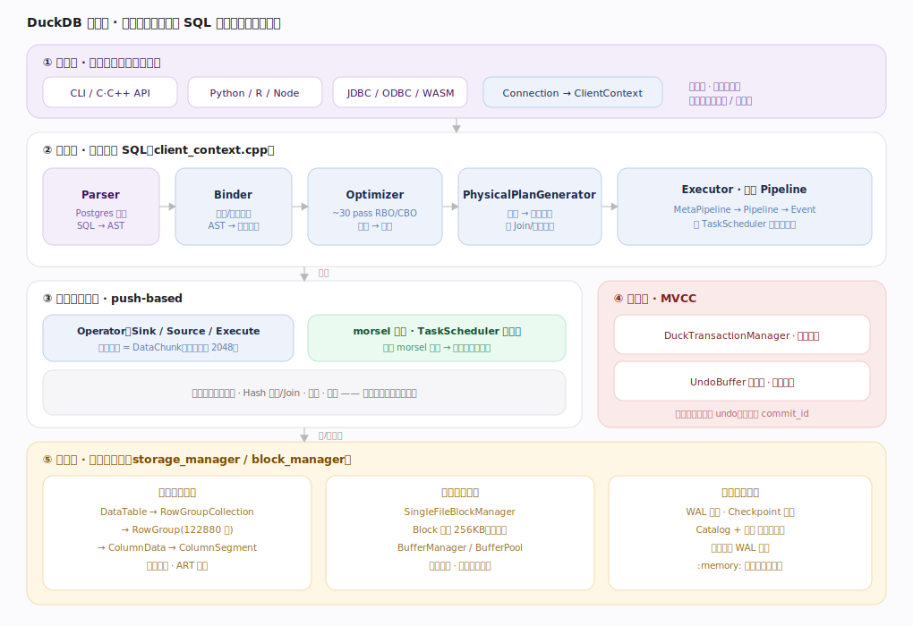
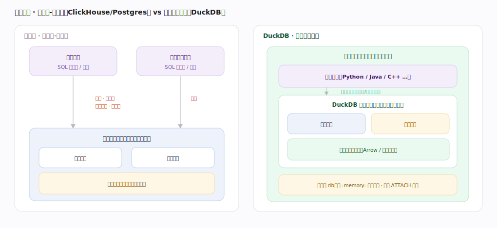
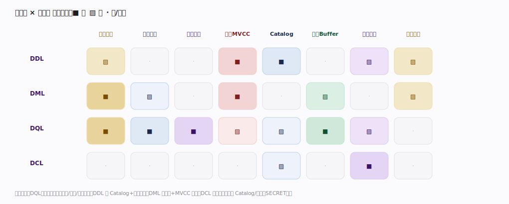

# DuckDB 核心原理 · 全景主线框架

> 统领全部原理文档：DuckDB 的 **4 条接口主线（DDL/DML/DQL/DCL）+ 8 条支撑能力域**，既无遗漏也无越界。核实基准 = 主线源码 `duckdb/src`（`commit b1b9cf5`）。DuckDB 是**进程内嵌入式 SQL 分析引擎**——原型 A（SQL 存算引擎，自管存储 + SQL 为主接口），但**单机、无服务进程、无集群/分布式执行/副本复制**，故原型 A 里"集群与自愈""复制与一致性""多租户资源组"三块塌缩，能力域按 DuckDB 实情重映射为 8 条。

## 〇、与 ClickHouse / Doris 的心智对照（读前必看）

三者都是列存分析引擎，但 DuckDB 的内核假设差异很大，先立几条"反直觉"认知，后文不再重复：

| 维度 | Doris / ClickHouse | DuckDB | 影响 |
|---|---|---|---|
| 部署形态 | 独立服务器进程 + 网络协议 | **作为库链接进宿主进程**，无守护进程、无网络 | 查询在宿主线程内跑，结果零拷贝交回（Arrow/原生向量） |
| 规模维度 | 横向扩展：分片 + 副本 + MPP | **纵向单机**：吃满本机多核与内存，无跨节点 exchange | 并行 = 单机多线程 morsel，不是分布式 shuffle |
| 执行模型 | 向量化 pull（ClickHouse Processors）/ MPP | **向量化 push-based + morsel 驱动并行** | 算子实现 Sink/Source/Execute，数据被"推"过流水线 |
| 事务 | Doris 2PC / ClickHouse 无经典事务 | **有经典 MVCC 事务**：快照隔离 + 乐观并发 + UndoBuffer 版本链 | 单连接内可 BEGIN/COMMIT，DDL 也在事务里 |
| 存储 | 多文件 Part/Rowset + 服务器独占盘 | **单文件数据库**（或 `:memory:` 全内存），Catalog 与数据同一文件 | 一个 `.duckdb` 文件即整库；WAL + checkpoint 管持久化 |
| 大于内存 | 靠集群扩容 | **larger-than-memory**：BufferManager 换页 + 临时文件溢写 | 单机也能跑超内存的聚合/排序/Join |

一句话：**Doris/ClickHouse 以"服务器 + 分布式"为中心，DuckDB 以"进程内单机 + 向量化 push 执行 + 单文件存储"为中心。**

---

## 一、双维模型：能力域 × 执行时机

- **能力域（管什么）**：接口主线（DDL/DML/DQL/DCL）面向用户下发的 SQL；支撑侧按"底座 / 计算 / 保障"分三类共 8 条——存储引擎、元数据与 Catalog、内存与 Buffer 管理（底座）；向量化执行引擎、优化技术（计算）；事务与 MVCC、扩展机制（保障）。
- **执行时机（何时做）**：前台同步（随查询/事务在工作线程内完成）占绝大多数；DuckDB 是单进程，**后台异步动作很少**——checkpoint（WAL 达阈值自动）、Buffer 驱逐与临时文件回收、事务旧版本清理。它们分散在各能力域，是正交的"执行时机"维度，而非又一个独立大能力域（第 8 条"后台任务"因此是横切汇总，不是并列域）。

---

## 二、总架构图：从 SQL 到结果的单机全链路

一条 SQL 在 `ClientContext` 内被顺序编译：`Planner`（Parser + Binder，AST→逻辑算子，`main/client_context.cpp:478`）→ `Optimizer`（~30 个 pass 重写逻辑计划，`:526`）→ `PhysicalPlanGenerator`（逻辑→物理算子、选 Join/聚合算法，`:538`）→ `Executor`（构建 MetaPipeline/Pipeline，交 TaskScheduler 线程池并行执行）。执行层是向量化 push-based 算子（数据单位 DataChunk = 列向量批，宽度 `STANDARD_VECTOR_SIZE = 2048`，`common/vector_size.hpp:16`）；存储层自管单文件（RowGroup 122880 行、Block 256KB），MVCC 事务层横切保障正确可见。

---

## 三、部署形态：进程内嵌入式 vs 客户端-服务器

DuckDB 不是"你连过去的数据库"，而是"你链接进来的库"。它与宿主应用共享地址空间，查询直接在宿主线程栈内执行，结果无需网络序列化即可交回；持久化是一个单文件（或纯内存 `:memory:`），也可 `ATTACH` 多个库文件同时查询。这决定了它的定位：分析嵌入、数据管线中间层、交互式探索，而非高并发在线服务后端。

---

## 四、8 条支撑能力域的分层归位

| 层 | 支撑能力域 | 一句话职责 | 内核锚点 |
|---|---|---|---|
| 底座 | **存储引擎** | 数据组织/落盘/读取：单文件 · RowGroup · ColumnSegment · 压缩 · ART 索引 | `storage/`、`storage/table/row_group.hpp` |
| 底座 | **元数据与 Catalog** | schema/表/函数等对象与依赖：DuckCatalog · CatalogSet · DependencyManager | `catalog/` |
| 底座 | **内存与 Buffer 管理** | 块换入换出、larger-than-memory 溢写：BufferManager · BufferPool | `storage/buffer_manager.cpp`、`storage/buffer/buffer_pool.hpp` |
| 计算 | **向量化执行引擎** | 执行期并行跑：push-based 算子 · morsel 并行 · Pipeline/Event | `execution/`、`parallel/` |
| 计算 | **优化技术** | 规划期减少"要做的事"：~30 pass · 下推 · Join 定序 · 裁剪 | `optimizer/` |
| 保障 | **事务与 MVCC** | 快照隔离、乐观并发、版本链：DuckTransaction · UndoBuffer | `transaction/` |
| 保障 | **扩展机制** | 动态加载能力：extension · replacement scan · catalog/函数/存储扩展 | `main/extension*`、`main/extension/` |
| 横切 | **后台任务** | 承接各域异步部分：checkpoint · WAL 回放 · buffer 驱逐 · 版本清理 | `storage/checkpoint_manager.cpp`、`storage/wal_replay.cpp` |

---

## 五、接触面 × 能力域 依赖矩阵

矩阵读出三条规律：**DQL（读）几乎调用全部计算与存储能力**——执行、优化、存储读取、Buffer 都是强依赖；**DML（写）以存储 + MVCC 为轴**——RowGroup 追加、UndoBuffer 版本、WAL；**DDL 以 Catalog + 事务为轴**——建/改对象走 CatalogSet 且在事务内原子生效；**DCL 最轻**，主要落在 Catalog 与扩展机制（SECRET 存于 Catalog、由扩展提供 provider）。

---

## 六、三条贯穿全库的声明（后续各篇复用同一措辞）

1. **数据单位是 DataChunk（列向量批，宽度 2048）。** 从表扫描、表达式求值、Hash 聚合/Join 到结果返回，引擎处处以列批为粒度批量处理——这是"向量化"的物化形态，也是各主线共享的数据货币。
2. **并行 = 单机多线程 morsel，不是分布式 shuffle。** 源算子把数据切成 morsel，TaskScheduler 线程池抢占式推进 Pipeline；跨算子的"重分区"（如 Hash 聚合/Join）在同一进程内用分区哈希表完成，没有网络 exchange。
3. **持久化 = 单文件 + WAL + checkpoint，可见性 = MVCC 提交点。** 写入先入 WAL 并记 UndoBuffer 版本，事务提交时定 `commit_id` 决定对其他快照的可见性；WAL 达阈值时后台 checkpoint 合并进单文件并截断日志。

---

## 常见误区与工程要点

- **把 DuckDB 当"小型服务器"**：它没有守护进程/网络监听，"多客户端并发"指的是同进程内多个 Connection，跨进程共享一个文件需靠外部协调（默认单写多读或独占）。
- **误以为没有事务**：DuckDB 有完整 MVCC 快照隔离与乐观并发；写写冲突在提交时以冲突失败告终，而非阻塞等待。
- **把并行度当分布式**：调 `threads`/`SET threads` 影响的是单机线程池规模，扩不了单机内存与核数的天花板；超内存靠溢写而非扩容。
- **忽略 checkpoint 时机**：长时间只写不 checkpoint 会让 WAL 膨胀、重启回放变慢；批量导入后可显式 `CHECKPOINT`。

---

## 一句话总纲

**DuckDB 是进程内嵌入式的 SQL 存算引擎：一条 SQL 在 ClientContext 内经 Planner→Optimizer→PhysicalPlanGenerator→Executor 编译成 push-based 向量化流水线，由 TaskScheduler 线程池以 morsel 并行在单机多核上执行；数据以 DataChunk（2048 宽列批）流动，自管为单文件（RowGroup 122880 行 / Block 256KB）并以 WAL+checkpoint 持久化，MVCC 快照隔离 + 乐观并发保证可见性与正确性。**
