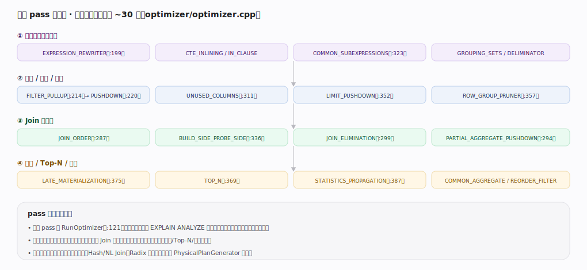
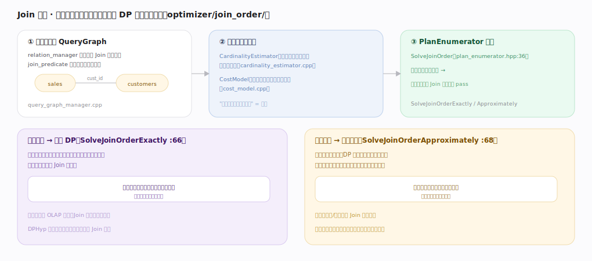
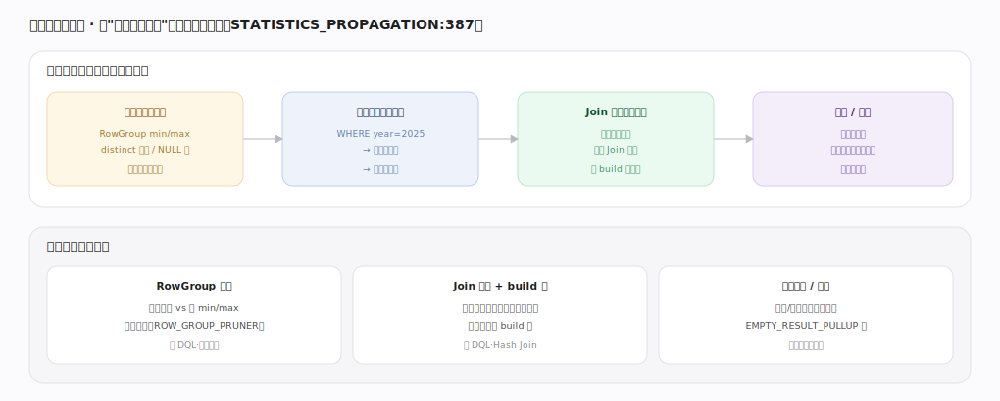

# DuckDB 核心原理 · 支撑能力域 · 优化技术

> **定位**：计算能力域的规划侧。在 `ClientContext` 编译链的中段（`main/client_context.cpp:526`）对逻辑计划顺序跑 ~30 个 pass，用统计与代价把"要处理的数据"在规划期就变少，再把优化后的逻辑计划交给 PhysicalPlanGenerator。为 **DQL** 定"怎么算最省"，与**存储引擎**（列统计）、**执行引擎**（物理算子）协作。核实基准：主线源码 `duckdb/src`。

## 一、优化 pass 流水线

`Optimizer::Optimize` 用 `RunOptimizer`（`optimizer.cpp:121`，逐个计时）顺序跑约 30 个 pass，分四组：**表达式与结构化简**（EXPRESSION_REWRITER `:199`、CTE_INLINING、COMMON_SUBEXPRESSIONS `:323`）→ **下推/上拉/裁剪**（FILTER_PULLUP `:214`→PUSHDOWN `:220`、UNUSED_COLUMNS `:311`、LIMIT_PUSHDOWN `:352`、ROW_GROUP_PRUNER `:357`）→ **Join 与聚合**（JOIN_ORDER `:287`、BUILD_SIDE_PROBE_SIDE `:336`、JOIN_ELIMINATION `:299`、PARTIAL_AGGREGATE_PUSHDOWN `:294`）→ **物化/Top-N/统计**（LATE_MATERIALIZATION `:375`、TOP_N `:369`、STATISTICS_PROPAGATION `:387`）。顺序有讲究：先化简下推缩小规模，再定 Join 顺序（此时基数估计更准），最后物化/Top-N。输出仍是逻辑计划。

---

## 二、Join 定序：基数估计 + DP/贪心

`optimizer/join_order/` 三步走：① `relation_manager`/`join_predicate` 构建 **QueryGraph**（关系为点、连接条件为边）；② `CardinalityEstimator`（用列统计估各中间结果行数）+ `CostModel`（把结果大小折成代价）；③ `PlanEnumerator::SolveJoinOrder`（`plan_enumerator.hpp:36`）按关系数量二选一——**关系较少用精确 DP**（`SolveJoinOrderExactly` `:66`，DPHyp 类超图动态规划，保证搜索空间内最优，但复杂度随关系数指数增长），**关系很多用贪心近似**（`SolveJoinOrderApproximately` `:68`，每步选当前代价最小的连接合并，牺牲最优换可行的规划时间）。目标始终是"让中间结果最小"。

---

## 深化 · 统计传播与下推

`STATISTICS_PROPAGATION`（`:387`）让统计沿逻辑计划自底向上传播：叶子表列统计（RowGroup min/max、distinct/NULL 估计）→ 过滤后收窄范围与选择率 → Join 后传播基数 → 聚合估分组数定哈希表大小。统计反哺三类优化：**RowGroup 裁剪**（常量过滤 vs 段 min/max 整段跳过）、**Join 定序 + build 端选择**（基数选最小中间结果、把较小表放 build 端）、**谓词化简/短路**（恒真恒假消除、`EMPTY_RESULT_PULLUP` 空结果整枝）。这就是"越准的统计 → 越好的计划"的闭环。

---

## 拓展 · 代表性 pass 一览

| 组 | pass | 作用 |
|---|---|---|
| 化简 | EXPRESSION_REWRITER / COMMON_SUBEXPRESSIONS | 常量折叠、化简、公共子表达式提取 |
| 下推 | FILTER_PUSHDOWN / LIMIT_PUSHDOWN / PARTIAL_AGGREGATE_PUSHDOWN | 过滤/limit/部分聚合下推近数据源 |
| 裁剪 | UNUSED_COLUMNS / COLUMN_LIFETIME / ROW_GROUP_PRUNER | 去未引用列、缩列生命周期、段级裁剪 |
| Join | JOIN_ORDER / BUILD_SIDE_PROBE_SIDE / JOIN_ELIMINATION | 重排、构建端选择、消除无用 Join |
| 物化 | LATE_MATERIALIZATION / TOP_N | 后期物化、`ORDER BY+LIMIT`→Top-N |
| 统计 | STATISTICS_PROPAGATION | 传播列统计喂给上面各 pass |

---

## 调优要点（关键开关）

- `EXPLAIN` / `EXPLAIN ANALYZE`：看优化后计划与各算子实际行数/耗时——判断估计是否离谱。
- `ANALYZE` / 保证数据有序：让列统计更准，Join 定序与裁剪才有效。
- `enable_optimizer`：诊断时可临时关，看优化前后差异；生产勿关。
- `prefer_range_joins` 等开关影响特定物理算子选择（见 DQL·Join 选择）。

---

## 常见误区与工程要点

- **认为 DuckDB 优化器很简单**：它有完整 CBO（DP/贪心 Join 定序 + 基数估计 + ~30 pass），不是纯规则。
- **统计过时仍怪优化器**：估计依赖统计；数据大改后统计陈旧会导致坏计划。
- **Join 顺序全靠手写**：多数情况交给 JOIN_ORDER；手写 hint 反而可能拦住更优解。
- **把逻辑优化当物理执行**：优化器只重写逻辑计划，物理算子在 PhysicalPlanGenerator 才定。

---

## 一句话总纲

**优化技术在 ClientContext 编译链中段对逻辑计划顺序跑约 30 个 pass（化简→下推裁剪→Join 与聚合→物化/Top-N/统计），核心是基于列统计的 CBO：STATISTICS_PROPAGATION 自底向上传播基数，JOIN_ORDER 用 CardinalityEstimator+CostModel 在关系少时精确 DP、关系多时贪心近似求最小中间结果的 Join 顺序，并反哺 RowGroup 裁剪、build 端选择与谓词短路——把"要处理的数据"在规划期就压到最小。**
