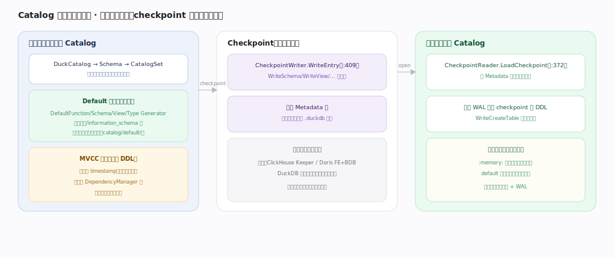
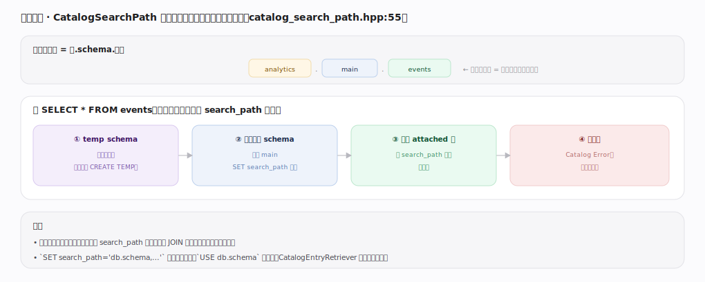

# DuckDB 核心原理 · 支撑能力域 · 元数据与 Catalog

> **定位**：底座能力域。管理 schema/表/视图/函数等对象的定义与依赖，运行时在内存、checkpoint 时序列化进单文件、打开时反序列化 + 回放 WAL 恢复。被 **DDL**（增删改对象）、**DQL/DML**（名称解析与绑定）依赖，落盘由**后台任务**（checkpoint）驱动，版本可见性由**事务与 MVCC** 托管。结构/MVCC/依赖已在 DDL 详述，本篇讲**持久化与名称解析**。核实基准：主线源码 `duckdb/src`。

## 一、内存态与持久化

Catalog 运行时是内存对象树（`DuckCatalog → Schema → CatalogSet`），查改都在内存。内建对象（函数/information_schema 视图/系统 schema/类型）由 **Default 生成器**惰性实例化（`catalog/default/`：`DefaultFunctionGenerator`/`DefaultSchemaGenerator`/`DefaultViewGenerator`…，首次访问才建）。持久化靠 **Checkpoint**：`CheckpointWriter.WriteEntry`（`checkpoint_manager.cpp:409`，`WriteSchema`/`WriteView` 分类型）把条目序列化进 Metadata 块，与数据同在一个 `.duckdb` 文件——**无外部元数据服务**（对比 ClickHouse Keeper / Doris FE+BDB）。打开库时 `CheckpointReader.LoadCheckpoint`（`:372`）反序列化 + 回放 WAL 里未 checkpoint 的 DDL 恢复对象状态；`:memory:` 库不落盘，default 对象每次启动惰性重建。

---

## 二、名称解析（CatalogSearchPath）

完全限定名是 `库.schema.对象`（三段写全即精确定位）。不带前缀时，`CatalogSearchPath`（`catalog_search_path.hpp:55`）按顺序找：① temp schema（临时表优先）→ ② 当前默认 schema（通常 main）→ ③ 其他 attached 库（按 search_path 列表）→ ④ 都没有则 Catalog Error。多库共存时不带前缀的名字靠 search_path 消歧，跨库 JOIN 建议写全三段名。`SET search_path` 调顺序、`USE db.schema` 切默认。

---

## 拓展 · Catalog 组件

| 组件 | 职责 | 锚点 |
|---|---|---|
| DatabaseManager | 管理所有 ATTACH 的库 | `main/database_manager.cpp` |
| DuckCatalog / CatalogSet | 每库目录根 / 按类型的条目集合（MVCC） | `catalog/` |
| DependencyManager | 对象依赖图（CASCADE/RESTRICT） | `catalog/dependency_manager.hpp` |
| CatalogSearchPath | 不带前缀名的解析顺序 | `catalog/catalog_search_path.cpp` |
| Default*Generator | 内建函数/视图/schema 惰性生成 | `catalog/default/` |
| CheckpointWriter/Reader | 目录序列化/反序列化 | `storage/checkpoint_manager.cpp` |

---

## 调优要点（关键开关）

- `SET search_path` / `USE`：多库/多 schema 时明确搜索范围，减少歧义与查找开销。
- 跨库查询写全三段名（`db.schema.tbl`），既清晰又避免 search_path 依赖。
- 密集 DDL 后 `CHECKPOINT`：把目录变更从 WAL 合进 Metadata 块，加快下次打开。
- 临时对象用 `CREATE TEMP`：仅会话可见、不落盘，适合中间结果。

---

## 常见误区与工程要点

- **找外部元数据服务**：DuckDB 目录就在文件里，没有独立元数据存储/协调进程。
- **忽视 search_path 歧义**：多库同名对象时不带前缀可能解析到非预期库。
- **以为 default 对象存在文件里**：内建函数/系统视图是惰性生成的，不占文件、每次启动重建。
- **把 catalog 变更当立即持久**：DDL 先进 WAL，checkpoint 才写进 Metadata 块。

---

## 一句话总纲

**元数据与 Catalog 运行时是内存对象树（DuckCatalog→Schema→CatalogSet，走 MVCC、依赖受 DependencyManager 管），内建对象由 Default 生成器惰性实例化；持久化靠 checkpoint 把条目序列化进单文件的 Metadata 块、打开时反序列化 + 回放 WAL 恢复——无外部元数据服务；不带前缀的名字由 CatalogSearchPath 按 temp→默认 schema→其他 attached 库的顺序解析。**
