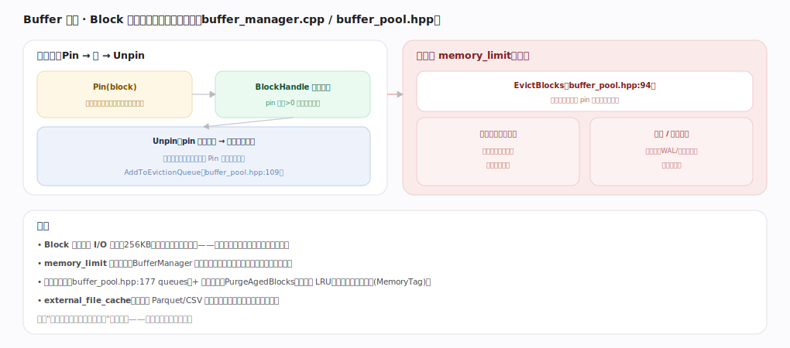
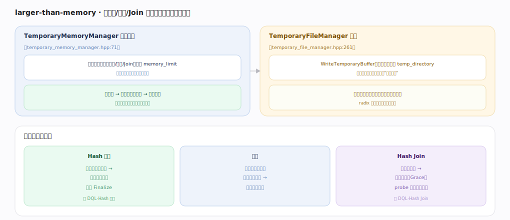

# DuckDB 核心原理 · 支撑能力域 · 内存与 Buffer 管理

> **定位**：底座能力域。用 **BufferManager/BufferPool** 把 256KB 的块按需换入内存、内存压力下驱逐，并在阻塞算子超预算时**溢写临时文件**，从而单机处理远大于内存的数据。被 **DQL/DML**（读写块）依赖，与**存储引擎**（块）、**执行引擎**（聚合/排序/Join 的内存）紧密协作。核实基准：主线源码 `duckdb/src`。

## 一、Buffer 管理：Pin / Unpin / 驱逐

读某块走 Pin → 用 → Unpin：`Pin` 时若块在内存直接用、否则从文件读入，`BlockHandle` 持有内存且 pin 计数>0 时不可驱逐；`Unpin` 后 pin 归零则进驱逐队列（`AddToEvictionQueue`，`buffer_pool.hpp:109`），但块仍缓存着，下次 Pin 命中免读盘。内存超 `memory_limit` 时 `EvictBlocks`（`buffer_pool.hpp:94`）挑未 pin 的块腾空间——干净块直接丢弃（需要再读回）、脏块/临时数据先写盘再释放。多驱逐队列（`buffer_pool.hpp:177`）+ 年龄清理近似 LRU，兼顾不同 MemoryTag。Block（256KB）是缓存与 I/O 的单位，**文件可远大于内存**。

---

## 二、larger-than-memory：外存溢写

阻塞算子内存不够时溢写临时文件。**TemporaryMemoryManager**（`temporary_memory_manager.hpp:71`）协调多个阻塞算子（聚合/排序/Join）竞争 `memory_limit`，按需分配额度、动态调整，避免单算子吃光内存；额度不够则触发 **TemporaryFileManager**（`temporary_file_manager.hpp:261`）`WriteTemporaryBuffer` 把块写到 `temp_directory`（需要再读回，像扩展的交换空间），按分区只落超出内存的部分。三类算子会溢写：**Hash 聚合**（分区哈希表过大 → 部分分区落盘、分批 Finalize）、**排序**（外部归并排序：分段排序落盘 → 归并读回）、**Hash Join**（构建端过大 → Grace 分区落盘、probe 同分区匹配）。

---

## 拓展 · 内存相关组件

| 组件 | 职责 | 锚点 |
|---|---|---|
| StandardBufferManager | Pin/Unpin、分配、协调驱逐 | `storage/standard_buffer_manager.cpp` |
| BufferPool | 内存预算、驱逐队列、EvictBlocks | `storage/buffer/buffer_pool.hpp` |
| TemporaryMemoryManager | 阻塞算子间内存额度协调 | `storage/temporary_memory_manager.hpp:71` |
| TemporaryFileManager | 溢写块到临时目录 | `storage/temporary_file_manager.hpp:261` |
| ExternalFileCache | 外部文件（Parquet/CSV）块缓存 | `storage/external_file_cache/` |

---

## 调优要点（关键开关）

- `memory_limit`：总内存预算，决定何时驱逐/溢写；据机器内存与并发查询设定。
- `temp_directory`：溢写落盘位置，放在快盘（SSD）上，容量要够大查询用。
- `threads`：并行度高会同时占更多内存（每线程本地状态），与 memory_limit 联动权衡。
- 大聚合/排序/Join 前确认 temp_directory 可写且空间充足，否则溢写失败。

---

## 常见误区与工程要点

- **以为超内存就 OOM**：DuckDB 会溢写而非崩溃（前提 temp_directory 可用且够大）。
- **temp_directory 放慢盘/满盘**：溢写密集时成为瓶颈或直接失败。
- **memory_limit 设太大**：多查询并发时可能整体超物理内存；应留余量。
- **把 Block 缓存当结果缓存**：Buffer 缓存的是存储块，不是查询结果（结果缓存是另一回事）。

---

## 一句话总纲

**内存与 Buffer 管理用 BufferManager/BufferPool 把 256KB 块按 Pin/Unpin 换入内存、内存超 memory_limit 时按近似 LRU 驱逐（干净块丢弃、脏块先写盘），并由 TemporaryMemoryManager 协调阻塞算子的内存额度、不足时经 TemporaryFileManager 溢写临时文件——让 Hash 聚合/排序/Hash Join 在单机上处理远大于内存的数据而不 OOM。**
