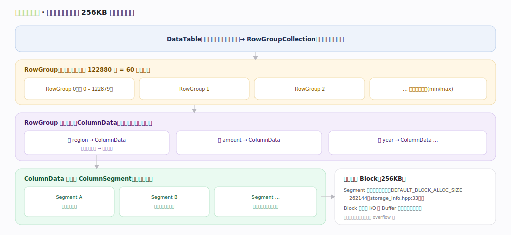
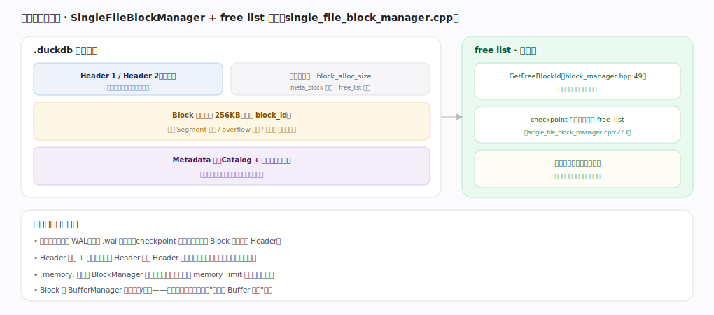
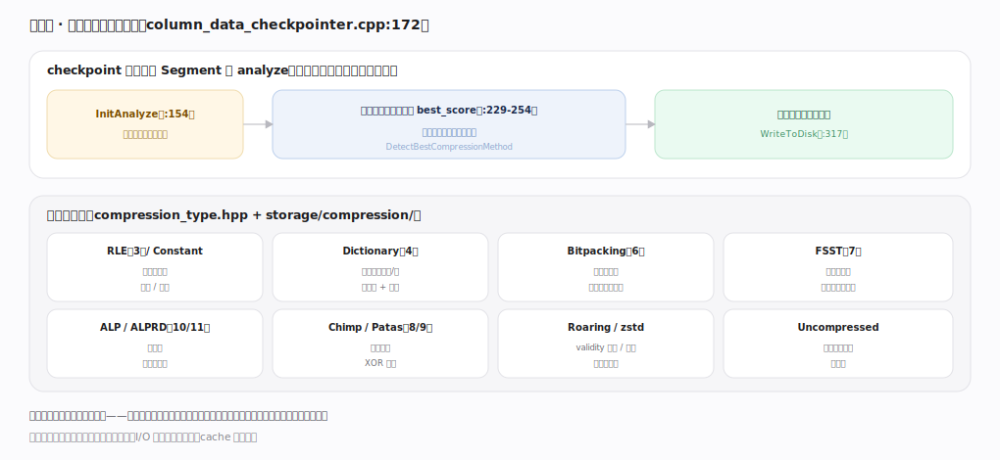
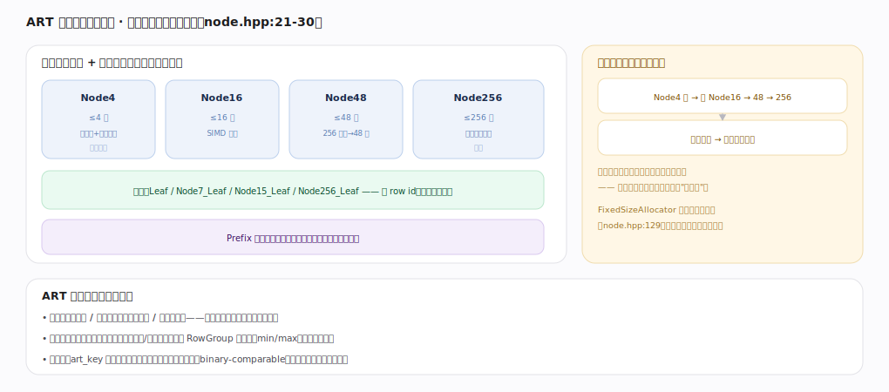

# DuckDB 核心原理 · 支撑能力域 · 存储引擎

> **定位**：底座能力域。自管**单文件列存**：把一张表逐层拆到 256KB 的块，按段自动压缩，并用 ART 索引服务点查/约束。被 **DML**（写路径）、**DQL**（读路径）强依赖，落盘时机由**后台任务**（checkpoint）驱动，块的内存驻留由**内存与 Buffer 管理**托管。核实基准：主线源码 `duckdb/src`。

## 一、数据层次：表如何落到块

自顶向下：`DataTable`（表的运行时句柄）→ `RowGroupCollection` → `RowGroup`（水平切分，每组 122880 行 = 60 个向量，`storage_info.hpp:26`）→ 组内按列拆成 `ColumnData` → `ColumnSegment`（连续值段，压缩与扫描的单位）→ 最终落进 `Block`（256KB，`DEFAULT_BLOCK_ALLOC_SIZE = 262144`，`storage_info.hpp:33`）。RowGroup 带列统计（min/max）供裁剪，Block 是磁盘 I/O 与 Buffer 换页的最小单位，长字符串等大值另走 overflow 块。

---

## 二、单文件与块管理

`SingleFileBlockManager` 管理 `.duckdb` 文件：双写 Header（交替写，崩溃时保一份完整，含块数/`block_alloc_size`/meta_block 指针/`free_list` 指针）、Block 区（列存 Segment/overflow/索引页）、Metadata 块（Catalog 序列化，元数据与数据同文件）。**free list 块复用**：`GetFreeBlockId`（`block_manager.hpp:49`）分配时优先复用空闲块，checkpoint 后释放的旧块进 `free_list`（`single_file_block_manager.cpp:273`），使文件不会因改删无限膨胀。`:memory:` 模式无落盘，全部块驻内存。

---

## 深化 · 列压缩：每段自动选最省编码

压缩是**列级、按段自选**的：checkpoint 时 `ColumnDataCheckpointer` 对每个 Segment 做 analyze（`InitAnalyze` `:154`），逐候选压缩函数试算打分，取估计字节数最小者（`DetectBestCompressionMethod` `:172`，`best_score` `:229-254`），再用选中编码写盘（`WriteToDisk` `:317`）。候选族（`compression_type.hpp` + `storage/compression/`）：RLE/Constant（重复值）、Dictionary（低基数）、Bitpacking（小范围整数）、FSST（通用字符串子串符号表）、ALP/ALPRD（浮点）、Chimp/Patas（时序浮点 XOR 差分）、Roaring（validity 位图）、zstd（兜底块压缩）、Uncompressed（压缩无收益时）。同一列不同段可用不同编码，随局部分布走，解压在扫描时向量化进行——直接决定扫描速度。

---

## 深化 · ART 自适应基数树索引

ART（`execution/index/art/`）用四种内部节点按子节点数自适应：`Node4`（≤4，最省空间）→ `Node16`（SIMD 查）→ `Node48`（256 索引→48 槽）→ `Node256`（直接下标，最快），叶子存 row id，`Prefix` 节点做路径压缩减少树高（`node.hpp:21-30`）。节点满则升级、删到很少则降级，空间与查找速度兼得，故名"自适应"。`art_key` 把各类型规整成可字节比较的二进制键。**定位很重要**：ART 服务**主键/唯一约束的强制**与**点查/小范围查找**，*不是*分析型大扫描的常规加速手段——范围/聚合扫描主要靠 RowGroup 列统计做段级裁剪。

---

## 拓展 · 关键量纲

| 常量 | 值 | 含义 | 锚点 |
|---|---|---|---|
| STANDARD_VECTOR_SIZE | 2048 | 向量/DataChunk 宽度 | `vector_size.hpp:16` |
| DEFAULT_ROW_GROUP_SIZE | 122880 | 每 RowGroup 行数（=60 向量） | `storage_info.hpp:26` |
| DEFAULT_BLOCK_ALLOC_SIZE | 262144（256KB） | 块分配大小 | `storage_info.hpp:33` |

---

## 调优要点（关键开关）

- 大导入后 `CHECKPOINT`：触发压缩分析与块整理，让存储进入紧致状态。
- 建主键/唯一约束才建 ART；无谓的索引增加写入与内存开销，帮不了分析扫描。
- 数据尽量按常用过滤列有序写入，利于 RowGroup min/max 裁剪更有效。
- `block_alloc_size`（建库时）可调块大小，一般用默认 256KB。

---

## 常见误区与工程要点

- **给分析扫描狂建二级索引**：DuckDB 靠列统计裁剪，普通分析查询不吃 ART；索引主要为点查/约束。
- **以为 DELETE 立即缩小文件**：空间靠 free list 在后续写入时复用，checkpoint 才整理，不是即时收缩。
- **忽视有序性**：无序写入让每个 RowGroup 的 min/max 都很宽，裁剪失效、全扫。
- **把 RowGroup 当分区**：它是内部水平切分单位（122880 行），不是用户可见的分区键。

---

## 一句话总纲

**存储引擎把一张表逐层拆解——DataTable → RowGroupCollection → RowGroup（122880 行）→ ColumnData → ColumnSegment → 256KB Block——由 SingleFileBlockManager 以双写 Header + free list 复用管理单文件；每个 Segment 在 checkpoint 时经 analyze 自动选最省的列压缩编码（RLE/Dict/Bitpacking/FSST/ALP/…），并用自适应 ART（Node4/16/48/256）服务主键约束与点查，而分析扫描的加速主要来自 RowGroup 列统计的段级裁剪。**
