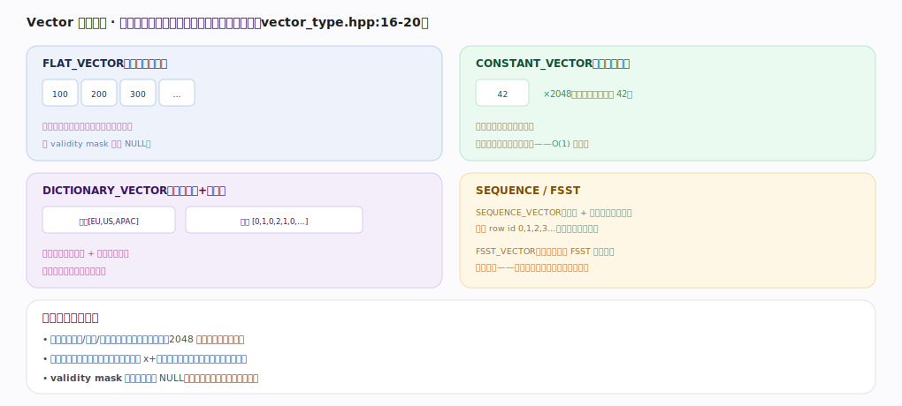
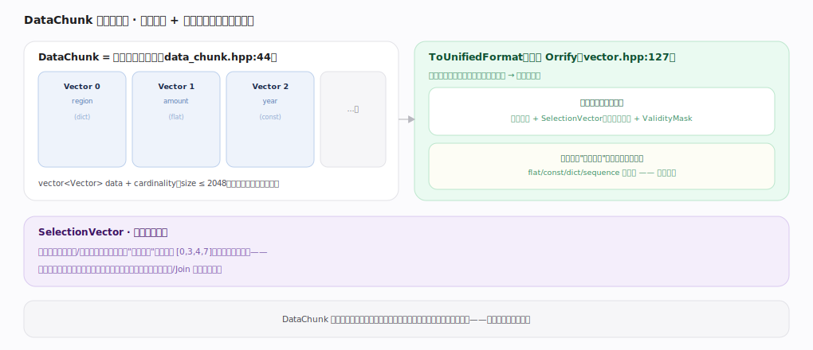
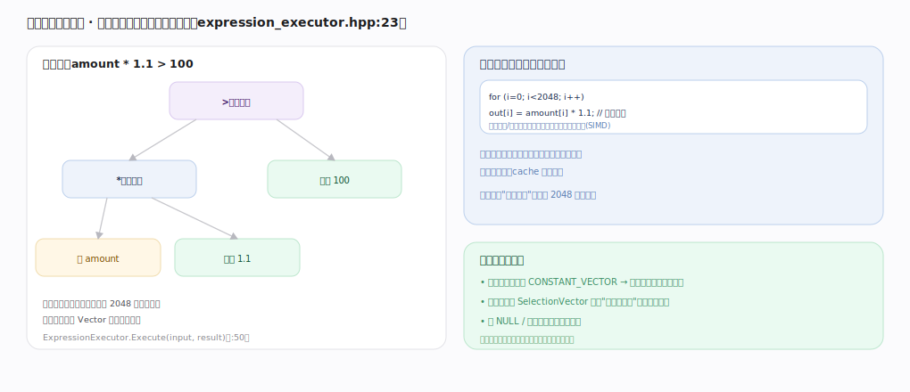

# DuckDB 核心原理 · 支撑能力域 · 向量化执行引擎

> **定位**：计算能力域的执行侧。它提供**列批（DataChunk）+ 多种 Vector 布局 + 向量化表达式求值 + push-based 流水线**这套机器，是 **DQL** 的执行底盘，也被 **DML**（插入/更新的表达式与约束求值）复用。与 DQL 主线分工：DQL 讲"一条 SELECT 怎么走完全链路"，本篇讲"引擎内部的向量化机器怎么造"。核实基准：主线源码 `duckdb/src`。

## 一、Vector 物理表示：一列多种布局

`Vector` 有多种物理布局（`vector_type.hpp:16-20`）：`FLAT_VECTOR`（标准逐值，配 validity mask 标记 NULL）、`CONSTANT_VECTOR`（整列一个常量，O(1) 内存）、`DICTIONARY_VECTOR`（字典 + 下标，低基数省内存）、`SEQUENCE_VECTOR`（起点+步长表达等差序列如 row id）、`FSST_VECTOR`（字符串保持 FSST 压缩态延迟解压）。多布局的意义：**省内存**（常量/序列/字典用极少字节表达 2048 行）+ **省计算**（算子对常量/字典走快速路径）+ validity mask 让判空批量化。

---

## 二、DataChunk 与统一格式

`DataChunk`（`data_chunk.hpp:44`）是全引擎的数据货币：`vector<Vector> data` + cardinality（size ≤ 2048），各列可用不同布局。难题是"算子若为每种布局写一套逻辑会组合爆炸"——解法是 **ToUnifiedFormat**（原名 Orrify，`vector.hpp:127`）把任意布局规整成统一三件套（数据指针 + `SelectionVector` 下标映射 + `ValidityMask`），算子只按统一格式写一次通用逻辑即可通吃。`SelectionVector` 还让**过滤不搬数据**：产生"选中下标"数组覆盖在原向量上，零拷贝、可级联，是向量化过滤/Join 的关键。

---

## 深化 · 表达式向量化求值

`ExpressionExecutor`（`expression_executor.hpp:23`，`Execute(input, result)` `:50`）把表达式树自底向上对**整个列批**求值：每个节点对 2048 行一次性算出一个中间 Vector 交给父节点。相比逐行火山模型（每行一次虚函数、分支预测差、cache 命中低），向量化用紧密内层循环把"每行开销"摊薄到 2048 行一次，编译器还能自动 SIMD。并有**布局感知快路径**：常量子表达式只算一次广播、比较结果用 SelectionVector 表达通过行、全 NULL/全通过走短路。

---

## 拓展 · 执行引擎组件速览

| 组件 | 职责 | 锚点 |
|---|---|---|
| PhysicalOperator | Source/Operator/Sink 三面接口 | `physical_operator.hpp:102/137/181` |
| PipelineExecutor | 单线程推进一条 Pipeline，算子间传 DataChunk | `parallel/pipeline_executor.cpp` |
| Executor | 拆 MetaPipeline → Pipeline → Event 调度 | `parallel/executor.cpp` |
| TaskScheduler | 线程池，morsel 任务分发 | `parallel/task_scheduler.cpp` |
| ExpressionExecutor | 向量化表达式求值 | `execution/expression_executor.cpp` |
| JoinHashTable / RadixPartitionedHashTable | Join/聚合的分区哈希表 | `execution/join_hashtable.cpp` 等 |

---

## 调优要点（关键开关）

- `threads`：线程池规模（默认 CPU 核数），并行度上限。
- `enable_caching_operators`：算子间 DataChunk 复用（减少分配），一般开启。
- 让过滤尽量早：优化器已做，但写查询时避免在最外层才过滤，配合下推。
- 用 `EXPLAIN ANALYZE` 看各算子实际处理行数/耗时，定位向量化未生效或数据倾斜。

---

## 常见误区与工程要点

- **以为"向量化"= SIMD**：向量化是"批量处理一列"的执行范式，SIMD 是其可能的底层加速；核心收益来自摊薄每行开销与 cache 友好。
- **在标量 UDF 里逐行思考**：能用内建向量化函数就别写逐行 UDF，否则退回火山式开销。
- **忽视 Vector 布局**：把常量列当 flat 处理会白占内存/算力；引擎自动选布局，但自定义扩展算子要尊重统一格式。
- **把 DataChunk 当整表**：它一次最多 2048 行，是流式列批而非物化结果集。

---

## 一句话总纲

**向量化执行引擎以 DataChunk（≤2048 行的列批）为数据货币，用 FLAT/CONSTANT/DICTIONARY/SEQUENCE/FSST 多种 Vector 布局省内存省算力，靠 ToUnifiedFormat 把任意布局规整成"数据+SelectionVector+ValidityMask"让算子只写一次通用逻辑，ExpressionExecutor 对整列批自底向上向量化求值，最终由 push-based 的 Source/Operator/Sink 算子在 morsel 并行流水线上跑满单机多核。**
