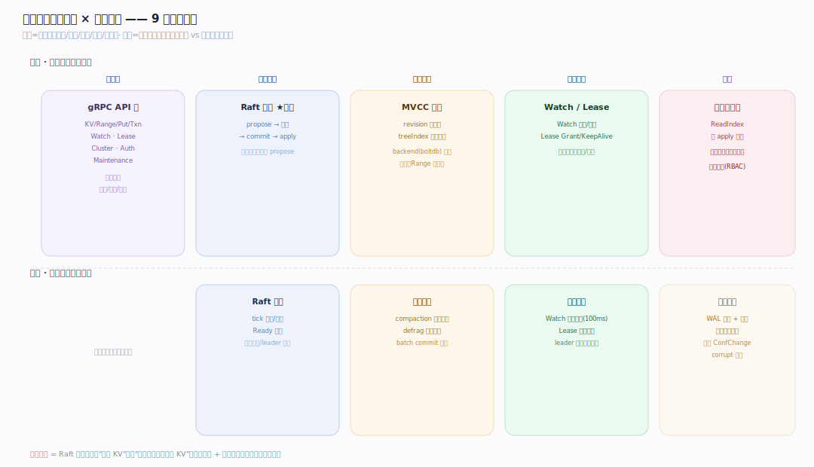
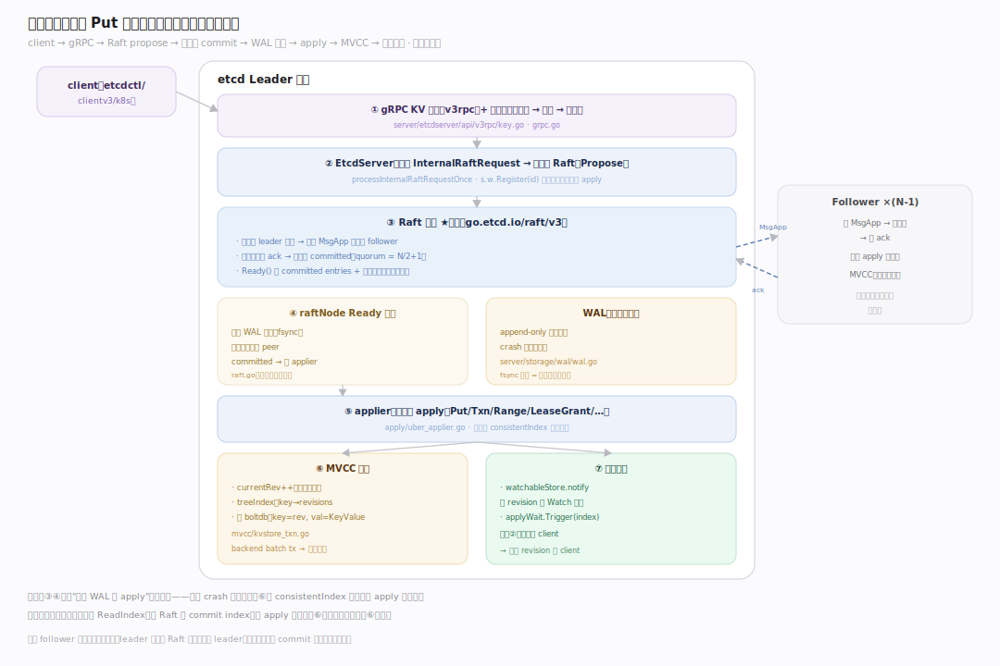
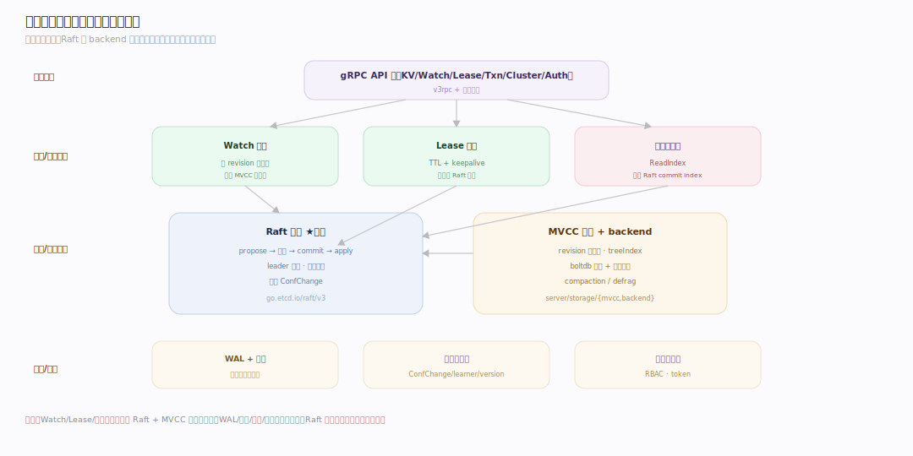
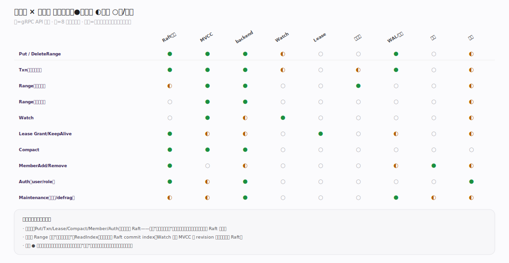
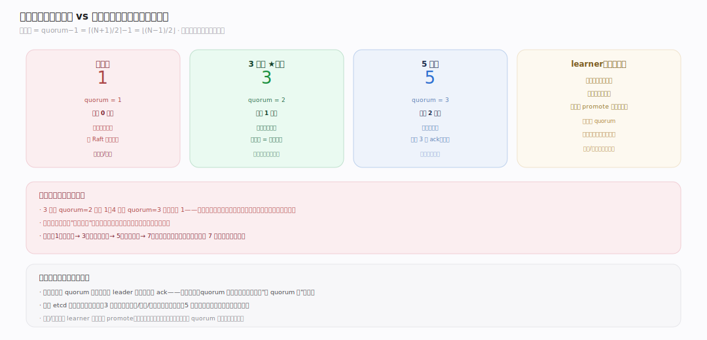
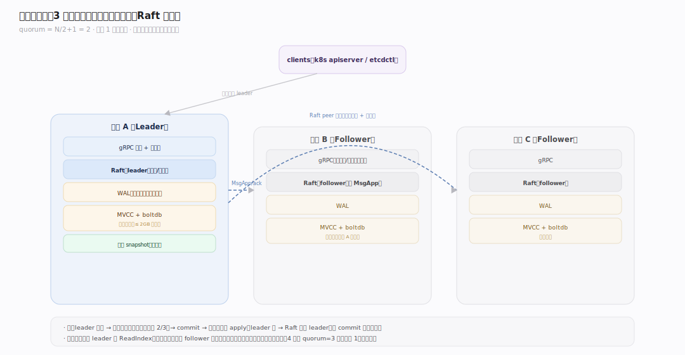

# etcd 原理 · 全景主线框架

> 统领全部原理文档：etcd 属 **新家族 · 分布式协调 / 共识 KV 存储**——接触面是**一族 gRPC API**（KV/Txn/Watch/Lease/Cluster/Auth/Maintenance）而非 SQL 或文件系统；自己管**强一致复制的有序 KV 存储 + 集群成员协调**；容错靠 **Raft 共识 + WAL/快照**而非主从复制或事务日志。灵魂主线是 **Raft 共识**——它把"单机 KV"变成"线性一致的分布式 KV"，漏了它 etcd 文档就是散的。核实基准：`~/workdir/etcd`（main，v3.8.0-alpha.0；Raft 为独立模块 `go.etcd.io/raft/v3 v3.7.0`）。

## 〇、与其它系统家族的心智对照（读前必看）

先立三条"反直觉"认知，后文不再重复：

维度 | 计算引擎（Doris/ClickHouse） | 分布式文件系统（HDFS） | **etcd** | 影响
|---|---|---|---|---|
| 接触面 | SQL 语句族 | FileSystem API | **一族 gRPC API**（KV/Watch/Lease/…） | 不是查询，是"读写小 KV + 监听变化 + 协调" |
| 存储 | 自管列存大表 | 分块大文件多副本 | **全量小数据 + 每节点全副本** | 数据量小（GB 级，默认配额 2GB）、每个成员存全量 |
| 一致性 | 事务/最终一致 | 租约 + 主控 | **Raft 强一致（线性一致读写）** | 每次写都经多数派 commit，这是 etcd 的立身之本 |
| 定位 | 存海量业务数据 | 存海量文件 | **存"关于系统的关键元数据"** | k8s 全部状态、服务发现、分布式锁、选主——要的是正确而非吞吐 |

## 一、双维模型：能力域 × 执行时机

用两个正交维度把 9 条主线归位：

- **能力域**（横轴）：接口面（gRPC API）/ 共识底座（Raft）/ 存储引擎（MVCC + backend）/ 协调能力（Watch/Lease）/ 保障（线性读、WAL/快照、成员、认证）。
- **执行时机**（纵轴）：前台请求路径（Range/Put/Txn/Watch 同步处理）vs 后台守护循环（Raft tick、lease 过期扫描、watch 同步、compaction、快照）。

## 二、总架构图：一次写的完整生命

一个 `Put` 的完整链路（贯穿示例，全库复用）：client → gRPC KV 服务 → `EtcdServer.processInternalRaftRequestOnce` 把请求编码成 `InternalRaftRequest` 提给 **Raft**（`Propose`）→ Raft 把日志条目复制到多数派、`commit` → raftNode 的 Ready 循环把条目**先写 WAL 落盘**、再交 **applier** 应用 → applier 写入 **MVCC store**（bump revision、更新 treeIndex、写 boltdb backend）→ 通过 `wait` 机制唤醒阻塞的 client 返回。读则分两条：**线性一致读**走 ReadIndex（问一次 Raft 拿 commit index，等 apply 追上再读本地），**串行读**直接读本地 MVCC。

## 三、能力域主线（1 接触面 + 8 支撑）

镜像元模式（接触面 × 能力域 × 执行时机），按 etcd 社区实情命名：

**接触面主线（面向用户）**
| 主线 | 覆盖 | 核实锚点 |
|---|---|---|
| **gRPC API 族** | KV(Range/Put/DeleteRange/Txn/Compact)、Watch、Lease、Cluster 成员、Auth、Maintenance、Election/Lock；拦截器链（认证/配额/校验） | `api/etcdserverpb/rpc.proto`、`server/etcdserver/api/v3rpc/*` |

**支撑能力域（面向引擎内部，8 条）**
| 主线 | 一句话职责 | 核实锚点 |
|---|---|---|
| **Raft 共识**（灵魂） | propose→复制→commit→apply；leader 选举、日志复制、成员变更 | `go.etcd.io/raft/v3`、`server/etcdserver/raft.go` |
| **MVCC 存储** | 多版本 KV：revision 单调递增、treeIndex 内存索引、boltdb 落盘 | `server/storage/mvcc/*` |
| **backend（boltdb）** | 底层持久化：bbolt 事务、批量提交、读写缓冲、defrag | `server/storage/backend/*` |
| **Watch 机制** | 按 revision 推送 KV 变更事件；synced/unsynced/victim 分组 | `server/storage/mvcc/watchable_store.go` |
| **Lease 租约** | TTL + keepalive；过期堆、leader 撤销、checkpoint | `server/lease/*` |
| **线性一致读** | ReadIndex：读也要跟上多数派进度 | `server/etcdserver/v3_server.go` |
| **WAL 与快照** | 预写日志 + 定期快照；崩溃恢复回放 | `server/storage/wal/*`、`server/etcdserver/server.go` |
| **成员与集群** | ConfChange 增删成员、learner、cluster version | `server/etcdserver/api/membership/*` |
| **认证与权限** | RBAC：user/role、key range 权限、token | `server/auth/*` |

> 归属判断：一个知识点属于哪条主线，看它的**归属能力域**而非它出现在哪个 API 里。例：`Txn` 的 MVCC 多版本读写属"MVCC 存储"，其"经 Raft 达成一致"属"Raft 共识"，其"跟上 commit 才返回"属"线性一致读"——同一个 Txn 在三条主线各有落点，这正是 etcd 的分层。

## 四、能力域依赖关系

## 五、接触面 × 能力域 依赖矩阵

## 六、三条贯穿声明（不单列主线，但覆盖全局）

- **强一致（线性一致）是最高约束**：etcd 宁可牺牲可用性与吞吐也要正确——任何写都经 Raft 多数派，任何线性读都经 ReadIndex。CAP 里它是 **CP**。
- **每个成员存全量数据**：不分片。集群规模由"一份数据要几个副本抗故障"决定（典型 3/5 节点），不是由数据量决定；数据量受 `--quota-backend-bytes`（默认 2GB）约束。
- **可观测性（诊断）**：Prometheus 指标（`etcd_disk_wal_fsync_duration`、`etcd_server_proposals_*`、`etcd_mvcc_db_total_size_in_bytes`）+ endpoint status/health + alarm（NOSPACE/CORRUPT）。fsync 延迟与 db 大小是运维头号信号。

## 七、运行形态与物理部署（部署维度）

- **单节点**：开发测试，无容错（一挂即不可用）。
- **3 节点集群**：容忍 1 节点故障（quorum=2），生产最小配置。
- **5 节点集群**：容忍 2 节点故障（quorum=3），高可用生产。
- **learner**：非投票成员，先追平数据再 promote 成投票成员——避免新成员拖慢 quorum。
- 偶数节点无收益：4 节点 quorum=3 仍只容忍 1 故障，反增开销——**永远用奇数**。

## 一句话总纲

**etcd 是强一致（CP）的分布式协调 KV 存储：一族 gRPC API（KV/Watch/Lease/Txn/Cluster/Auth）为接触面，灵魂是 Raft 共识——每次写都编码成日志条目、经多数派复制并 commit、先写 WAL 再 apply 到 MVCC 存储（revision 多版本 + treeIndex + boltdb），线性读经 ReadIndex 跟上多数派进度；Watch 按 revision 推变更、Lease 管 TTL、WAL/快照保崩溃恢复、ConfChange 管成员、RBAC 管权限。每个成员存全量小数据、用奇数节点抗故障——它存的是"关于系统的关键真相"，要的是正确而非吞吐。**
