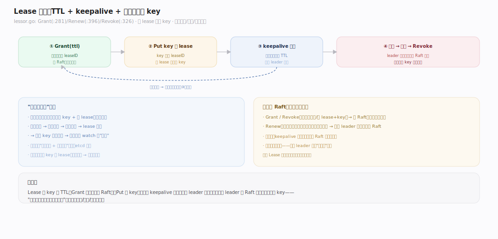
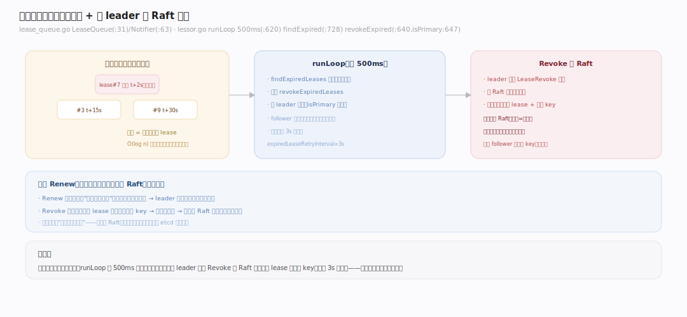
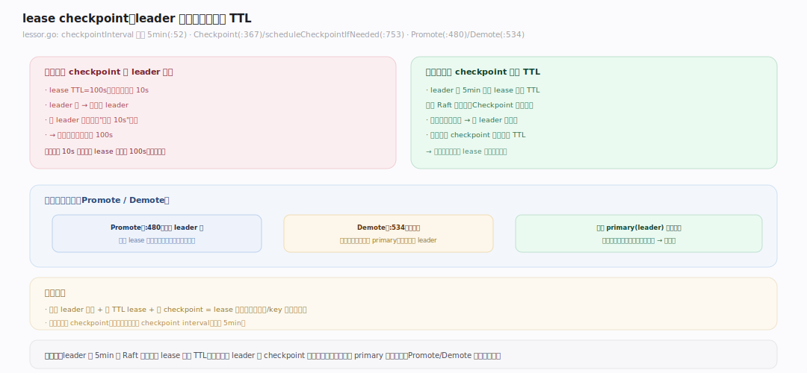
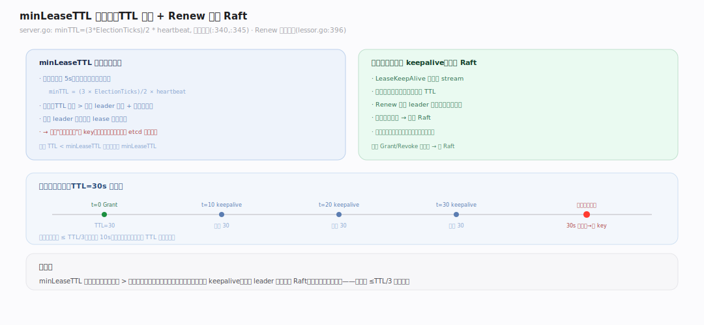

# etcd 原理 · 支撑主线 · Lease 租约

> **定位**：Lease 是协调能力域——给 key 挂"生存期（TTL）"，客户端需持续 keepalive 续租，否则租约过期、其名下所有 key 被自动删除。这是**服务发现、会话、分布式锁**的基础（服务挂了→不再续租→注册 key 自动消失）。骨架 = `Grant 建租约 → 客户端 keepalive 续租 → 过期堆管到期 → leader 经 Raft 撤销`。依赖 [[Raft 共识]]（撤销走日志）、[[MVCC 存储]]（key 关联 lease）。核实基准：`~/workdir/etcd/server/lease`（main，v3.8.0-alpha.0）。

## 一、Lease 全景：TTL + keepalive + 自动删除

Lease 的生命：① 客户端 `LeaseGrant(ttl)` 建一个租约（`lessor.Grant`，`server/lease/lessor.go:281`），拿到 leaseID。② 把 key 绑到这个 lease（`Put` 带 leaseID）——一个 lease 可绑多个 key。③ 客户端周期性 `LeaseKeepAlive` 续租（`Renew`，`:396`），重置 TTL。④ 若客户端**停止续租**（进程挂了/网络断了），TTL 耗尽 → **leader 撤销该 lease**（`Revoke`，`:326`）→ **其名下所有 key 被自动删除**。这就是"活着才续租、死了自动清理"——服务发现里节点注册后持续续租，宕机后注册信息自动消失，无需手动清理。

---

## 二、过期检测：过期堆 + leader 撤销

etcd 用**最小堆**高效找最快到期的租约。`LeaseExpiredNotifier`（`lease_queue.go:63`，底层 `LeaseQueue`，`:31`）按到期时间排序。后台 `runLoop`（`lessor.go:620`，每 **500ms** tick）：`findExpiredLeases`（`:728`）从堆顶取已过期的租约 → `revokeExpiredLeases`（`:640`）。**关键：只有 leader 撤销**（`:647` `if le.isPrimary()`）——撤销不是本地删除，而是**发起一个 LeaseRevoke 请求走 Raft**（`server.go:885` → `v3_server.go` raftRequest），复制到多数派后各节点一致地删除 lease 及其 key。为什么必须经 Raft：撤销 = 删数据，删数据必须在所有副本上一致发生，否则 follower 上的 key 不一致。过期撤销失败会按 `expiredLeaseRetryInterval`（**3s**，`:58`）重试。

---

## 三、lease checkpoint：leader 切换不重置 TTL

问题：一个 100s TTL 的 lease 已续到剩 10s，此时 leader 切换——新 leader 内存里没有"剩余 TTL"信息，会不会把它重置回 100s（导致该删的不删）？**lease checkpoint** 解决：leader 周期性（`checkpointInterval` 默认 **5min**，`lessor.go:52`）把每个 lease 的**剩余 TTL 通过 Raft 持久化**（`Checkpoint`，`:367`；`scheduleCheckpointIfNeeded`，`:753`）。这样 leader 切换后，新 leader 从已复制的 checkpoint 恢复剩余 TTL，而非从头计时。`Promote`（`:480`，成为 leader 时）/`Demote`（`:534`，退位时）管理 lease 的主从角色转换。没有 checkpoint，频繁 leader 切换会让短 TTL lease 反复"续命"、迟迟不过期。

---

## 深化 · minLeaseTTL 与续租机制

**最小 TTL 有下限**。`minLeaseTTL` 不是硬编码 5s，而是**根据选举参数算出**：`minTTL = (3 * ElectionTicks) / 2 * heartbeat`（`server.go:340,345`），取上整秒。为什么：TTL 必须显著大于一次 leader 选举 + 恢复的时间，否则 leader 切换期间 lease 就到期了（误删活着的服务的 key）。**续租路径**：客户端 `LeaseKeepAlive` 是**流式**的——建一条 stream 持续发心跳、收剩余 TTL。续租只需 leader 在内存重置到期时间（`Renew` `:396`），**不走 Raft**（续租不改数据、只推后到期，无需一致性）——这让 keepalive 高频也不拖累共识。对比：Grant/Revoke 改数据走 Raft，Renew 只改内存不走 Raft。

---

## 拓展 · Lease 边界

| 类别 | 项 | 说明 |
|---|---|---|
| 操作 | Grant/Revoke/Renew/TimeToLive/Leases | 建/撤/续/查/列 |
| 绑定 | 一 lease 多 key | lease 撤销 → 名下 key 全删 |
| 过期结构 | 最小堆（LeaseQueue） | O(log n) 找最快到期 |
| 撤销 | 仅 leader，经 Raft | 删数据要多数派一致 |
| 续租 | leader 内存，不经 Raft | 高频也不拖累共识 |
| checkpoint | 默认 5min | leader 切换保剩余 TTL |
| 最小 TTL | ~由选举参数算 | 须 &gt; 选举恢复时间 |
| 重试 | 3s（撤销失败） | expiredLeaseRetryInterval |

---

## 调优要点（关键开关）

- lease TTL 选择：别设太短（< minLeaseTTL 会被抬高；接近选举时间会误删）；服务发现常用 10~60s + 1/3 TTL 频率续租。
- `--experimental-lease-checkpoint-interval` / checkpoint：默认 5min，频繁 leader 切换场景可调小。
- keepalive 频率：建议 ≤ TTL/3，留重试余量；别等到 TTL 快尽才续。
- 大量 lease：每个 lease 占堆 + 内存；海量短生命 lease 考虑复用同一 lease 绑多 key。

---

## 常见误区与工程要点

- **以为续租走 Raft**：不——Renew 只在 leader 内存重置到期时间，不经共识（否则高频 keepalive 压垮 Raft）；只有 Grant/Revoke 改数据才走 Raft。
- **TTL 设太短**：接近或小于 leader 选举时间 → 切换期间误过期、误删活着服务的 key；minLeaseTTL 就是防这个下限。
- **不理解 checkpoint**：无 checkpoint 时 leader 切换会重置剩余 TTL，短 lease 反复续命不过期；生产建议开。
- **lease 撤销 = key 全删**：一个 lease 绑了多个 key，撤销会一起删；绑定时想清楚生命周期。
- **client 不 keepalive 却期望 key 保留**：lease key 靠续租存活，停续即删——要长期 key 别挂 lease。

---

## 一句话总纲

**Lease 给 key 挂 TTL、靠 keepalive 续命：Grant 建租约（走 Raft）、客户端流式 keepalive 续租（只改 leader 内存不走 Raft，高频也不压共识）、停续则 leader 经最小堆检出过期并发起 Revoke（走 Raft 一致删除名下所有 key）；lease checkpoint 周期持久化剩余 TTL 让 leader 切换不重置计时，minLeaseTTL 由选举参数决定确保 TTL 大于选举恢复时间。它是服务发现、会话、分布式锁"活着才存在"语义的基础。**
