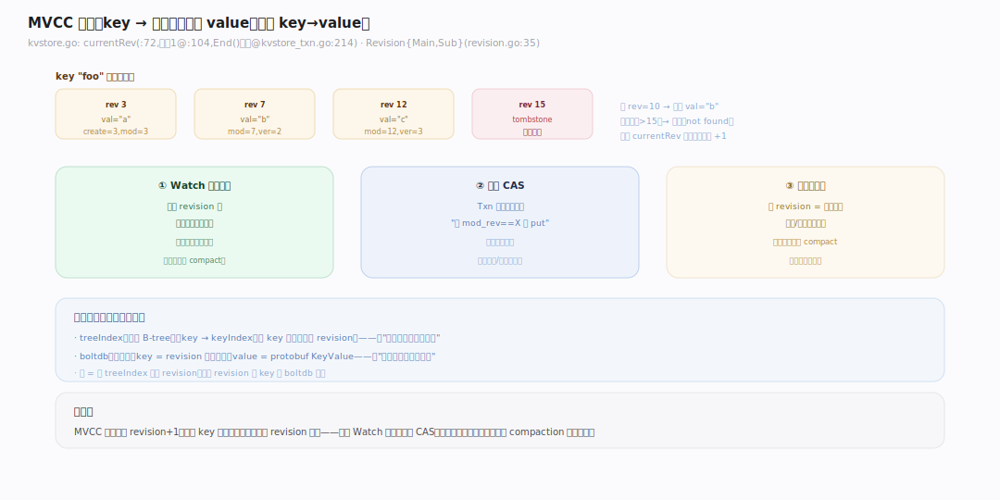
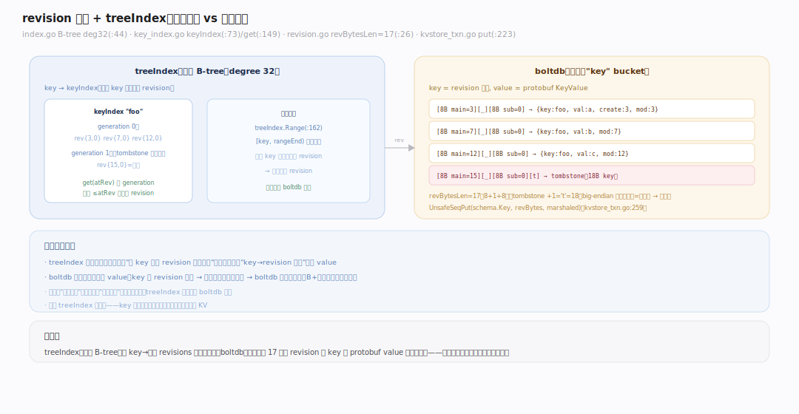
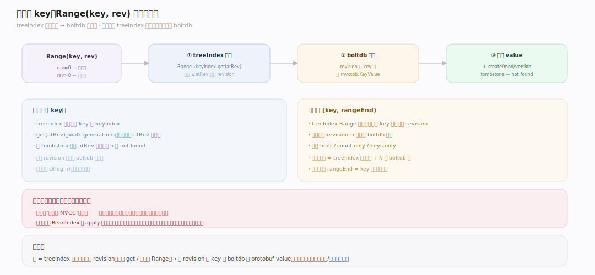
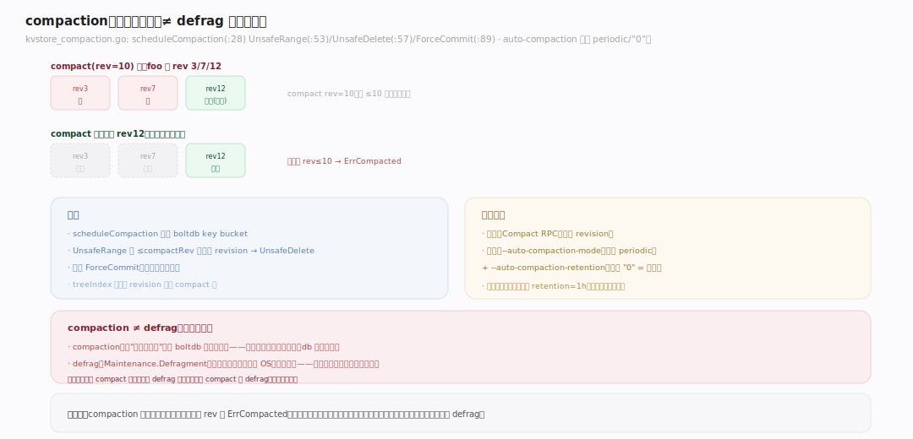
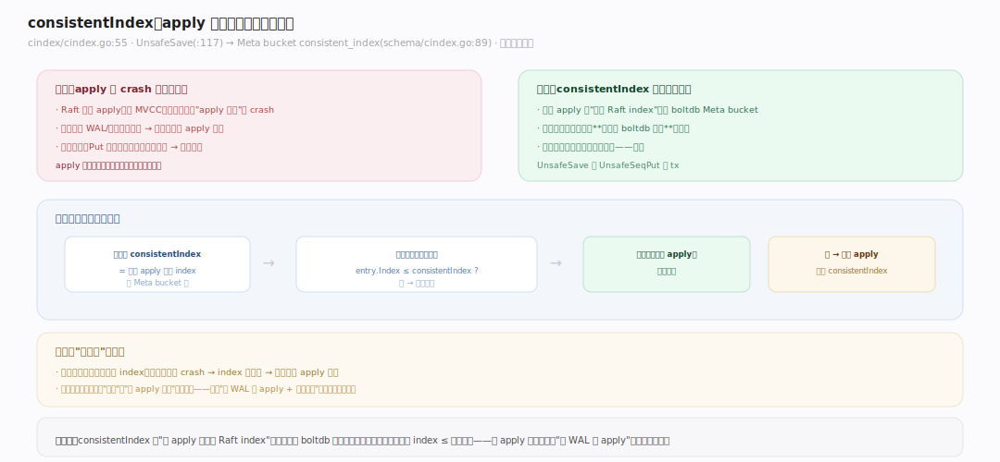

# etcd 原理 · 支撑主线 · MVCC 存储

> **定位**：MVCC 是存储引擎能力域——把"KV 写"变成"多版本、可按 revision 回看"的有序存储。骨架 = `revision 单调递增 → treeIndex 内存索引（key→revisions）→ boltdb 持久化（key=revision, val=protobuf）`。承接 [[Raft 共识]] 的 apply、为 [[Watch 机制]] 提供按 revision 的事件流、被 [[线性一致读]] 在本地读取、底层落在 [[backend（boltdb）]]。核实基准：`~/workdir/etcd/server/storage/mvcc`（main，v3.8.0-alpha.0）。

## 一、MVCC 全景：为什么 etcd 是多版本的

etcd 不是"key→value"，而是"key→**一串带版本的 value**"。每次写让全局 `currentRev` +1（`server/storage/mvcc/kvstore.go:72`，初值 1，`:104`；仅在事务真有改动时于 `End` 递增，`kvstore_txn.go:214`）。一个 key 的每次修改都记为一个 `Revision{Main, Sub}`（`revision.go:35`，Main=事务号、Sub=事务内序号）。**读可以指定 revision** 回看历史版本；不指定则读最新。这带来三个能力：**Watch 从某 revision 起精确重放变更**、**事务基于版本做 CAS**、**compact 可回收旧版本**。代价是数据带版本历史，需定期 compaction 清理。

---

## 二、revision 编码与 treeIndex

两层索引结构：

- **treeIndex（内存）**：一棵 B-tree（degree 32，`index.go:44`），key = 用户 key，value = `keyIndex`（`key_index.go:73`，记该 key 的所有历史 revision，按 generation 分代——每次 tombstone 开新代）。查"key 在某 revision 的版本"走 `treeIndex.Range`（`index.go:162`）→ `keyIndex.get(atRev)`（`key_index.go:149`）。
- **boltdb（磁盘）**：真正的 value 存这里，**key = revision 编码字节，value = protobuf `mvccpb.KeyValue`**。revision 编码：8 字节大端 Main + 分隔符 `_` + 8 字节 Sub = `revBytesLen=17`（`revision.go:26`）；tombstone 多一个 `t` 字节 = 18（`:30`）。

写路径：`storeTxnWrite.put`（`kvstore_txn.go:223`）构造 KeyValue、`proto.Marshal`、`UnsafeSeqPut(schema.Key, revBytes, data)`（`:259`）——**按 revision 顺序追加写**（boltdb 顺序写友好）。读路径：先查 treeIndex 拿到目标 revision，再用它作 boltdb 的 key 取 value。

---

## 三、读一个 key 的完整链路

`Range(key, rev)` 的执行：① 若指定 rev（历史读），用它；否则用 currentRev。② `treeIndex.Range` 在内存 B-tree 里找到 key 在 ≤rev 处的最新 `keyIndex`，`get(atRev)` 返回对应的 revision（walk generations，跳过更晚的版本、遇 tombstone 说明已删）。③ 用该 revision 作 key 去 boltdb 取 `mvccpb.KeyValue`。**两层分工**：treeIndex 管"key 在某时间点是哪个版本"（内存快、支持范围扫描），boltdb 管"那个版本的实际内容"（磁盘持久）。范围查询 `[key, rangeEnd)` 在 treeIndex 上做区间遍历，逐个解析出 revision 再批量读 boltdb。

---

## 四、compaction：回收旧版本

多版本会无限累积，必须 compact。`scheduleCompaction`（`kvstore_compaction.go:28`）删除某 compactRev 之前、且不再需要的历史版本：对 boltdb 的 key bucket 做 `UnsafeRange` 找出待删 revision（`:53`）→ `UnsafeDelete`（`:57`），每批 `ForceCommit`（`:89`）。同时 treeIndex 里对应的旧 revision 也被 compact 掉。**保留规则**：每个 key 的最新版本一定保留；被 compact 掉的历史版本无法再回看（读旧 revision 会报 `ErrCompacted`）。触发方式：手动 `Compact` RPC，或自动——`--auto-compaction-mode`（默认 `periodic`，`config.go:730`）+ `--auto-compaction-retention`（默认 `"0"` = 关闭，`:729`）。

> **compaction ≠ defrag**：compaction 删的是"逻辑旧版本"，但 boltdb 文件不会自动缩小（空间标记为可复用）；要真正把磁盘还给 OS 需 `Defragment`（见 [[gRPC API 族]] Maintenance）——两者常一起做。

---

## 深化 · consistentIndex：apply 幂等

问题：Raft apply 后 crash，重启时会不会把同一条目 apply 两次？etcd 用 `consistentIndex`（`cindex/cindex.go:55`）解决——它记录"已 apply 到哪个 Raft index"，**和数据写在同一个 boltdb 事务里**（`UnsafeSave` `:117` → 写入 Meta bucket 的 `consistent_index` key，`schema/cindex.go:89`）。因此"数据变更"和"apply 进度"要么一起提交、要么一起回滚——原子。重启回放时，apply 前先比对：Raft index ≤ 已存 consistentIndex 的条目**跳过**，不重复应用。这让 apply 天然幂等，是"先 WAL 后 apply + 快照回放"能正确工作的关键配套。

---

## 拓展 · MVCC 边界

| 类别 | 项 | 说明 |
|---|---|---|
| 版本单位 | Revision{Main, Sub} | Main=事务号、Sub=事务内序号 |
| 内存索引 | treeIndex（B-tree deg 32） | key→keyIndex→revisions |
| 磁盘编码 | key=17B revision, val=KeyValue | 顺序追加写 |
| 版本字段 | create/mod/version | KeyValue 里记创建/修改 rev + 修改次数 |
| tombstone | 删除标记（+1 字节 `t`） | 开新 generation |
| 回收 | compaction | 删旧版本，读旧 rev → ErrCompacted |
| 幂等 | consistentIndex | 与数据同事务，防重复 apply |

---

## 调优要点（关键开关）

- `--auto-compaction-mode` / `--auto-compaction-retention`：自动压缩（默认 periodic / "0"=关）——生产务必开，否则版本无限涨、db 撑爆。
- `--quota-backend-bytes`：db 大小配额（默认 2GB，最大 8GB）——超限触发 NOSPACE alarm、集群转只读。
- `Compact` + `Defragment`：压缩逻辑版本 + 回收物理空间，运维定期成对做。
- `--snapshot-count`：影响回放，见 [[Raft 共识]]。

---

## 常见误区与工程要点

- **不开 auto-compaction**：多版本无限累积 → db 膨胀 → 撞 quota → NOSPACE → 集群只读；生产必开。
- **compact 了就以为空间回收了**：compact 只删逻辑版本，boltdb 文件不缩小；要 defrag 才还磁盘。defrag 会短暂阻塞、需逐节点滚动做。
- **读历史 revision 报 ErrCompacted**：那个版本已被 compact；只能读未被压缩的区间。
- **以为 etcd 适合存大量数据**：多版本 + 全副本 + 2GB 配额——etcd 存"关键元数据"，不是通用数据库。
- **treeIndex 全内存**：key 数量极大时内存吃紧；etcd 的 key 规模由元数据量决定，不该塞海量业务 KV。

---

## 一句话总纲

**MVCC 把 KV 变成多版本有序存储：每次写让全局 revision 单调 +1，treeIndex（内存 B-tree）记 key→历史 revisions、boltdb（磁盘）以 revision 为 key 存 protobuf value——读先查 treeIndex 定位版本再取 boltdb 内容，支持按 revision 回看历史；compaction 回收旧版本（不缩文件，需 defrag），consistentIndex 与数据同事务保证 apply 幂等。多版本是 Watch 精确重放、事务 CAS、快照一致的共同基础，代价是必须定期压缩。**
