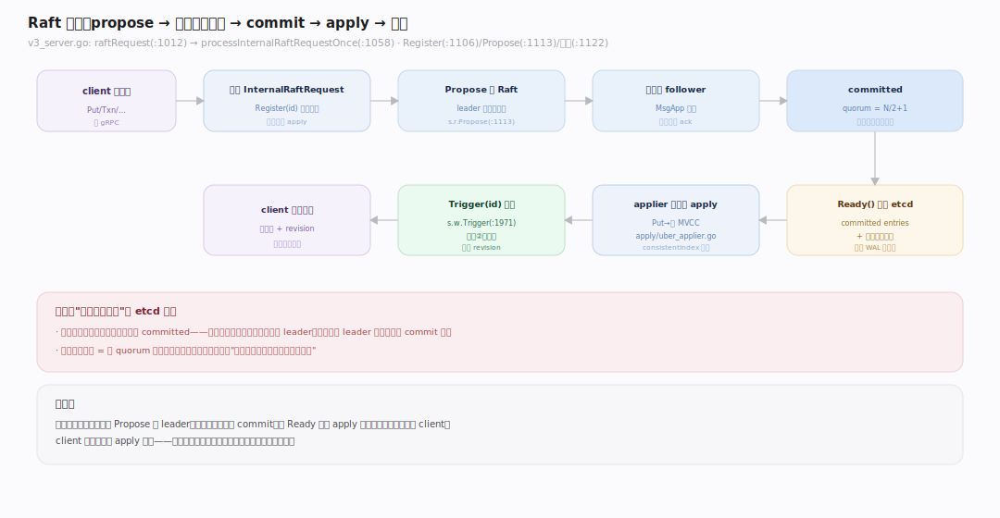
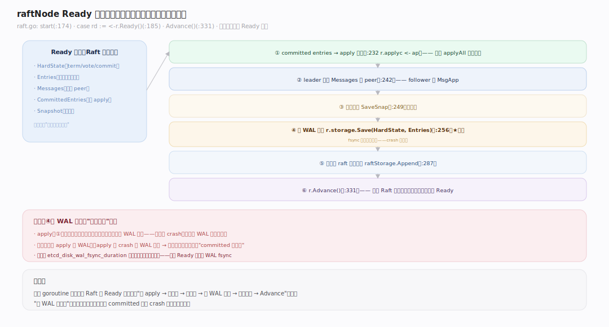
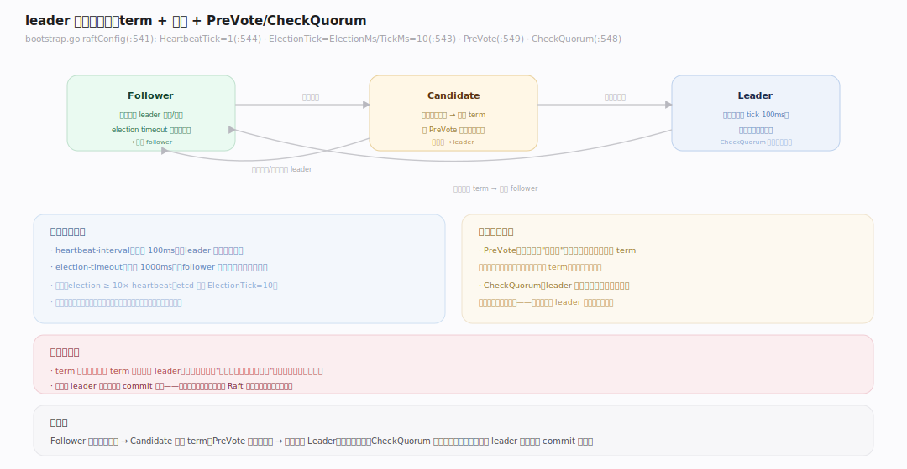
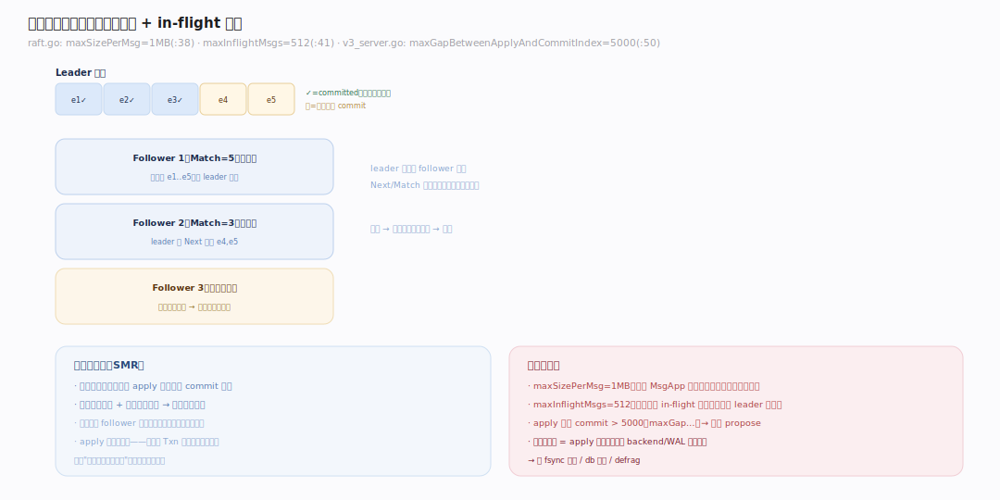
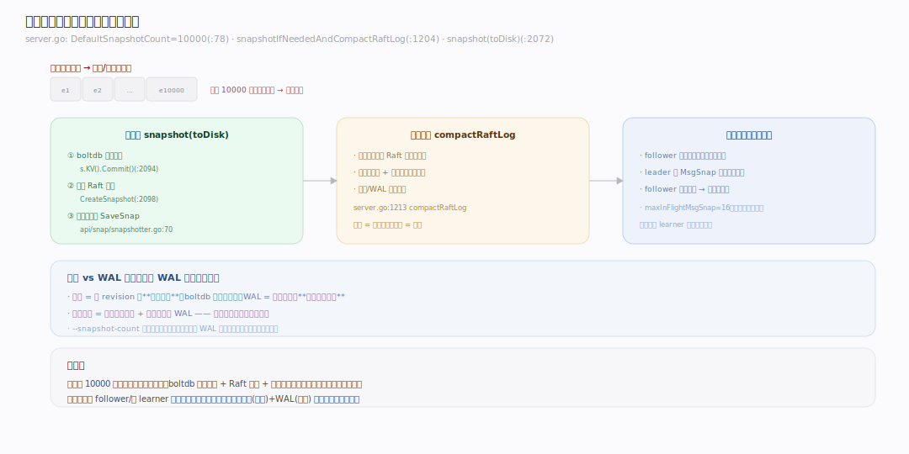

# etcd 原理 · 支撑主线 · Raft 共识（灵魂）

> **定位**：Raft 是共识底座、etcd 的**灵魂主线**——把"单机 KV"变成"线性一致的分布式 KV"。骨架 = `propose → 日志复制到多数派 → commit → apply`。它是所有写路径的必经之地（见依赖矩阵：所有写都强依赖它），被 [[MVCC 存储]] 承接 apply、被 [[线性一致读]] 用作 ReadIndex 来源、被 [[WAL 与快照]] 持久化、被 [[成员与集群]] 用 ConfChange 变更。Raft 本身是独立库 `go.etcd.io/raft/v3 v3.7.0`；etcd 侧集成在 `server/etcdserver/raft.go` + `v3_server.go`。核实基准：`~/workdir/etcd`（main，v3.8.0-alpha.0）。

## 一、Raft 全景：从 propose 到 apply

一次写的共识链路：`EtcdServer` 把请求编码成 `InternalRaftRequest`，调 `raftRequest`（`server/etcdserver/v3_server.go:1012`）→ `processInternalRaftRequestOnce`（`:1058`）先 `s.w.Register(id)` 注册一个等待通道（`:1106`）、再 `s.r.Propose(cctx, data)`（`:1113`）把数据提给 Raft，然后**阻塞在通道上**（`:1122`）直到该条目被 apply。Raft 库内部：leader 把条目追加到自己的日志、通过 `MsgApp` 复制给 follower，收到**多数派 ack**（quorum = N/2+1）后该条目 `committed`。committed 条目经 `Ready()` 吐回 etcd，apply 后 `s.w.Trigger(id, result)`（`server.go:1971`）唤醒阻塞的 client。**写必过多数派**——这是 etcd 强一致的根。

---

## 二、raftNode Ready 循环：先持久化后应用

etcd 用一个专门的 goroutine（`raftNode.start`，`server/etcdserver/raft.go:174`）驱动 Raft 状态机。核心是 `case rd := <-r.Ready()`（`:185`）——Raft 库每轮把"待办事项"打包成 `Ready`：待持久化的 `HardState`/`Entries`、待发送的 `Messages`、已提交的 `CommittedEntries`、可能的 `Snapshot`。etcd 按严格顺序处理：**① 先把 committed entries 交给 apply 通道**（`:232` `r.applyc <- ap`）→ ② leader 发送消息给 peer（`:242`）→ ③ 保存快照（`:249`）→ ④ **写 WAL 落盘**（`:256` `r.storage.Save`）→ ⑤ 追加到 raft 内存存储（`:287`）→ ⑥ `r.Advance()`（`:331`）告诉 Raft 这轮处理完。**关键不变式：条目必须先落 WAL 再真正生效**——这样 crash 后能从 WAL 回放，不丢已确认的写。

---

## 三、leader 选举与任期

Raft 用**任期（term）+ 心跳**维持单一 leader。etcd 配置（`bootstrap.go:541` `raftConfig`）：`HeartbeatTick: 1`（`:544`，硬编码），`ElectionTick: cfg.ElectionTicks`（`:543`，= `ElectionMs/TickMs` = 1000/100 = **10**）。开启 `CheckQuorum`（`:548`）与 `PreVote`（`:549`）：

- **心跳**：leader 每个 tick（默认 `--heartbeat-interval` 100ms，`embed/config.go:533`）发心跳维持权威。
- **选举超时**：follower 超过 election timeout（默认 `--election-timeout` 1000ms，`:534`）没收到心跳 → 发起选举。
- **PreVote**：候选人先试探能否赢得多数，避免被网络分区隔离的节点反复自增 term 扰乱集群。
- **CheckQuorum**：leader 若联系不上多数派则主动退位，防脑裂下的旧 leader 继续服务。

term 单调递增，每 term 至多一个 leader；新 leader 必含所有已 commit 的日志（选举限制）。

---

## 四、日志复制与批处理

leader 把客户端请求作为日志条目复制给 follower。etcd 的复制参数（`raft.go`）：`maxSizePerMsg = 1MB`（`:38`，单条 MsgApp 最大字节），`maxInflightMsgs = 512`（`:41`，未确认的 in-flight 消息上限）。每个 follower 有 `Next`/`Match` 索引，leader 据此决定发哪些条目；落后太多的 follower 会收到快照而非逐条日志。**背压**：当 apply 落后 commit 超过 `maxGapBetweenApplyAndCommitIndex = 5000`（`v3_server.go:50`）时，新的 propose 被拒绝（`:1062`），防止内存中未应用条目堆积。已 commit 的条目在所有节点上以相同顺序 apply——这就是**状态机复制**：相同的初始状态 + 相同的操作序列 → 相同的最终状态。

---

## 深化 · 快照与日志压缩

日志不能无限增长。etcd 每积累 `--snapshot-count`（默认 **10000**，`server.go:78` `DefaultSnapshotCount`）条已应用条目就做一次快照，然后**压缩掉快照点之前的 Raft 日志**。当前实现拆成两种（`server.go:1204` `snapshotIfNeededAndCompactRaftLog`）：`shouldSnapshotToDisk`（`:1215`，gap > SnapshotCount，落盘快照）与 `shouldSnapshotToMemory`（`:1219`）。落盘快照 `snapshot(ep, toDisk=true)`（`:2072`）= boltdb 一致提交（`:2094` `s.KV().Commit()`）+ 创建 Raft 快照（`:2098`）+ 存快照文件（`:2114` `SaveSnap`，`api/snap/snapshotter.go:70`）。落后太多的 follower（日志已被压缩）直接收快照追平，而非重放日志。快照 + WAL 一起构成崩溃恢复的基础（见 [[WAL 与快照]]）。

---

## 拓展 · Raft 边界

| 类别 | 项 | 说明 |
|---|---|---|
| 消息类型 | MsgApp/MsgVote/MsgHeartbeat/MsgSnap | 复制/选举/心跳/快照 |
| 优化 | PreVote / CheckQuorum | 防分区扰动 / 防脑裂 |
| 成员变更 | ConfChange（单步） | 增删成员经日志，见成员主线 |
| 背压 | maxGapBetweenApplyAndCommitIndex=5000 | apply 落后过多则拒新 propose |
| in-flight | maxInflightMsgs=512, maxSizePerMsg=1MB | 复制流控 |
| Learner | 非投票日志接收者 | 追平后 promote，见成员主线 |

---

## 调优要点（关键开关）

- `--heartbeat-interval`：心跳间隔（默认 100ms）——跨地域高延迟网络需调大。
- `--election-timeout`：选举超时（默认 1000ms）——建议 ≥ 10× heartbeat；太小易误触发选举。
- `--snapshot-count`：多少条已应用条目触发快照（默认 10000）——调大减少快照频率但增加重启回放量。
- `--max-request-bytes`：单请求上限（默认 1.5MB）——大 value 会撑大日志与 WAL。
- `--experimental-*` / `--pre-vote`：PreVote 默认开，一般不动。

---

## 常见误区与工程要点

- **以为 etcd 靠主从异步复制**：不是——每次写都同步等多数派 commit，是强一致（CP），牺牲可用性换正确。
- **heartbeat/election 设太小**：网络抖动就误判 leader 失联 → 频繁选举、集群震荡；跨机房务必调大。
- **不理解"先 WAL 后 apply"**：颠倒会导致 crash 后丢已确认写；这是 Ready 循环里不可动的顺序。
- **偶数节点**：4 节点 quorum=3 仍只容忍 1 故障，白增复制开销——永远奇数（见全景运行形态）。
- **apply 落后报错**：`maxGapBetweenApplyAndCommitIndex` 触发说明 apply（多为磁盘慢）跟不上 commit——查 backend/WAL fsync 延迟。

---

## 一句话总纲

**Raft 是 etcd 的灵魂：客户端写被编码成日志条目 propose 给 leader，leader 复制到多数派并 commit（quorum=N/2+1），raftNode 的 Ready 循环按"先写 WAL 落盘、再 apply 到状态机"的铁序处理，apply 完唤醒阻塞的 client；靠 term+心跳+PreVote/CheckQuorum 维持单一 leader，靠快照压缩日志、让落后节点追平。写必过多数派——这就是 etcd 强一致（CP）的根，也是所有写路径的必经底座。**
