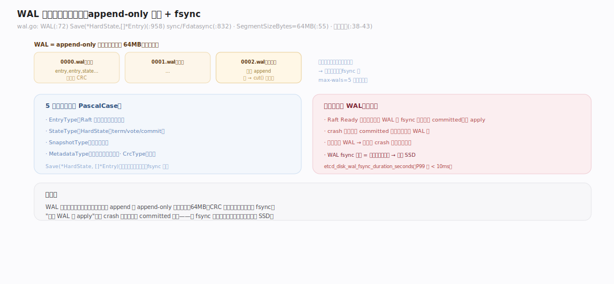
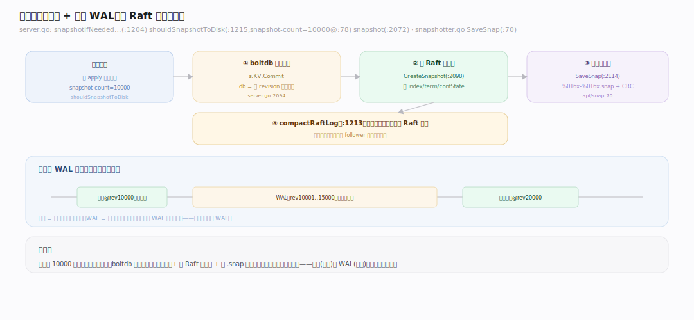
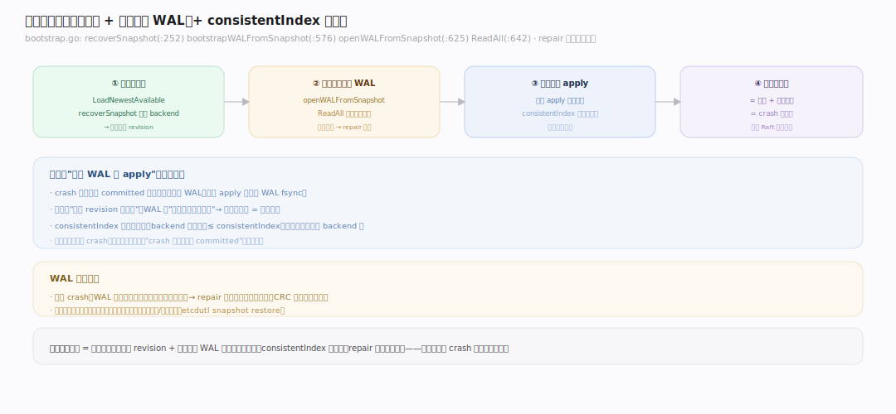
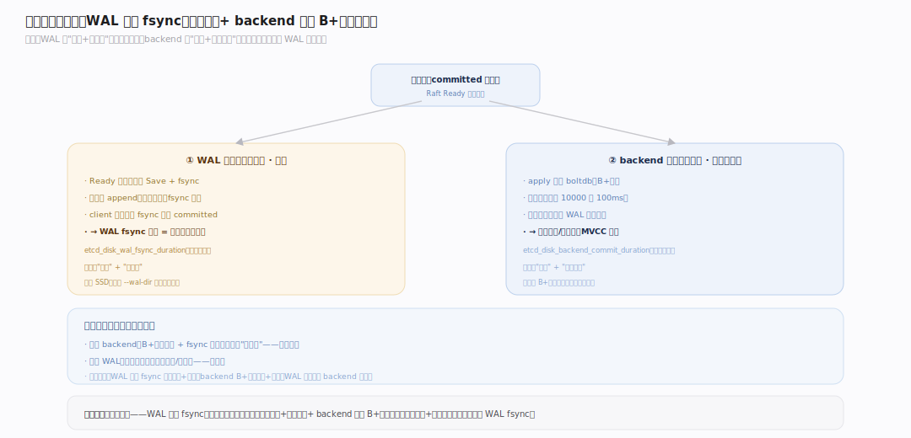

# etcd 原理 · 支撑主线 · WAL 与快照

> **定位**：WAL+快照是保障能力域——崩溃恢复的地基。骨架 = `WAL 预写日志（append-only 分段 + fsync）+ 周期快照（状态全量）→ 重启 = 装最近快照 + 回放其后 WAL`。承接 [[Raft 共识]] Ready 循环的"先写 WAL"、与 [[MVCC 存储]]/[[backend（boltdb）]] 的快照配合。核实基准：`~/workdir/etcd/server/storage/wal` + `server/etcdserver/{server,bootstrap}.go` + `api/snap`（main，v3.8.0-alpha.0）。

## 一、WAL：先写后生效的地基

WAL（Write-Ahead Log，预写日志）是 etcd 崩溃恢复的根基：**任何状态变更生效前，先把它作为一条记录追加到 WAL 并 fsync 落盘**。`WAL`（`server/storage/wal/wal.go:72`）的 `Save(st *raftpb.HardState, ents []*raftpb.Entry)`（`:958`，注意参数是指针）保存 Raft 的 HardState（term/vote/commit）与日志条目，通过 `sync()`（`:832`，`Fdatasync`）落盘。记录类型（`:38-43`，导出的 PascalCase）：`MetadataType/EntryType/StateType/CrcType/SnapshotType`，每条带 CRC 校验防损坏。WAL 是 **append-only 的分段文件**（`SegmentSizeBytes=64MB`，`:55`，预分配），写满一段 `cut()`（`:748`）开新段。**为什么先写 WAL**：见 [[Raft 共识]] Ready 循环——条目落 WAL 后才真正 apply，crash 后从 WAL 回放即恢复，保证 committed 不丢。

---

## 二、快照：状态全量 + 日志压缩

WAL 不能无限增长，快照定期"结算"。触发在 `snapshotIfNeededAndCompactRaftLog`（`server/etcdserver/server.go:1204`）：`shouldSnapshotToDisk`（`:1215`，已 apply 条目数超 `--snapshot-count`（默认 **10000**，`:78`）时落盘快照）。`snapshot(ep, toDisk=true)`（`:2072`）三步：① `s.KV().Commit()`（`:2094`，boltdb 一致提交，此刻 db 是某 revision 的完整状态）→ ② `CreateSnapshot`（`:2098`，Raft 记录快照元信息）→ ③ `SaveSnap`（`:2114`，`api/snap/snapshotter.go:70`，写 `%016x-%016x.snap` 文件，带 CRC）。快照后 `compactRaftLog`（`:1213`）压缩掉快照点之前的 Raft 日志。**快照 = 状态全量的一致副本，WAL = 快照之后的增量操作**——两者互补。`--max-wals`（默认 **5**，`embed/config.go:63`）限制保留的 WAL 段数。

---

## 三、崩溃恢复：装快照 + 回放 WAL

重启时 etcd 重建状态（`server/etcdserver/bootstrap.go`）：① 找最新可用快照（`LoadNewestAvailable`）、恢复 backend 到快照点（`recoverSnapshot`，`:252`）。② `bootstrapWALFromSnapshot`（`:576`）从快照对应的 WAL 位置开始 `openWALFromSnapshot`（`:625`）→ `w.ReadAll`（`:642`）读出快照之后的所有 WAL 记录。③ 把这些记录（Raft 条目）重新 apply——配合 [[MVCC 存储]] 的 consistentIndex，跳过已 apply 的、只补未落 backend 的。若 WAL 尾部因 crash 损坏（`ErrUnexpectedEOF`），`repair` 截断到最后一条完整记录。**恢复 = 快照（跳到某 revision）+ 回放增量 WAL（补齐到最新）**。这就是为什么"先写 WAL 后 apply"是铁律——它保证 crash 时刻已 committed 的每条写都在 WAL 里、能被回放补回。

---

## 深化 · WAL 与 backend 的两次落盘

一次写在磁盘上落两次，分工不同：

- **WAL 落盘（关键路径，快）**：Raft Ready 循环里每轮 `Save` + fsync（`etcd_disk_wal_fsync_duration`）。这是**写延迟的决定因素**——client 要等这次 fsync 才算 committed。必须快（SSD），故 WAL 是纯顺序 append（磁盘友好）。
- **backend 落盘（非关键路径，可批量慢）**：apply 后写 boltdb，批量提交（见 [[backend（boltdb）]]，`etcd_disk_backend_commit_duration`）。可稍后、可丢——丢了从 WAL 回放补回。

**为什么要两次**：WAL 保证"不丢 + 快确认"（顺序日志），backend 保证"可查询 + 最终持久"（B+树）。若只有 backend：其 B+树随机写 + fsync 太慢，做不到快确认。若只有 WAL：无法高效点查/范围查。两者分工让 etcd **写快（WAL 顺序 fsync）且可查（backend B+树）且不丢（WAL 回放兜底 backend）**。监控上 WAL fsync 延迟是写性能头号信号,backend commit 延迟次之。

---

## 拓展 · WAL/快照边界

| 类别 | 项 | 说明 |
|---|---|---|
| WAL 文件 | append-only 分段 64MB | 预分配、CRC 校验 |
| 记录类型 | Metadata/Entry/State/Crc/Snapshot | 5 类 |
| 快照触发 | snapshot-count=10000 | 已 apply 条目数阈值 |
| 快照内容 | boltdb 一致副本 + Raft 元信息 | 状态全量 |
| 保留 | max-wals=5 | WAL 段数上限 |
| 恢复 | 快照 + 回放 WAL | bootstrap 阶段 |
| 损坏修复 | repair 截断 | 尾部 crash 半条记录 |

---

## 调优要点（关键开关）

- WAL 盘用 SSD：WAL fsync 是写延迟决定因素；机械盘/网络盘会让写极慢。可用 `--wal-dir` 把 WAL 单独放高速盘。
- `--snapshot-count`（默认 10000）：调大 → 快照少、重启回放的 WAL 多；调小 → 快照频繁、恢复快、但快照有开销。
- `--max-wals`（默认 5）：保留 WAL 段数。
- `--max-snapshots`：保留快照文件数。
- 监控 `etcd_disk_wal_fsync_duration_seconds`（P99 应 < 10ms）与 `etcd_disk_backend_commit_duration_seconds`。

---

## 常见误区与工程要点

- **WAL 放慢盘**：WAL fsync 直接决定写延迟；慢盘 → 写慢 → apply 落后 → Raft 背压。SSD 是硬要求，理想用独立 `--wal-dir`。
- **以为快照能替代 WAL**：不——快照是周期状态点，两次快照间的写只在 WAL 里；缺 WAL 会丢最近写。
- **snapshot-count 调太大**：重启要回放海量 WAL、恢复慢；也让内存里未快照的 Raft 日志更多。
- **混淆两次落盘**：WAL fsync（关键、快、顺序）vs backend commit（非关键、批量、B+树）——诊断写慢先看 WAL fsync。
- **WAL 损坏**：正常 crash 尾部半条记录 etcd 会 repair；但盘故障导致的中间损坏需从其他成员恢复。

---

## 一句话总纲

**WAL+快照是崩溃恢复的地基：任何变更生效前先 append 到 WAL 并 fsync（64MB 分段、CRC 校验、纯顺序写），保证 committed 不丢；每积累 10000 条已应用条目做一次快照（boltdb 一致副本 + Raft 元信息）并压缩其前的 WAL。重启 = 装最近快照跳到某 revision + 回放其后 WAL 补齐到最新（配合 consistentIndex 幂等）。一次写落两次盘——WAL 顺序 fsync 保"快确认+不丢"（写延迟决定因素）、backend 批量 B+树保"可查+最终持久"，分工让 etcd 写快、可查、不丢。**
