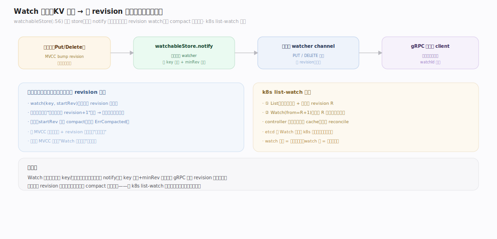
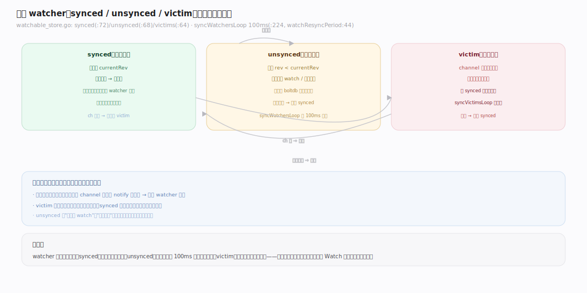
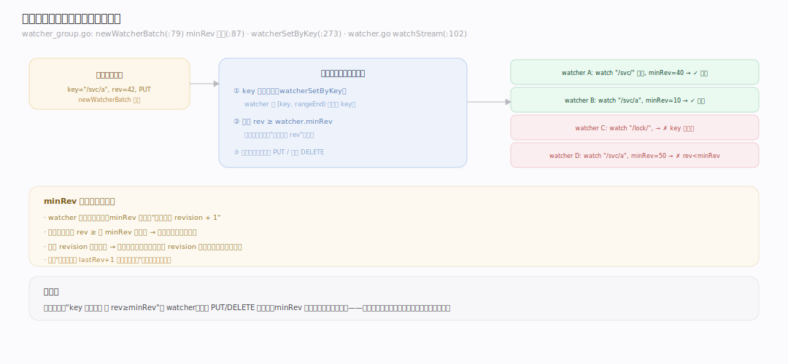
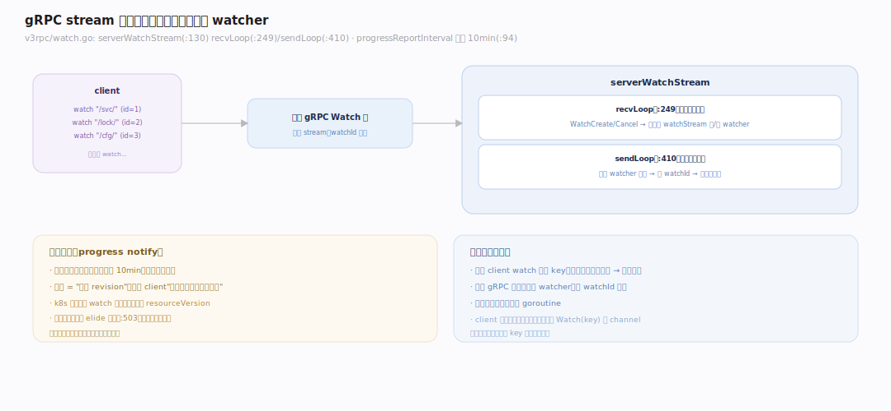

# etcd 原理 · 支撑主线 · Watch 机制

> **定位**：Watch 是协调能力域——把"KV 变更"变成"可订阅的事件流"，是 etcd 作为协调系统的核心特性（k8s 靠它 watch 所有资源变化）。骨架 = `按 revision 订阅 → watcher 分 synced/unsynced/victim 三组 → 后台同步循环推事件`。依赖 [[MVCC 存储]] 的 revision 事件流、经 [[gRPC API 族]] 的 stream 多路复用给客户端。核实基准：`~/workdir/etcd/server/storage/mvcc` + `api/v3rpc/watch.go`（main，v3.8.0-alpha.0）。

## 一、Watch 全景：从变更到事件流

Watch 让客户端**订阅一个 key 或 key 范围的变更**，服务端在数据变化时**按 revision 顺序推送事件**（PUT/DELETE）。关键能力：**可从历史 revision 起 watch**——只要那个 revision 未被 compact，重连后能补齐断连期间的所有变更（不丢事件）。实现核心是 `watchableStore`（`server/storage/mvcc/watchable_store.go:56`）——它包住普通 store，在每次写后 `notify` 把变更事件分发给匹配的 watcher。k8s 的 list-watch 机制正是建立在此之上：先 list 拿到当前状态 + revision，再从该 revision watch 增量。

---

## 二、三组 watcher：synced / unsynced / victim

watcher 按"是否跟上最新 revision"分三组管理（`watchable_store.go`）：

- **synced（已同步，`:72`）**：已追上 currentRev 的 watcher。新变更来时直接推给它们。
- **unsynced（未同步，`:68`）**：起始 revision 落后于 currentRev（如从历史 revision 开始 watch，或刚重连）。需要后台循环从 boltdb 补历史事件、逐步追平。
- **victim（受害者，`:64`）**：channel 满了（客户端消费慢）推不进去的 watcher。`notify` 若发现 synced watcher 的 ch 阻塞，把它移入 victim（`:468`），避免拖垮整个通知路径。

后台两个循环：`syncWatchersLoop`（每 100ms，`:224`；周期常量 `watchResyncPeriod=100ms`，`:44`）把 unsynced 追平后移入 synced；`syncVictimsLoop`（`:259`）重试把 victim 的积压事件推出去、成功后移回。**这套分组让"慢消费者"不阻塞"快消费者"**，是 Watch 可扩展到海量订阅的关键。

---

## 三、事件过滤与推送

不是每个 watcher 都收到每个事件。`watcherGroup`（`watcher_group.go`）按 key 范围索引 watcher；一次写产生的变更经 `newWatcherBatch`（`:79`）过滤：只推给**① key 范围匹配**（`watcherSetByKey`，`:273`）且 **② 事件 revision ≥ 该 watcher 的 minRev**（`:87`）的 watcher。还支持过滤器（如只看 PUT 不看 DELETE）。匹配后事件进 watcher 的 channel，由 `watchStream`（`watcher.go:102`）交给 gRPC 层发送。**minRev 机制**保证不重推：watcher 每收一批事件，minRev 前移到"已推最大 revision+1"，下次只推更新的。

---

## 深化 · gRPC stream 多路复用

一个客户端可能 watch 几百个 key，但**只用一条 gRPC 流**。`serverWatchStream`（`server/etcdserver/api/v3rpc/watch.go:130`）在一条 `Watch` 双向流上多路复用多个逻辑 watcher：`recvLoop`（`:249`）收客户端的 WatchCreate/WatchCancel 请求、在底层 `watchStream`（`:177`）上建/删 watcher；`sendLoop`（`:410`）把所有 watcher 产生的事件汇聚、打上 watchId 后经这条流发回。**进度通知（progress notify）**：即使无变更，也可周期性（`progressReportInterval` 默认 **10min**，`:94`）发一个"当前 revision"的空响应，让客户端知道"服务端还活着、我已同步到这个 revision"——k8s 用它判断 watch 是否健康。相邻进度事件可 elide 合并（`:503`）减少无谓推送。

---

## 拓展 · Watch 边界

| 类别 | 项 | 说明 |
|---|---|---|
| 订阅粒度 | 单 key / 前缀范围 | rangeEnd 指定范围 |
| 起始点 | 当前 / 历史 revision | 历史需未被 compact |
| 分组 | synced/unsynced/victim | 追平/补历史/慢消费者隔离 |
| 不丢保证 | minRev + revision 有序 | 断连重连可补齐 |
| 进度 | progress notify（默认 10min） | 无变更也报当前 revision |
| 多路复用 | 一 gRPC 流多 watcher | watchId 区分 |
| 失效 | ErrCompacted | watch 的起始 rev 已被压缩 |

---

## 调优要点（关键开关）

- `--watch-progress-notify-interval`：进度通知间隔（默认 10min）——k8s 等依赖它判活，一般不改。
- 客户端及时消费：消费慢 → watcher 进 victim → 事件积压；确保客户端处理速度跟得上。
- compact 策略与 watch 起点：watch 历史 revision 前确认未被 compact，否则 ErrCompacted。
- `--max-request-bytes` / stream 数：海量 watch 时关注内存与 goroutine。

---

## 常见误区与工程要点

- **以为 watch 会丢事件**：只要起始 revision 未被 compact，etcd 保证按序不丢；丢事件通常是客户端从错误 revision 重连或已被 compact。
- **慢消费拖垮服务**：victim 机制隔离慢消费者，但积压仍占内存；客户端必须及时消费。
- **watch 太多不 cancel**：每个 watcher 占资源；用完 WatchCancel，别泄漏。
- **误解 progress notify**：它不是变更事件，是"心跳 + 当前 revision"；别把它当数据变化处理。
- **一 key 一连接**：应在一条 gRPC 流上多路复用多个 watch，别为每个 key 开新连接。

---

## 一句话总纲

**Watch 把 KV 变更变成按 revision 有序的可订阅事件流：watchableStore 在每次写后 notify，watcher 按"是否追上最新 revision"分 synced/unsynced/victim 三组——后台 100ms 循环把 unsynced 补历史追平、把慢消费者隔离到 victim；事件按 key 范围 + minRev 过滤后推送，一条 gRPC 流多路复用多个 watcher 并周期发进度通知。只要起始 revision 未被 compact 就不丢事件——这是 k8s list-watch 的基石。**
