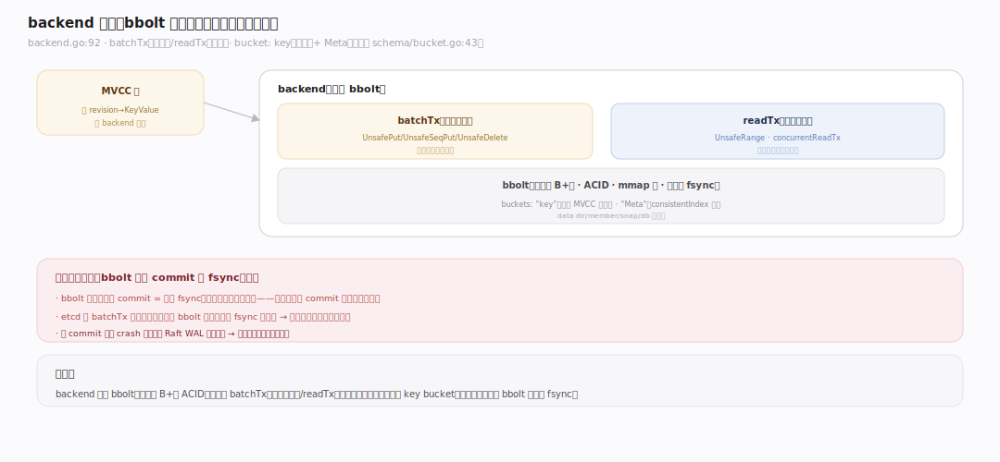
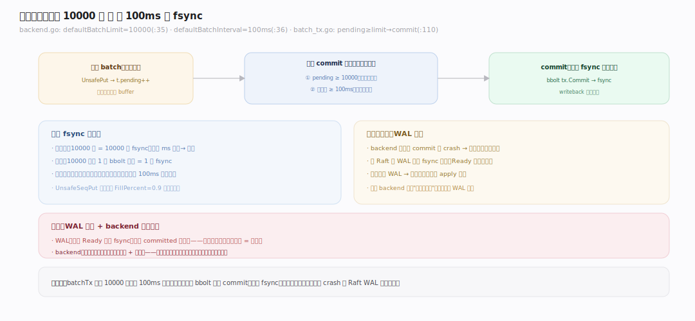
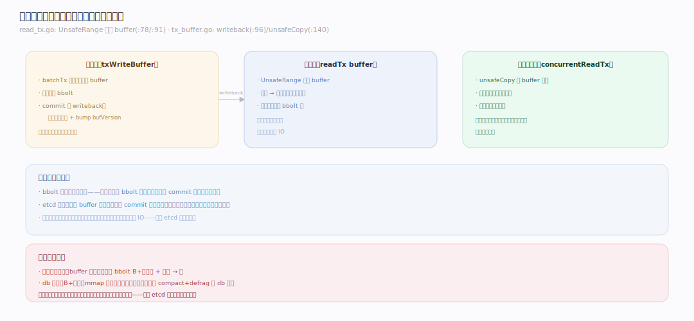
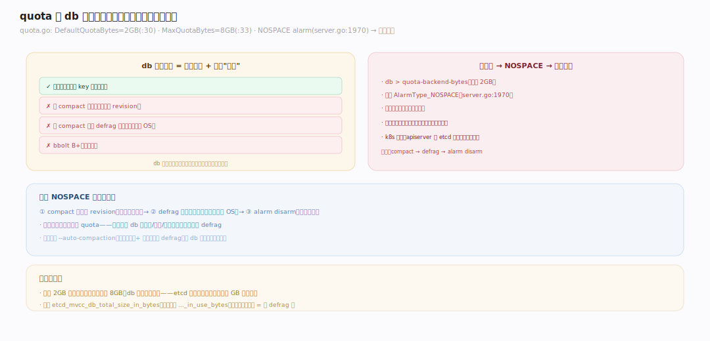

# etcd 原理 · 支撑主线 · backend（boltdb 持久化）

> **定位**：backend 是存储引擎的最底层——把 [[MVCC 存储]] 的写落到磁盘。骨架 = `bbolt 事务（读写 batchTx / 只读 readTx）→ 批量提交（攒够或到点才 fsync）→ 读写缓冲加速`。被 MVCC 直接调用，其 fsync 延迟与 db 大小是 etcd 写性能与容量的头号约束。核实基准：`~/workdir/etcd/server/storage/backend`（main，v3.8.0-alpha.0）。

## 一、backend 全景：bbolt 之上的事务封装

etcd 底层用 **bbolt**（BoltDB 的维护分支）——一个单文件、B+树、支持 ACID 事务的嵌入式 KV。`backend`（`server/storage/backend/backend.go:92`）封装它，暴露两类事务：**batchTx**（读写，`batch_tx.go`）与 **readTx**（只读，`read_tx.go`）。所有 MVCC 数据存在名为 **`key` 的 bucket**（`schema/bucket.go:43`），另有 `Meta` bucket 存 consistentIndex 等元信息。bbolt 本身每个写事务 commit 都要 fsync（昂贵），etcd 通过**批量提交**把多个写攒进一个 bbolt 事务，摊薄 fsync 成本。

---

## 二、批量提交：攒够或到点才 fsync

写不是来一条 commit 一条。`batchTx` 累积 pending 写，两个条件任一满足才真正 commit（fsync 落盘）：

- **攒够条数**：pending ≥ `defaultBatchLimit`（**10000**，`backend.go:35`）——`batch_tx.go:110` 检查 `t.pending >= batchLimit` 则 commit。
- **到时间**：每 `defaultBatchInterval`（**100ms**，`backend.go:36`）后台强制 commit 一次。

`UnsafePut`（`batch_tx.go:140`）/ `UnsafeSeqPut`（`:145`，顺序写用 `FillPercent=0.9` 提高页填充率）把数据写进当前 batch，不立即落盘。**权衡**：批量摊薄 fsync（吞吐↑），但一批未 commit 前 crash 会丢这批未落盘写——不过没关系，因为 **Raft 层的 WAL 已先落盘**（见 [[Raft 共识]] Ready 循环），backend 丢的能从 WAL 回放补回。这正是"WAL 快速落盘 + backend 批量慢落盘"的分工。

---

## 三、读写缓冲：读不必等磁盘

为避免读被写事务阻塞、也避免每次读都触盘：

- **写缓冲（txWriteBuffer）**：batchTx 里的写先进内存 buffer，commit 时 `writeback`（`tx_buffer.go:96`）把 buffer 合并进读缓冲、并 bump `bufVersion`。
- **读缓冲（readTx buffer）**：`baseReadTx.UnsafeRange`（`read_tx.go:78`）**先查 buffer**（`:91`），buffer 里有就直接返回，只有缺的部分才落到 bbolt。
- **并发读快照**：`concurrentReadTx` 通过 `unsafeCopy`（`tx_buffer.go:140`）拿 buffer 快照，让多个读并发进行而不互相阻塞、也不被写事务阻塞。

效果：热数据读命中内存 buffer、不触盘；写批量落盘时读仍可用旧快照——读写解耦。

---

## 深化 · quota 与 db 空间

etcd 的 db 有硬上限。`DefaultQuotaBytes = 2GB`（`server/storage/quota.go:30`），最大可配 `MaxQuotaBytes = 8GB`（`:33`）。超过配额触发 **NOSPACE alarm**（`server.go:1970`）——集群转入**只读**保护（拒绝写，避免磁盘写满彻底不可用）。关键认知：

- **db 大小 ≠ 有效数据量**：多版本 + 未 compact 的历史 + 未 defrag 的空闲页都算进 db 文件大小。db 涨到配额常是"没开 auto-compaction"或"没定期 defrag"，而非真有那么多数据。
- **恢复 NOSPACE**：compact（清版本）→ defrag（缩文件）→ 解除 alarm（`etcdctl alarm disarm`）。
- **db 大 = 一切变慢**：boltdb 越大，B+树越深、快照越慢、启动 mmap 越慢。etcd 存关键元数据、控制在 GB 级，才健康。

---

## 拓展 · backend 边界

| 类别 | 项 | 说明 |
|---|---|---|
| 底层 | bbolt（单文件 B+树） | ACID、mmap 读、写事务 fsync |
| 事务 | batchTx（读写）/ readTx（只读） | 读写分离 |
| bucket | key / Meta | 数据 / 元信息 |
| 批量 | batchLimit=10000, interval=100ms | 摊薄 fsync |
| 缓冲 | 读缓冲 + 写缓冲 | 读不触盘、读写解耦 |
| 配额 | 2GB 默认 / 8GB 最大 | 超限 NOSPACE 转只读 |
| 空间回收 | defrag | 缩小文件，还页给 OS |

---

## 调优要点（关键开关）

- `--quota-backend-bytes`：db 配额（默认 2GB，最大 8GB）——按元数据规模设，别盲目调大（大 db 一切变慢）。
- `--backend-batch-limit` / `--backend-batch-interval`：批量提交阈值（默认 10000 / 100ms）——高写入可调，权衡延迟 vs fsync 频率。
- `--backend-bbolt-freelist-type`：freelist 类型（map/array），大 db 用 map 更快。
- `Defragment`：定期滚动 defrag 回收空间（阻塞该节点，逐节点做）。
- 监控 `etcd_disk_backend_commit_duration_seconds`（backend fsync）与 `etcd_mvcc_db_total_size_in_bytes`。

---

## 常见误区与工程要点

- **db 满了以为要扩数据盘**：多半是没 compact/defrag——先 compact+defrag，通常 db 大幅缩小。
- **调大 quota 当解法**：治标；大 db 让快照/启动/读写全变慢，且更难 defrag。根因是版本没清。
- **忽视 backend fsync 延迟**：慢盘（如网络盘/机械盘）让 batchTx commit 慢 → apply 落后 → Raft 背压。etcd 强烈建议 SSD。
- **defrag 不滚动做**：defrag 阻塞该节点、期间不服务；必须逐节点、避开同时，否则集群抖动。
- **以为读都触盘**：热读命中内存读缓冲；真正慢的是大范围冷扫描 + 慢盘。

---

## 一句话总纲

**backend 把 MVCC 的写落到 bbolt（单文件 B+树、ACID）：数据存 `key` bucket，通过批量提交（攒 10000 条或每 100ms）把多写摊进一个 bbolt 事务、摊薄昂贵的 fsync（丢的未落盘写由 Raft WAL 兜底回放）；读写双缓冲让热读不触盘、读写解耦。db 有 2GB 默认配额（最大 8GB），超限触发 NOSPACE 转只读——db 膨胀多因未 compact/defrag 而非真有那么多数据，SSD + 定期压缩碎片整理是健康前提。**
