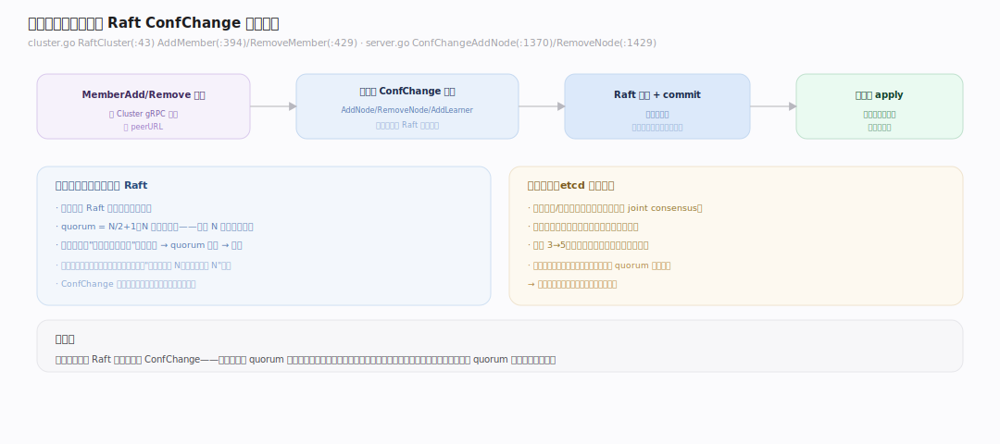
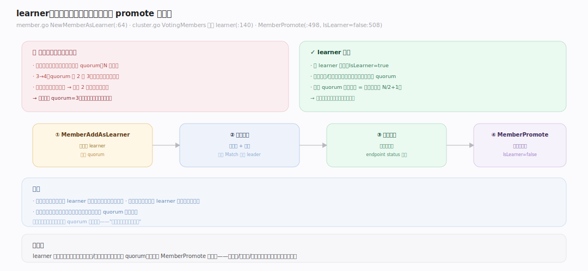
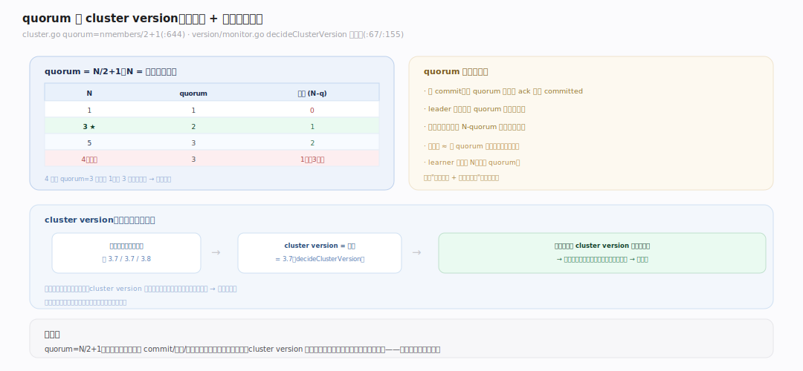
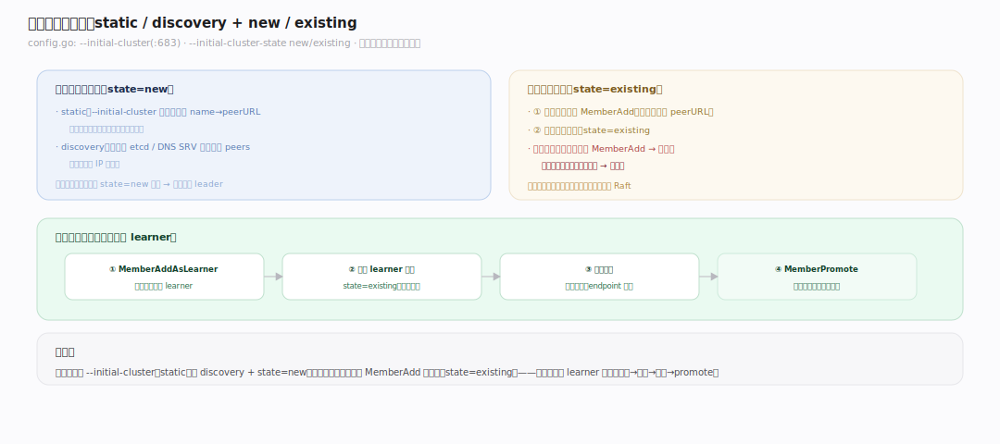

# etcd 原理 · 支撑主线 · 成员与集群

> **定位**：成员与集群是保障能力域——管"谁在集群里、怎么增删、版本怎么协商"。骨架 = `成员变更走 Raft ConfChange → learner 先追平再 promote → cluster version = 各成员最小版本`。依赖 [[Raft 共识]]（ConfChange 也是日志条目）。核实基准：`~/workdir/etcd/server/etcdserver/api/membership` + `server.go`（main，v3.8.0-alpha.0）。

## 一、成员变更：经 ConfChange 走 Raft

集群成员不是配置文件静态写死，而是**运行时经 Raft 动态变更**。`RaftCluster`（`server/etcdserver/api/membership/cluster.go:43`）维护成员表；增删成员是**特殊的 Raft 日志条目 ConfChange**：`AddMember`（`cluster.go:394` / server 侧 `server.go:1370`，`ConfChangeAddNode`）、`RemoveMember`（`cluster.go:429` / `server.go:1429`，`ConfChangeRemoveNode`）。**为什么走 Raft**：成员集是 Raft 自身正确性的基础（quorum 算多少要看有几个成员），变更必须让所有节点对"当前成员集"达成一致、且变更点在日志里有确定位置。etcd 用**单步变更**（一次加/删一个），避免联合共识的复杂性——所以扩容 3→5 要分两次各加一个。

---

## 二、learner：非投票成员，先追平再投票

直接加一个空白新成员进投票集有风险：它数据是空的，却立刻计入 quorum——若此时另一节点故障，新成员还没数据却要参与多数派，可能拖慢甚至阻塞。**learner（非投票成员）**解决：`NewMemberAsLearner`（`member.go:64`）加入的成员 `IsLearner=true`——它**接收日志/快照追平数据，但不投票、不计入 quorum**（`VotingMembers` 跳过 learner，`cluster.go:140`）。追平后 `MemberPromote`（`cluster.go:498` / `server.go:1447`）把它转为投票成员（`IsLearner=false`，`:508`）。**用途**：安全扩容、替换故障节点、跨地域加副本——先让新成员默默追上，确认健康再纳入投票，全程不影响现有 quorum 的可用性。

---

## 三、quorum 与集群版本

**quorum（多数派）= N/2+1**（`cluster.go:644` `nquorum := nmembers/2 + 1`，N=投票成员数）。它决定：写要几个 ack 才 commit、选举要几票才当选、集群能容忍几个故障（N-quorum）。这就是"奇数节点"的数学根源（见全景运行形态）。**cluster version**（集群版本）：`decideClusterVersion`（`version/monitor.go:67`）取**所有成员的最小 server 版本**（`membersMinimalServerVersion`，`:155`）作为集群版本，存进成员元信息（`SetVersion`，`cluster.go:589`）。作用：**滚动升级时，新功能只在所有成员都升级后才启用**——避免高版本节点用了低版本节点不认识的特性导致不一致。这让 etcd 能平滑滚动升级：逐个升级节点，cluster version 保持在最低版本，全升完才跳版本、开新特性。

---

## 深化 · 成员发现与启动

集群首次启动怎么互相找到？两种方式：**① static（静态）**：`--initial-cluster`（`config.go:683`）列出所有初始成员的 name→peerURL，每个节点配同样的列表，启动时按表互联。**② discovery（发现）**：通过一个已存在的 etcd 或 DNS SRV 记录动态发现 peers（适合不预知 IP 的场景）。启动模式 `--initial-cluster-state`：`new`（组建新集群）vs `existing`（加入已有集群）。加入已有集群的正确流程：先在现有集群 `MemberAdd`（登记新成员的 peerURL）→ 再启动新节点且 `state=existing`——**顺序不能反**，否则新节点找不到自己在成员表里的位置。生产扩容标准姿势：`MemberAdd as learner` → 启动 learner 追平 → 确认健康 → `MemberPromote`。

---

## 拓展 · 成员边界

| 类别 | 项 | 说明 |
|---|---|---|
| 变更 | ConfChange（单步） | 一次加/删一个，走 Raft |
| 成员类型 | voting / learner | learner 不计 quorum |
| quorum | N/2+1（N=投票数） | 决定容错/选举/commit |
| 提升 | MemberPromote | learner 追平后转投票 |
| 版本 | cluster version = min | 滚动升级门控 |
| 发现 | static / discovery | initial-cluster / DNS SRV |
| 启动态 | new / existing | 建新 / 加入已有 |

---

## 调优要点（关键开关）

- 扩容/换节点用 learner：`MemberAddAsLearner` → 追平 → `MemberPromote`，避免空白成员拖 quorum。
- `--initial-cluster` / `--initial-cluster-state`：初始组建 vs 加入已有，配对使用。
- 加入已有集群顺序：先 `MemberAdd`（在现集群登记）再启动新节点（`state=existing`）。
- 奇数成员数：3/5/7；偶数无收益（见全景运行形态）。
- 滚动升级：逐个升级，watch cluster version，全升完才跳版本。

---

## 常见误区与工程要点

- **直接加投票成员**：空白成员立刻计入 quorum，若同时有节点故障可能阻塞；用 learner 先追平。
- **加入顺序反了**：先启动新节点再 MemberAdd → 新节点找不到自己 → 起不来；必须先在现集群 MemberAdd。
- **一次加多个成员**：etcd 单步变更，一次一个；批量加要逐个做，中间等健康。
- **偶数成员**：4 节点 quorum=3 只容忍 1，等于 3 节点但更慢——永远奇数。
- **跨大版本跳升**：cluster version 只在全员升级后跳；别指望混版本集群用新特性。

---

## 一句话总纲

**成员与集群管"谁在集群里"：增删成员是经 Raft 的单步 ConfChange（成员集是 Raft 正确性基础，须一致），quorum=N/2+1 决定容错/选举/commit（奇数节点的数学根源）；learner 是非投票成员——先接收日志追平数据、不计 quorum，健康后 MemberPromote 转投票，让扩容/换节点不影响现有可用性；cluster version 取所有成员最小版本，门控新特性直到全员升级，实现平滑滚动升级。**
