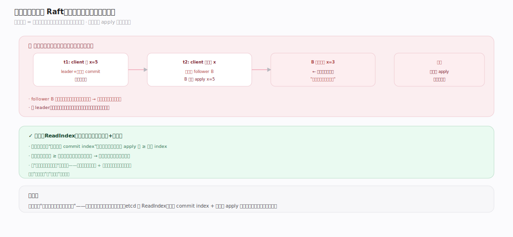
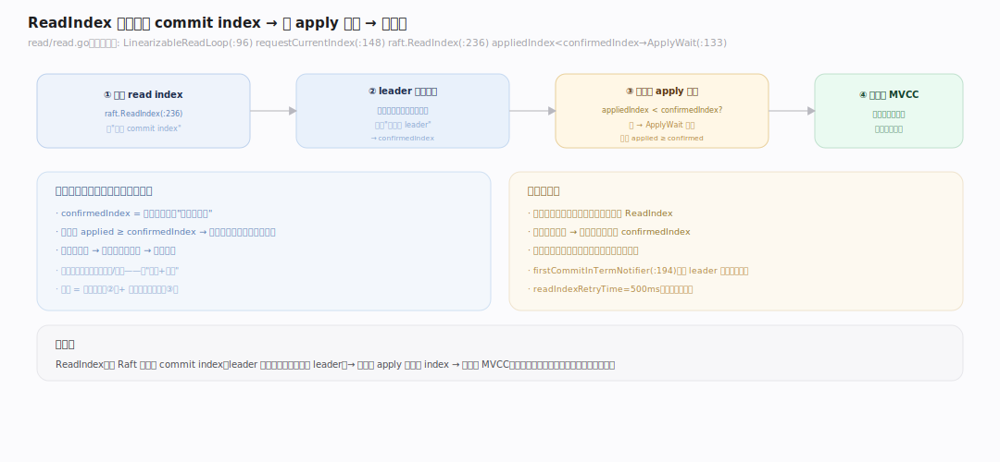
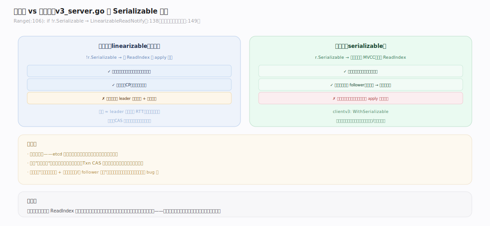
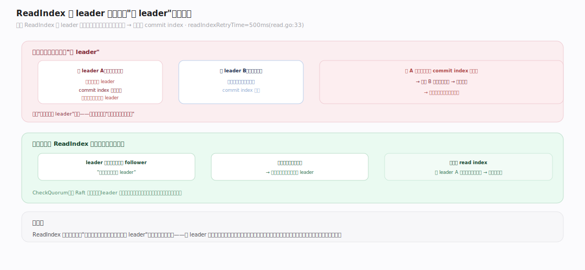

# etcd 原理 · 支撑主线 · 线性一致读

> **定位**：线性一致读是保障能力域——保证"读能看到所有已成功的写"（读不会读到过期数据）。骨架 = `ReadIndex 向 Raft 拿当前 commit index → 等本地 apply 追上 → 读本地 MVCC`。它是 etcd **默认读语义**，与写一样是 CP 保证。依赖 [[Raft 共识]] 的 commit index、读 [[MVCC 存储]] 本地数据。核实基准：`~/workdir/etcd/server/etcdserver/read/read.go` + `v3_server.go`（main，v3.8.0-alpha.0；注：linearizable read loop 已从 v3_server.go 抽到独立 `read/` 包）。

## 一、为什么读也要过 Raft

直觉上"读只是取本地数据、不改状态，为何要经共识？"——问题在于 **follower（甚至旧 leader）的本地数据可能落后**。假设：client 写成功（多数派已 commit）后立即读，若读落到一个还没 apply 这条写的节点，就会**读到旧值**——违反线性一致（"读到的必须至少和最近一次成功写一样新"）。etcd 的解法不是"读也复制一遍"（太贵），而是 **ReadIndex**：读之前先确认"本地已经 apply 到 ≥ 集群当前 commit index",再读本地。这样既保证不读旧数据，又避免读走完整 Raft 日志复制——是"强一致读"与"读性能"的折衷。

---

## 二、ReadIndex 机制

线性读的完整步骤（`server/etcdserver/read/read.go`，注意已独立成包）：`LinearizableReadLoop`（`:96`）驱动：① 向 Raft 请求当前 read index——`requestCurrentIndex`（`:148`）调 `raft.ReadIndex`（`:236`），Raft 返回"发起时刻的 commit index"作为 `confirmedIndex`（leader 需确认自己仍是 leader，通过一轮心跳确认多数派、防旧 leader 返回旧 index）。② **等本地 apply 追上**：若 `appliedIndex < confirmedIndex`（`:133`），阻塞在 `ApplyWait` 上直到追上。③ 追上后，读本地 MVCC（此刻本地状态 ≥ 该读发起时的集群已提交状态，线性一致成立）。多个并发线性读可**共享一次 ReadIndex**（批处理），`firstCommitInTermNotifier`（`:194`）处理新 leader 上任的首次确认。

---

## 三、线性读 vs 串行读

etcd 提供两种读，在 `Range`（`v3_server.go:138`）按 `RangeRequest.Serializable` 分流：

- **线性读（linearizable，默认）**：`if !r.Serializable` → 先 `LinearizableReadNotify`（ReadIndex 等 apply 追上）再读。**保证读到最新**（所有已成功写可见），但每次读有一次 leader 心跳往返 + 可能的等待。
- **串行读（serializable）**：直接读本地 MVCC（`:149`），**不经 ReadIndex**。任意节点可服务、无网络往返、最快，但**可能读到略旧数据**（该节点还没 apply 最新写）。

选择：需要"读己之写"、强一致（如 CAS 前的读）→ 线性读；能容忍轻微陈旧、要极致读吞吐/低延迟（如缓存预热、监控）→ 串行读。**默认线性读**——etcd 把正确性放在性能之前。

---

## 深化 · ReadIndex 的 leader 确认

ReadIndex 的正确性依赖一个微妙点：**leader 必须确认"我此刻仍是 leader"**，才能用它的 commit index。为什么：网络分区下可能存在"旧 leader"——它自认为是 leader，但集群已在别处选了新 leader 并提交了新数据。若旧 leader 直接用自己的 commit index 服务读，会漏掉新数据。解法：leader 发起 ReadIndex 时，**先广播一轮心跳、确认收到多数派响应**（证明自己仍被多数派认可为 leader），才返回 read index。`CheckQuorum`（见 [[Raft 共识]]）也辅助此保证。`readIndexRetryTime`（500ms，`read.go:33`）在确认超时时重试。这一轮心跳确认就是线性读相比串行读的"额外成本"——一次网络往返，换来"绝不读旧数据"。

---

## 拓展 · 读一致性边界

| 类别 | 项 | 说明 |
|---|---|---|
| 默认 | 线性读 | ReadIndex + 等 apply 追上 |
| 可选 | 串行读 | 本地直读，可能略旧 |
| 分流点 | RangeRequest.Serializable | v3_server.go:138 |
| leader 确认 | 一轮心跳 | 防旧 leader 读旧数据 |
| 批处理 | 并发读共享 ReadIndex | 摊薄心跳成本 |
| 重试 | readIndexRetryTime=500ms | 确认超时重试 |
| 与写关系 | 都是 CP | 读己之写成立 |

---

## 调优要点（关键开关）

- 默认线性读：绝大多数场景直接用，正确性优先。
- 显式串行读（clientv3 `WithSerializable`）：对陈旧不敏感、要极致读性能时用，可让 follower 分担读。
- follower 读：串行读可路由到 follower 减 leader 压力；线性读仍需 leader 心跳确认。
- 心跳延迟影响线性读延迟：跨地域时线性读延迟 ≈ leader 到多数派的 RTT。

---

## 常见误区与工程要点

- **以为读不经共识就一定最新**：串行读读本地，可能落后；要"读己之写"必须线性读。
- **以为线性读要复制日志**：不——ReadIndex 只需一轮心跳确认 + 等本地 apply 追上，不走日志复制，比写便宜。
- **全用串行读图快**：会读到旧数据；CAS/选主/锁等依赖"读到最新"的逻辑必须线性读，否则出错。
- **忽视线性读的心跳成本**：跨地域高 RTT 时线性读延迟明显；热点只读且容忍陈旧的用串行读 + follower 分流。
- **误解 leader 确认**：ReadIndex 的心跳是"确认我还是 leader"，不是"复制这次读"——目的是防旧 leader 读旧数据。

---

## 一句话总纲

**线性一致读保证"读到所有已成功的写"：不复制日志，而用 ReadIndex——先向 Raft 拿当前 commit index（leader 经一轮心跳确认自己仍是 leader、防旧 leader 读旧数据），再等本地 apply 追上该 index，才读本地 MVCC；这是 etcd 默认读语义（CP，可读己之写），代价是一次心跳往返。串行读则直接读本地、最快但可能略旧——正确性敏感用线性读，极致性能且容忍陈旧用串行读。**
