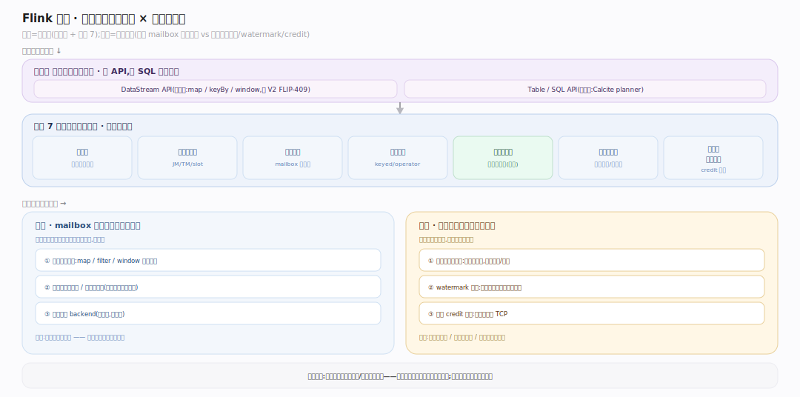
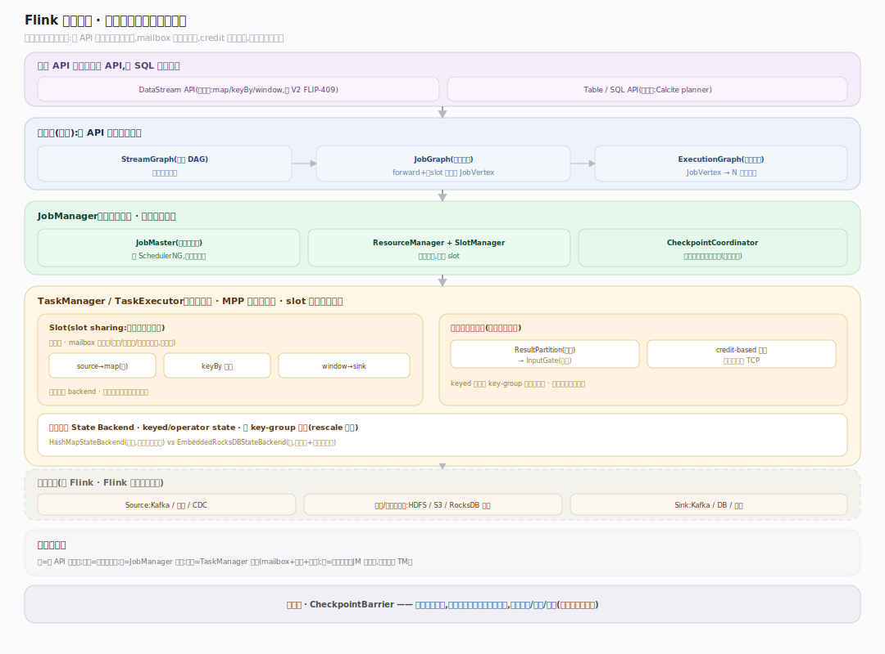
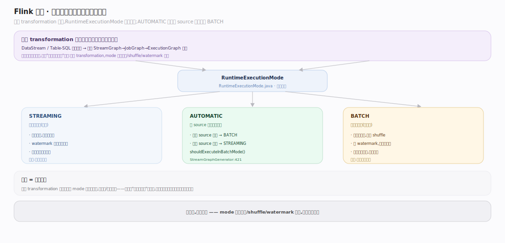
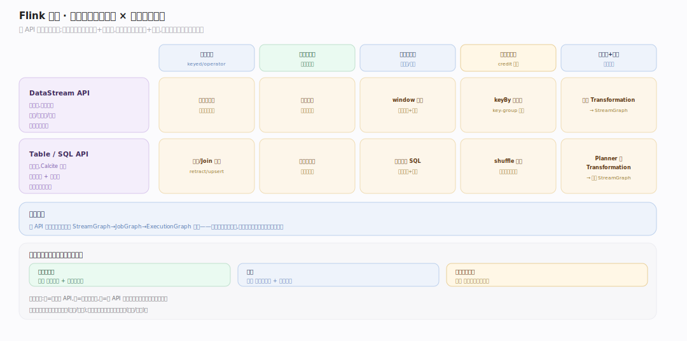
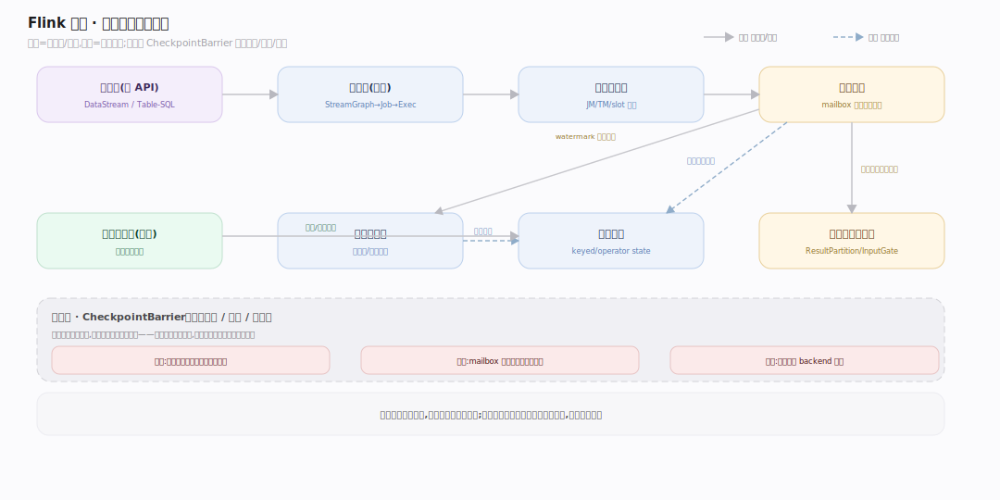

# Flink 原理 · 全景主线框架

> 统领全部原理文档:Apache Flink 是**流优先的统一计算引擎**(原型 C:多编程 API、自管执行不管持久存储)。**接触面 = 多 API(DataStream / Table-SQL),而非 SQL 语句族。** 源码基准 **Flink 2.x / master**(`~/workdir/flink`,git `7f707f3e`)。

Flink 与 SQL 存算引擎(Doris/StarRocks)最大的不同:它**不管持久存储**,只管"把无界/有界数据流并行、容错、按时间正确地算出来"。它的灵魂是**分布式快照(检查点)带来的精确一次(exactly-once)容错**——这是理解一切主线的钥匙。

> **Flink 2.x 结构提示(写文档必看)**:① state *接口*在 `flink-core-api`,*描述符*在 `flink-core`;② streaming 运行时类(`StreamTask`/`WindowOperator`/barrier handler)物理上在 **`flink-runtime`** 的 `org.apache.flink.streaming.*` 包(不是旧的 `flink-streaming-java`);③ RocksDB backend 用 `org.apache.flink.state.rocksdb`(旧 `contrib.streaming.state` 是遗留);④ DataStream 有经典与 V2(FLIP-409)两套 API。

---

## 一、双维模型:能力域 × 执行时机

- **能力域**:接触面(多 API)面向用户;支撑侧——图变换、调度与部署、任务执行、状态管理、检查点容错、时间与窗口、网络与数据交换。
- **执行时机**:前台(算子处理记录、mailbox 单线程)vs 后台(检查点异步快照、watermark 推进、网络 credit 流控)。

---

## 二、总架构图(位置即语义)

用户用 DataStream / Table-SQL 写 job → 累积成 **StreamGraph** → 算子链化成 **JobGraph** → 并行展开成 **ExecutionGraph** → JobManager 调度、TaskManager 执行。执行期算子在 **mailbox 单线程**里处理 Chunk;子任务间数据经 **credit-based** 网络栈交换;状态存 state backend,周期性做**分布式快照(检查点)**以容错。

---

## 三、统一流批:有界是流的特例

`RuntimeExecutionMode { STREAMING, BATCH, AUTOMATIC }`(`flink-core-api/.../RuntimeExecutionMode.java:32`)。AUTOMATIC 下所有 source 有界即 BATCH(`StreamGraphGenerator.shouldExecuteInBatchMode():421`)。**一套 transformation 模型,mode 只改调度/shuffle/watermark 语义**——批不是另一个引擎,而是"所有输入有界"的流。

---

## 四、支撑主线分层归位

| 层 | 支撑主线 | 一句话职责 |
|---|---|---|
| 编译 | **图变换** | StreamGraph→JobGraph(算子链化)→ExecutionGraph(并行展开) |
| 调度 | **调度与部署** | JobManager/TaskManager/slot 分配 |
| 执行 | **任务执行** | Task→StreamTask→算子链,mailbox 单线程模型 |
| 状态 | **状态管理** | keyed/operator state,heap vs RocksDB backend,key-group 分片 |
| 容错 | **检查点容错(灵魂)** | Chandy-Lamport 异步屏障快照,精确一次 |
| 时间 | **时间与窗口** | 事件时间/水位线/窗口 |
| 通信 | **网络与数据交换** | ResultPartition/InputGate,credit 流控,keyed 分区 |

---

## 五、接触面 × 能力域 依赖矩阵

DataStream / Table-SQL 两 API 最终都汇入同一条 StreamGraph→JobGraph→ExecutionGraph 管线(统一后端)。有状态算子依赖状态管理 + 检查点;窗口依赖时间与窗口 + 状态;所有跨子任务数据依赖网络栈。

---

## 六、能力域依赖关系图

实线=数据流/调用,虚线=状态约束。贯穿层:**检查点屏障(CheckpointBarrier)** 横切执行/状态/网络——它随数据流注入,对齐后触发各算子快照。

---

## 七、三条贯穿声明(Flink 区别于 SQL 引擎/批引擎)

1. **多 API,不是 SQL 语句族(原型 C)**:接触面是 DataStream(命令式流转换)+ Table/SQL(声明式,Calcite planner),两者汇入统一执行后端——不像 Doris 只有 SQL。

2. **流优先,批是特例**:有界流 = 批;一套 transformation + 执行模型,mode 只改语义。这让流批同引擎、同代码。

3. **精确一次靠分布式快照,不靠重放去重**:检查点(Chandy-Lamport 异步屏障快照)在数据流里注入屏障、对齐后各算子异步快照状态;失败从最近检查点恢复、按 key-group 重分布状态——这是 Flink 的立身之本,也是它区别于"至少一次 + 幂等"系统的分水岭。

---

**一句话定位**:Flink 是流优先的统一计算引擎——多 API 汇入统一的 StreamGraph→JobGraph→ExecutionGraph 执行管线,算子在 mailbox 单线程里处理、经 credit 网络栈交换,靠分布式快照(检查点)实现精确一次容错,批只是"输入全有界"的流。
