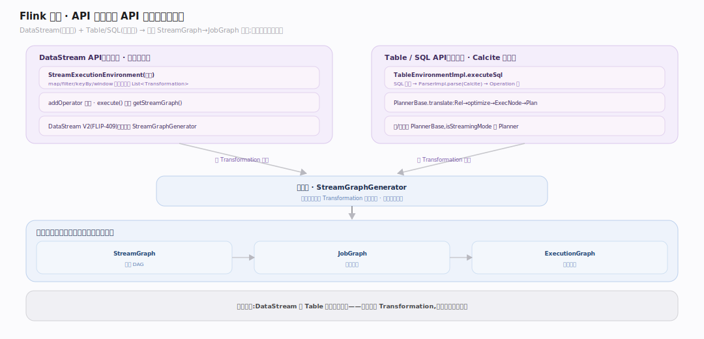
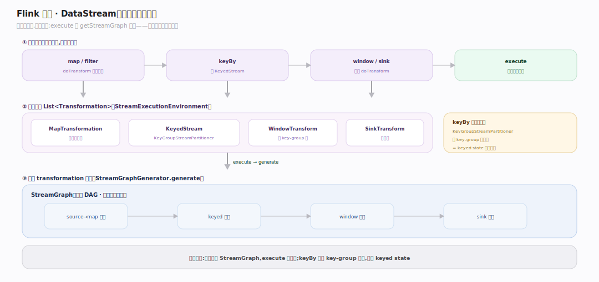
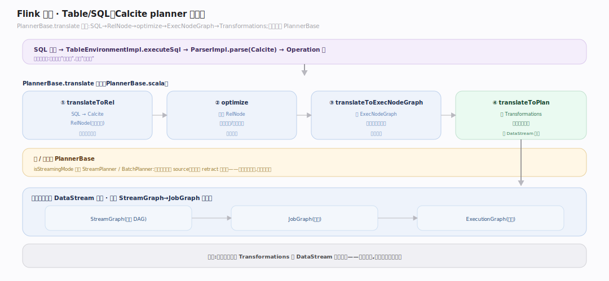

# Flink 原理 · 接触面主线 · 编程 API（DataStream / Table-SQL）

> **定位**：属"接触面主线"(用户可见)。Flink 是原型 C——接触面是**多编程 API**而非 SQL 语句族:命令式的 DataStream API 与声明式的 Table/SQL API,两者最终汇入**同一条执行管线**(StreamGraph→JobGraph→ExecutionGraph)。源码基准 **Flink 2.x**(`flink-runtime` 的 streaming 包、`flink-table`、`flink-datastream`)。

Flink 给两类用户两种 API,但**统一后端**:写惯代码的用 DataStream(逐条转换,精细控制),写惯 SQL 的用 Table/SQL(声明式,Calcite 优化)。无论哪种,都被翻译成 transformation 列表 → StreamGraph,走同一套图变换与执行。这是"一份引擎两种表达"的关键。

---

## 一、API 全景:两套 API 汇入统一后端

- **DataStream API**(命令式):`StreamExecutionEnvironment` 是入口,用户的 `map/filter/keyBy/window` 等转换累积进 `List<Transformation>`(`flink-runtime/.../streaming/api/environment/StreamExecutionEnvironment.java:171`),经 `addOperator`(`:2131`)登记。`execute()` 惰性 `getStreamGraph()`(`:1838`)。Flink 2.x 还有 DataStream V2(FLIP-409,`flink-datastream-api`/`flink-datastream`),同样汇入 `StreamGraphGenerator`。
- **Table / SQL API**(声明式):`TableEnvironmentImpl.executeSql`(`flink-table/flink-table-api-java/.../TableEnvironmentImpl.java:947`);SQL 文本经 `ParserImpl.parse`(Calcite)→ Operation 树,`PlannerBase.translate`(Scala,`PlannerBase.scala:176`)跑 `translateToRel`(Calcite RelNode)→ `optimize` → `translateToExecNodeGraph` → `translateToPlan`(产 Transformations)。批/流共享 `PlannerBase`,由 `isStreamingMode` 选 Stream/BatchPlanner。

两条路的输出都是 `Transformation` 列表 → 同一 StreamGraph→JobGraph 管线。

---

## 二、DataStream:转换如何累积成图

每个算子(如 `map`)经 `DataStream.doTransform` 把结果 transformation 登记进环境(`DataStream.java:844`)。`keyBy` 产生 `KeyedStream`(`:276`),其重分区用 `KeyGroupStreamPartitioner`(按 key-group 分,`KeyedStream.java:134`)——这就是 keyed state 分区的来源。`execute()` 时 `StreamGraphGenerator.generate()`(`streaming/api/graph/StreamGraphGenerator.java:253`)遍历 transformation 建 StreamGraph。**惰性**:转换只是搭图,`execute()` 才真正提交。

---

## 三、Table/SQL:Calcite planner 管线

`PlannerBase.translate`(`flink-table-planner/.../PlannerBase.scala:176`)四步:① `translateToRel` SQL→Calcite RelNode;② `optimize` 优化 RelNode;③ `translateToExecNodeGraph` 成 ExecNodeGraph;④ `translateToPlan` 产 Transformations。**关键**:输出的 Transformations 喂进和 DataStream 一样的 StreamGraph→JobGraph 路径——统一后端。批/流走同一 `PlannerBase`,`isStreamingMode` 决定语义(如是否允许无界 source、retract 流)。

---

## 拓展 · API 关键结构一览

| 结构 | 定义 | 职责 |
|---|---|---|
| StreamExecutionEnvironment | `streaming/api/environment/StreamExecutionEnvironment.java:171` | DataStream 入口,累积 transformation |
| DataStream / KeyedStream | `streaming/api/datastream/DataStream.java:844` | 命令式转换 API |
| TableEnvironmentImpl | `flink-table-api-java/.../TableEnvironmentImpl.java:947` | Table/SQL 入口 |
| ParserImpl | `flink-table-planner/.../delegation/ParserImpl.java:91` | Calcite 解析 SQL |
| PlannerBase | `flink-table-planner/.../PlannerBase.scala:176` | SQL→RelNode→优化→Transformations |
| StreamGraphGenerator | `streaming/api/graph/StreamGraphGenerator.java:253` | transformation → StreamGraph(两 API 汇合点) |

## 调优要点（关键开关）

- **API 选型**:精细控制状态/定时器 → DataStream;快速表达关系逻辑 + 优化器 → Table/SQL;可混用。
- **keyBy 均衡**:key 分布不均导致数据倾斜(某 key-group 热);选高基数均匀 key。
- **Table 优化**:Calcite planner 会做谓词下推/投影裁剪;流上注意 retract/upsert 语义。
- **RuntimeExecutionMode**:批场景显式设 BATCH 得批优化(排序 shuffle 等)。

## 常见误区与工程要点

- **误区:DataStream 和 Table 是两个引擎。** 不。两者都翻译成 Transformation,汇入同一 StreamGraph→JobGraph→ExecutionGraph。
- **误区:转换写完就在跑。** 惰性:转换只搭 StreamGraph,`execute()` 才提交执行。
- **误区:keyBy 只是分组。** 它决定数据按 key-group 重分区、并绑定 keyed state 的分区——影响状态与并行。
- **误区:SQL 只能批。** Table/SQL 流批统一,流上支持窗口/聚合/Join(带 retract/upsert 语义)。
- **归属提醒**:transformation 变图在【图变换】;keyBy 的分区在【网络与数据交换】;keyed state 在【状态管理】。

## 一句话总纲

**Flink 是原型 C(多 API 而非 SQL 语句族):命令式 DataStream(StreamExecutionEnvironment 累积 Transformation,keyBy 产 KeyedStream 按 key-group 分区)与声明式 Table/SQL(Calcite planner 经 translateToRel→optimize→ExecNodeGraph→Transformations)两套 API,最终都汇入同一条 StreamGraph→JobGraph→ExecutionGraph 执行管线——一份引擎两种表达,惰性构图、execute() 才提交,批流统一。**
