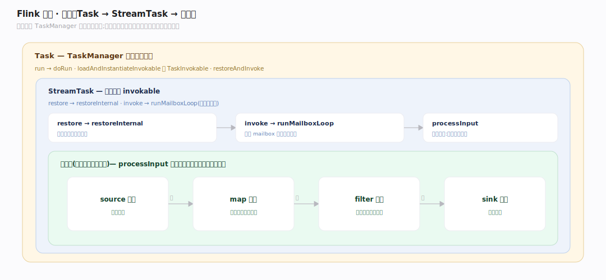
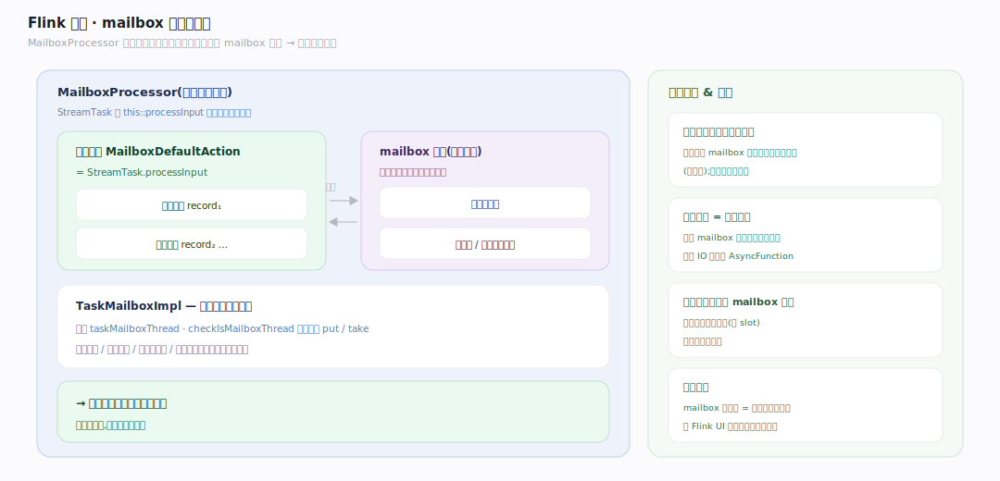

# Flink 原理 · 支撑主线 · 任务执行

> **定位**：属"执行能力域"。管子任务在 TaskManager 里的实际运行:Task→StreamTask→算子链,以及 **mailbox 单线程模型**(算子无需加锁的根基)。接收【调度与部署】部署的子任务、读写【状态管理】、承载【检查点容错】的屏障处理。源码基准 **Flink 2.x**(`flink-runtime/.../taskmanager/`、`streaming/runtime/tasks/`)。

一个子任务在 TM 里怎么跑?核心是 **mailbox 模型**:一条算子链的所有处理(记录、检查点、定时器)都在**单一线程**里串行执行——这就是为什么 Flink 算子写起来不用加锁。理解 mailbox,就理解了 Flink 执行期的并发模型。

---

## 一、Task → StreamTask → 算子链

- **Task**(`taskmanager/Task.java`)是 TM 的可运行单元:`run→doRun`(`:579`),`loadAndInstantiateInvokable` 建 `TaskInvokable`(`:756`),`restoreAndInvoke`(`:774`)。
- 流作业的 invokable 是 **StreamTask**(`streaming/runtime/tasks/StreamTask.java:205`):`restore→restoreInternal`(`:788`),`invoke→runMailboxLoop`(`:945,1021`)。
- StreamTask 里是**算子链**(链化后的一串算子,见图变换篇):`processInput` 从输入拉记录、推过链上各算子(`:655`)。

---

## 二、mailbox 单线程模型

**MailboxProcessor**(`streaming/runtime/tasks/mailbox/MailboxProcessor.java:67`)在**一个线程**上循环:默认动作 `MailboxDefaultAction`(= `StreamTask.processInput`,处理记录)与队列里的 mailbox 信件(检查点、定时器、其他控制动作)**交替执行**。StreamTask 用 `this::processInput` 作默认动作构造它(`StreamTask.java:300,420`)。

**单线程不变量**由 `TaskMailboxImpl` 强制:绑定 `taskMailboxThread`,`checkIsMailboxThread` 守护所有 put/take(`TaskMailboxImpl.java:65,101`)。**这就是算子无需加锁的原因**:记录处理、状态读写、检查点快照、定时器触发全在同一线程串行,没有并发访问。控制动作(如检查点屏障)作为 mailbox 信件插队,在处理记录的间隙执行。

---

## 拓展 · 任务执行关键结构一览

| 结构 | 定义 | 职责 |
|---|---|---|
| Task | `taskmanager/Task.java:579` | TM 可运行单元 |
| StreamTask | `streaming/runtime/tasks/StreamTask.java:205` | 流作业 invokable,跑 mailbox 循环 |
| MailboxProcessor | `.../mailbox/MailboxProcessor.java:67` | 单线程交替跑记录处理 + 控制信件 |
| TaskMailboxImpl | `.../mailbox/TaskMailboxImpl.java:65` | 强制单线程不变量 |
| AbstractStreamOperator | `streaming/api/operators/AbstractStreamOperator.java` | 算子基类(处理/快照钩子) |

## 调优要点（关键开关）

- **算子链**:链越长单线程串行越紧凑、越省网络,但单点算子慢会拖累整链;重算子拆出。
- **mailbox 吞吐**:控制信件(检查点/定时器)多会挤占记录处理;定时器别滥用。
- **背压定位**:mailbox 线程忙于处理即背压向上游传导;用 Flink UI 的背压指标定位慢算子。
- **异步 IO**:需外部查询的算子用 AsyncFunction,避免阻塞 mailbox 单线程。

## 常见误区与工程要点

- **误区:算子要自己加锁。** 不用。mailbox 单线程串行执行记录/状态/检查点/定时器,无并发访问。
- **误区:检查点在另一个线程打断处理。** 检查点屏障作为 mailbox 信件在记录处理间隙执行(同线程),异步的只是写盘。
- **误区:阻塞算子没关系。** 阻塞 mailbox 线程 = 整条链停;外部 IO 必须用 AsyncFunction。
- **误区:一个子任务多线程并行。** 一条算子链一个 mailbox 线程;并行靠多个子任务(多 slot),不是链内多线程。
- **归属提醒**:被执行的算子链来自【图变换】;状态读写在【状态管理】;屏障对齐在【检查点容错】;跨子任务数据在【网络与数据交换】。

## 一句话总纲

**Flink 子任务在 TaskManager 里以 Task→StreamTask→算子链运行,核心是 mailbox 单线程模型:MailboxProcessor 在一个线程上交替执行默认动作(processInput 处理记录)与 mailbox 信件(检查点屏障/定时器/控制动作),TaskMailboxImpl 强制单线程不变量——这就是算子无需加锁的根基;背压即 mailbox 线程处理不过来向上游传导,阻塞操作必须用 AsyncFunction 以免卡死单线程。**
