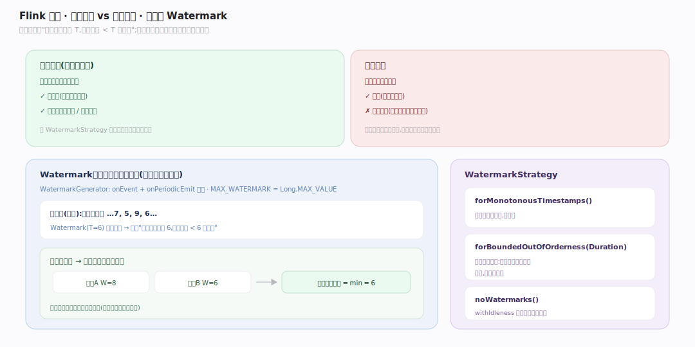
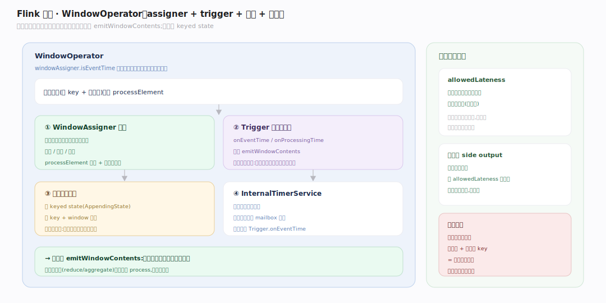

# Flink 原理 · 支撑主线 · 时间与窗口

> **定位**：属"时间能力域"。管流上的时间语义与聚合:事件时间 vs 处理时间、水位线(watermark)生成与传播、窗口(assigner/trigger)。依赖【状态管理】存窗口累积、被【任务执行】的定时器服务驱动。是流计算"按时间正确算"的根基。源码基准 **Flink 2.x**(`flink-core/.../eventtime/`、`flink-runtime/.../windowing/`)。

无界流上"过去 5 分钟的统计"是什么意思?流可能乱序、延迟到达。Flink 用**事件时间 + 水位线**回答:以数据自带的时间戳为准,水位线声明"事件时间已推进到 T,比 T 早的数据基本到齐了",窗口据此触发计算——既处理乱序,又能确定何时出结果。

---

## 一、事件时间 vs 处理时间 · 水位线

- **处理时间**:算子墙上时钟,简单但不可重现(重跑结果不同)。
- **事件时间**:数据自带的时间戳,可重现、能正确处理乱序——流计算首选。
- **水位线 Watermark**(`flink-core/.../eventtime/Watermark.java:46`,`MAX_WATERMARK=Long.MAX_VALUE`):一条特殊标记,声明"事件时间已到 T,不再期待 < T 的数据"。由 `WatermarkGenerator`(`onEvent` + `onPeriodicEmit`,`WatermarkGenerator.java:32`)产生,`WatermarkStrategy`(`WatermarkStrategy.java:56`)配置:`forMonotonousTimestamps`(严格递增)/`forBoundedOutOfOrderness(Duration)`(容忍固定乱序)/`noWatermarks`。

水位线随数据流传播,算子取所有输入通道水位线的**最小值**作为自己的事件时间——保证不漏早到的数据。

---

## 二、窗口:assigner + trigger + 状态

**WindowOperator**(`flink-runtime/.../streaming/runtime/operators/windowing/WindowOperator.java:102`)持 `WindowAssigner`、`Trigger`、`windowStateDescriptor`(窗口累积状态)、`InternalTimerService`:

- **WindowAssigner**:把每条记录分到一个或多个窗口(滚动/滑动/会话)。`processElement` 分窗 + 注册定时器(`:293`)。
- **Trigger**:决定窗口何时触发计算(`onEventTime`/`onProcessingTime` 触发 `emitWindowContents`,`:450,497`);事件时间窗口在水位线越过窗口结束时触发。
- **窗口状态**:累积值存 keyed state(AppendingState),按 key + window 命名——所以窗口是有状态的,靠状态管理存、检查点保。

`windowAssigner.isEventTime` 决定走事件时间还是处理时间分支(`:519`)。

---

## 拓展 · 时间窗口关键结构一览

| 结构 | 定义 | 职责 |
|---|---|---|
| Watermark | `eventtime/Watermark.java:46` | 事件时间进度标记 |
| WatermarkGenerator | `eventtime/WatermarkGenerator.java:32` | onEvent + 周期发水位线 |
| WatermarkStrategy | `eventtime/WatermarkStrategy.java:56` | 单调/有界乱序/无水位线策略 |
| WindowOperator | `.../windowing/WindowOperator.java:102` | 窗口核心(assigner+trigger+状态+定时器) |
| WindowAssigner | `.../windowing/assigners/WindowAssigner.java` | 记录→窗口分配 |
| Trigger | `.../windowing/triggers/Trigger.java` | 窗口触发时机 |

## 调优要点（关键开关）

- **水位线策略**:`forBoundedOutOfOrderness` 的延迟设太小丢迟到数据、太大增延迟;按数据乱序程度调。
- **allowedLateness**:窗口触发后再容忍多久的迟到数据(重触发);侧输出(side output)兜底极晚数据。
- **窗口状态**:大量长窗口 + 高基数 key = 状态爆炸;用增量聚合(reduce/aggregate)而非全量 process。
- **空闲源 idleness**:`withIdleness` 防某分区无数据卡住整体水位线推进。

## 常见误区与工程要点

- **误区:处理时间更简单就用它。** 处理时间不可重现、结果随运行波动;要正确性用事件时间。
- **误区:水位线是数据。** 它是控制标记,声明事件时间进度,不携带业务数据;算子取输入水位线最小值。
- **误区:窗口无状态。** 窗口累积存 keyed state、由检查点保;长窗口/高基数会撑爆状态。
- **误区:迟到数据一定丢。** allowedLateness + 侧输出可兜底;但延迟越大成本越高,需权衡。
- **归属提醒**:窗口累积存在【状态管理】;定时器由【任务执行】的 mailbox 触发;水位线随数据在【网络与数据交换】传播。

## 一句话总纲

**Flink 用事件时间 + 水位线在乱序无界流上"按时间正确算":事件时间以数据自带时间戳为准(可重现、处理乱序),Watermark 声明"事件时间已到 T"(WatermarkStrategy 配单调/有界乱序),算子取输入水位线最小值推进;窗口由 WindowOperator 的 WindowAssigner 分窗、Trigger 定触发时机(事件时间窗口在水位线越过窗口末尾时触发)、累积值存 keyed state 并由检查点保护——迟到数据靠 allowedLateness+侧输出兜底。**
