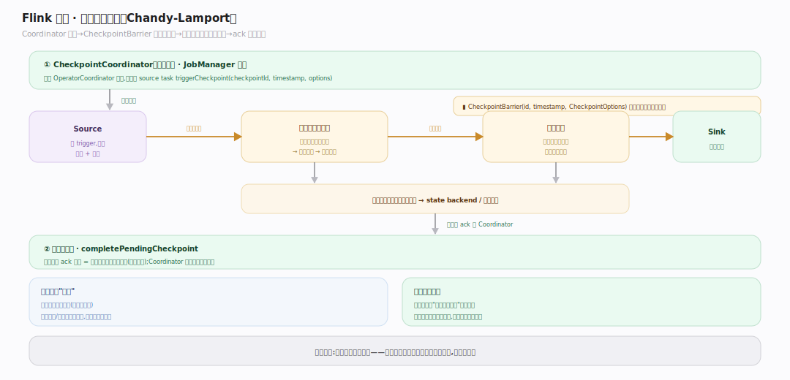
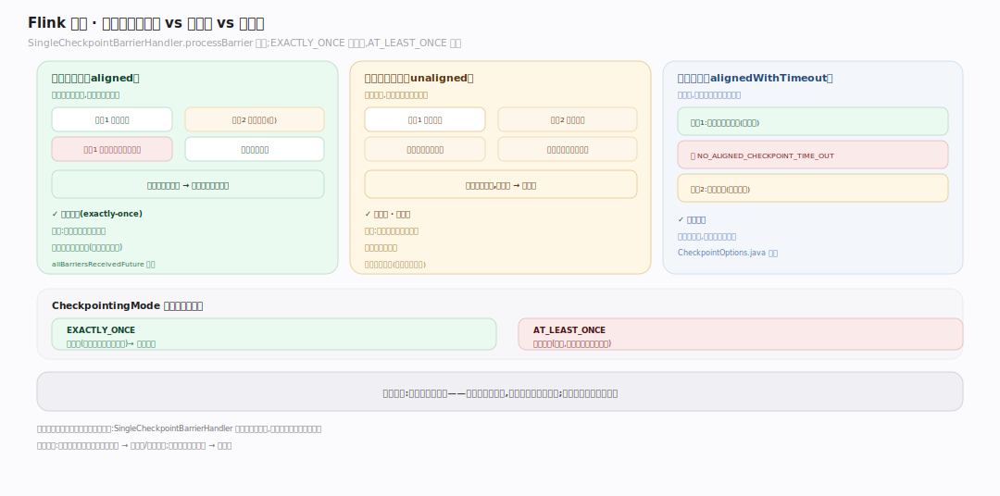
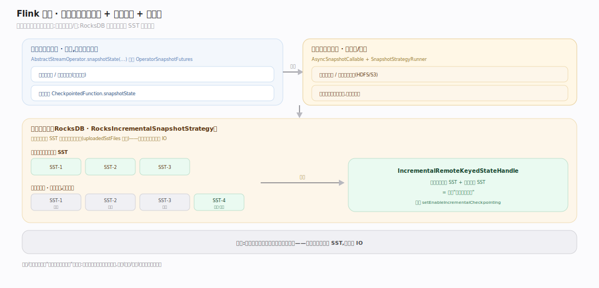
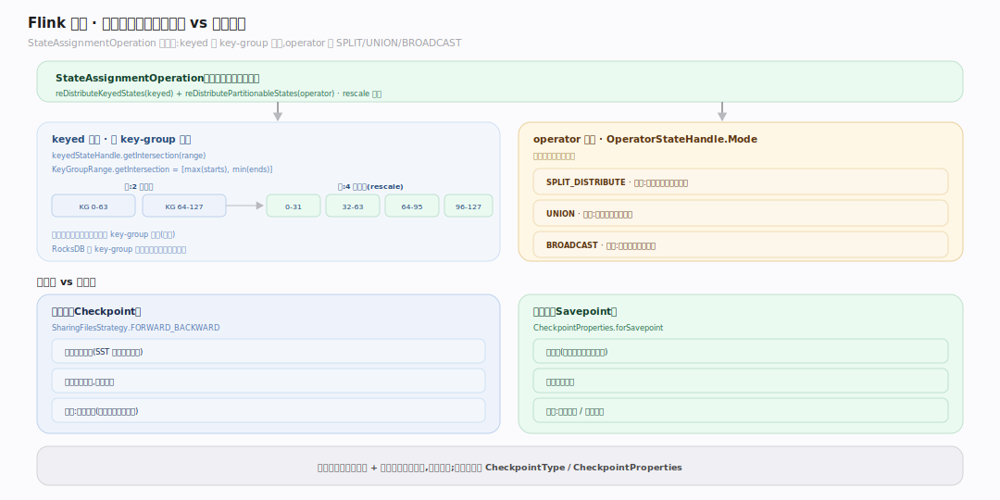

# Flink 原理 · 支撑主线 · 检查点与容错

> **定位**：属"容错能力域"——Flink 的灵魂。管精确一次(exactly-once)容错:Chandy-Lamport 异步屏障快照、屏障对齐、增量检查点、失败恢复与重分布。被【任务执行】的 mailbox 承载屏障、依赖【状态管理】做快照、约束【网络与数据交换】传播屏障。源码基准 **Flink 2.x**(`flink-runtime/.../checkpoint/`)。

Flink 凭什么敢说"精确一次"?靠**分布式快照**:在数据流里注入**检查点屏障(CheckpointBarrier)**,屏障流到算子时对齐、各算子异步快照自己的状态;所有算子快照齐了就是一个全局一致的时间点。失败时从最近检查点恢复、按 key-group 重分布状态,像什么都没发生过。这是它区别于"至少一次 + 应用幂等"系统的分水岭。

---

## 一、Chandy-Lamport 异步屏障快照

**CheckpointCoordinator**(`flink-runtime/src/main/java/org/apache/flink/runtime/checkpoint/CheckpointCoordinator.java:102`)定时触发:先给 OperatorCoordinator 打点,再给各 source task `triggerCheckpoint(checkpointId, timestamp, options)`(`:614,703`)。**CheckpointBarrier(id, timestamp, CheckpointOptions)**(`io/network/api/CheckpointBarrier.java:45`)作为特殊记录注入数据流,随数据一起往下游流。算子收到所有输入通道的屏障后,快照自己的状态、把屏障转发给下游。ack 回 coordinator,全齐则 `completePendingCheckpoint`(`:1262`)。

**为什么叫异步**:算子快照的"同步阶段"只建资源(拿状态引用),真正写盘/上传在"异步阶段",不阻塞记录处理——见第三节。

---

## 二、屏障对齐:对齐 vs 非对齐

多输入算子的屏障处理由 **SingleCheckpointBarrierHandler**(`flink-runtime/.../streaming/runtime/io/checkpointing/SingleCheckpointBarrierHandler.java:64`)管,`processBarrier` 计数,所有通道到齐则完成 `allBarriersReceivedFuture`(`:277`)。

- **对齐检查点(aligned)**:算子等**所有**输入通道的屏障都到,期间先到的通道被阻塞缓冲——保证快照是干净的一致切面,**精确一次**。代价:慢通道拖累对齐延迟。
- **非对齐检查点(unaligned)**:不等对齐,把"已越过屏障的在途数据"也快照进去——低延迟、抗反压,但快照更大。
- **对齐超时(alignedWithTimeout)**:先对齐,超 `NO_ALIGNED_CHECKPOINT_TIME_OUT` 未完成则切非对齐(`CheckpointOptions.java:106`)。

`CheckpointingMode { EXACTLY_ONCE, AT_LEAST_ONCE }`(`flink-core/.../core/execution/CheckpointingMode.java:36`):EXACTLY_ONCE 需对齐;AT_LEAST_ONCE 跳过对齐(更快,但故障可能重复处理)。

---

## 三、快照:同步建资源 + 异步写盘 + 增量

算子快照钩子 `AbstractStreamOperator.snapshotState(...)` 返回 `OperatorSnapshotFutures`(`flink-runtime/.../streaming/api/operators/AbstractStreamOperator.java:421`);用户函数用 `CheckpointedFunction.snapshotState`(`api/checkpoint/CheckpointedFunction.java:151`)。异步:`AsyncSnapshotCallable` + `SnapshotStrategyRunner`——同步阶段建资源、异步阶段写/传。

**增量检查点(RocksDB)**:`RocksIncrementalSnapshotStrategy`(`flink-statebackend-rocksdb/.../state/rocksdb/snapshot/RocksIncrementalSnapshotStrategy.java:71`)只上传新增的 SST 文件、复用未变的(`uploadedSstFiles` 跟踪,`:103`),产 `IncrementalRemoteKeyedStateHandle`。大状态作业省大量 IO。开关 `setEnableIncrementalCheckpointing`(`EmbeddedRocksDBStateBackend.java:521`)。

---

## 四、恢复与重分布:检查点 vs 保存点

恢复由 **StateAssignmentOperation**(`flink-runtime/.../checkpoint/StateAssignmentOperation.java:205`)做:`reDistributeKeyedStates`(keyed)+ `reDistributePartitionableStates`(operator)。

- **keyed 重分布 = key-group 交集**:`keyedStateHandle.getIntersection(range)`(`:666`),`KeyGroupRange.getIntersection = [max(starts), min(ends)]`——rescale 时每个新子任务只取它负责的 key-group 子集。RocksDB 用 key-group 前缀字节在复合键里定位。
- **operator state 重分布**:`OperatorStateHandle.Mode { SPLIT_DISTRIBUTE, UNION, BROADCAST }`(`OperatorStateHandle.java:46`),圆整分配。

**检查点 vs 保存点**:检查点用 `SharingFilesStrategy.FORWARD_BACKWARD`(增量共享文件,由系统自动管、失败恢复用);保存点 `CheckpointProperties.forSavepoint`(自包含、用户手动触发、用于升级/迁移)。区分在 `CheckpointType`/`CheckpointProperties`(`CheckpointType.java:30`)。

---

## 拓展 · 检查点关键结构一览

| 结构 | 定义 | 职责 |
|---|---|---|
| CheckpointCoordinator | `checkpoint/CheckpointCoordinator.java:102` | 定时触发 + 收 ack + 完成 |
| CheckpointBarrier | `io/network/api/CheckpointBarrier.java:45` | 注入数据流的屏障标记 |
| SingleCheckpointBarrierHandler | `streaming/runtime/io/checkpointing/SingleCheckpointBarrierHandler.java:64` | 对齐/非对齐屏障处理 |
| CheckpointingMode | `core/execution/CheckpointingMode.java:36` | EXACTLY_ONCE / AT_LEAST_ONCE |
| RocksIncrementalSnapshotStrategy | `state/rocksdb/snapshot/RocksIncrementalSnapshotStrategy.java:71` | 增量快照 |
| StateAssignmentOperation | `checkpoint/StateAssignmentOperation.java:205` | 恢复时状态重分布 |

## 调优要点（关键开关）

- **对齐 vs 非对齐**:反压严重、追求低延迟检查点 → 开非对齐或对齐超时;追求最小快照体积 → 对齐。
- **增量检查点**(RocksDB):大状态作业强烈建议开,省上传 IO。
- **检查点间隔 / 超时**:间隔太短压垮存储、太长恢复回退多;超时防慢快照拖死。
- **精确一次 vs 至少一次**:能容忍重复(且下游幂等)时用至少一次省对齐开销。

## 常见误区与工程要点

- **误区:检查点会暂停处理。** 异步快照只在同步阶段短暂建资源,写盘在后台;记录处理基本不停。
- **误区:精确一次靠去重。** Flink 靠一致快照 + 恢复重放到快照点,不是靠下游去重(那是至少一次的路子)。
- **误区:非对齐检查点更好。** 它低延迟抗反压,但快照更大、恢复更慢;稳态无反压时对齐更省。
- **误区:保存点和检查点一回事。** 检查点系统自动管、增量共享、用于故障恢复;保存点自包含、手动触发、用于升级迁移。
- **归属提醒**:屏障在【网络与数据交换】随数据传;快照的状态在【状态管理】;屏障对齐发生在【任务执行】的输入处理;检查点是本主线灵魂。

## 一句话总纲

**Flink 的精确一次容错 = Chandy-Lamport 异步屏障快照:CheckpointCoordinator 定时把 CheckpointBarrier 注入数据流,算子收齐所有输入通道的屏障后(对齐检查点等齐、非对齐检查点连在途数据一起快照)异步快照自己的状态(RocksDB 可增量只传新 SST),全算子快照齐即一个全局一致时间点;失败时从最近检查点恢复、keyed 状态按 key-group 交集重分布——这是 Flink 区别于"至少一次+幂等"系统的立身之本,保存点则是其自包含、手动、用于升级迁移的变体。**
