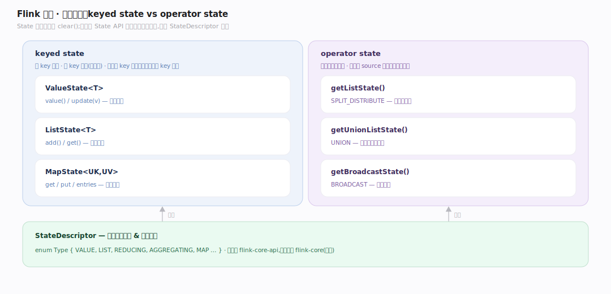
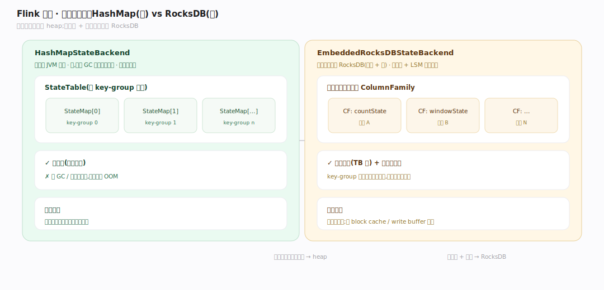
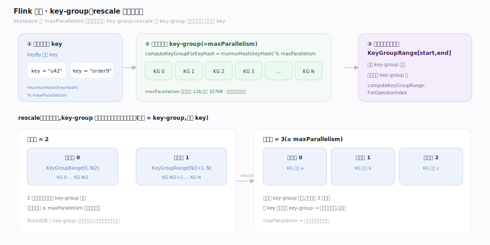

# Flink 原理 · 支撑主线 · 状态管理

> **定位**：属"状态能力域"。管有状态流计算的状态存储:keyed vs operator state、heap vs RocksDB backend、key-group 分片(rescale 的基础)。被【检查点容错】快照、被【时间与窗口】用作窗口状态、被【任务执行】的算子读写。源码基准 **Flink 2.x**(`flink-core-api`/`flink-core`/`flink-runtime`/`flink-statebackend-rocksdb`)。

流计算与批的核心差异之一:流是无界的,算子要**记住**跨记录的信息(计数、窗口累积、去重集)——这就是状态。Flink 把状态做成一等公民:类型化的 State API + 可插拔 backend + 按 key-group 分片以支持弹性扩缩容。状态是检查点要快照的对象,也是精确一次的载体。

---

## 一、keyed state vs operator state

`State` 基接口只有 `void clear`(`flink-core-api/.../state/State.java:32`)。两类:

- **keyed state**(按 key 分区,最常用):`ValueState<T>`(value/update,`ValueState.java:40`)、`ListState<T>`(`ListState.java:44`)、`MapState<UK,UV>`(get/put/entries,`MapState.java:45`)。每个 key 一份状态,算子处理某 key 的记录时自动切到该 key 的状态。
- **operator state**(按算子并行实例):`OperatorStateStore.getListState`(SPLIT_DISTRIBUTE 重分布)、`getUnionListState`(UNION)、`getBroadcastState`(`OperatorStateStore.java:78,101,54`)。常用于 source 记录偏移量等。

状态类型由 `StateDescriptor`(`flink-core/.../state/StateDescriptor.java:60`,`enum Type{VALUE,LIST,REDUCING,AGGREGATING,MAP…}`)声明。注意 Flink 2.x:接口在 `flink-core-api`、描述符在 `flink-core`,别混。

---

## 二、状态后端:heap vs RocksDB

- **HashMapStateBackend**(堆内,`flink-runtime/.../state/hashmap/HashMapStateBackend.java:63`):状态存 JVM 堆,`StateTable` 按 key-group 分成 `StateMap[]`(`heap/StateTable.java:79`)。快—但受 GC 与堆大小限制,适合小状态。
- **EmbeddedRocksDBStateBackend**(堆外+盘,`flink-statebackend-rocksdb/.../state/rocksdb/EmbeddedRocksDBStateBackend.java:98`):状态存嵌入的 RocksDB,**每个注册状态一个 ColumnFamily**(`RocksDBKeyedStateBackend.java:227`)。支持超大状态(TB 级)+ 增量检查点,代价是序列化 + LSM 读写开销。

选型:小状态低延迟 → heap;大状态 + 增量检查点 → RocksDB。用 `org.apache.flink.state.rocksdb` 包(旧 `contrib.streaming.state` 遗留)。

---

## 三、key-group:rescale 的分片单位

Flink 弹性扩缩容(改并行度)不用重算——靠 **key-group**。keyspace 按 maxParallelism 切成固定数量的 key-group:`computeKeyGroupForKeyHash = murmurHash(keyHash) % maxParallelism`(`KeyGroupRangeAssignment.java:63`)。每个算子子任务负责一段连续的 key-group 区间 `KeyGroupRange [start,end]`(`state/KeyGroupRange.java:31`)。

- rescale 时,key-group 在新旧子任务间按区间重分配(`computeKeyGroupRangeForOperatorIndex:93`)——状态跟着 key-group 走,粒度是 key-group 而非单 key。
- maxParallelism(=key-group 数)建表即定、不可改(默认下界 128,上限 32768);它是**并行度可调的天花板**。
- RocksDB 用 key-group 前缀字节放进复合键,恢复时按前缀高效切片。

---

## 拓展 · 状态关键结构一览

| 结构 | 定义 | 职责 |
|---|---|---|
| State / ValueState / ListState / MapState | `flink-core-api/.../state/` | 类型化状态接口 |
| StateDescriptor | `flink-core/.../state/StateDescriptor.java:60` | 状态声明(类型/序列化器) |
| HashMapStateBackend | `state/hashmap/HashMapStateBackend.java:63` | 堆内后端 |
| EmbeddedRocksDBStateBackend | `state/rocksdb/EmbeddedRocksDBStateBackend.java:98` | RocksDB 后端(大状态+增量) |
| KeyGroupRange | `state/KeyGroupRange.java:31` | 子任务负责的 key-group 区间 |
| KeyGroupRangeAssignment | `state/KeyGroupRangeAssignment.java:63` | key→key-group→子任务映射 |

## 调优要点（关键开关）

- **backend 选型**:小状态低延迟 heap;大状态 RocksDB + 增量检查点。
- **maxParallelism**:是并行度上限(=key-group 数),建表即定不可改;设太小限制未来扩容,太大增元数据。
- **状态 TTL**:给 keyed state 配 TTL 自动过期,防状态无限增长。
- **RocksDB 调优**:block cache / write buffer / 压缩,大状态作业收益明显。

## 常见误区与工程要点

- **误区:并行度随便改。** 只能在 ≤ maxParallelism 内改;maxParallelism 建表即定,改它需从保存点重建。
- **误区:keyed 和 operator state 一样。** keyed 按 key 分区(每 key 一份,最常用);operator state 按算子实例(source 偏移等)。
- **误区:heap backend 更好因为快。** 受 GC 与堆限制,大状态会 OOM;超一定规模必须 RocksDB。
- **误区:rescale 按 key 迁移。** 粒度是 key-group(固定数量),不是单 key——这才让 rescale 高效。
- **归属提醒**:状态的快照/恢复在【检查点容错】;窗口状态是【时间与窗口】用本主线存;算子读写状态在【任务执行】。

## 一句话总纲

**Flink 把状态做成一等公民:keyed state(ValueState/ListState/MapState,按 key 分区,最常用)与 operator state(按算子实例,SPLIT/UNION/BROADCAST 重分布),由 StateDescriptor 声明、存进可插拔 backend(heap 小状态低延迟 / RocksDB 大状态+每状态一 ColumnFamily+增量检查点);keyspace 按 maxParallelism 切成固定数量 key-group(murmurHash%maxP),每子任务负责一段区间,rescale 时按 key-group 而非单 key 重分布——这既是弹性扩缩容的基础,也是检查点快照的对象。**
