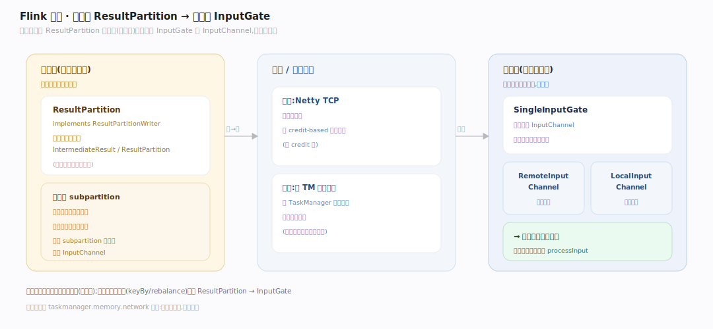
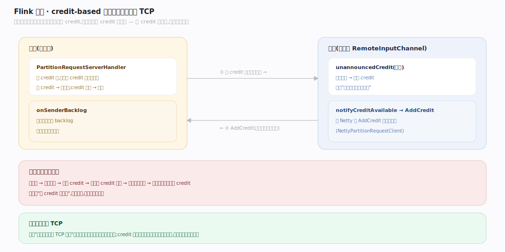
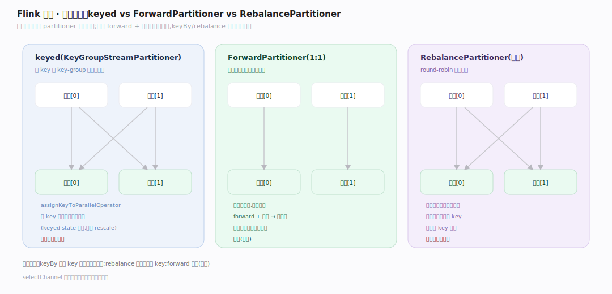

# Flink 原理 · 支撑主线 · 网络与数据交换

> **定位**：属"通信能力域"。管子任务间的数据流动:ResultPartition/InputGate、**credit-based 流控**(背压不阻塞 TCP)、keyed vs 非 keyed 分区。承载【检查点容错】的屏障传播、实现【图变换】里链间的重分区。源码基准 **Flink 2.x**(`flink-runtime/.../io/network/`)。

链化后的算子在链内直接函数调用传记录(免网络),但链间(keyBy/rebalance 等重分区)必须跨子任务、常跨机器。Flink 的网络栈用 **credit-based 流控**做背压:下游有多少空闲缓冲就给上游多少 credit,上游只在有 credit 时才发——背压是"没 credit 就不发",而不是阻塞 TCP 连接。这让背压精准、不误伤同连接的其他流。

---

## 一、生产端 / 消费端:ResultPartition ↔ InputGate

- **生产端**:`ResultPartition implements ResultPartitionWriter`(`io/network/partition/ResultPartition.java:78`),子任务把记录写这里;一个生产者一个 `IntermediateResult`/ResultPartition(见图变换篇的并行展开)。
- **消费端**:`SingleInputGate`(`io/network/partition/consumer/SingleInputGate.java`)聚合多个 `InputChannel`;远程通道是 `RemoteInputChannel`。

数据从上游 ResultPartition 经网络(或本地)流到下游 InputGate 的 InputChannel,再喂给算子。

---

## 二、credit-based 流控:背压不阻塞 TCP

**核心机制**(`RemoteInputChannel.java`):下游通道维护 `unannouncedCredit`(`:120`),缓冲空出就累积 credit(`:641`),经 Netty `notifyCreditAvailable → AddCredit` 消息告诉上游(`PartitionRequestClient.java:51`,`NettyPartitionRequestClient` 发 AddCredit `:218`);上游 `PartitionRequestServerHandler` 收 credit(`:115`)后**只在有 credit 时才发数据**。下游忙 → 不给 credit → 上游不发 → 背压逐级向上传导。

**为什么不阻塞 TCP**:传统"下游慢就阻塞 TCP 连接"会误伤同连接复用的其他子任务流;credit 机制让背压精准作用于单个逻辑通道,同时 `onSenderBacklog`(`:774`)让上游告知积压便于下游预留缓冲。

---

## 三、分区:keyed vs 非 keyed

链间重分区由 partitioner 决定去向:

- **keyed(KeyGroupStreamPartitioner)**:`selectChannel` → `KeyGroupRangeAssignment.assignKeyToParallelOperator`(`streaming/runtime/partitioner/KeyGroupStreamPartitioner.java:55`),按 key 的 key-group 确定性映射到下游子任务——这保证同 key 永远到同一子任务(keyed state 的前提),也支持 rescale。
- **ForwardPartitioner**(1:1,可链化,唯一能让算子链化的分区)。
- **RebalancePartitioner**(轮询,均衡负载)。

只有 forward + 非批交换能链化(见图变换篇);keyBy/rebalance 必断链跨网络。

---

## 拓展 · 网络关键结构一览

| 结构 | 定义 | 职责 |
|---|---|---|
| ResultPartition | `io/network/partition/ResultPartition.java:78` | 生产端数据分区 |
| SingleInputGate | `io/network/partition/consumer/SingleInputGate.java` | 消费端聚合输入通道 |
| RemoteInputChannel | `.../consumer/RemoteInputChannel.java:120` | 远程通道 + credit |
| PartitionRequestClient | `io/network/PartitionRequestClient.java:51` | 声明 credit(AddCredit) |
| KeyGroupStreamPartitioner | `streaming/runtime/partitioner/KeyGroupStreamPartitioner.java:55` | keyed 分区(按 key-group) |

## 调优要点（关键开关）

- **网络缓冲**:`taskmanager.memory.network` 决定网络内存;缓冲不足限制吞吐、过多浪费。
- **credit 参数**:floating/exclusive buffers 影响流控粒度与吞吐。
- **背压排查**:Flink UI 背压指标 + credit 视图定位瓶颈子任务。
- **分区选择**:keyBy 保证 key 亲和但可能倾斜;rebalance 均衡但打散 key;forward 最省(可链)。

## 常见误区与工程要点

- **误区:背压靠阻塞连接。** Flink 用 credit-based 流控:没 credit 就不发,精准作用于逻辑通道,不阻塞 TCP、不误伤同连接其他流。
- **误区:所有数据都走网络。** 链内算子函数调用传记录(免网络);只有链间(重分区)才走 ResultPartition→InputGate。
- **误区:keyBy 是随机分。** 是按 key 的 key-group 确定性映射,保证同 key 到同子任务(keyed state 前提)。
- **误区:加大并行度就能消背压。** 若瓶颈是单点慢算子或倾斜 key,加并行度无效;要定位真实瓶颈。
- **归属提醒**:链间重分区源于【图变换】的断链;keyed 分区服务【状态管理】的 key-group;屏障随数据流传播支撑【检查点容错】。

## 一句话总纲

**Flink 子任务间数据经 ResultPartition(生产)→InputGate/InputChannel(消费)流动,用 credit-based 流控做背压:下游有空闲缓冲才给上游 credit、上游有 credit 才发,背压精准作用于逻辑通道而不阻塞 TCP(不误伤同连接其他流);分区上 keyed 用 KeyGroupStreamPartitioner 按 key-group 确定性映射(保证同 key 到同子任务、支撑 keyed state 与 rescale),forward(1:1 可链)最省、keyBy/rebalance 必断链跨网络。**
