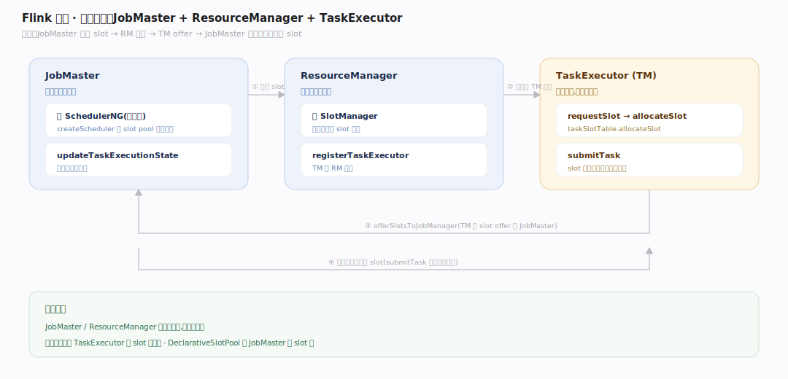
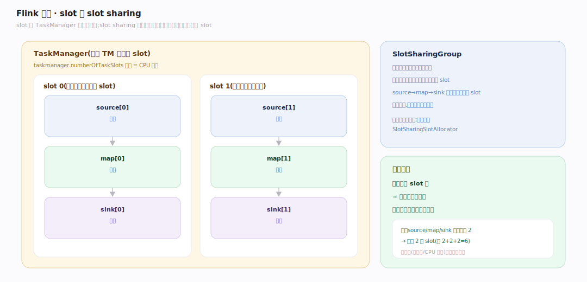

# Flink 原理 · 支撑主线 · 调度与部署

> **定位**：属"调度能力域"。管把 ExecutionGraph 的子任务分配到集群资源上跑:JobManager(JobMaster/ResourceManager)、TaskManager、slot 分配与共享。接收【图变换】的 ExecutionGraph、把子任务部署到【任务执行】。源码基准 **Flink 2.x**(`flink-runtime/.../jobmaster/`、`resourcemanager/`、`taskexecutor/`)。

有了并行执行图,还得决定"每个子任务跑在哪台机器的哪个槽位"。Flink 用 JobMaster(单作业领导)+ ResourceManager(集群资源)+ TaskExecutor(工作节点)三方协作,以 **slot** 为资源单位分配,并用 **slot sharing** 让一条流水线的算子共享槽位提高利用率。

---

## 一、三方角色:JobMaster / ResourceManager / TaskExecutor

- **JobMaster**(每作业一个领导,`flink-runtime/.../jobmaster/JobMaster.java:205`):持 `SchedulerNG` 调度器,`createScheduler` 经 slot pool 工厂创建(`:406`);子任务状态经 `schedulerNG.updateTaskExecutionState`(`:543`)回流。
- **ResourceManager**(集群级,`resourcemanager/ResourceManager.java:153`):持 `SlotManager`,TM 经 `registerTaskExecutor`(`:475`)注册。
- **TaskExecutor**(TM 工作节点,`taskexecutor/TaskExecutor.java:1189`):处理 `requestSlot` → `allocateSlot` → `taskSlotTable.allocateSlot`(`:1303`),再 `offerSlotsToJobManager`(`:1237`);slot 被接受后 `submitTask`(`:660`)收部署描述符。

流程:JobMaster 向 RM 申请 slot → RM 从注册的 TM 分配 → TM 把 slot offer 给 JobMaster → JobMaster 部署子任务到该 slot。

---

## 二、slot 与 slot sharing

**slot** 是 TaskManager 的资源单位(一个 TM 有多个 slot)。**slot sharing**(`jobmanager/scheduler/SlotSharingGroup.java`):同一 slot-sharing 组的不同算子的子任务可**共享一个 slot**——一条 `source→map→sink` 流水线的各算子实例挤在一个 slot 里,既省资源又让数据本地流转。默认所有算子在一个共享组;需要隔离时可拆组。自适应分配用 `SlotSharingSlotAllocator`。这让"作业需要的 slot 数 = 最大算子并行度"而非"所有算子并行度之和"。

---

## 拓展 · 调度关键结构一览

| 结构 | 定义 | 职责 |
|---|---|---|
| JobMaster | `jobmaster/JobMaster.java:205` | 单作业领导,持调度器 |
| ResourceManager | `resourcemanager/ResourceManager.java:153` | 集群资源,持 SlotManager |
| TaskExecutor | `taskexecutor/TaskExecutor.java:1189` | TM 工作节点,分配 slot 收任务 |
| SlotSharingGroup | `jobmanager/scheduler/SlotSharingGroup.java` | slot 共享组 |
| DeclarativeSlotPool | `jobmaster/slotpool/DeclarativeSlotPool.java` | JobMaster 侧 slot 池 |

## 调优要点（关键开关）

- **taskmanager.numberOfTaskSlots**:每 TM slot 数,通常 = CPU 核数。
- **slot sharing 组**:默认全共享省资源;重算子(大状态/CPU 密集)拆组避免争抢。
- **部署模式**:session / per-job / application 模式,隔离性与资源复用权衡。
- **RM 类型**:Standalone / YARN / Kubernetes / Adaptive,按环境选。

## 常见误区与工程要点

- **误区:作业要的 slot = 所有算子并行度之和。** 靠 slot sharing,通常 = 最大算子并行度(一条流水线挤一个 slot)。
- **误区:JobManager 执行数据。** JM 只调度协调;数据处理全在 TaskManager 的 slot 里。
- **误区:一个 slot 一个算子。** slot sharing 让一条流水线多算子共享一个 slot。
- **归属提醒**:被调度的执行图来自【图变换】;子任务在 slot 里的实际执行在【任务执行】;资源约束不改数据语义。

## 一句话总纲

**Flink 调度是 JobMaster(单作业领导,持 SchedulerNG)+ ResourceManager(集群资源,持 SlotManager)+ TaskExecutor(TM,分配 slot)三方协作:JobMaster 申请 slot→RM 分配→TM offer→部署子任务;资源单位是 slot,靠 slot sharing 让一条流水线的算子共享一个槽位(作业所需 slot≈最大算子并行度而非并行度之和),既省资源又让数据本地流转。**
